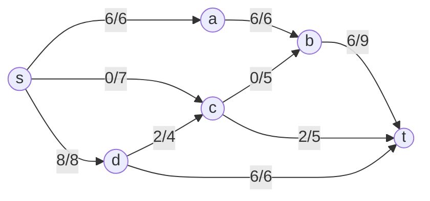
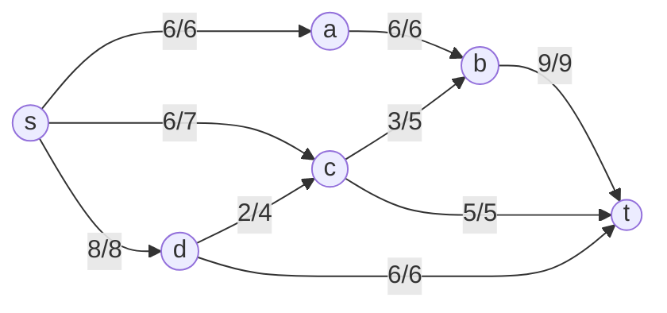

## Задание 10. Задача о максимальном потоке

В этом задании необходимо решить задачу о максимальном потоке в сети по алгоритму поиска увеличивающих путей в остаточной сети (как на занятиях), а также проверить ответ через минимальный разрез.

Условия вариантов находятся в файле `Задание 10/Варианты условий.md` в ветке `main` репозитория для ручных задач ([ссылка на файл с условиями вариантов](https://github.com/algos-ris-24-4/manual-tasks/blob/main/%D0%97%D0%B0%D0%B4%D0%B0%D0%BD%D0%B8%D0%B5%2010/%D0%92%D0%B0%D1%80%D0%B8%D0%B0%D0%BD%D1%82%D1%8B%20%D1%83%D1%81%D0%BB%D0%BE%D0%B2%D0%B8%D0%B9.md)).

Ниже приведён полностью оформленный разбор **варианта 6**.

---

## 1. Постановка задачи (вариант 6)

Дана сеть с вершинами:

- `s` — источник;
- `a, b, c, d` — промежуточные вершины;
- `t` — сток.

Пропускные способности дуг сети для варианта 6:

| Дуга | sa | sc | sd | ab | cb | dc | bt | ct | dt |
|:----:|:--:|:--:|:--:|:--:|:--:|:--:|:--:|:--:|:--:|
|  C   |  6 |  7 |  8 |  6 |  5 |  4 |  9 |  5 |  6 |

То есть в сети заданы дуги:

- `s → a` с пропускной способностью 6;
- `s → c` с пропускной способностью 7;
- `s → d` с пропускной способностью 8;
- `a → b` с пропускной способностью 6;
- `c → b` с пропускной способностью 5;
- `d → c` с пропускной способностью 4;
- `b → t` с пропускной способностью 9;
- `c → t` с пропускной способностью 5;
- `d → t` с пропускной способностью 6.

Необходимо:

1. Построить сеть с указанием пропускной способности дуг.
2. Построить остаточные сети на каждом шаге.
3. Найти максимальный поток методом поиска увеличивающих путей.
4. Проверить величину максимального потока через поиск минимального разреза (посчитать пропускную способность всех разрезов сети).
5. Оформить решение по шагам с подробными комментариями и таблицами.
6. Указать максимальную величину потока и показать, как он может быть организован (локальные потоки по дугам).

---

## 2. Поиск максимального потока методом увеличивающих путей

Будем записывать состояние дуг в виде `f/c`, где:

- `f` — текущий поток по дуге;
- `c` — её пропускная способность.

Изначально во всех рёбрах поток равен нулю.

### Шаг 0. Начальный поток и остаточная сеть

Начальное состояние:

- `s → a`: 0/6
- `s → c`: 0/7
- `s → d`: 0/8
- `a → b`: 0/6
- `c → b`: 0/5
- `d → c`: 0/4
- `b → t`: 0/9
- `c → t`: 0/5
- `d → t`: 0/6

Остаточная пропускная способность на всех прямых дугах равна их исходной ёмкости, обратных дуг нет. Суммарный поток |f| = 0.

Графически исходная сеть (потоки по дугам пока нулевые):

---

### Шаг 1. Увеличивающий путь \(P_1: s \to a \to b \to t\)

Рассмотрим путь:

`P₁: s → a → b → t`.

Остаточные пропускные способности вдоль пути:

- `r(s,a) = 6`;
- `r(a,b) = 6`;
- `r(b,t) = 9`.

Минимальная остаточная пропускная способность на пути:

\[
\Delta_1 = \min(6, 6, 9) = 6.
\]

Увеличиваем поток по каждой дуге пути на 6:

- `s → a`: 6/6;
- `a → b`: 6/6;
- `b → t`: 6/9.

Суммарный поток стал:

\[
|f| = 6.
\]

**Остаточная сеть после шага 1.**

- Прямые дуги:
  - `r(s,a) = 6 - 6 = 0`;
  - `r(a,b) = 6 - 6 = 0`;
  - `r(b,t) = 9 - 6 = 3`;
  - `r(s,c) = 7`, `r(s,d) = 8`;
  - `r(c,b) = 5`, `r(d,c) = 4`, `r(c,t) = 5`, `r(d,t) = 6`.
- Обратные дуги (появляются из-за ненулевого потока):
  - `r(a,s) = 6`, `r(b,a) = 6`, `r(t,b) = 6`.

Сеть после шага 1 (подписи на рёбрах — текущий поток/ёмкость):

---

### Шаг 2. Увеличивающий путь \(P_2: s \to d \to t\)

Теперь возьмём путь:

`P₂: s → d → t`.

Остаточные пропускные способности:

- `r(s,d) = 8`;
- `r(d,t) = 6`.

\[
\Delta_2 = \min(8, 6) = 6.
\]

Увеличиваем поток на 6:

- `s → d`: 6/8;
- `d → t`: 6/6.

Суммарный поток:

\[
|f| = 6 + 6 = 12.
\]

**Остаточная сеть после шага 2.**

- Прямые дуги:
  - `r(s,a) = 0`, `r(a,b) = 0`;
  - `r(b,t) = 3`;
  - `r(s,c) = 7`;
  - `r(s,d) = 8 - 6 = 2`;
  - `r(d,t) = 6 - 6 = 0`;
  - `r(c,b) = 5`, `r(d,c) = 4`, `r(c,t) = 5`.
- Обратные дуги:
  - `r(a,s) = 6`, `r(b,a) = 6`, `r(t,b) = 6`;
  - `r(d,s) = 6`, `r(t,d) = 6`.

Сеть после шага 2:

---

### Шаг 3. Увеличивающий путь \(P_3: s \to d \to c \to t\)

Используем ещё незаполненные дуги `d → c` и `c → t`:

`P₃: s → d → c → t`.

Остаточные пропускные способности:

- `r(s,d) = 2`;
- `r(d,c) = 4`;
- `r(c,t) = 5`.

\[
\Delta_3 = \min(2, 4, 5) = 2.
\]

Увеличиваем поток на 2:

- `s → d`: 6 + 2 = 8/8 (дуга насыщена);
- `d → c`: 2/4;
- `c → t`: 2/5.

Суммарный поток:

\[
|f| = 12 + 2 = 14.
\]

**Остаточная сеть после шага 3.**

- Прямые дуги:
  - `r(s,a) = 0`;
  - `r(s,c) = 7`;
  - `r(s,d) = 0`;
  - `r(d,c) = 4 - 2 = 2`;
  - `r(c,t) = 5 - 2 = 3`;
  - `r(b,t) = 3`;
  - `r(c,b) = 5`;
  - `r(d,t) = 0`.
- Обратные дуги:
  - `r(a,s) = 6`, `r(b,a) = 6`, `r(t,b) = 6`;
  - `r(d,s) = 8`;
  - `r(c,d) = 2`, `r(t,c) = 2`.

Сеть после шага 3:

---

### Шаг 4. Увеличивающий путь \(P_4: s \to c \to t\)

Путь:

`P₄: s → c → t`.

Остаточные пропускные способности:

- `r(s,c) = 7`;
- `r(c,t) = 3`.

\[
\Delta_4 = \min(7, 3) = 3.
\]

Увеличиваем поток на 3:

- `s → c`: 3/7;
- `c → t`: 2 + 3 = 5/5 (дуга насыщена).

Суммарный поток:

\[
|f| = 14 + 3 = 17.
\]

**Остаточная сеть после шага 4.**

- Прямые дуги:
  - `r(s,a) = 0`;
  - `r(s,c) = 7 - 3 = 4`;
  - `r(s,d) = 0`;
  - `r(a,b) = 0`;
  - `r(c,b) = 5`;
  - `r(d,c) = 2`;
  - `r(b,t) = 3`;
  - `r(c,t) = 0`;
  - `r(d,t) = 0`.
- Обратные дуги:
  - `r(a,s) = 6`, `r(b,a) = 6`, `r(t,b) = 6`;
  - `r(d,s) = 8`;
  - `r(c,s) = 3`;
  - `r(c,d) = 2`, `r(t,c) = 5`.

Сеть после шага 4:

---

### Шаг 5. Увеличивающий путь \(P_5: s \to c \to b \to t\)

Используем оставшуюся пропускную способность из `s` в `c`, затем из `c` в `b` и `b` в `t`:

`P₅: s → c → b → t`.

Остаточные пропускные способности:

- `r(s,c) = 4`;
- `r(c,b) = 5`;
- `r(b,t) = 3`.

\[
\Delta_5 = \min(4, 5, 3) = 3.
\]

Увеличиваем поток на 3:

- `s → c`: 3 + 3 = 6/7;
- `c → b`: 3/5;
- `b → t`: 6 + 3 = 9/9 (дуга насыщена).

Суммарный поток:

\[
|f| = 17 + 3 = 20.
\]

**Остаточная сеть после шага 5.**

Главные прямые остаточные рёбра:

- `r(s,a) = 0`, `r(s,c) = 7 - 6 = 1`, `r(s,d) = 0`;
- `r(a,b) = 0`;
- `r(c,b) = 5 - 3 = 2`;
- `r(d,c) = 4 - 2 = 2`;
- `r(b,t) = 0`;
- `r(c,t) = 0`;
- `r(d,t) = 0`.

Из `s` есть прямой выход с положительной остаточной пропускной способностью только по дуге `s → c`, но из `c` уже нет пути до `t` с положительным остатком (из `c` в `t` остаток 0; из `b` в `t` остаток 0). Поэтому **увеличивающих путей больше нет**, алгоритм заканчивается.

Сеть после шага 5 (конечный максимальный поток):

---

## 3. Полученный поток и проверка сохранения потока

Итоговые значения потоков по дугам:

- От источника:
  - `s → a`: 6/6;
  - `s → c`: 6/7;
  - `s → d`: 8/8.
- Внутри сети:
  - `a → b`: 6/6;
  - `c → b`: 3/5;
  - `d → c`: 2/4.
- В сток:
  - `b → t`: 9/9;
  - `c → t`: 5/5;
  - `d → t`: 6/6.

Проверим закон сохранения потока в промежуточных вершинах:

- Вершина `a`:
  - Вход: `f(s,a) = 6`;
  - Выход: `f(a,b) = 6`.
- Вершина `b`:
  - Вход: `f(a,b) + f(c,b) = 6 + 3 = 9`;
  - Выход: `f(b,t) = 9`.
- Вершина `c`:
  - Вход: `f(s,c) + f(d,c) = 6 + 2 = 8`;
  - Выход: `f(c,b) + f(c,t) = 3 + 5 = 8`.
- Вершина `d`:
  - Вход: `f(s,d) = 8`;
  - Выход: `f(d,c) + f(d,t) = 2 + 6 = 8`.

Суммарный поток в сток:

\[
|f| = f(b,t) + f(c,t) + f(d,t) = 9 + 5 + 6 = 20.
\]

---

## 4. Проверка через минимальный разрез

Разрез \((S,T)\) задаётся разбиением множества вершин \(V\) на две части, где:

- `s ∈ S`;
- `t ∈ T`;
- \(S \cup T = V\), \(S \cap T = \varnothing\).

Пропускная способность разреза определяется как

\[
c(S, T) = \sum_{u \in S, v \in T} c(u, v),
\]

где суммирование ведётся по всем дугам, идущим из \(S\) в \(T\).

Переберём все разрезы. Обозначим:

- множество вершин \(V = \{s, a, b, c, d, t\}\);
- множество внутренних вершин \(\{a, b, c, d\}\).

Каждый разрез задаётся выбором подмножества \(X \subseteq \{a, b, c, d\}\), тогда:

- \(S = \{s\} \cup X\),
- \(T = V \setminus S\).

Посчитаем пропускные способности всех разрезов:

| №  | \(S\)                  | Рёбра из \(S\) в \(T\)                               | \(c(S,T)\) |
|:--:|:-----------------------|:-----------------------------------------------------|:----------:|
| 1  | {s}                    | sa(6), sc(7), sd(8)                                  |    21      |
| 2  | {s,a}                  | sc(7), sd(8), ab(6)                                  |    21      |
| 3  | {s,b}                  | sa(6), sc(7), sd(8), bt(9)                           |    30      |
| 4  | {s,c}                  | sa(6), sd(8), cb(5), ct(5)                           |    24      |
| 5  | {s,d}                  | sa(6), sc(7), dc(4), dt(6)                           |    23      |
| 6  | {s,a,b}                | sc(7), sd(8), bt(9)                                  |    24      |
| 7  | {s,a,c}                | sd(8), ab(6), cb(5), ct(5)                           |    24      |
| 8  | {s,a,d}                | sc(7), ab(6), dc(4), dt(6)                           |    23      |
| 9  | {s,b,c}                | sa(6), sd(8), bt(9), ct(5)                           |    28      |
| 10 | {s,b,d}                | sa(6), sc(7), dc(4), dt(6), bt(9)                    |    32      |
| 11 | {s,c,d}                | sa(6), cb(5), ct(5), dt(6)                           |    22      |
| 12 | {s,a,b,c}              | sd(8), bt(9), ct(5)                                  |    22      |
| 13 | {s,a,b,d}              | sc(7), dc(4), dt(6), bt(9)                           |    26      |
| 14 | {s,a,c,d}              | ab(6), cb(5), ct(5), dt(6)                           |    22      |
| 15 | {s,b,c,d}              | sa(6), bt(9), ct(5), dt(6)                           |    26      |
| 16 | {s,a,b,c,d}            | bt(9), ct(5), dt(6)                                  |  **20**    |

Минимальная пропускная способность разреза:

\[
c_{\min} = 20.
\]

Она достигается, например, для разреза:

- \(S = \{s, a, b, c, d\}\),
- \(T = \{t\}\),

где через разрез проходят дуги `b → t`, `c → t`, `d → t` с суммарной пропускной способностью \(9 + 5 + 6 = 20\).

По теореме Макс-поток – Мин-разрез имеем:

\[
|f^\*| = c_{\min} = 20.
\]

Следовательно, найденный поток величины 20 является максимальным.

---

## 5. Итог: величина максимального потока и локальные потоки

**Максимальный поток для варианта 6 равен \(20\).**

Один из возможных вариантов распределения локальных потоков (в формате `поток/ёмкость`) по дугам:

- `s → a`: 6/6
- `s → c`: 6/7
- `s → d`: 8/8
- `a → b`: 6/6
- `c → b`: 3/5
- `d → c`: 2/4
- `b → t`: 9/9
- `c → t`: 5/5
- `d → t`: 6/6

Такое распределение удовлетворяет всем ограничениям:

- нигде поток не превышает пропускную способность дуг;
- в промежуточных вершинах `a`, `b`, `c`, `d` выполняется закон сохранения потока;
- суммарный поток в сток `t` равен 20 и совпадает с минимальной пропускной способностью разреза.

