# Задание 10
## Состав команды:
1. Штенцов Михаил
2. Лопатин Иван
3. Погодин Роман

## Вариант 8: 

Пропускная способность дуг сети:

|          Дуги          | sa | sc | ab | ad | db | cb | ct | bt | dt |
|:----------------------:|:--:|:--:|:--:|:--:|----|:--:|:--:|:--:|:--:|
| Пропускная способность | 9  | 9  | 5  | 7  | 4  | 5  | 5  | 6  | 8  |

## Решение: 

### 1. Построим сеть с источником **s**, стоком **t** и указанными пропускными способностями дуг.

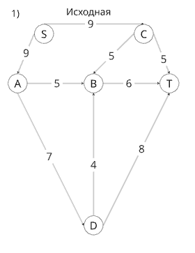

Построим остаточную сеть. Так как изначально поток в сети не задан, все дуги сети являются пустыми (локальный поток равен нулю), соответственно в остаточную сеть необходимо вынести обратную дугу с весом равным пропускной способности. 

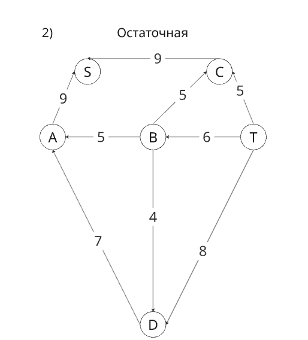

### 2. Проведем поиск увеличивающего пути в остаточной сети
В остаточной сети найден увеличивающий путь t -> d -> a -> s. Минимальный вес дуг на этом пути равен 7.

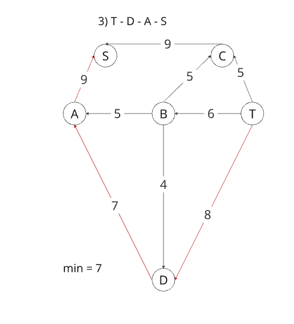

Уменьшим вес дуг на найденном пути, дуги для которых вес стал нулевым удалим из остаточной сети.

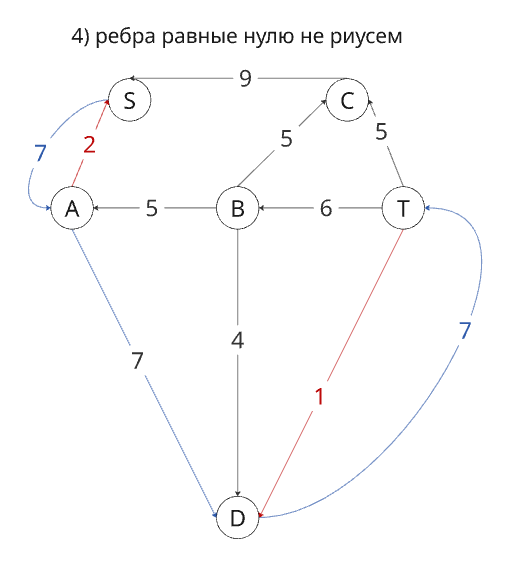

Скорректируем соответствующим образом локальные потоки в исходной сети. Первым числом будем указывать локальный поток, вторым пропускную способность дуги.

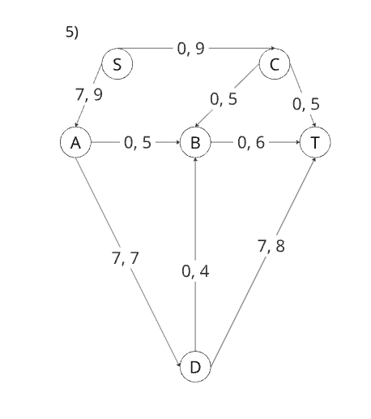

### 3. Продолжим поиск увеличивающего пути в остаточной сети

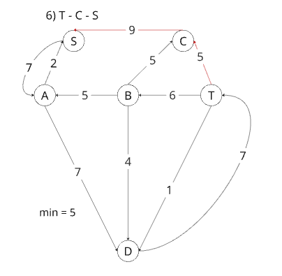

В остаточной сети найден увеличивающий путь t -> c -> s. Минимальный вес дуг на этом пути равен 5.

Уменьшим вес дуг на найденном пути, дуги для которых вес стал нулевым удалим из остаточной сети.

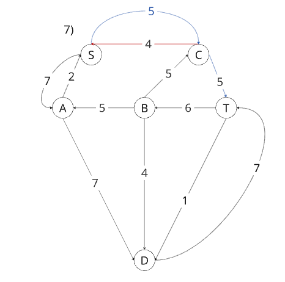

Скорректируем соответствующим образом локальные потоки в исходной сети.

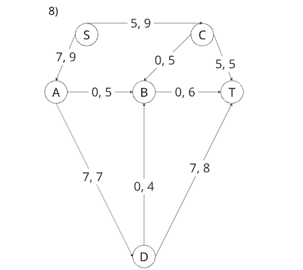

### 4. Продолжим поиск увеличивающего пути в остаточной сети

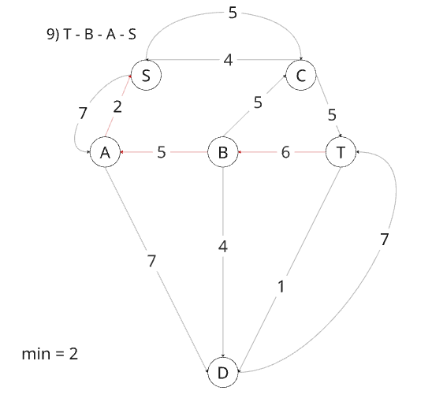

В остаточной сети найден увеличивающий путь t -> b -> a -> s. Минимальный вес дуг на этом пути равен 2.

Уменьшим вес дуг на найденном пути, дуги для которых вес стал нулевым удалим из остаточной сети.

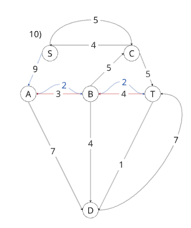

Скорректируем соответствующим образом локальные потоки в исходной сети.

### 5. Продолжим поиск увеличивающего пути в остаточной сети

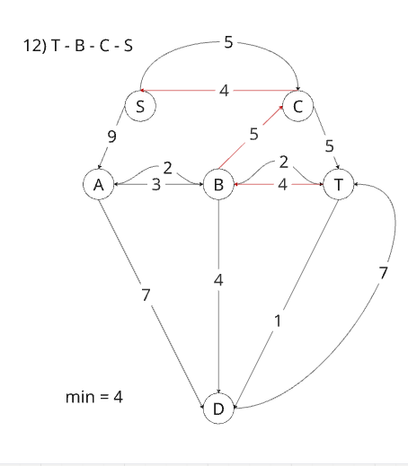

В остаточной сети найден увеличивающий путь t -> b -> c -> s. Минимальный вес дуг на этом пути равен 4.

Уменьшим вес дуг на найденном пути, дуги для которых вес стал нулевым удалим из остаточной сети.

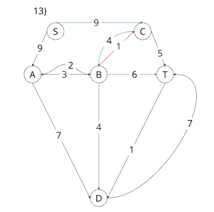

Скорректируем соответствующим образом локальные потоки в исходной сети.

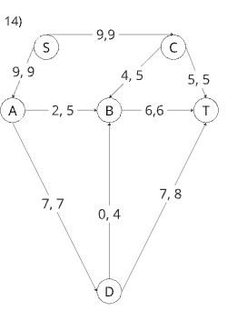

### 6. Продолжим поиск увеличивающего пути в остаточной сети
В остаточной сети не найдено увеличивающих путей, следовательно, алгоритм завершил работу и найденный поток величиной 18 является максимальным для данной сети.

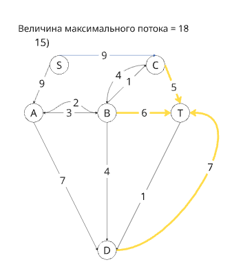

### 7. Проверим значение максимального потока перебором всех разрезов сети.
Разрез сети - разбиение множества вершин на два подмножества V1 и V2, где во множество V1 входит источник, а в V2 входит сток.

Пропускная способность разреза - сумма пропускной способности дуг, начинающихся в вершинах из множества V1 и оканчивающихся в вершинах из V2.

Для сети из _n_ вершин существует 2n - 2 различных разрезов, так как две вершины из множества (источник и сток) "зафиксированы" в V1 и V2, остальные вершины можно различными способами распределять между множествами V1 и V2.

Для сети из 6 вершин нужно найти 26 - 2 = 24 = 16 разрезов. 

| № | V1                      | V2 | Пропускная способность разреза |
|---|:----------------------------------:|:-------------:|:------------------------------:|
| 1 | s                                  | a, b, c, d, t |           9 + 9 = 18           |
|   | **s + одна вершина из a, b, c, d** |               |                                |
| 2 | s, a                               | b, c, d, t    |         9 + 5 + 7 = 21         |
| 3 | s, b                               | a, c, d, t    |         9 + 9 + 6 = 24         |
| 4 | s, c                               | a, b, d, t    |         9 + 5 + 5 = 19         |
| 5 | s, d                               | a, b, c, t    |   9 + 9 + 4 + 8 = 30           |
|   | **s + пара вершин из a, b, c, d**  |               |                                |
| 6 | s, a, b                            | c, d, t          |         9 + 7 + 6 = 22         |
| 7 | s, a, c                            | b, d, t          |         5 + 5 + 7 + 5 = 22         |
| 8 | s, a, d                            | b, c, t          |         9 + 5 + 4 + 8 = 26         |
| 9 | s, b, c                            | a, d, t | 9 + 6 + 5 = 20 |
| 10| s, b, d                            | a, c, t | 9 + 9 + 6 + 8 = 32 |
| 11| s, c, d                            | a, b, t | 9 + 5 + 4 +5 + 8 = 31 |
|   | **s + три вершины из a, b, c, d**  |               |                                |
| 12 | s, a, b, c                        | d, t             |      7 + 6 + 5 = 18           |
| 13 | s, a, b, d                        | c, t             |      9 + 6 + 8 = 23           |
| 14 | s, b, c, d                        | a, t             |    9 + 6 + 5 + 8 = 28           |
| 15 | s, a, c, d                        | b, t             |    5 + 5 + 4 + 5 + 8 = 27     |
|   | **s + четыре вершины из a, b, c, d**  |               |                                |
| 16 | s, a, b, c, d                     |  t               |        5 + 6 + 8 = 19          |

Минимальная пропускная способность разреза равна 18 ( {s} / {a, b, c, d, t} ), что совпадает с найденной величиной максимального потока в сети.

### Ответ:
Максимальный поток в сети равен 18