# Решение задачи о максимальном потоке
### Вариант 2:
#### Пропускная способность дуг сети:

|          Дуги          | sa | sс | aс | ba | cb | bt | at |
|:----------------------:|:--:|:--:|:--:|:--:|:--:|:--:|:--:|
| Пропускная способность | 7  | 8  | 8  | 5  | 11 | 5 | 10  |

### 1. Построим сеть с источником **s**, стоком **t**, а также с локальными потоками (первое число) и указанными пропускными способностями дуг (второе число). Изначально все локальные потоки равны 0.

Построим остаточную сеть. Так как изначально поток в сети не задан, все дуги сети являются пустыми (локальный поток равен нулю), соответственно в остаточную сеть необходимо вынести обратную дугу с весом равным пропускной способности. 

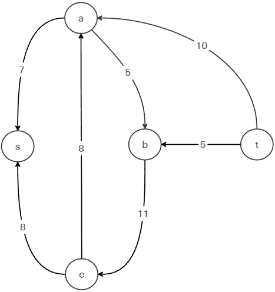

### 2. Проведем поиск увеличивающего пути в остаточной сети
В остаточной сети найден увеличивающий путь t -> b -> c -> s. Минимальный вес дуг на этом пути равен 5.

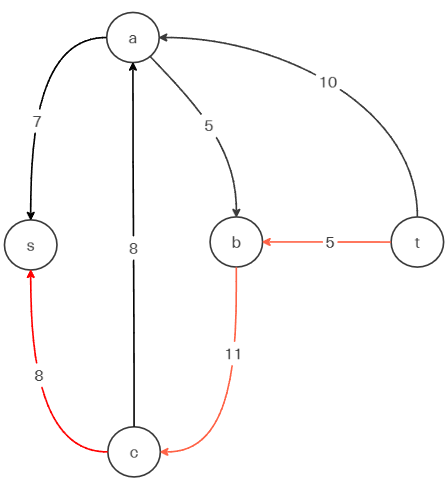

Уменьшим вес дуг на найденном пути, дуги для которых вес стал нулевым удалим из остаточной сети.

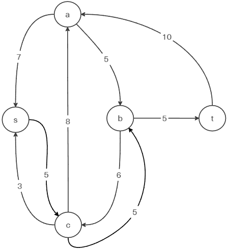

Скорректируем соответствующим образом локальные потоки в исходной сети. Первым числом будем указывать локальный поток, вторым пропускную способность дуги. 

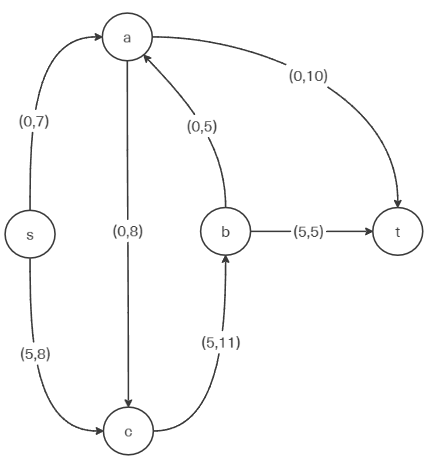

### 3. Продолжим поиск увеличивающего пути в остаточной сети

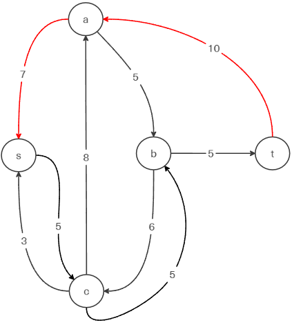

В остаточной сети найден увеличивающий путь t -> a -> s. Минимальный вес дуг на этом пути равен 7.

Уменьшим вес дуг на найденном пути, дуги для которых вес стал нулевым удалим из остаточной сети.

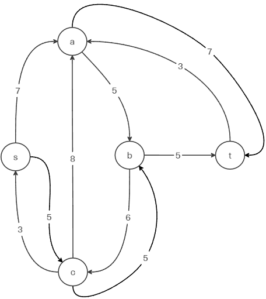

Скорректируем соответствующим образом локальные потоки в исходной сети.

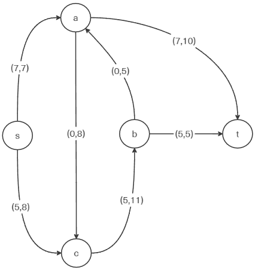

### 4. Продолжим поиск увеличивающего пути в остаточной сети

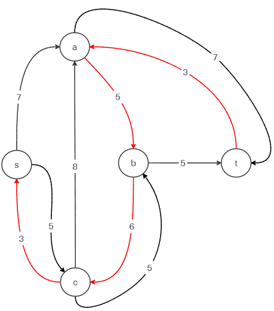

В остаточной сети найден увеличивающий путь t -> a -> b -> c -> s. Минимальный вес дуг на этом пути равен 3.

Уменьшим вес дуг на найденном пути, дуги для которых вес стал нулевым удалим из остаточной сети.

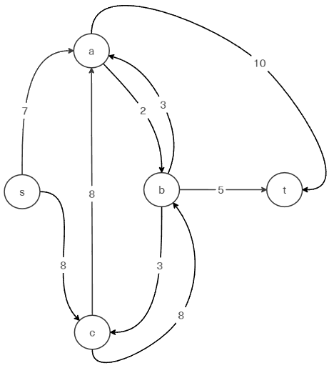

Скорректируем соответствующим образом локальные потоки в исходной сети.

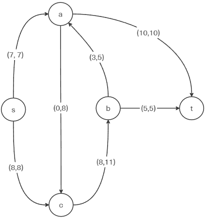

### 5. Продолжим поиск увеличивающего пути в остаточной сети
В остаточной сети не найдено увеличивающих путей, следовательно, алгоритм завершил работу и найденный поток величиной 15 является максимальным для данной сети.

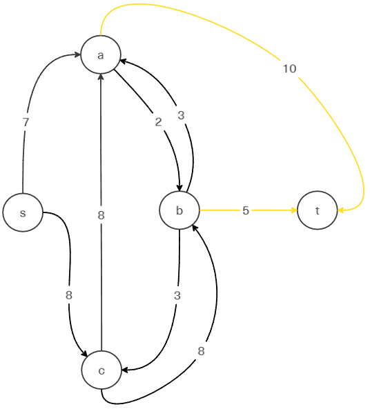

### 6. Проверим значение максимального потока перебором всех разрезов сети.
Разрез сети - разбиение множества вершин на два подмножества V1 и V2, где во множество V1 входит источник, а в V2 входит сток.

Пропускная способность разреза - сумма пропускной способности дуг, начинающихся в вершинах из множества V1 и оканчивающихся в вершинах из V2.

Для сети из _n_ вершин существует 2n - 2 различных разрезов, так как две вершины из множества (источник и сток) "зафиксированы" в V1 и V2, остальные вершины можно различными способами распределять между множествами V1 и V2.

Для сети из 5 вершин нужно найти 25 - 2 = 23 = 8 разрезов. 

| № | V1                   | V2 | Пропускная способность разреза |
|---|:--------------------------------|:--------------|:------------------------------:|
| 1 | s                               | a, b, c, t    |      7 + 8 = 15           |
|   | **s + одна вершина из a, b, c** |               |                           |
| 2 | s, a                            | b, c, t       |      8 + 8 + 10 = 24      |
| 3 | s, b                            | a, c, t       |      7 + 8 + 5 + 5 = 25   |
| 4 | s, c                            | a, b, t       |    7 + 11 = 18            |
|   | **s + пара вершин из a, b, c**  |               |                           |
| 5 | s, a, b                         | c, t          |      8 + 10 + 8 + 5 = 31  |
| 6 | s, a, c                         | b, t          |    10 + 11 = 21           |
| 7 | s, b, c                         | a, t          |    7 + 5 + 5 = 17         |
|   | **s + три вершины из a, b, c**  |               |                           |
| 8 | s, a, b, c                      | t             |      10 + 5 = 15          |

Минимальная пропускная способность разреза равна 15 ( {s, a, b, c} / {t} ), что совпадает с найденной величиной максимального потока в сети.

### Ответ:
Максимальный поток в сети равен 15, он реализуется следующим локальными потоками:
