# Задание №10. Задача о максимальном потоке. Вариант 7

## Исходные данные

Пропускная способность дуг сети:
|          Дуги          | sc | sa | ct | ca | cb | ab | at | bt |
|:----------------------:|:--:|:--:|:--:|:--:|:--:|----|----|----|
| Пропускная способность | 11  | 8  | 5  | 5  | 3  | 3  | 6  | 9 |

## 1. Строим ориентированный граф с источником S и стоком t. На дуги пишем их локальные потоки и пропускную способность.

Первое число (0) - реальный поток. Начинаем с 0, потому что реальный поток не дан. Второе число - пропускная способность

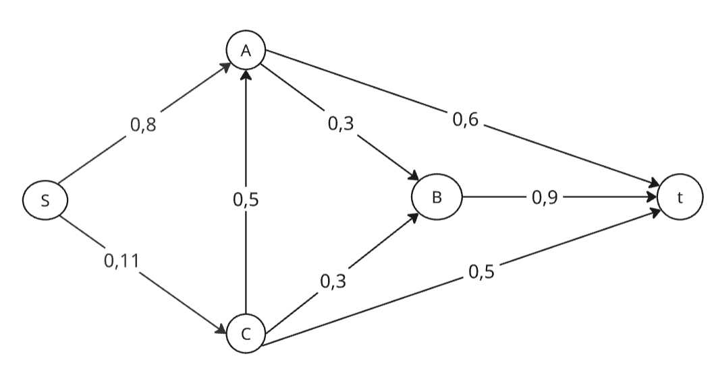

Построим остаточную сеть: рисуем резервные дуги, они идут  в противоположном направлении от изначальной дуги и их величина - пропускная способность - реальный поток, например для as = 8 - 0 = 8

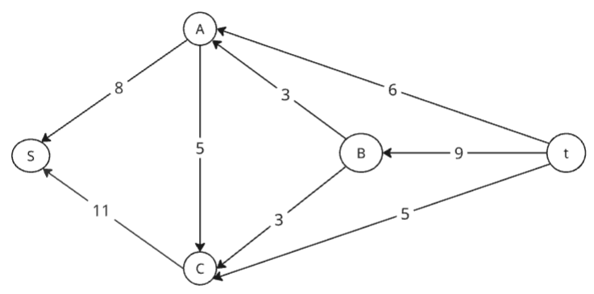

## 2. Проведем поиск увеличивающего пути в остаточной сети

Ищем увеличивающий путь - цепь из t в s. 
Нашли t -> a -> s.

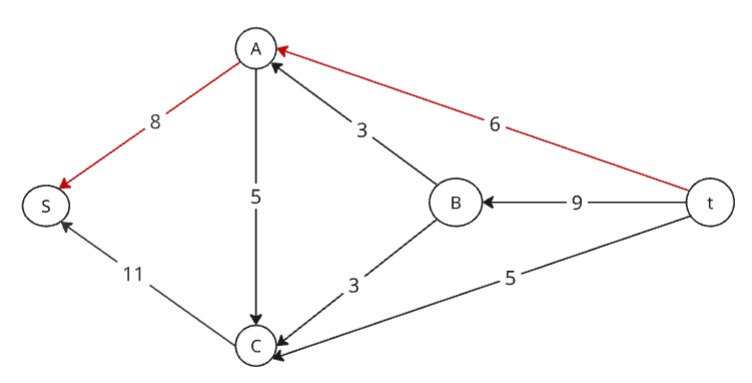

Минимальный вес - 6.
Вычитаем его из резервных дуг и прибавляем к реальному потоку.

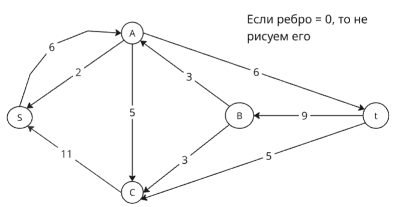

Скорректируем соответствующим образом локальные потоки в исходной сети. Первым числом будем указывать локальный поток, вторым пропускную способность дуги.

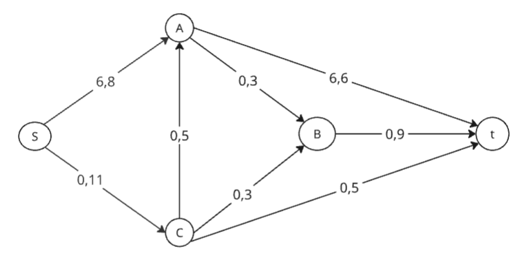

## 3. Продолжим поиск увеличивающего пути в остаточной сети

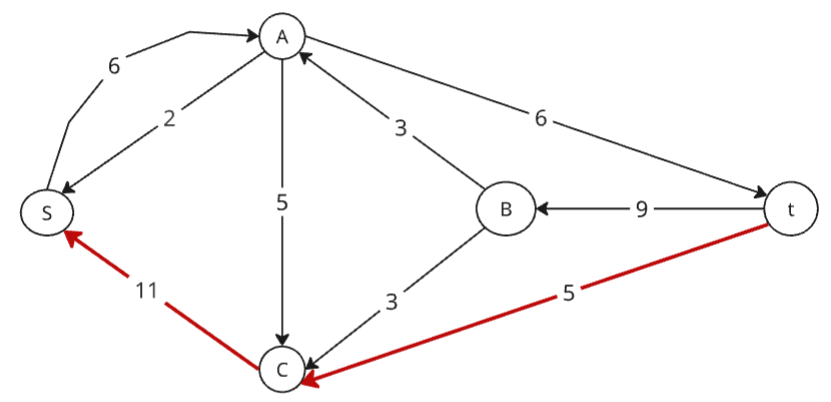

В остаточной сети найден увеличивающий путь t -> c -> s.
Минимальный вес дуг на этом пути равен 5.

Уменьшим вес дуг на найденном пути, дуги для которых вес стал нулевым удалим из остаточной сети.

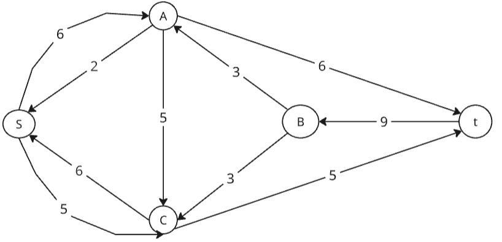

Скорректируем соответствующим образом локальные потоки в исходной сети.

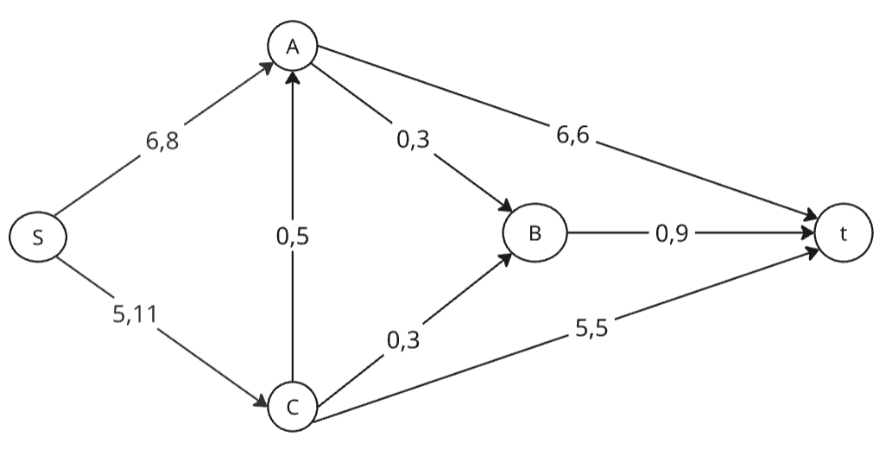

## 4. Продолжим поиск увеличивающего пути в остаточной сети

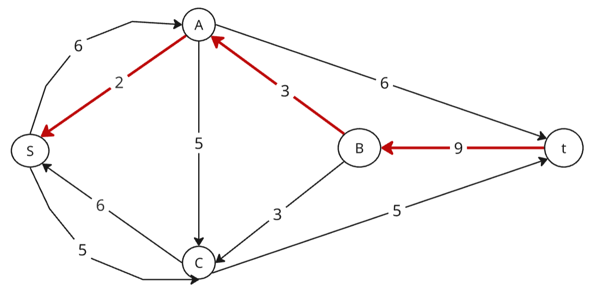

В остаточной сети найден увеличивающий путь t -> b -> a -> s. Минимальный вес дуг на этом пути равен 2.

Уменьшим вес дуг на найденном пути, дуги для которых вес стал нулевым удалим из остаточной сети.

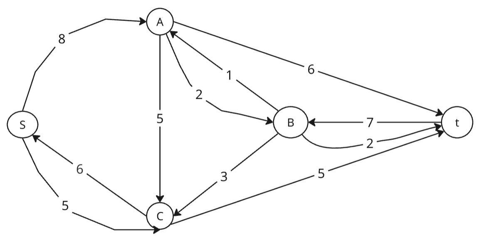

Скорректируем соответствующим образом локальные потоки в исходной сети.

## 5. Продолжим поиск увеличивающего пути в остаточной сети

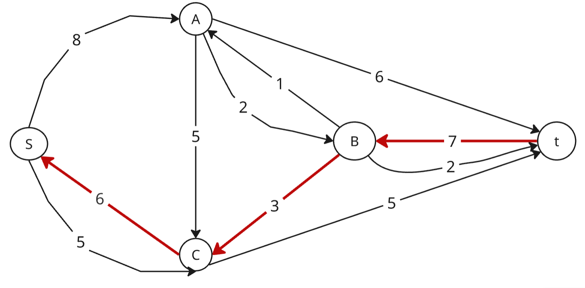

В остаточной сети найден увеличивающий путь t -> b -> c -> s. Минимальный вес дуг на этом пути равен 3.

Уменьшим вес дуг на найденном пути, дуги для которых вес стал нулевым удалим из остаточной сети.

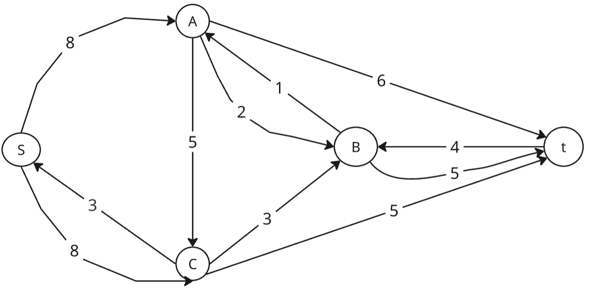

Скорректируем соответствующим образом локальные потоки в исходной сети.

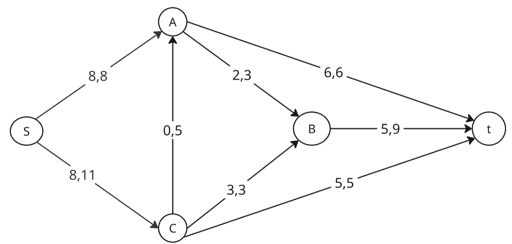

## 6. Продолжим поиск увеличивающего пути в остаточной сети

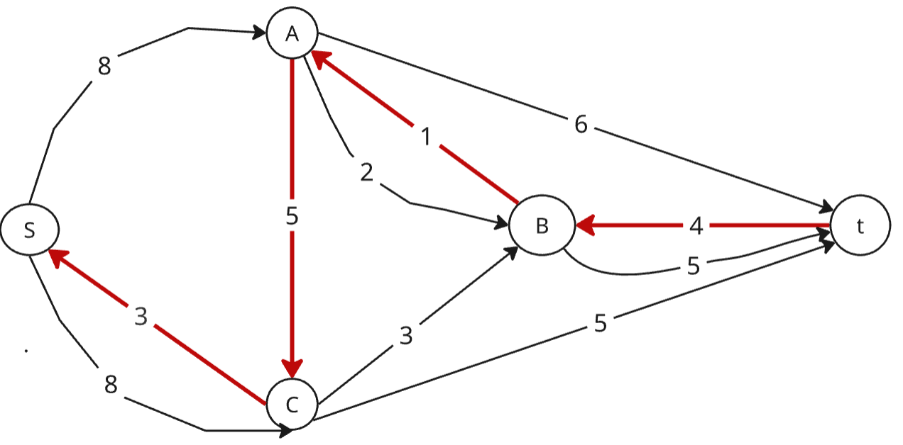

В остаточной сети найден увеличивающий путь t -> b -> a -> c -> s. Минимальный вес дуг на этом пути равен 1.

Уменьшим вес дуг на найденном пути, дуги для которых вес стал нулевым удалим из остаточной сети.

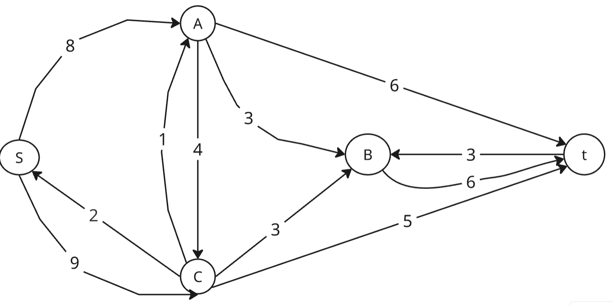

Скорректируем соответствующим образом локальные потоки в исходной сети.

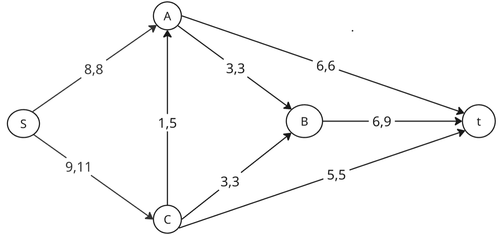

## 7. Продолжим поиск увеличивающего пути в остаточной сети

В остаточной сети не найдено увеличивающих путей, следовательно, алгоритм завершил работу и найденный поток величиной 17 является максимальным для данной сети.

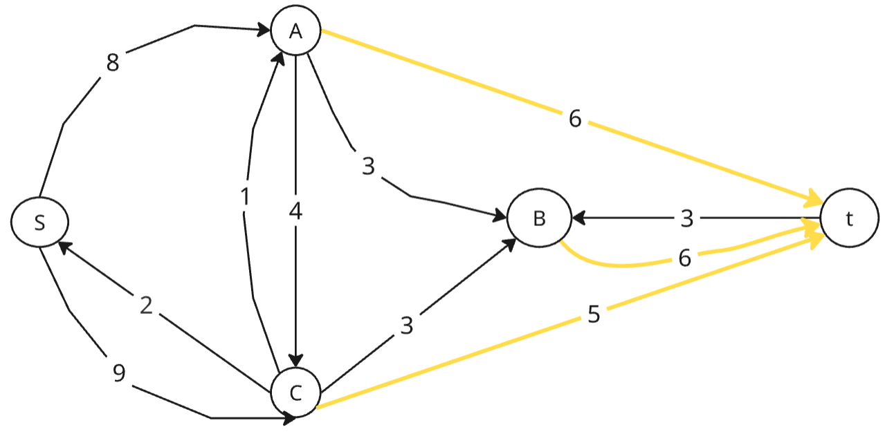

## 8. Проверим значение максимального потока перебором всех разрезов сети.

Для сети из 5 вершин нужно найти 25 - 2 = 23 = 8 разрезов.

| № | V1                   | V2 | Пропускная способность разреза |
|---|:--------------------------------|:--------------|:------------------------------:|
| 1 | s                               | a, b, c, t    |           8 + 11 = 19          |
|   | **s + одна вершина из a, b, c** |               |                                |
| 2 | s, a                            | b, c, t       |         6 + 3 + 11 = 20        |
| 3 | s, b                            | a, c, t       |         8 + 11 + 9 = 28        |
| 4 | s, c                            | a, b, t       |         8 + 5 + 3 + 5 = 21     |
|   | **s + пара вершин из a, b, c**  |               |                                |
| 5 | s, a, b                         | c, t          |         6 + 9 + 11 = 26        |
| 6 | s, a, c                         | b, t          |         6 + 3 + 3 + 5 = 17     |
| 7 | s, b, c                         | a, t          |         8 + 5 + 5 + 9 = 27     |
|   | **s + три вершины из a, b, c**  |               |                                |
| 8 | s, a, b, c                      | t             |           6 + 9 + 5 = 20       |

Минимальная пропускная способность разреза равна 17 ( {s, a, c} / {b, t} ), что совпадает с найденной величиной максимального потока в сети.

### Ответ:
Максимальный поток в сети равен 17, он реализуется следующим локальными потоками:

