# Задание №10. Задача о максимальном потоке минимальной стоимости. Варинат 5

## Исходные данные
#### Пропускная способность дуг сети p(e) и стоимость транспортировки  единицы потока c(e):

| Дуги                       | sd | sc | db | ct | dc | ca | ba | at |
|:---------------------------|:--:|:--:|:--:|:--:|:--:|:--:|:--:|:--:|
| Пропускная способность     | 9  | 9  | 5  | 10 | 5  | 11 | 5  | 11 |
| Стоимость транспортировки  | 3  | 3  | 3  | 12 | 3  | 8  | 3  | 2  |

### 1. Построим сеть с источником **s**, стоком **t** и указанными пропускными способностями дуг для поиска максимального потока.

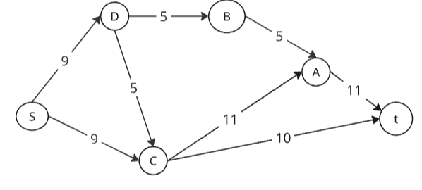

Укажем начальный поток величиной 5 s -> с -> t. Первое число - реальный поток, второе - пропускная способность.

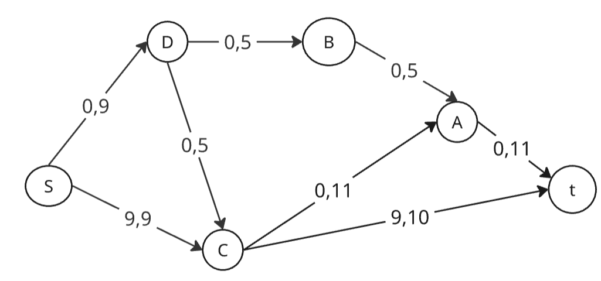

Построим остаточную сеть: рисуем резервные дуги, они идут в противоположном направлении от изначальной дуги и их величина - пропускная способность - реальный поток, например для ds = 9 - 0 = 9

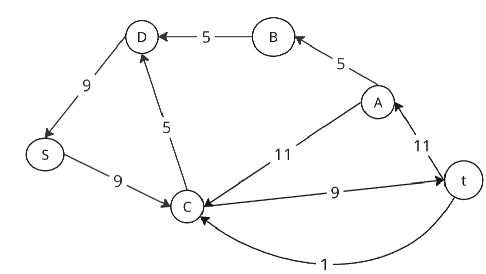

### 2. Проведем поиск увеличивающего пути в остаточной сети

В остаточной сети найден увеличивающий путь t -> c -> d -> s. Минимальный вес дуг на этом пути равен 1.

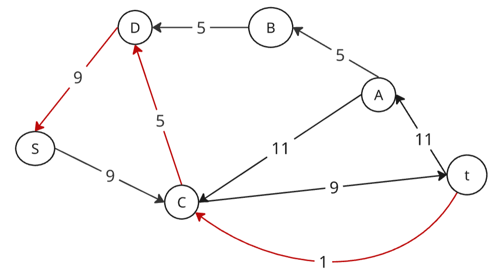

Уменьшим вес дуг на найденном пути, дуги для которых вес стал нулевым удалим из остаточной сети.

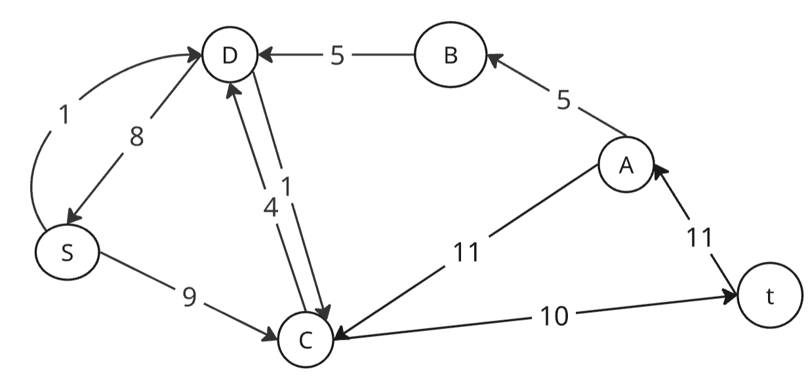

Скорректируем соответствующим образом локальные потоки в исходной сети. Первым числом будем указывать локальный поток, вторым пропускную способность дуги.

### 3. Продолжим поиск увеличивающего пути в остаточной сети

В остаточной сети найден увеличивающий путь t -> a -> b -> d -> s. Минимальный вес дуг на этом пути равен 5.

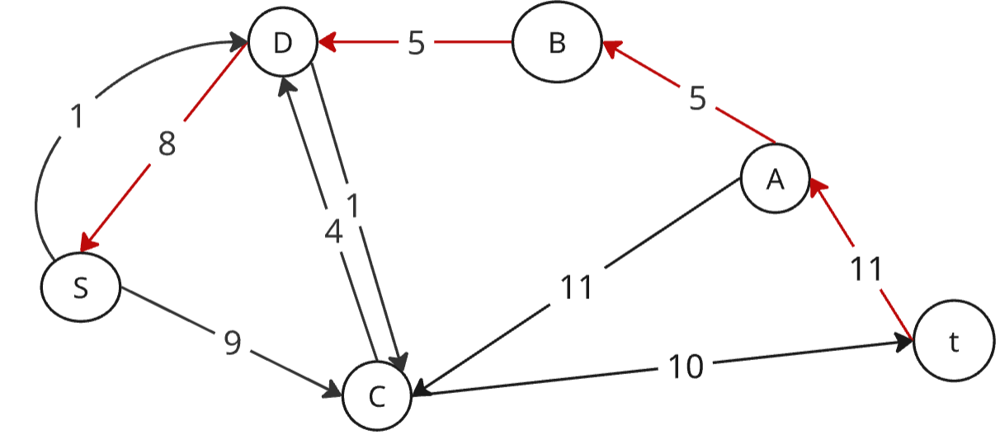

Уменьшим вес дуг на найденном пути, дуги для которых вес стал нулевым удалим из остаточной сети.

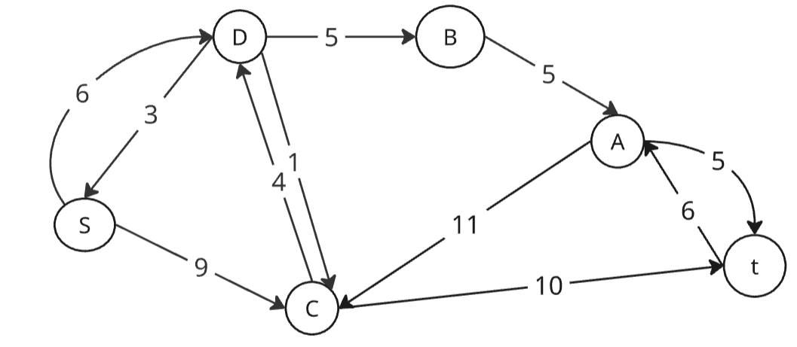

Скорректируем локальные потоки сети

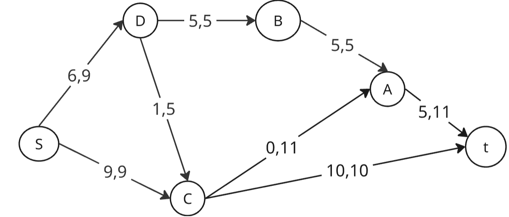

### 4. Продолжим поиск увеличивающего пути в остаточной сети

В остаточной сети найден увеличивающий путь t -> a -> c -> d -> s. Минимальный вес дуг на этом пути равен 3.

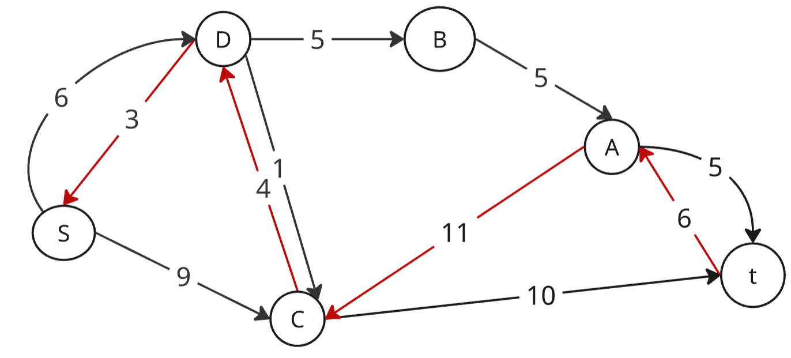

Уменьшим вес дуг на найденном пути, дуги для которых вес стал нулевым удалим из остаточной сети.

Скорректируем локальные потоки сети

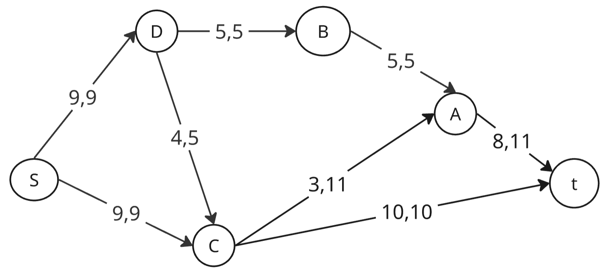

### 5. Продолжим поиск увеличивающего пути в остаточной сети

В остаточной сети не найдено увеличивающих путей, следовательно, алгоритм завершил работу и найденный поток величиной 18 является максимальным для данной сети.

### 6. Рассчитаем стоимость полученного максимального потока.

| Дуги                                          | sd | sc | db | ct | dc | ca | ba | at | Итого  |
|:----------------------------------------------|:--:|:--:|:--:|:--:|:--:|:--:|:--:|:--:|:------:|
| Пропускная способность p(e)                   | 9  | 9  | 5  | 10 | 5  | 11 | 5  | 11 |        |
| Локальный поток f(e)                          | 9  | 9  | 5  | 10 | 4  | 3  | 5  |  8 |        |
| Стоимость транспортировки единицы потока c(e) | 3  | 3  | 3  | 12 | 3  | 8  | 3  |  2 |        |
| Суммарная стоимость f(e)*c(e)                 | 27 | 27 | 15 | 120| 12 | 24 | 15 | 16 |**256** |

Стоимость полученного потока составляет 256.

### 7. Попробуем уменьшить стоимость потока для чего построим остаточную сеть.

Для каждого ребра остаточной сети укажем стоимость транспортировки единицы потока. Резервные дуги имеют положительную стоимость, прямые - отрицательную.

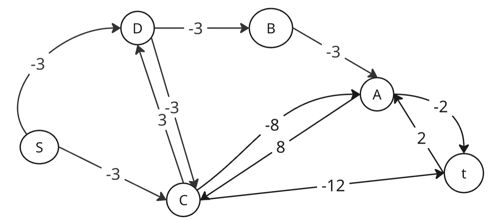

В остаточной сети найден ориентированный цикл отрицательной стоимости:
c -> t -> a -> c (-12 + 2 + 8 = -2)

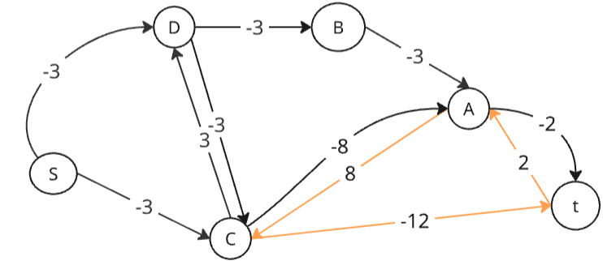

Найдем минимальный вес ребра в указанном цикле (=3), изображенном в остаточной сети с указанием величины потока.

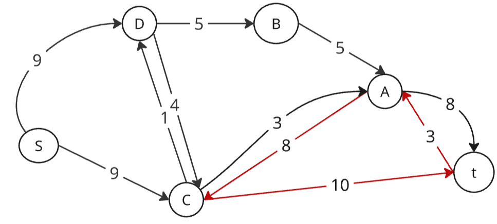

Минимальный вес ребра в цикле 3 - это неиспользованный резерв ребра a -> t.

Удалим найденный цикл - уменьшим на 3 вес всех ребер, входящих в цикл.

Скорректируем остаточную сеть с указанием стоимости транспортировки единицы потока.

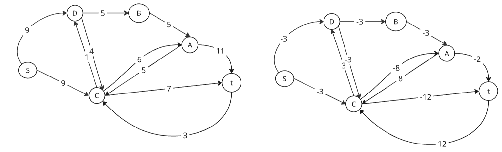

### 8. Проведем повторный поиск цикла отрицательной стоимости в остаточной сети.

В остаточной сети отсутствуют циклы отрицательной стоимости, следовательно, стоимость потока минимальна.

### 9. Рассчитаем стоимость полученного максимального потока.

| Дуги                                          | sd | sc | db | ct | dc | ca | ba | at | Итого  |
|:----------------------------------------------|:--:|:--:|:--:|:--:|:--:|:--:|:--:|:--:|:------:|
| Пропускная способность p(e)                   | 9  | 9  | 5  | 10 | 5  | 11 | 5  | 11 |        |
| Локальный поток f(e)                          | 9  | 9  | 5  | 7  | 4  | 6  | 5  | 11 |        |
| Стоимость транспортировки единицы потока c(e) | 3  | 3  | 3  | 12 | 3  | 8  | 3  |  2 |        |
| Суммарная стоимость f(e)*c(e)                 | 27 | 27 | 15 | 84 | 12 | 48 | 19 | 22 |**250** |

Ответ: Следовательно максимальный поток в сети равен 18, минимальная стоимость равна 250

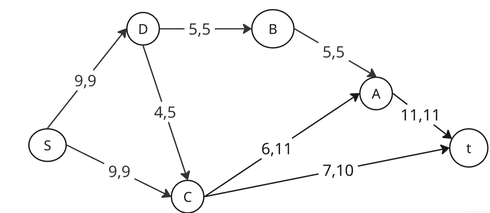

