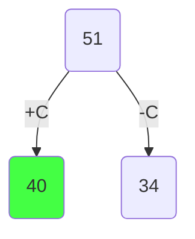
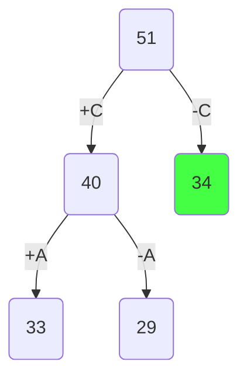
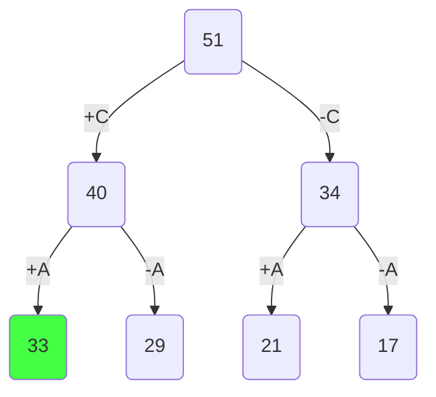
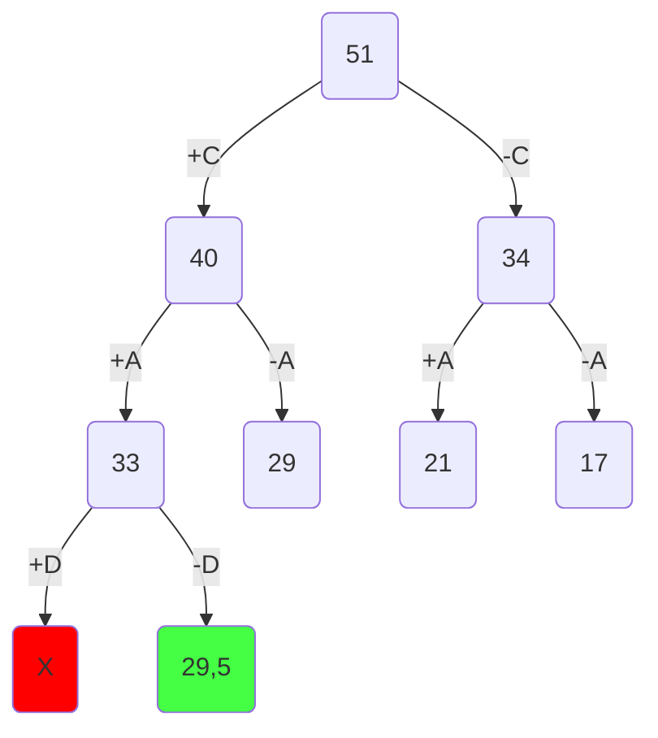
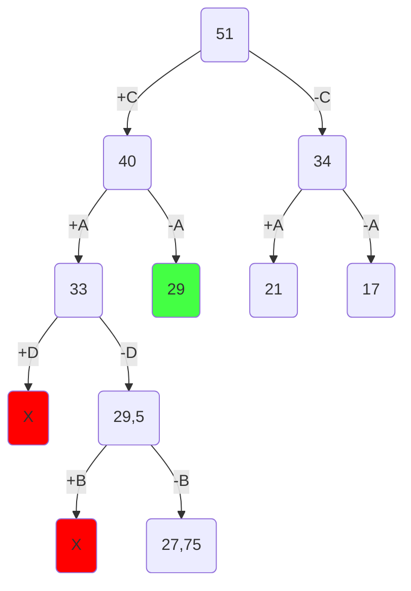
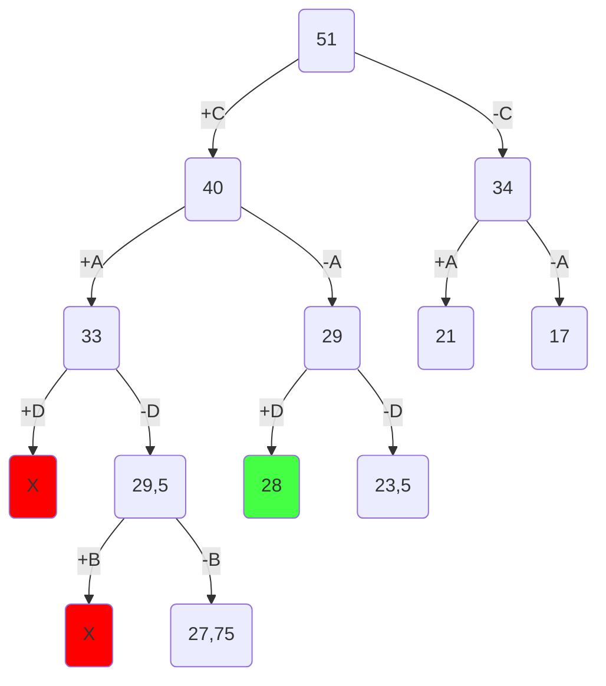
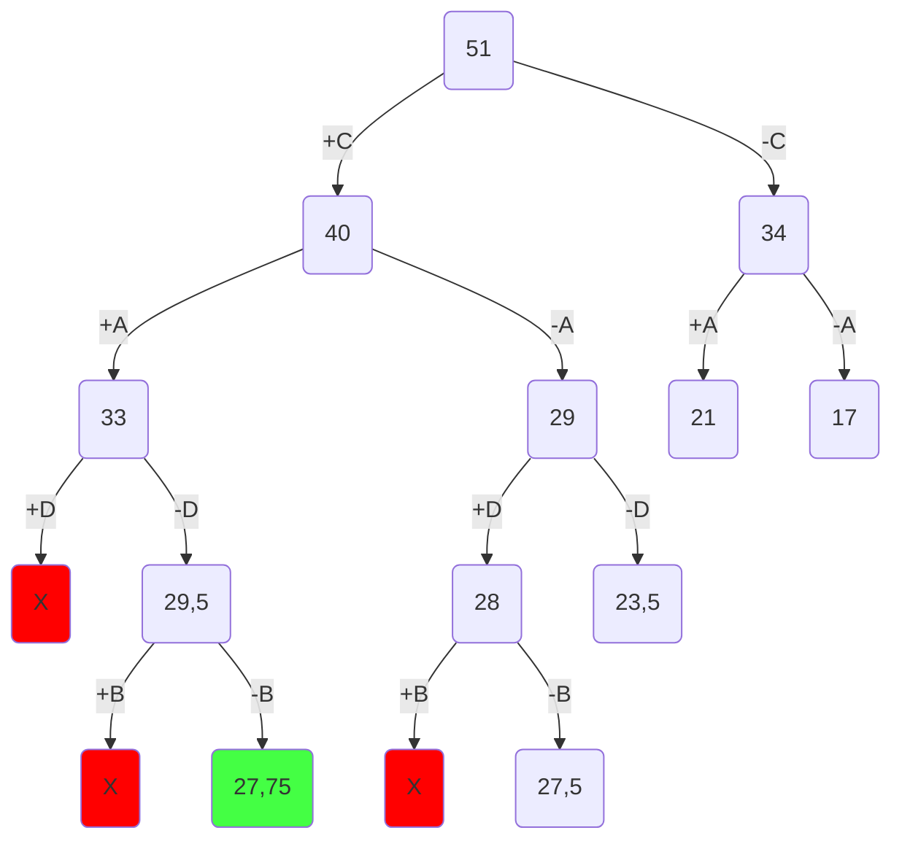
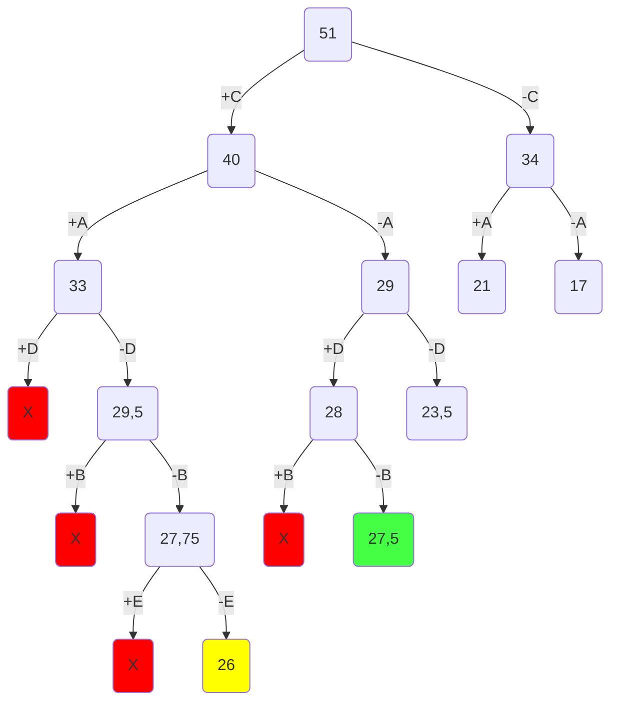
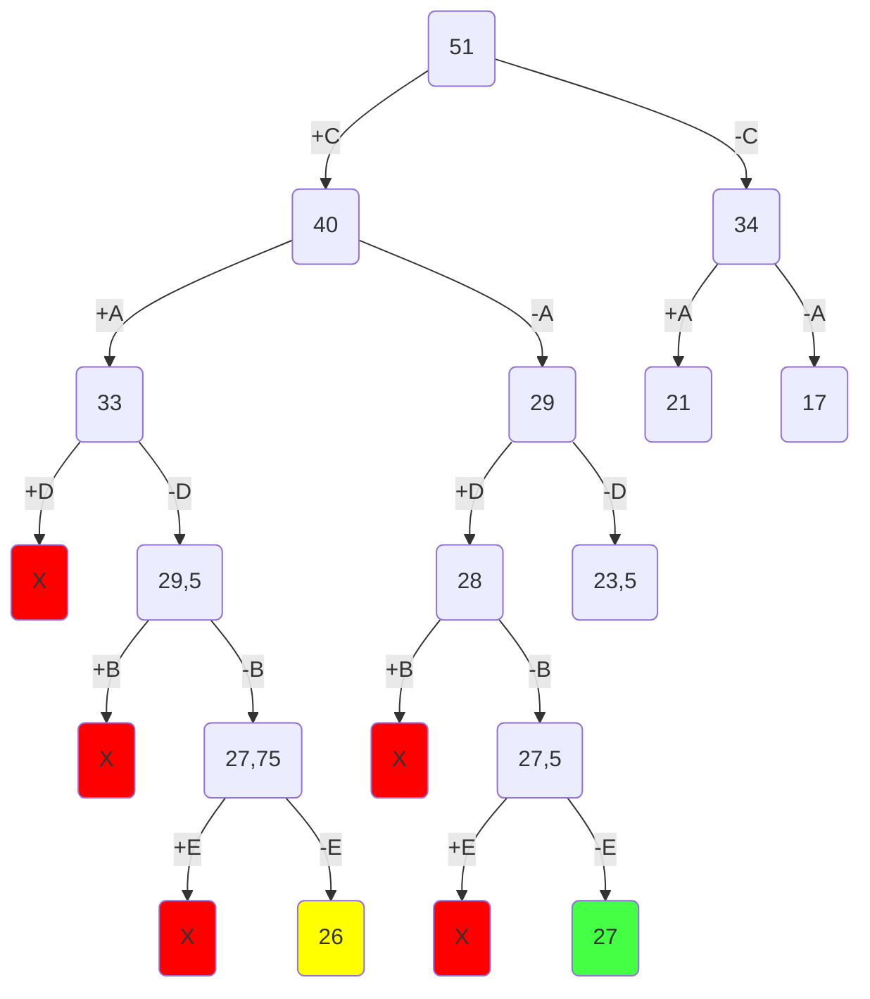

# Задание №12

# Задача о рюкзаке. Метод ветвей и границ.

Для каждого варианта представлены условия задачи, в соответствии с которыми необходимо:

1. Решить задачу о рюкзаке с применением метода ветвей и границ.
2. Оформить решение задачи по шагам с подробными комментариями, таблицами и диаграммами.
3. **В узлах построенного дерева привести расчет оценки и указать порядковый номер, по которым можно проверить порядок исследования узлов дерева**, либо оформить решение с пошаговым построением дерева (как в примере ниже).
4. В ответе указать:
   - максимально возможную стоимость предметов в рюкзаке,
   - набор предметов, обеспечивающих максимальную стоимость,
   - общий вес предметов в рюкзаке,
   - свободное место в рюкзаке.

# Пример решения задачи о рюкзак

## Постановка задачи

Задача о рюкзаке (англ. Knapsack problem) — дано N предметов, ni предмет имеет массу wi > 0 и стоимость pi > 0. Необходимо выбрать из этих предметов такой набор, чтобы суммарная масса не превосходила заданной величины W (вместимость рюкзака), а суммарная стоимость была максимальна.

## Условия задачи

### Вариант 7:

| **Предметы**  | **A** | **B** | **C** | **D** | **E** |
| ------------- | :---: | :---: | :---: | :---: | :---: |
| **Стоимость** |   8   |   5   |  18   |   9   |   3   |
| **Вес**       |   4   |  10   |   6   |   9   |  12   |

Ограничение вместимости - 17 у.е.

## Шаг 1

Сортируем предметы по их ценности $(\frac {Стоимость}{вес})$

| **Предметы**  | **C** | **A** | **D** |     **B**     |     **E**     |
| ------------- | :---: | :---: | :---: | :-----------: | :-----------: |
| **Стоимость** |  18   |   8   |   9   |       5       |       3       |
| **Вес**       |   6   |   4   |   9   |      10       |      12       |
| **Ценность**  |   3   |   2   |   1   | $\frac{1}{2}$ | $\frac{1}{4}$ |

## Шаг 2

Представим, что самого ценного предмета из тех, что еще не обработаны, у нас бесконечное количество и мы можем делить его на сколь угодно малые части. Тогда мы можем все оставшееся в рюкзаке место заполнить этим предметом. Тогда ценность будет

$$
3 * 17 = 51
$$

Это значение будет корнем нашего дерева, оно представляет оценку перспективности для задачи в целом.

## Шаг 3

Разобьем множество решений на два подмножества и начнем строить дерево. Левым потомком будет подмножество решений, в которых мы взяли самый ценный из оставшихся предметов, правым - где не взяли.

Оценка перспективности левого потомка =

$$
18 + (17 - 6) * 2 = 40
$$

Оценка перспективности правого потомка =

$$
17 * 2 = 34
$$

Повторяем шаг 3 и продолжаем строить дерево из самой перспективной вершины.

Оценка перспективности левого потомка -

$$
18 + 8 + (11 - 4) * 1 = 18 + 8  + 7 = 33
$$

Оценка перспективности правого потомка -

$$
18 + 11 * 1 = 29
$$

Заметим, что самая перспективная вершина оказалась на другой ветке. Продолжаем строить из вершины с оценкой 34.

Оценка перспективности левого потомка -

$$
8 + (17 - 4) * 1 = 8 + 13 = 21
$$

Оценка перспективности правого потомка -

$$
17 * 1 = 17
$$

\

Самая перспективная вершина - 33.

Оценка перспективности левого потомка -

$$
18 + 8 + 9 + (7-9), 7 - 9 = -2
$$

Получили отрицательное значение, это значит, что предмет не поместится в рюкзак. Соответственно от этой вершины мы не будем продолжать поиск.

Оценка перспективности правого потомка -

$$
18 + 8 + 7 * \frac{1}{2} = 29,5
$$

Самая перспективная вершина - 29,5.

Оценка перспективности левого потомка -

$$
18 + 8 + (7 - 10), 7 - 10 = -3
$$

Получили отрицательное значение, это значит, что предмет не поместится в рюкзак. Соответственно от этой вершины мы не будем продолжать поиск.

Оценка перспективности правого потомка -

$$
18 + 8 + 7 * \frac{1}{4} = 27,75
$$

Самая перспективная вершина - 29.

Оценка перспективности левого потомка -

$$
18 + 9 + 2 * \frac{1}{2} = 28
$$

Оценка перспективности правого потомка -

$$
18 + 11 * \frac{1}{2} = 23,5
$$

Самая перспективная вершина - 28.

Оценка перспективности левого потомка -

$$
18 + 9 + (2 - 10), 2 - 10 = -8
$$

Получили отрицательное значение, что значит предмет не поместится в рюкзак. Соответственно от этой вершины мы не будем продолжать поиск.

Оценка перспективности правого потомка -

$$
18 + 9 + 2 * \frac{1}{4} = 27,5
$$

Самая перспективная вершина - 27,75.

Оценка перспективности левого потомка -

$$
18 + 8 + (7 - 12), 7 - 12 = -5
$$

Снова получили отрицательное значение - не рассматриваем эту вершину

Оценка перспективности правого потомка -

$$
18 + 8 + 7 * 0 = 26
$$

Самая перспективная вершина - 27,5.

Оценка перспективности левого потомка -

$$
18 + 9 + (2 - 12), 2 - 12 = -10
$$

Снова получили отрицательное значение - не рассматриваем эту вершину

Оценка перспективности правого потомка -

$$
18 + 9 + 2 * 0 = 27
$$

Поскольку мы опустились до самого нижнего уровня (рассмотрели все предметы) и вершина на самом нижнем уровне является самой перспективной, то это и будет ответом.

Чтобы восстановить все положенные в рюкзак предметы пройдемся по ребрам, которые привели нас к ответу.

## Ответ

В рюкзак пойдут C и D, т.е. итоговая стоимость: 18 + 9 = 27 (вес: 6 + 9 = 15 <= 17)
