# Решение транспортной задачи - вариант 2
Три завода имеют производительность 6, 2 и 5, а два складских помещения имеют вместимость 8 и 5. Матрица затрат на перевозку одной единицы товара (строки – это заводы, столбцы – это склады) имеет вид:
$$
 \begin{pmatrix}    
  20 & 30 \\ 
  10 & 8 \\
  12 & 11 \\ 
 \end{pmatrix}    
$$
## Задача:
Распределить весь товар производимы заводами по складам с минимально возможной стоимостью перевозки, используя алгоритм поиска максимального потока минимальной стоимости.
## Решение:
### 1. Исходные данные задачи
Поставщики (заводы):
| Завод | Производительность |
|:-----:|:-----:|
|A|6|
|B|2|
|C|5|

Общий объём производства: 6 + 2 + 5 = 13

Потребители (склады):
|Склад|Вместимость|
|:-:|:-:|
|1|8|
|2|5|

Общая вместимость: 8 + 5 = 13

Т.к. суммарное производство равно суммарной вместимости, задача сбалансирована.

### Матрица затрат на перевозку:
$$
 \begin{array}{c|cc} 
   & 1 & 2 \\ \hline
  A & 20 & 30 \\ 
  B & 10 & 8 \\
  C & 12 & 11 \\ 
 \end{array}    
$$

### 2. Приведение к задаче максимального потока минимальной стоимости

#### 2.1. Представление производителей и потребителей в виде вершин графа

Представим исходные данные в виде графа:

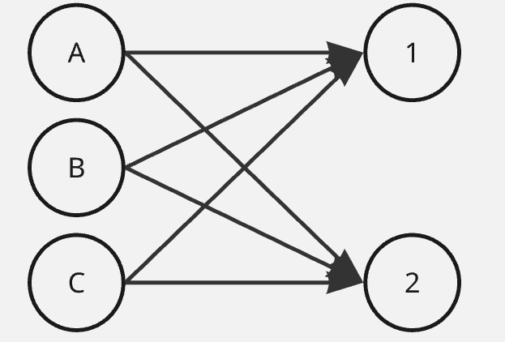

#### 2.2. Добавим источник и сток для полной реализации графа и моделирования поставок и спроса

После добавления источника и стока, граф выглядит следующим образом:

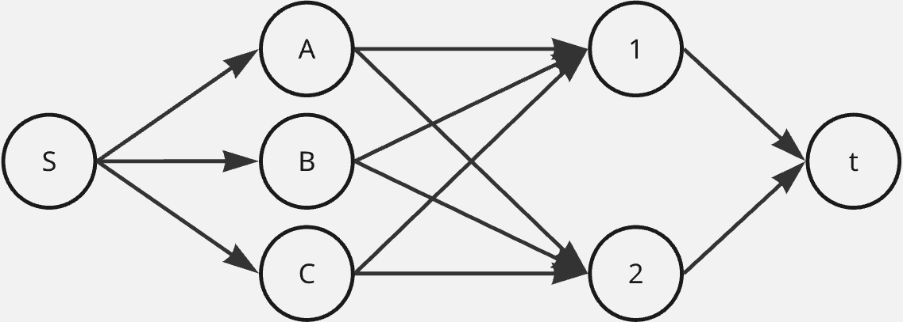

#### 2.3. Введение ограничений на перевозки. 
Для каждого ребра построенного графа задается пропускная способность, которая выступает в роли верхней границы допустимого потока.

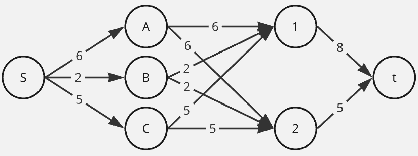

#### 2.4. Учет стоимости перевозки.
Ребра наделяются весами (стоимостью), и теперь каждое ребро характеризуется парой: стоимость, пропускная способность.

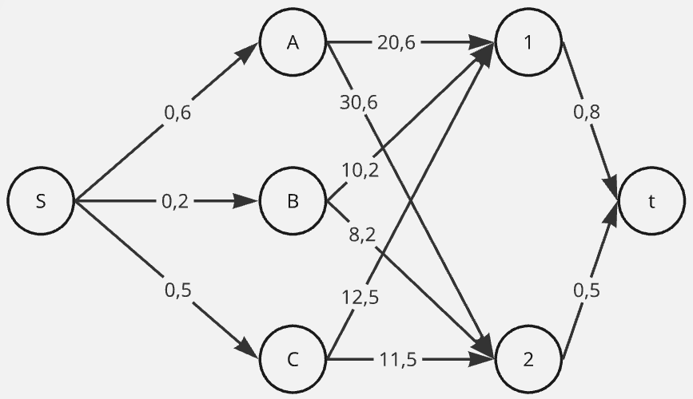

На этом подготовка графа завершена. Переходим к решению основной задачи — поиску максимального потома минимальной стоимости.

### 3. Определение максимального потока.
Для этого используется сеть, в которой ребра содержат информацию о текущем потоке и пропускной способности (локальный поток, пропускная способность).

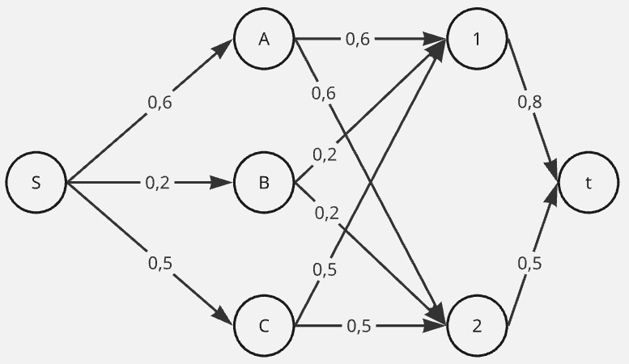

#### 3.1 Строим остаточную сеть, чтобы найти увеличивающий путь.

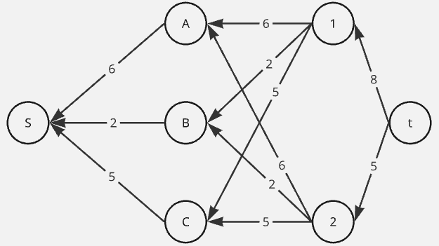

#### 3.2 Выбираем первый путь t - 1 - A - S, минимальный вес ребра в нём 6.

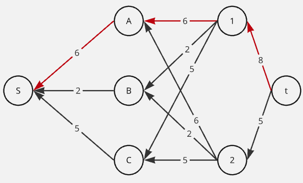

#### 3.3 Уменьшим вес дуг на найденном пути, дуги для которых вес стал нулевым удалим из остаточной сети.

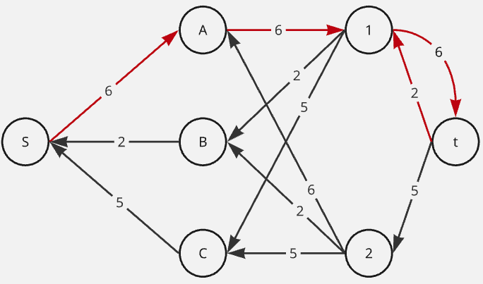

#### 3.4 Скорректируем соответствующим образом локальные потоки в исходной сети.

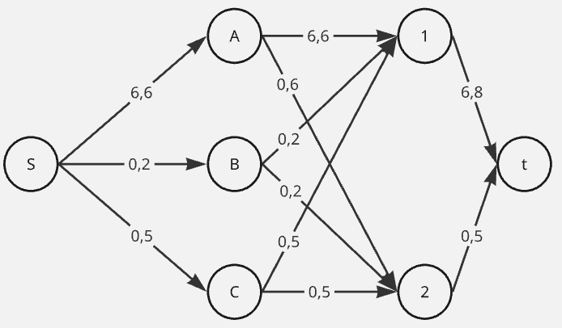

#### 3.5 Выбираем увеличивающий путь t - 2 - C - S, минимальный вес ребра 5.

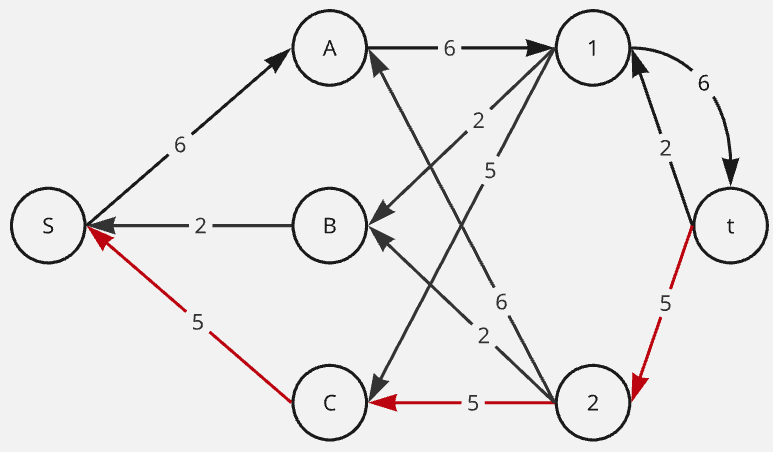

#### 3.6 Уменьшим вес дуг на найденном пути, дуги для которых вес стал нулевым удалим из остаточной сети.

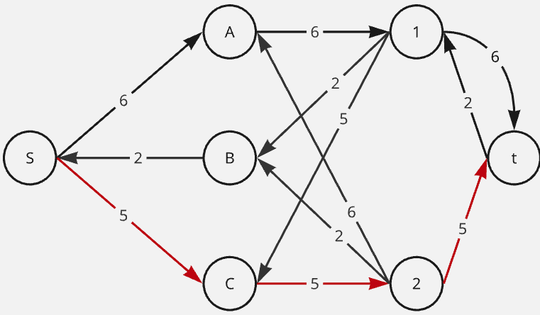

#### 3.7 Скорректируем соответствующим образом локальные потоки в исходной сети.

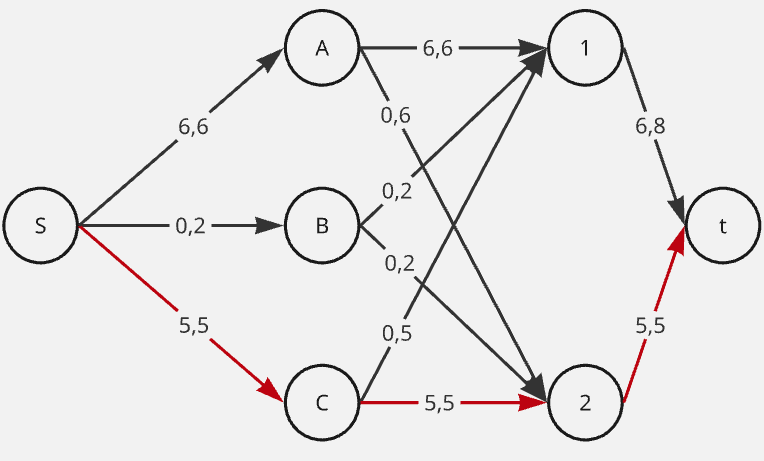

#### 3.8 Выбираем увеличивающий путь t - 1 - B - S, минимальный вес ребра 2.

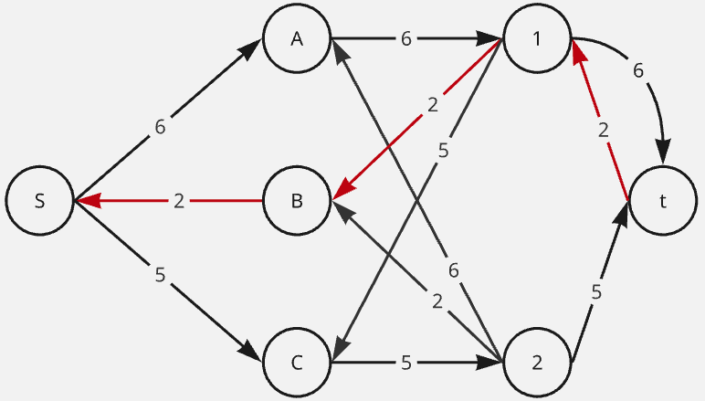

#### 3.9 Уменьшим вес дуг на найденном пути, дуги для которых вес стал нулевым удалим из остаточной сети.

#### 3.10 Скорректируем соответствующим образом локальные потоки в исходной сети.

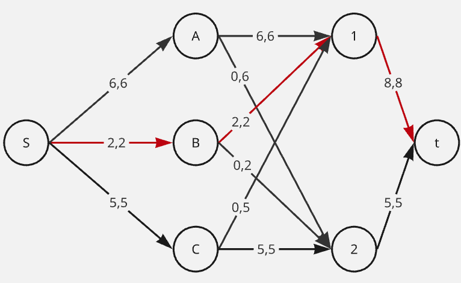

В остаточной сети не найдено увеличивающих путей, следовательно, алгоритм завершил работу.

### 4. Уменьшение стоимости потока

Найдем общую стоимость потока: $$6 \times 20 + 2 \times 10 + 5 \times 11 = 120 + 20 + 55 = 195$$

Для оптимизации потока по стоимости перейдем к построению остаточной сети с указанием стоимости на каждом ребре.

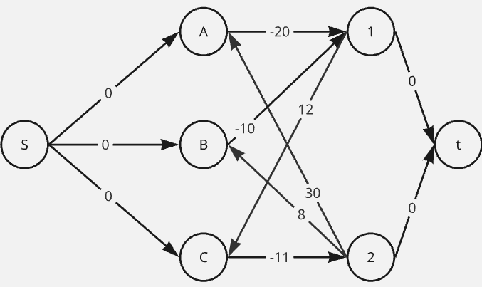

В данной сети найдем цикл отрицательной стоимости B - 1 - C - 2 - B.

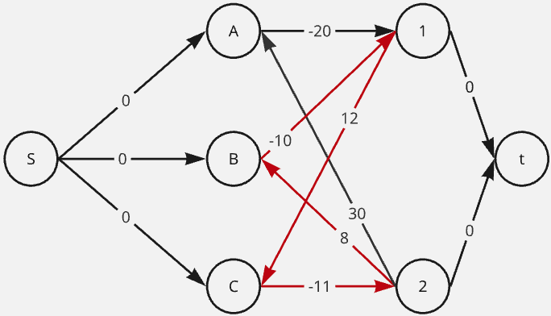

Сумма рёбер: $$- 10 + 12 - 11 + 8 = -1 < 0 $$

Определим минимальный вес ребра в рассматриваемом цикле остаточной сети с учетом величины потока.

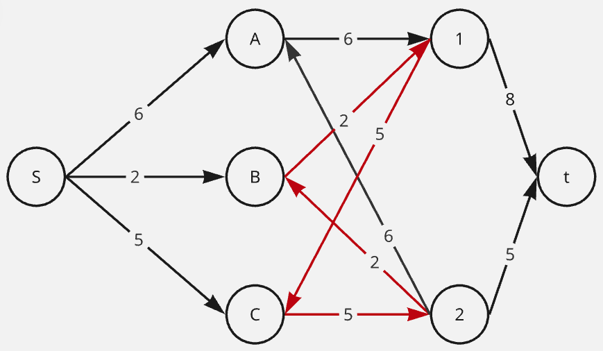

Минимальный вес ребра 2. Уменьшим вес дуг на найденном пути, дуги для которых вес стал нулевым удалим из остаточной сети.

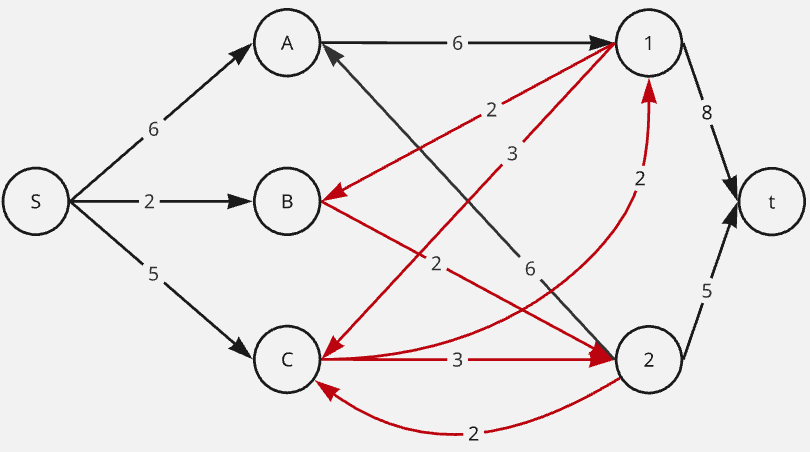

Скорректируем соответствующим образом стоимости.

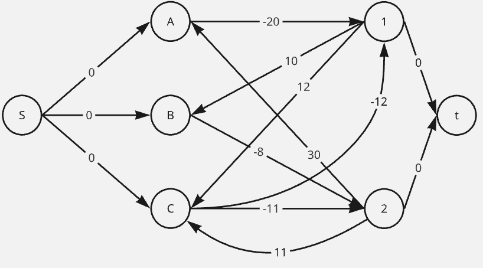

В данной сети нет циклов отрицательной стоимости, а значит, что текущий поток является максимальным потоком минимальной стоимости.

Скорректируем исходную сеть локальных потоков.

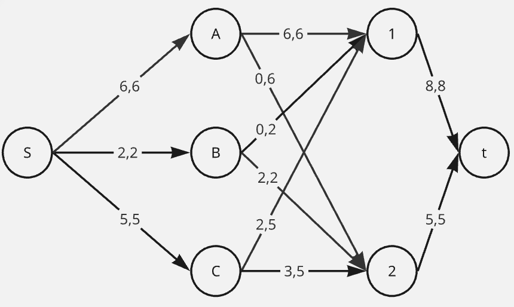

Теперь рассчитаем стоимость потока: $$6 \times 20 + 2 \times 8 + 2 \times 12 + 3 \times 11 = 193$$

## Ответ
Минимальная стоимость перевозки: 193

Способ распределения:

A -> 1 (6 ед.)

B -> 2 (2 ед.)

C -> 1 (2 ед.)

C -> 2 (3 ед.)