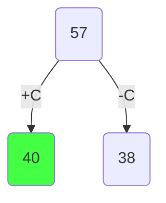
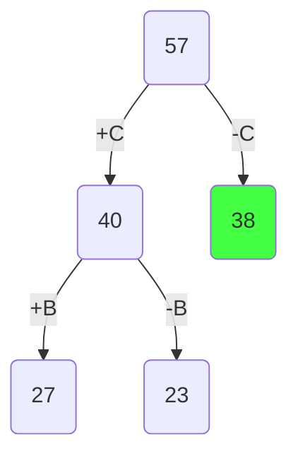
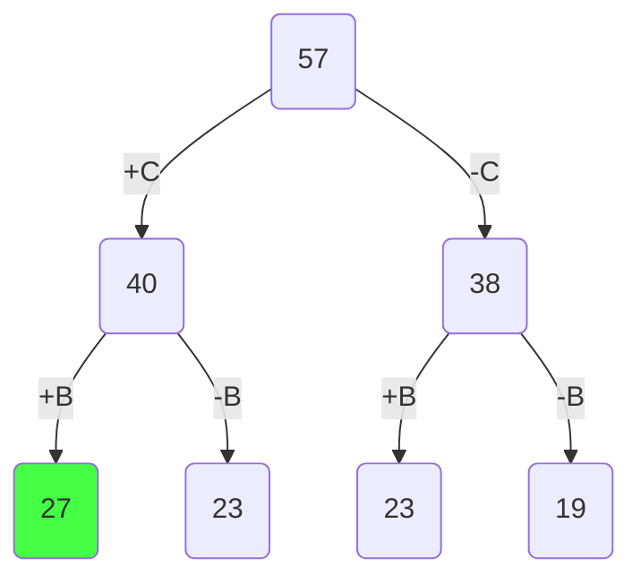
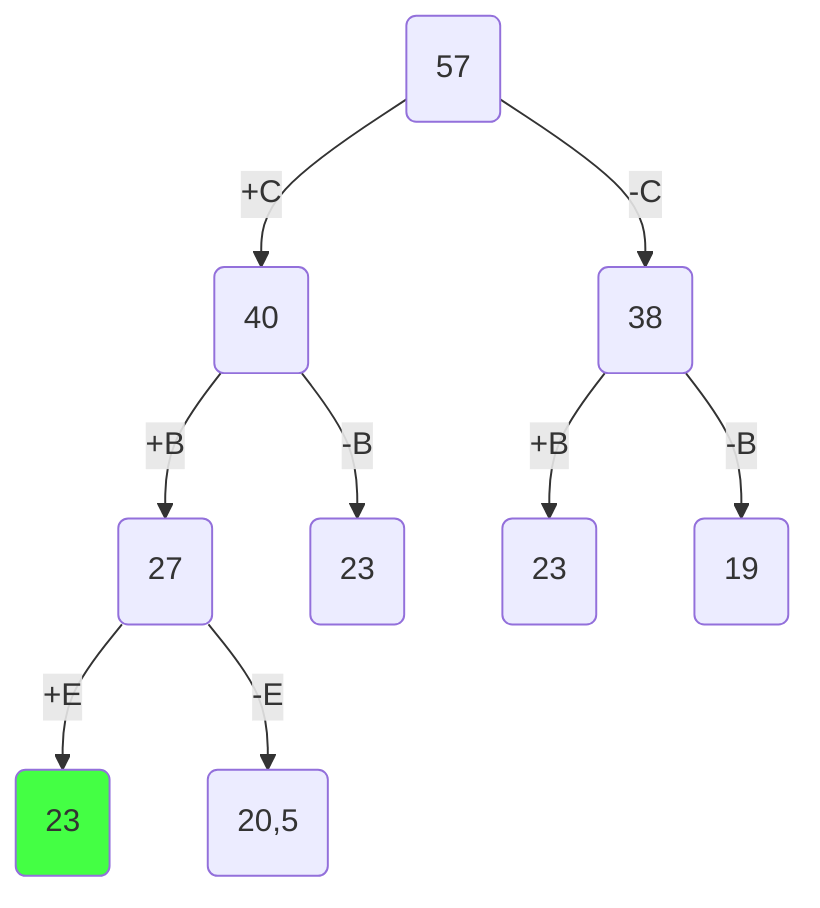
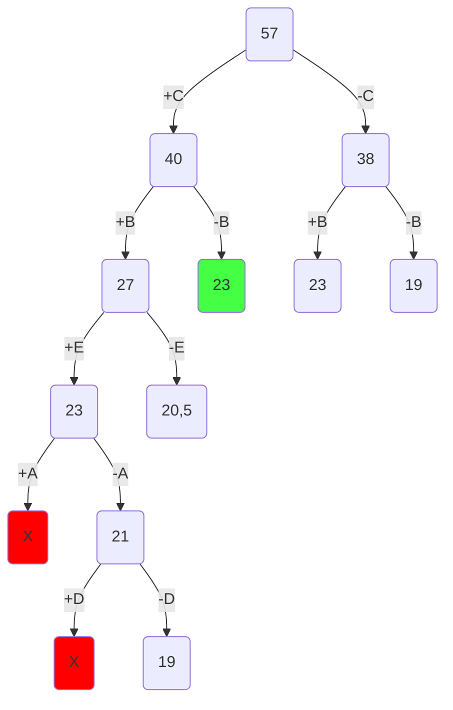
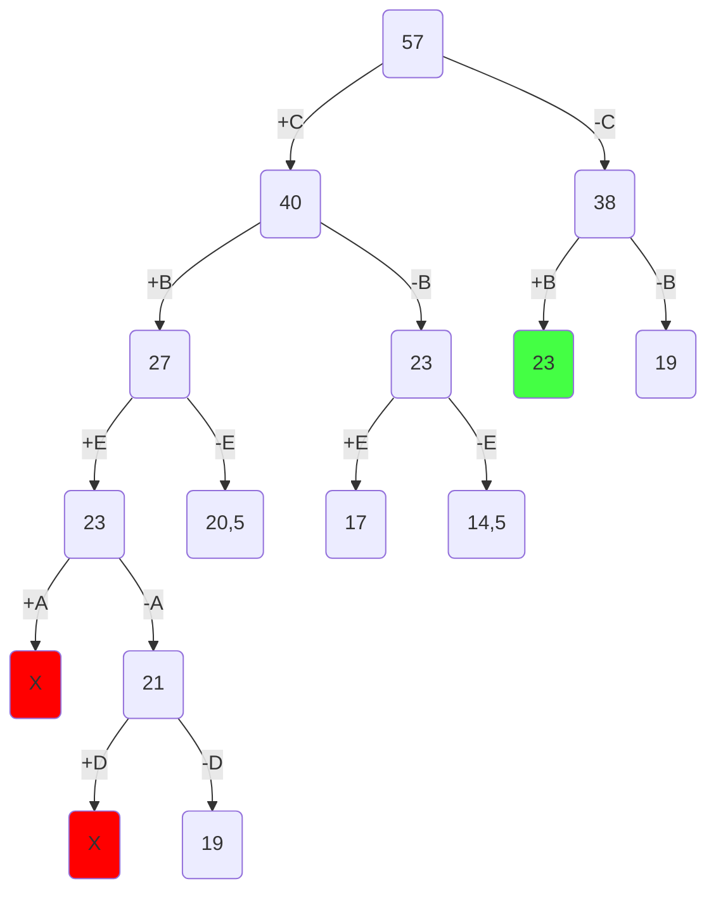
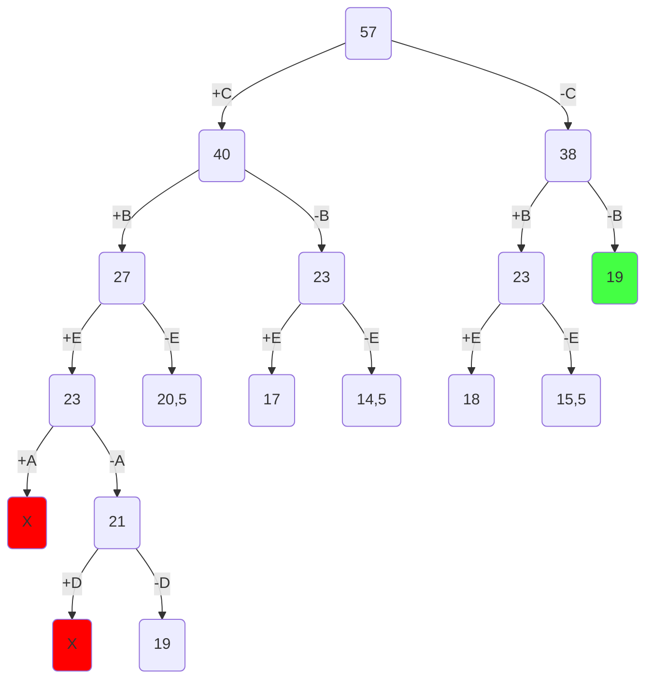
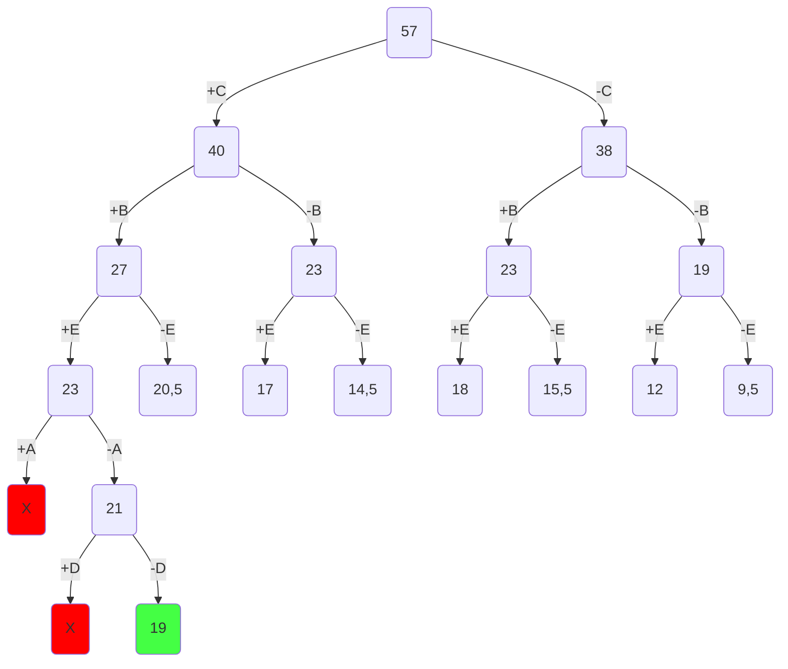

## Условия задачи

| **Предметы**  | **A** | **B** | **C** | **D** | **E** |
| ------------- | :---: | :---: | :---: | :---: | :---: |
| **Стоимость** |   5   |   8   |   6   |   3   |   5   |
| **Вес**       |  10   |   4   |   2   |  12   |   5   |

Ограничение вместимости - 19 у.е.

## Шаг 1

Сортируем предметы по их ценности $(\frac {Стоимость}{вес})$

| **Предметы**  | **C** | **B** | **E** |     **A**     |     **D**     |
| ------------- | :---: | :---: | :---: | :-----------: | :-----------: |
| **Стоимость** |   6   |   8   |   5   |       5       |       3       |
| **Вес**       |   2   |   4   |   5   |      10       |      12       |
| **Ценность**  |   3   |   2   |   1   | $\frac{1}{2}$ | $\frac{1}{4}$ |

## Шаг 2

Представим, что самого ценного предмета из тех, что еще не обработаны, у нас бесконечное количество и мы можем делить его на сколь угодно малые части. Тогда мы можем все оставшееся в рюкзаке место заполнить этим предметом. Тогда ценность будет

$$
3 * 19 = 57
$$

Это значение будет корнем нашего дерева, оно представляет оценку перспективности для задачи в целом.

## Шаг 3

Разобьем множество решений на два подмножества и начнем строить дерево. Левым потомком будет подмножество решений, в которых мы взяли самый ценный из оставшихся предметов, правым - где не взяли.

Оценка перспективности левого потомка =

$$
6 + (19 - 2) * 2 = 40
$$

Оценка перспективности правого потомка =

$$
19 * 2 = 38
$$

Повторяем шаг 3 и продолжаем строить дерево из самой перспективной вершины.

Оценка перспективности левого потомка -

$$
6 + 8 + (19 - 2 - 4) * 1 = 27
$$

Оценка перспективности правого потомка -

$$
6 + (19 - 2) * 1 = 23
$$

Заметим, что самая перспективная вершина оказалась на другой ветке. Продолжаем строить из вершины с оценкой 38.

Оценка перспективности левого потомка -

$$
8 + (19 - 4) * 1 = 23
$$

Оценка перспективности правого потомка -

$$
19 * 1 = 19
$$

Самая перспективная вершина - 27.

Оценка перспективности левого потомка -

$$
6 + 8 + 5 + (19 - 2 - 4 - 5) * \frac{1}{2} = 23
$$

Оценка перспективности правого потомка -

$$
6 + 8 + (19 - 2- 4) * \frac{1}{2} = 20,5
$$

Самая перспективная вершина - 23 в трёх случаях.
Правило метода ветвей и границ: если несколько вершин имеют одинаковую максимальную оценку, они все должны быть развиты, пока их оценка остаётся выше текущего лучшего целочисленного решения. Сначала развиваем самый глубокий узел, затем — левые среди оставшихся.

Следовательно, рассмотрим узел глубиной 3 (+C -> +B -> +E)

Оценка перспективности левого потомка -

$$
6 + 8 + 5 + 5 + (19 - 2 - 4 - 5 - 10) * \frac{1}{4} = 24 + -3 * \frac{1}{4}
$$

Получили отрицательное значение, что значит предмет не поместится в рюкзак. Соответственно от этой вершины мы не будем продолжать поиск.

Оценка перспективности правого потомка -

$$
6 + 8 + 5 + (19 - 2 - 4 - 5) * \frac{1}{4} = 21
$$

В узле: C, B, E взяты, A и D не взяты. Все предметы рассмотрены.

Фактическая стоимость - 

$$
6 + 8 + 5 = 19
$$

Имеем два случая максимально перспективной вершины - 23. Рассмотрим (+C -> -B).

Оценка перспективности левого потомка -

$$
6 + 5 + (19 - 2 - 5) * \frac{1}{2} = 17
$$

Оценка перспективности правого потомка -

$$
6 + (19 - 2) * \frac{1}{2} = 14,5
$$

Оба потомка имеют оценку ниже текущего лучшего решения 19, поэтому они не развиваются. 

Самая перспективная вершина - 23.

Оценка перспективности левого потомка -

$$
8 + 5 + (19 - 4 - 5) * \frac{1}{4} = 18
$$

Оценка перспективности правого потомка -

$$
8 + (19 - 4) * \frac{1}{2} = 15,5
$$

Самая перспективная вершина, которую можно проверить - 19.

Оценка перспективности левого потомка -

$$
8
5+ (19 - 5) * \frac{1}{2} = 12
$$

Оценка перспективности правого потомка -

$$
19 * \frac{1}{2} = 9,5
$$

Поскольку мы опустились до самого нижнего уровня, рассмотрев все предметы и вершина 19 на самом нижнем уровне является самой перспективной, то это и будет ответом.

Чтобы восстановить все положенные в рюкзак предметы пройдемся по ребрам, которые привели нас к ответу.

## Ответ

В рюкзак пойдут предметы C, B, E. Максимальная стоимость рюкзака: 6 + 8 + 5 = 19.
