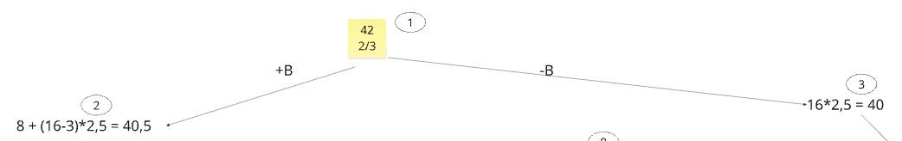
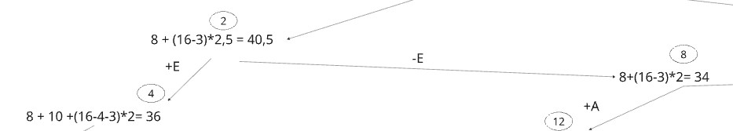
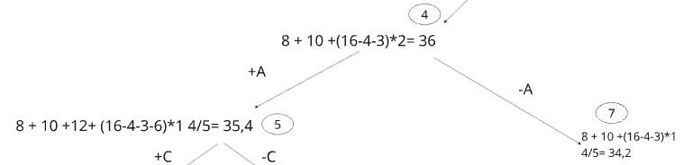
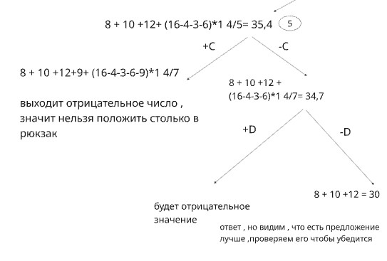
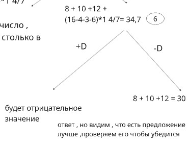
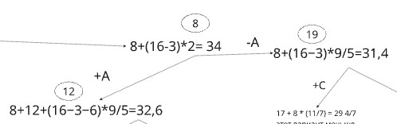
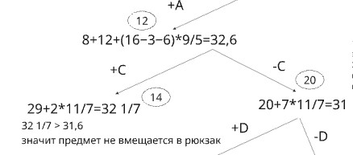

Постановка задачи

Задача о рюкзаке (англ. Knapsack problem) — дано N предметов, ni предмет имеет массу wi > 0 и стоимость pi > 0. Необходимо выбрать из этих предметов такой набор, чтобы суммарная масса не превосходила заданной величины W (вместимость рюкзака), а суммарная стоимость была максимальна.

Условия задачи

Предметы: A, B, C, D, E

| Предмет | A | B | C | D | E |
|----------|---|---|---|---|---|
| Стоимость | 12 | 8 | 9 | 11 | 10 |
| Вес | 6 | 3 | 5 | 7 | 4 |

Ограничение вместимости: 16

Шаг 1
Сортируем предметы по их ценности
(стоимость / вес)
| Предмет | B | E | A | C | D |
|----------|---|---|---|---|---|
| Стоимость | 8 | 10 | 12 | 9 | 11 |
| Вес | 3 | 4 | 6 | 5 | 7 |
| Ценность | 2 2/3 | 2,5 | 2 | 1 4/5 | 1 4/7 |

Шаг 2
Предположим, что самого ценного предмета можно взять дробное количество (верхняя оценка).

Самая высокая ценность:

2+2/3 = 8/3

Максимальная оценка:

16*8/3 = 42,7

Это значение является корнем дерева.

Шаг 3

Разбиваем решения на два подмножества:

Левый потомок — берем предмет B
Правый — не берем B

Левая ветка (+B)

Берем B:

Стоимость: 8
Оставшийся вес: 13

Оценка:

8+(16−3)*2,5=8+13*2,5=8+32,5=40,5

Правая ветка (-B)

16*2,5=40

Далее продолжаем строить дерево из самой перспективной вершины (40,5).

Следующий уровень

Добавляем предмет E.

+E

8+10+(16−3−4)*2=18+9*2=36

-E

8+(16−3)*2=8+13*2=34

Среди открытых вершин максимальная оценка равна 40 (ветка -B).
Продолжаем построение из этой вершины.

+E

10+(16−4)*2=10+12*2=34

-E

16*2=32

Теперь среди открытых вершин максимальная оценка равна 36.
Продолжаем построение из вершины 36 (ветка +B +E).

Следующий предмет — A (ценность 2)

+A
8+10+12+(16−3−4−6)*9/5=35,4

-A
8+10+(16−3−4)*9/5=34,2

Из вершины 35,4 (ветка +B +E +A) пробуем добавить C

Следующий предмет — C (ценность 9/5)

+C
Проверяем вес:

3+4+6+5=18>16

Вес превышен → ветка невозможна (в твоём дереве это как раз помечено как «выходит отрицательное/нельзя»).

-C +D будет отрицательное значение

-C -D тогда остаётся целочисленное решение:

8+10+12=30

(предметы B, E, A)

Вершина 34 (ветка +B -E)

Дальше по A:

+A

8+12+(16−3−6)*9/5=32,6

-A

8+(16−3)*9/5=31,4

Из вершины 32,6 (ветка +B -E +A) рассматриваем C

+C

Берём C:

вес 3+6+5=14, стоимость 8+12+9=29

Верхняя оценка с D (дробно):
остаток веса 16−14=2

29+2*11/7=29+22/7≈32 1/7

-C

Не берём C:
вес 3+6=9, стоимость 20

Остаток веса 7, следующий D:

20+7*11/7=31

Из вершины 31 (ветка +B -E +A -C) рассматриваем D (ВАЖНО)

+D

Проверяем вес:

3+6+7=16≤16

Стоимость:

8+12+11=31

Это допустимое решение и оно лучше, чем 30.

-D

Стоимость остаётся 20 — хуже.

Итог

Максимальное допустимое решение:

Предметы:
A, B, D

Проверка:

Вес:
3+6+7=16≤16

Стоимость:
12+8+11=31

Добавить остальные предметы невозможно без превышения веса.

Ответ

В рюкзак пойдут предметы:

A, B, D

Максимальная стоимость: 31