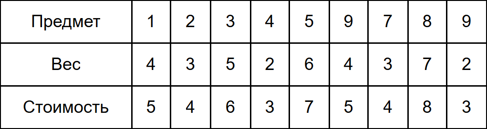
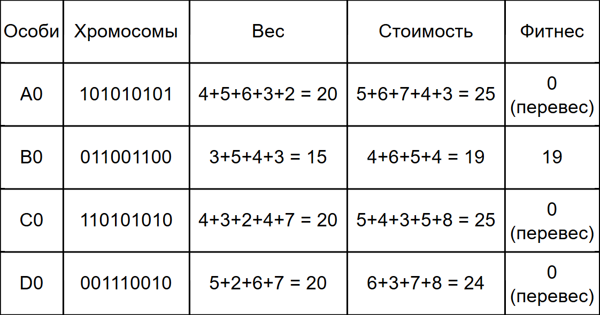
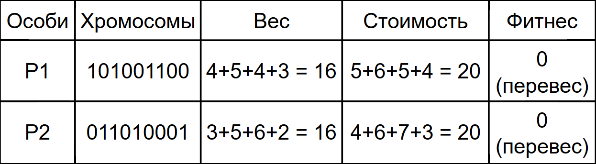
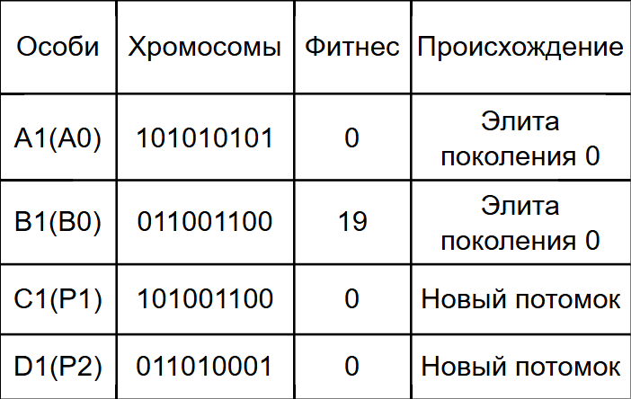
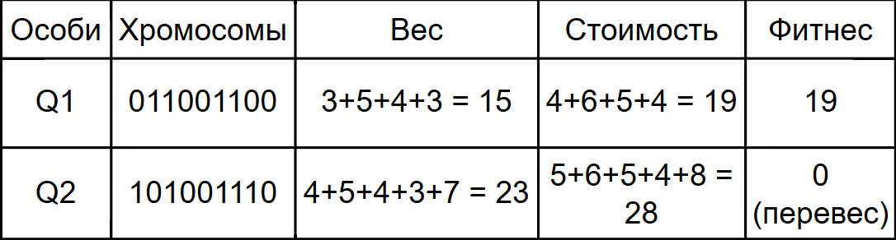
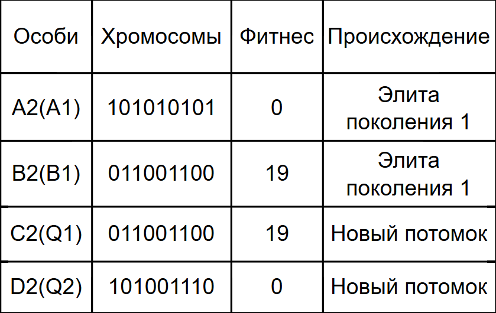
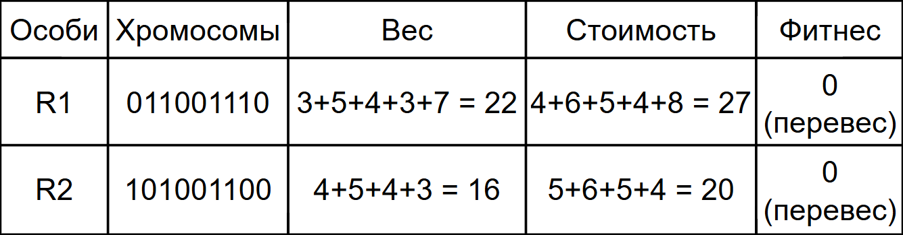
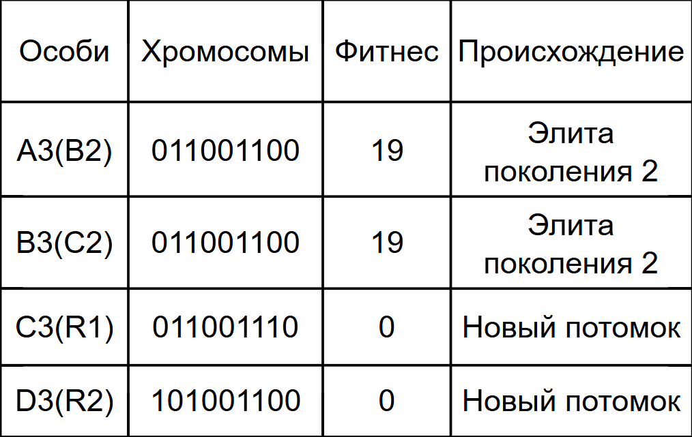

# Задание 14
## Состав команды:
1. Штенцов Михаил
2. Лопатин Иван
3. Погодин Роман

## Вариант 8: 
## 1. Условия задачи
У путешественника есть рюкзак, который выдерживает максимальный вес 15 кг.

У него есть 9 предметов, каждый со своим весом и ценностью.

**Цель**: Необходимо заполнить рюкзак набором предметов так, чтобы их общая стоимость была максимальной, а общий вес не превышал 15 кг.

## 2. Правила действий

- **Представление особи**: Бинарная строка длиной 9. Каждый бит соответствует предмету из таблицы.

    1 - предмет кладем в рюкзак.

    0 - предмет не кладем.

- **Функция приспособленности**: Это целевая функция, которую мы максимизируем.

    Если общий вес набора ≤ 15 кг, то приспособленность = общая стоимость набора.

    Если общий вес набора > 15 кг, то такой набор "нелегальный". Чтобы штрафовать его и не давать участвовать в размножении, мы присвоим ему приспособленность = 0.

- **Селекция** (Отбор): Будем использовать турнирный отбор. Так как популяция всего из 4 особей, мы проведем 2 турнира, чтобы выбрать 2 родителей. Случайным образом выбираем 2-х кандидатов из популяции. Тот, у кого фитнес выше, становится родителем.

- **Скрещивание**: Одноточечное. Выбирается случайная точка разрыва (от 1 до 8, т.к. длина хромосомы 9). Потомок 1 получает гены первого родителя до точки, и гены второго родителя после точки. Потомок 2 получает гены второго родителя до точки, и гены первого родителя после точки.

- **Мутация**: Будем применять её с небольшой вероятностью. Чтобы упростить ручной расчет, скажем, что после создания двух новых потомков, мы с вероятностью 10% инвертируем один случайный бит у каждого потомка. Если вероятность сработала (для демонстрации мы сделаем это принудительно в каком-нибудь поколении), то 0 меняется на 1 или 1 на 0.

- **Формирование нового поколения**:

    У нас популяция 4 особи. Мы создаем 2 новых потомка путем скрещивания.

    Чтобы не потерять лучшие решения, мы сохраним 2 лучшие особи из предыдущего поколения (стариков), а 2 худших заменим нашими новыми потомками. Это гарантирует, что прогресс не пойдет вспять.

## 3. Начальная популяция (Поколение 0)
Сформируем случайную начальную популяцию из 4 особей. Для каждой рассчитаем вес, стоимость и фитнес.

Только одна особь **B0** имеет допустимый вес (15 кг) и стоимость 19. Остальные три бесполезны (фитнес = 0). Лучшая особь на данный момент - **B0** (стоимость 19).

## 4. Поколение 1

### Шаг 1. Турнирная селекция (Выбираем 2-х родителей)
Нам нужно выбрать 2-х родителей из 4-х текущих особей (**A0**, **B0**, **C0**, **D0**).

- Турнир 1: Выберем случайно, например, **A0** и **C0**.

    - Фитнес **A0** = 0, Фитнес **C0** = 0. Ничья. Выбираем любого, например, **A0**.

- Турнир 2: Выберем случайно, например, **B0** и **D0**.

    - Фитнес **B0** = 19, Фитнес **D0** = 0. Победитель - **B0**.

**Результат селекции**: Родитель 1 = **A0**, Родитель 2 = **B0**.

### Шаг 2. Скрещивание (Одноточечное)

**Родители**:

- **A0** = [1, 0, 1, 0, 1, 0, 1, 0, 1]

- **B0** = [0, 1, 1, 0, 0, 1, 1, 0, 0]

Выбираем случайную точку разрыва. Пусть это будет позиция после 4-го гена (индекс 4, разделитель между 4 и 5 геном).

**Потомок 1** (**P1**): Берет гены **A0** (до точки) + гены **B0** (после точки).

- От **A0** (первые 4 гена): 1, 0, 1, 0

- От **B0** (остальные 5 генов): 0, 1, 1, 0, 0

- **P1** = [1, 0, 1, 0, 0, 1, 1, 0, 0]

**Потомок 2** (**P2**): Берет гены **B0** (до точки) + гены **A0** (после точки).

- От **B0** (первые 4 гена): 0, 1, 1, 0

- От **A0** (остальные 5 генов): 1, 0, 1, 0, 1

- **P2** = [0, 1, 1, 0, 1, 0, 1, 0, 1]

### Шаг 3. Мутация
Применим мутацию с вероятностью 10%.

Допустим, для **P1** мутация не произошла. А для **P2** - произошла.

Инвертируем, например, 7-й ген (индекс 6).

**P2** был: $$[0, 1, 1, 0, 1, 0, 1, 0, 1]$$ 
7-й ген = 1.

После мутации становится: $$[0, 1, 1,0 ,1 ,0 ,0 ,0 ,1]$$

### Шаг 4. Расчет характеристик потомков

Оба потомка оказались с весом 16 кг, что превышает лимит, поэтому их фитнес = 0.

### Шаг 5. Формирование нового поколения (Поколение 1)
Оставляем 2 лучших особи из прошлого поколения (стариков) и заменяем 2 худших нашими новыми потомками.

Старики (поколение 0):

- **B0** (фитнес 19) - лучший.

- **A0**, **C0**, **D0** (фитнес 0) - все худшие с одинаковым фитнесом.

**Новые потомки**: **P1** (фитнес 0), **P2** (фитнес 0).

**Лучшие старики**: **B0** (19) и **A0** (0) (выберем любого из оставшихся).

Новое поколение составим так: оставим лучшего (**B0**) и добавим к нему любого из тройки с фитнесом 0. Возьмем, например, **A0**. А двух новичков (**P1** и **P2**) добавим вместо оставшихся двух стариков (**C0** и **D0**).

Таким образом, поколение 1 выглядит так:

## 5. Поколение 2

### Шаг 1. Турнирная селекция (Выбираем 2-х родителей)
Текущая популяция: **A1**(0), **B1**(19), **C1**(0), **D1**(0).

- Турнир 1: Выберем случайно, например, **A1** и **B1**.

    - Фитнес **A1** = 0, Фитнес **B1** = 19. Победитель **B1**.

- Турнир 2: Выберем случайно, например, **C1** и **D1**.

    - Фитнес **C1** = 0, Фитнес **D1** = 0. Ничья. Выбираем любого, например, **C1**.

**Результат селекции**: Родитель 1 = **B1**, Родитель 2 = **C1**.

### Шаг 2. Скрещивание (Одноточечное)

**Родители**:

- **B1** = [0, 1, 1, 0, 0, 1, 1, 0, 0]

- **C1** = [1, 0, 1, 0, 0, 1, 1, 0, 0]

Выбираем новую случайную точку разрыва. Пусть это будет позиция после 2-го гена (индекс 2).

**Потомок 1** (**Q1**): Берет гены **B1** (до точки) + гены **C1** (после точки).

- От **B1** (первые 2 гена): 0, 1

- От **C1** (остальные 7 генов): 1, 0, 0, 1, 1, 0, 0

- **Q1** = [0, 1, 1, 0, 0, 1, 1, 0, 0]

**Потомок 2** (**Q2**): Берет гены **C1** (до точки) + гены **B1** (после точки).

- От **C1** (первые 2 гена): 1, 0

- От **B1** (остальные 5 генов): 1, 0, 0, 1, 1, 0, 0

- **Q2** = [1, 0, 1, 0, 0, 1, 1, 0, 0]

### Шаг 3. Мутация
Применим мутацию с вероятностью 10%.

Допустим, для **Q1** мутация не произошла. А для **Q2** - произошла.

Инвертируем, например, 8-й ген (индекс 7).

**Q2** был: $$[1, 0, 1, 0, 0, 1, 1, 0, 0]$$ 
8-й ген = 0.

После мутации становится: $$[1,0,1,0,0,1,1,1,0]$$

### Шаг 4. Расчет характеристик потомков

### Шаг 5. Формирование нового поколения (Поколение 2)
Оставляем 2 лучших особи из прошлого поколения (стариков) и заменяем 2 худших нашими новыми потомками.

Старики (поколение 1):

- **B1** (фитнес 19) - лучший.

- **A1**, **C1**, **D1** (фитнес 0) - все худшие с одинаковым фитнесом.

**Новые потомки**: **Q1** (фитнес 19), **Q2** (фитнес 0).

**Лучшие старики**: **B1** (19) и **A1** (0) (выберем любого из оставшихся).

Новое поколение составим так: оставим лучшего (**B1**) и добавим к нему любого из тройки с фитнесом 0. Возьмем, например, **A1**. А двух новичков (**Q1** и **Q2**) добавим вместо оставшихся двух стариков (**C1** и **D1**).

Таким образом, поколение 2 выглядит так:

Анализ поколения 2: Появилась вторая особь **C2** с фитнесом 19. Генотип **C2** идентичен B2. Лучшее значение стоимости по-прежнему 19.

## 6. Поколение 3
### Шаг 1. Турнирная селекция (Выбираем 2-х родителей)
Текущая популяция: **A2**(0), **B2**(19), **C2**(19), **D2**(0).

- Турнир 1: Выберем случайно, например, **B2** и **C2**.

    - Фитнес **B2** = 19, Фитнес **C2** = 19. Фитнес обоих 19. Ничья. Выберем, допустим, **B2**.

- Турнир 2: Выберем случайно, например, **A2** и **D2**.

    - Фитнес **A2** = 0, Фитнес **D2** = 0. Ничья. Выбираем любого, например, **D2**.

**Результат селекции**: Родитель 1 = **B2**, Родитель 2 = **D2**.

### Шаг 2. Скрещивание (Одноточечное)

**Родители**:

- **B2** = [0, 1, 1, 0, 0, 1, 1, 0, 0]

- **D2** = [1, 0, 1, 0, 0, 1, 1, 1, 0]

Выбираем новую случайную точку разрыва. Пусть это будет позиция после 6-го гена (индекс 6).

**Потомок 1** (**R1**): Берет гены **B2** (до точки) + гены **D2** (после точки).

- От **B2** (первые 6 генов): 0, 1, 1, 0, 0, 1

- От **D2** (остальные 3 гена): 1, 1, 0

- **R1** = [0, 1, 1, 0, 0, 1, 1, 1, 0]

**Потомок 2** (**R2**): Берет гены **D2** (до точки) + гены **B2** (после точки).

- От **D2** (первые 6 генов): 1, 0, 1, 0, 0, 1

- От **B2** (остальные 3 гена): 1, 0, 0

- **R2** = [1, 0, 1, 0, 0, 1, 1, 0, 0]

### Шаг 3. Мутация

Для разнообразия предположим, что мутация не произошла ни у одного из потомков.

### Шаг 4. Расчет характеристик потомков

Оба потомка снова имеют вес > 15.

### Шаг 5. Формирование нового поколения (Поколение 3)
Оставляем 2 лучших особи из прошлого поколения (стариков) и заменяем 2 худших нашими новыми потомками.

Старики (поколение 2):

- **B2** (фитнес 19) - лучший.

- **C2** (фитнес 19) - лучший.

**Новые потомки**: **R1** (фитнес 0), **R2** (фитнес 0).

**Лучшие старики**: **B2** (19) и **C2** (19).

Новое поколение составим так: оставим лучших (**B2** и **C2**) и двух новичков (**R1** и **R2**) добавим вместо оставшихся двух стариков (**A2** и **D2**).

Таким образом, поколение 3 выглядит так:

## 7. Результат работы алгоритма (после 3-х поколений)

После трех итераций генетического алгоритма мы получили популяцию, в которой лучшие особи имеют стоимость **19** и вес **15** кг.

Максимально возможная стоимость: **19**

Набор предметов: Предметы №2, №3, №6, №7.

Общий вес предметов: $3 + 5 + 4 + 3 = 15$ кг.

Свободное место: 15 - 15 = 0 кг.

Полученное решение совпадает с точным решением. Максимальная стоимость 19. Набор предметов №1, №2, №3 и №7.