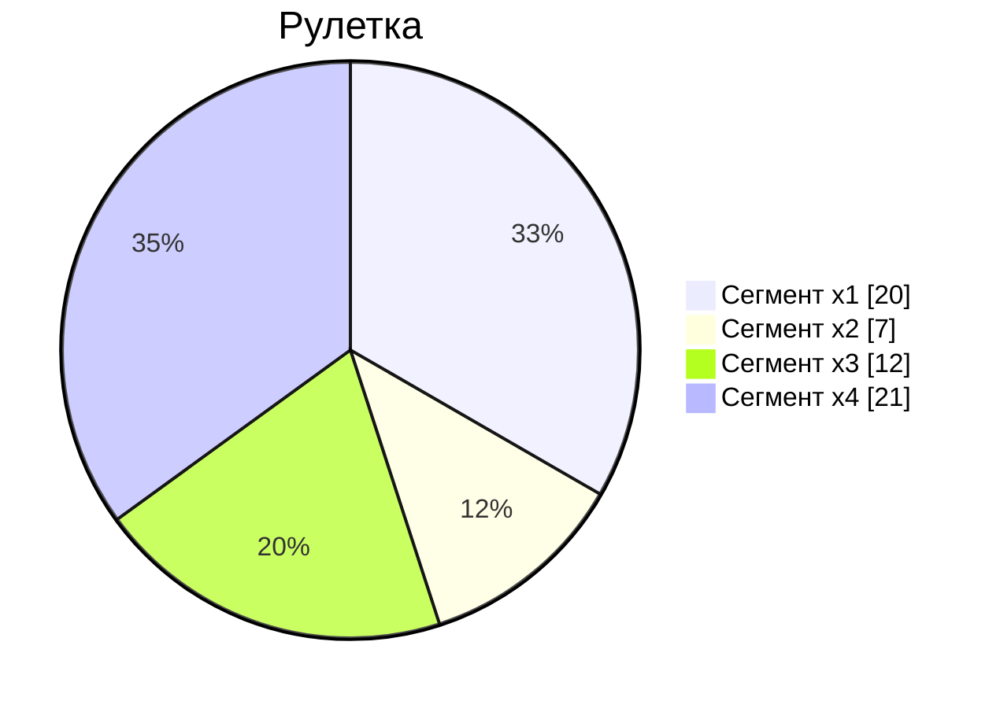
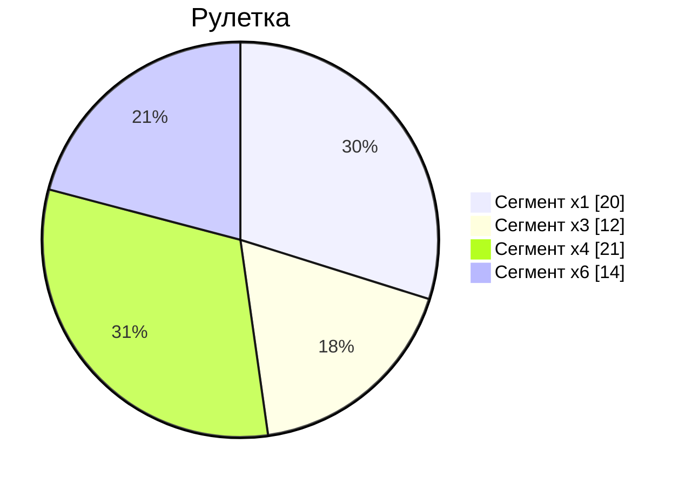
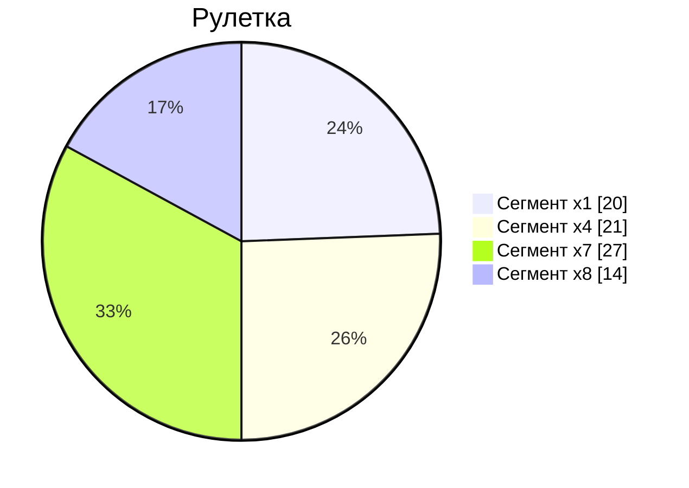
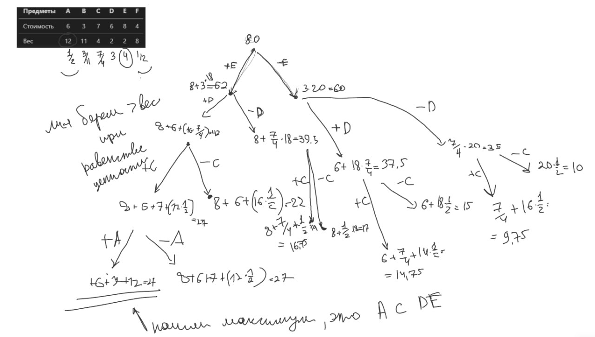

# Задача о рюкзаке. Генетический алгоритм.

Для каждого варианта представлены условия задачи, в соответствии с которыми необходимо:

1. Решить задачу о рюкзаке с применением генетического алгоритма.
2. Оформить решение задачи по шагам с подробными комментариями, таблицами и диаграммами.
3. В ответе указать:
   - максимально возможную стоимость предметов в рюкзаке,
   - набор предметов, обеспечивающих максимальную стоимость,
   - общий вес предметов в рюкзаке,
   - свободное место в рюкзаке.
   - насколько полученное решение отличается от точного решения.

**Генетический алгоритм не гарантирует получение точного решения, при выполнении задания важно продемонстрировать понимание работы алгоритма, а не получение точного решения.**

**Решение должно содержать номер варианта и подробное пошаговое описание.**

### Вариант 9:

Решить задачу о рюкзаке с применением генетического алгоритма, с учетом следующих требований:

- Придумать условия задачи с количеством предметов не менее 6.
- Численность популяции не менее 4 особей, в скрещивании участвует половина популяции.
- Для скрещивания выбираются особи по принципу рулетки, скрещивание – равномерное.
- До выполнения алгоритма сформулировать стратегию применения оператора мутации и правила формирования нового поколения на основе новых особей и особей из предыдущего поколения
- Сформировать не менее 3 поколений, не считая первоначального.

| Предметы  |  A  |  B  |  C  |  D  |  E  |  F  |
| --------- | :-: | :-: | :-: | :-: | :-: | :-: |
| Стоимость |  6  |  3  |  7  |  6  |  8  |  4  |
| Вес       | 12  | 11  |  4  |  2  |  2  |  8  |

Ограничение вместимости - 20 у.е.

Чтобы узнать максимальную ценность рюкзака, нужно поделить стоимость на вес.

| Номер     |  1  |  2   |  3   |  4  |  5  |  6  |
| --------- | :-: | :--: | :--: | :-: | :-: | :-: |
| Предметы  |  A  |  B   |  C   |  D  |  E  |  F  |
| Стоимость |  6  |  3   |  7   |  6  |  8  |  4  |
| Вес       | 12  |  11  |  4   |  2  |  2  |  8  |
| Ценность  | 0.5 | 0.27 | 1.75 |  3  |  4  | 0.5 |

Максимальная ценность рюкзака - 27

- Численность популяции не менее 4 особей, в скрещивании участвует половина популяции.
- Для скрещивания выбираются особи по принципу рулетки, скрещивание – равномерное.
- Мутации будем применять для нежизнеспособных особей. При возникновении дублей будем их игнорировать. Новое поколение будем формировать из самых сильных особей из предыдущего поколения и из их детей.
- Сформируем не менее 4 поколения.

1 поколение:
| | 1 | 2 | 3 | 4 | 5 | 6 | f |
| -- | :-: | :-: | :-: | :-: | :-: | :-: | :-: |
| x1 | 1 | 0 | 0 | 1 | 1 | 0 | 20 |
| x2 | 0 | 1 | 0 | 0 | 0 | 1 | 7 |
| x3 | 0 | 0 | 0 | 0 | 1 | 1 | 12 |
| x4 | 1 | 0 | 1 | 0 | 1 | 0 | 21 |

Для выбора родителей применим метод рулетки

Выберем в качестве родителей 1 и 3 поколение (x1 и x3) по принципу рулетки

|     |  1  |  2  |  3  |  4  |  5  |  6  |  f  |
| --- | :-: | :-: | :-: | :-: | :-: | :-: | :-: |
| x1  |  1  |  0  |  0  |  1  |  1  |  0  | 20  |
| x3  |  0  |  0  |  0  |  0  |  1  |  1  | 12  |
| z   |  1  |  0  |  0  |  1  |  1  |  0  |

Далее выполним равномерное скрещивание с помощью маски z, которая. При 0 в маске z первому ребенку будет соответствовать ген от первого родителя, а второму ребенку - ген от второго родителя. При 1 в маске z первому ребенку будет соответствовать ген от второго родителя, а второму ребенку - ген от первого родителя. Получаем двух потомков.

|     |  1  |  2  |  3  |  4  |  5  |  6  |  f  |
| --- | :-: | :-: | :-: | :-: | :-: | :-: | :-: |
| x5  |  0  |  0  |  0  |  0  |  1  |  0  |  8  |
| x6  |  1  |  0  |  0  |  1  |  1  |  1  |     |

Применим мутацию для x6, так как особь оказалась нежизнеспособной. И получим:

|     |  1  |  2  |  3  |  4  |  5  |  6  |  f  |
| --- | :-: | :-: | :-: | :-: | :-: | :-: | :-: |
| x6  |  1  |  0  |  0  |  0  |  1  |  0  | 14  |

Тогда 2 поколение:

|     |  1  |  2  |  3  |  4  |  5  |  6  |  f  |
| --- | :-: | :-: | :-: | :-: | :-: | :-: | :-: |
| x1  |  1  |  0  |  0  |  1  |  1  |  0  | 20  |
| x3  |  0  |  0  |  0  |  0  |  1  |  1  | 12  |
| x4  |  1  |  0  |  1  |  0  |  1  |  0  | 21  |
| x6  |  1  |  0  |  0  |  0  |  1  |  0  | 14  |

Для выбора родителей применим метод рулетки

Выберем в качестве родителей 1 и 4 поколение (x1 и x4) по принципу рулетки

|     |  1  |  2  |  3  |  4  |  5  |  6  |  f  |
| --- | :-: | :-: | :-: | :-: | :-: | :-: | :-: |
| x1  |  1  |  0  |  0  |  1  |  1  |  0  | 20  |
| x4  |  1  |  0  |  1  |  0  |  1  |  0  | 21  |
| z   |  0  |  0  |  1  |  0  |  1  |  0  |

Далее выполним равномерное скрещивание с помощью маски z, которая. При 0 в маске z первому ребенку будет соответствовать ген от первого родителя, а второму ребенку - ген от второго родителя. При 1 в маске z первому ребенку будет соответствовать ген от второго родителя, а второму ребенку - ген от первого родителя. Получаем двух потомков.

|     |  1  |  2  |  3  |  4  |  5  |  6  |  f  |
| --- | :-: | :-: | :-: | :-: | :-: | :-: | :-: |
| x7  |  1  |  0  |  1  |  1  |  1  |  0  | 27  |
| x8  |  1  |  0  |  0  |  0  |  1  |  0  | 14  |

Тогда 3 поколение:

|     |  1  |  2  |  3  |  4  |  5  |  6  |  f  |
| --- | :-: | :-: | :-: | :-: | :-: | :-: | :-: |
| x1  |  1  |  0  |  0  |  1  |  1  |  0  | 20  |
| x4  |  1  |  0  |  1  |  0  |  1  |  0  | 21  |
| x7  |  1  |  0  |  1  |  1  |  1  |  0  | 27  |
| x8  |  1  |  0  |  0  |  0  |  1  |  0  | 14  |

Для выбора родителей применим метод рулетки

Выберем в качестве родителей 8 и 4 поколение (x4 и x8) по принципу рулетки

|     |  1  |  2  |  3  |  4  |  5  |  6  |  f  |
| --- | :-: | :-: | :-: | :-: | :-: | :-: | :-: |
| x8  |  1  |  0  |  0  |  0  |  1  |  0  | 14  |
| x4  |  1  |  0  |  1  |  0  |  1  |  0  | 21  |
| z   |  0  |  0  |  1  |  0  |  1  |  0  |

Далее выполним равномерное скрещивание с помощью маски z, которая. При 0 в маске z первому ребенку будет соответствовать ген от первого родителя, а второму ребенку - ген от второго родителя. При 1 в маске z первому ребенку будет соответствовать ген от второго родителя, а второму ребенку - ген от первого родителя. Получаем двух потомков.

|     |  1  |  2  |  3  |  4  |  5  |  6  |  f  |
| --- | :-: | :-: | :-: | :-: | :-: | :-: | :-: |
| x9  |  1  |  0  |  1  |  0  |  1  |  0  | 21  |
| x10 |  1  |  0  |  0  |  0  |  1  |  0  | 14  |

Тогда 4 поколение:

|     |  1  |  2  |  3  |  4  |  5  |  6  |  f  |
| --- | :-: | :-: | :-: | :-: | :-: | :-: | :-: |
| x1  |  1  |  0  |  0  |  1  |  1  |  0  | 20  |
| x7  |  1  |  0  |  1  |  1  |  1  |  0  | 27  |
| x9  |  1  |  0  |  1  |  0  |  1  |  0  | 21  |
| x10 |  1  |  0  |  0  |  0  |  1  |  0  | 14  |

Максимальной стоимостью в результате работы ГА при получении 4 поколений является 27.

Также максимальная ценность была посчитана с помощью точного метода ветвей и границ и получилась равна 27.

Ответ:

- максимально возможную стоимость предметов в рюкзаке = 27
- набор предметов, обеспечивающих максимальную стоимость - A, C, D, E
- общий вес предметов в рюкзаке = 20
- свободное место в рюкзаке = 0
- полученное решение не отличается от точного решения.
