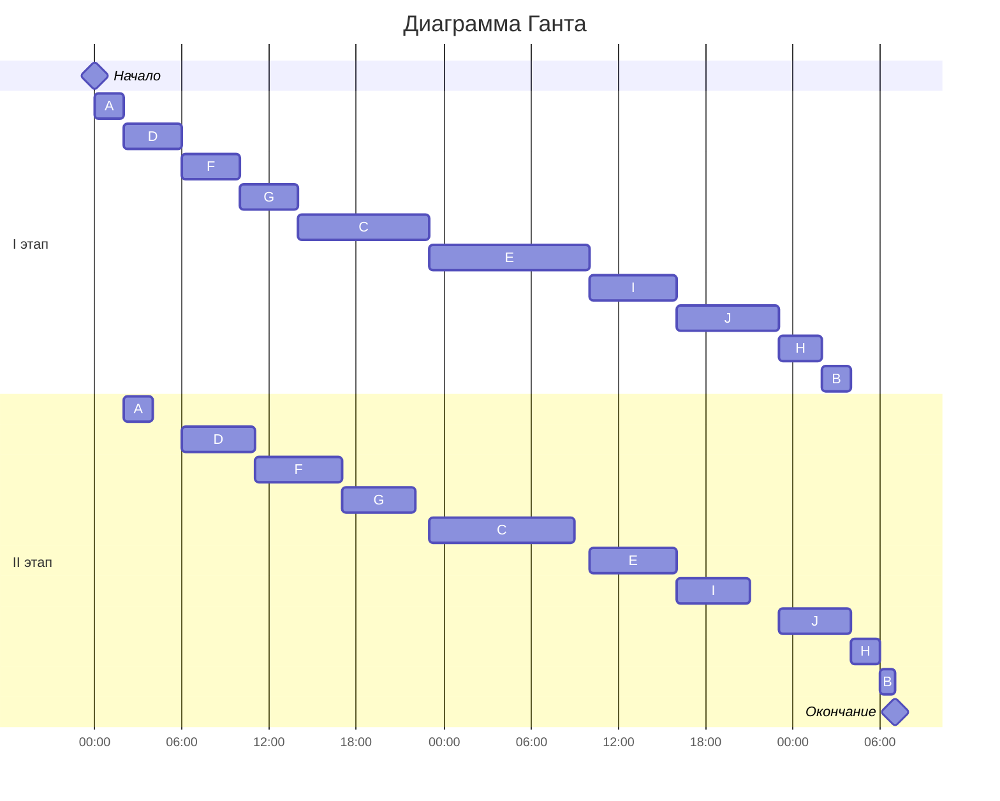

# Вариант 6

# Задача о распределении инвестиций между проектами

**Исходная таблица:**

| \$   | A  | B  | C  | D  |
|------|----|----|----|----|
| 50   | 10 | 9  | 8  | 12 |
| 100  | 13 | 10 | 11 | 14 |
| 150  | 18 | 14 | 15 | 17 |
| 200  | 20 | 16 | 17 | 18 |
| 250  | 22 | 19 | 20 | 24 |

Имеется таблица с возможной прибылью от инвестиций в четыре проекта. Необходимо найти максимальную прибыль с учетом того, что у нас бюджет размером 250$.
Все варианты (их количество) распределения можно посчитать по формуле Сk(n), где k - количество вариантов вложения (суммы), n - количество проектов.

### 1. A:B

Начнем распределение с базы рекурсии n = 2 (A:B).
Выбираем максимум.

| \$   | A:B         |
|------|-------------|
| 50   | 10 (1:0)    |
| 100  | 19 (1:1)    |
| 150  | 22 (2:1)    |
| 200  | 27 (3:1)    |
| 250  | 29 (4:1)    |

Для более простого решения заменим \$ на части (1 часть = 50\$)

**для 50:**  
| A | B | Результат            |
|---|---|----------------------|
| 1 | 0 | **10** (макс. прибыль) |
| 0 | 1 | 9                    |

**для 100:**  
| A | B | Результат       |
|---|---|-----------------|
| 0 | 2 | 10              |
| 1 | 1 | **19** (макс.)  |
| 2 | 0 | 13              |

**для 150:**  
| A | B | Результат       |
|---|---|-----------------|
| 0 | 3 | 14              |
| 1 | 2 | 20              |
| 2 | 1 | **22** (макс.)  |
| 3 | 0 | 18              |

**для 200:**  
| A | B | Результат       |
|---|---|-----------------|
| 0 | 4 | 16              |
| 1 | 3 | 24              |
| 2 | 2 | 23              |
| 3 | 1 | **27** (макс.)  |
| 4 | 0 | 20              |

**для 250:**  
| A | B | Результат       |
|---|---|-----------------|
| 0 | 5 | 19              |
| 1 | 4 | 26              |
| 2 | 3 | 27              |
| 3 | 2 | 28              |
| 4 | 1 | **29** (макс.)  |
| 5 | 0 | 22              |

Чем больше проектов, тем больше вариантов распределения.
Потом объединяем проекты и заново считаем максимумы (заполняем таблицу, которая в начале решения).

### 2. Добавляем столбец AB : C

| \$   | A:B         | AB:C        |
|------|-------------|-------------|
| 50   | 10 (1:0)    | 10 (1:0)    |
| 100  | 19 (1:1)    | 19 (2:0)    |
| 150  | 22 (2:1)    | 27 (2:1)    |
| 200  | 27 (3:1)    | 30 (2:2)    |
| 250  | 29 (4:1)    | 35 (4:1)    |

**для 50**  
| AB | C | Результат        |
|----|---|------------------|
| 0  | 1 | 8                |
| 1  | 0 | **10** (макс.)   |

**для 100**  
| AB | C | Результат        |
|----|---|------------------|
| 0  | 2 | 11               |
| 1  | 1 | 18               |
| 2  | 0 | **19** (макс.)   |

**для 150**  
| AB | C | Результат        |
|----|---|------------------|
| 0  | 3 | 15               |
| 1  | 2 | 21               |
| 2  | 1 | **27** (макс.)   |
| 3  | 0 | 22               |

**для 200**  
| AB | C | Результат        |
|----|---|------------------|
| 0  | 4 | 17               |
| 1  | 3 | 25               |
| 2  | 2 | **30** (макс.)   |
| 3  | 1 | 30               |
| 4  | 0 | 27               |

**для 250**  
| AB | C | Результат        |
|----|---|------------------|
| 0  | 5 | 20               |
| 1  | 4 | 27               |
| 2  | 3 | 34               |
| 3  | 2 | 33               |
| 4  | 1 | **35** (макс.)   |
| 5  | 0 | 29               |

### 3. Добавляем столбец АВС : D

(АВС:D) не считаем полностью, потому что для последней клетки, которая нам и нужна, достаточно (АВ:С) и D. Самая нижняя правая клетка - обязательная , она и является максимальной прибылью.

| \$   | A:B         | AB:C        | ABC:D       |
|------|-------------|-------------|-------------|
| 50   | 10 (1:0)    | 10 (1:0)    | —           |
| 100  | 19 (1:1)    | 19 (2:0)    | —           |
| 150  | 22 (2:1)    | 27 (2:1)    | —           |
| 200  | 27 (3:1)    | 30 (2:2)    | —           |
| 250  | 29 (4:1)    | 35 (4:1)    | 42 (4:1) |

**для 250**  
| ABC | D | Сумма           |
|-----|---|-----------------|
| 0   | 5 | 24              |
| 1   | 4 | 28              |
| 2   | 3 | 36              |
| 3   | 2 | 41          |
| 4   | 1 | **42** (макс.)  |
| 5   | 0 | 35              |

**Ответ:** максимальная прибыль 42.

**Проверка:**

Идем от обратного в таблице: 42(4;1(D)) - 30(2;2(C)) - 19(1(A);1(B))
50\$ в проект A + 50\$ в проект B + 100\$ в проект C + 50\$ в проект D = $10 + 9 + 11 + 12 = 42$ (верно!!!)

# Конвейерная задача

**Исходные данные**

Имеется 10 независимых заданий. Длительность заданий (по этапам): (2, 2), (2, 1), (9, 10), (4, 5), (11, 6), (4, 6), (4, 5), (3, 2), (6, 5), (7, 5)

Необходимо найти и посчитать кротчайшее расписание работ, а позже построить по нему наглядную диаграмму Ганта.

**Данные:**

| Задание | A   | B   | C   | D   | E   | F   | G   | H   | I   | J   |
|---------|-----|-----|-----|-----|-----|-----|-----|-----|-----|-----|
| I этап  | 2   | 2   | 9   | 4   | 11  | 4   | 4   | 3   | 6   | 7   |
| II этап | 2   | 1   | 10  | 5   | 6   | 6   | 5   | 2   | 5   | 5   |

Решим задачу по этапам, используя алгоритм Джексона.

### 1. Распределим на две группы все работы по длительности задач

**1 группа (I этап ≤ II этап):** A, C, D, F, G  
**2 группа (I этап > II этап):** B, E, H, I, J

### 2. Отсортируем работы

**1 группа (по возрастанию I этапа):** 
A (2), D (4), F (4), G (4), C (9) → A → D → F → G → C

**2 группа (по убыванию II этапа):** 
E (6), I (5), J (5), H (2), B (1) → E → I → J → H → B

### 3. Объединяем группы и строим диаграмму

Сначала идёт первая группа, после неё сразу вторая

**Оптимальная последовательность**:  
A → D → F → G → C → E → I → J → H → B

### 4. Расчёт времени выполнения

Выполним ручной расчёт

| Задача  | t₁  | t₂  | I этап       |II этап         |
|---------|-----|-----|--------------|----------------|
| A       | 2   | 2   | 2            | 4              |
| D       | 4   | 5   | 6            | 11             |
| F       | 4   | 6   | 10           | 17             |
| G       | 4   | 5   | 14           | 22             |
| C       | 9   |10   | 23           | 33             |
| E       |11   | 6   | 34           | 40             |
| I       | 6   | 5   | 40           | 45             |
| J       | 7   | 5   | 47           | 52             |
| H       | 3   | 2   | 50           | 54             |
| B       | 2   | 1   | 52           | **55**         |

Рассмотрим каждую задачу отдельно:

1. Задача A
t₁ = 2, t₂ = 2
I этап: 0 + 2 = 2
II этап: max(2, 0) + 2 = 4
(начинается сразу после I этапа, так как до этого ничего не было)
2. Задача D
t₁ = 4, t₂ = 5
I этап: 2 + 4 = 6
II этап: max(6, 4) + 5 = 11
(начинается не раньше, чем закончится A на II этапе (4), но D закончилась на I этапе в 6 — значит, ждём 6)
3. Задача F
t₁ = 4, t₂ = 6
I этап: 6 + 4 = 10
II этап: max(10, 11) + 6 = 17
(D закончила II этап в 11, F закончила I этап в 10 — значит, начинаем в 11, заканчиваем в 17)
4. Задача G
t₁ = 4, t₂ = 5
I этап: 10 + 4 = 14
II этап: max(14, 17) + 5 = 22
(F закончила II этап в 17, G закончила I этап в 14 — начинаем в 17, заканчиваем в 22)
5. Задача C
t₁ = 9, t₂ = 10
I этап: 14 + 9 = 23
II этап: max(23, 22) + 10 = 33
(G закончила II этап в 22, C закончила I этап в 23 — начинаем в 23, заканчиваем в 33)
6. Задача E
t₁ = 11, t₂ = 6
I этап: 23 + 11 = 34
II этап: max(34, 33) + 6 = 40
(C закончила II этап в 33, E закончила I этап в 34 — начинаем в 34, заканчиваем в 40)
7. Задача I
t₁ = 6, t₂ = 5
I этап: 34 + 6 = 40
II этап: max(40, 40) + 5 = 45
(E закончила II этап в 40, I закончила I этап в 40 — начинаем в 40, заканчиваем в 45)
8. Задача J
t₁ = 7, t₂ = 5
I этап: 40 + 7 = 47
II этап: max(47, 45) + 5 = 52
(I закончила II этап в 45, J закончила I этап в 47 — начинаем в 47, заканчиваем в 52)
9. Задача H
t₁ = 3, t₂ = 2
I этап: 47 + 3 = 50
II этап: max(50, 52) + 2 = 54
(J закончила II этап в 52, H закончила I этап в 50 — начинаем в 52, заканчиваем в 54)
10. Задача B
t₁ = 2, t₂ = 1
I этап: 50 + 2 = 52
II этап: max(52, 54) + 1 = 55
(H закончила II этап в 54, B закончила I этап в 52 — начинаем в 54, заканчиваем в 55)

**Ответ:** 55 часов

### 5. Диаграмма Ганта

Стоит учитывать, что у первой группы простой может быть только только в конце, а у второй всегда в начале и необязательно, но в середине (а в конце не может быть!!!). Это используем как проверку правильности распределения.