# Решение задачи 4 команды brigada
## Состав команды:
1. Ваулин Никита
2. Громов Иван
3. Кузнецов Егор

## Вариант 9: 

# Задание 4.1 - Задача о распределении инвестиций между проектами:

| $   | A  | B  | C  | D  |
|-----|----|----|----|----|
| 20  | 7  | 2  | 1  | 4  |
| 40  | 9  | 10 | 12 | 13 |
| 60  | 11 | 13 | 14 | 16 |
| 80  | 17 | 15 | 15 | 18 |
| 100 | 21 | 22 | 19 | 19 |

## Постановка задачи 4.1
Условия задачи представляются в виде прямоугольной матрицы, где столбцы соответствуют проектам, а строки части инвестиций, направляемых в проекты, объем инвестиций указывается в первом столбце. В ячейках таблицы представлены суммы прибыли от вложения некоторой части средств в определенный проект.

Для решения задачи требуется рассчитать максимально возможную сумму прибыли от вложения всех средств в проекты и распределение этой суммы между проектами.

## Решение 4.1
| $   | A  | B  | C  | D  |
|-----|----|----|----|----|
| 20  | 7  | 2  | 1  | 4  |
| 40  | 9  | 10 | 12 | 13 |
| 60  | 11 | 13 | 14 | 16 |
| 80  | 17 | 15 | 15 | 18 |
| 100 | 21 | 22 | 19 | 19 |

### Построим заготовку для сводной таблицы: упростим задачу разбив её на 3 этапа:
1. Максимальные значения прибыли при распределении инвестиций между проектами A и B
2. Максимальные значения прибыли при распределении инвестиций между проектами AB и C
3. Максимальные значения прибыли при распределении инвестиций между проектами ABC и D

### Заготовка
| $   | A:B     | AB:C    | ABC:D   | 
|-----|---------|---------|---------|
| 20  |         |         |         |
| 40  |         |         |         |
| 60  |         |         |         |
| 80  |         |         |         |
| 100 |         |         |         |

## 1 Этап: Найдем максимальные значения прибыли при распределении инвестиций между проектами A и B

<!-- region Таблицы для расчёта A:B -->

  

    
<strong>Для $20:</strong>

    <table border="1" cellpadding="5">
      <tr><th>A</th><th>B</th><th>Доход</th></tr>
      <tr><td>0</td><td>1</td><td>2</td></tr>
      <tr style="font-weight: bold; background-color: #fff3cd; color: black;"><td>1</td><td>0</td><td>7</td></tr>
    </table>
  

  

    
<strong>Для $40:</strong>

    <table border="1" cellpadding="5">
      <tr><th>A</th><th>B</th><th>Доход</th></tr>
      <tr style="font-weight: bold; background-color: #fff3cd; color: black;"><td>0</td><td>2</td><td>10</td></tr>
      <tr><td>1</td><td>1</td><td>9</td></tr>
      <tr><td>2</td><td>0</td><td>9</td></tr>
    </table>
  

  

    
<strong>Для $60:</strong>

    <table border="1" cellpadding="5">
      <tr><th>A</th><th>B</th><th>Доход</th></tr>
      <tr><td>0</td><td>3</td><td>13</td></tr>
      <tr style="font-weight: bold; background-color: #fff3cd; color: black;"><td>1</td><td>2</td><td>17</td></tr>
      <tr><td>2</td><td>1</td><td>11</td></tr>
      <tr><td>3</td><td>0</td><td>11</td></tr>
    </table>
  

  

    
<strong>Для $80:</strong>

    <table border="1" cellpadding="5">
      <tr><th>A</th><th>B</th><th>Доход</th></tr>
      <tr><td>0</td><td>4</td><td>15</td></tr>
      <tr style="font-weight: bold; background-color: #fff3cd; color: black;"><td>1</td><td>3</td><td>20</td></tr>
      <tr><td>2</td><td>2</td><td>19</td></tr>
      <tr><td>3</td><td>1</td><td>13</td></tr>
      <tr><td>4</td><td>0</td><td>17</td></tr>
    </table>
  

  

    
<strong>Для $100:</strong>

    <table border="1" cellpadding="5">
      <tr><th>A</th><th>B</th><th>Доход</th></tr>
      <tr style="font-weight: bold; background-color: #fff3cd; color: black;"><td>0</td><td>5</td><td>22</td></tr>
      <tr><td>1</td><td>4</td><td>22</td></tr>
      <tr><td>2</td><td>3</td><td>22</td></tr>
      <tr><td>3</td><td>2</td><td>21</td></tr>
      <tr><td>4</td><td>1</td><td>19</td></tr>
      <tr><td>5</td><td>0</td><td>21</td></tr>
    </table>
  

<!-- endregion -->

<!-- endregion -->

### Заполним сводную таблицу

| $   | A:B     | AB:C    | ABC:D   | 
|-----|---------|---------|---------|
| 20  | 7(1:0)  |         |         |
| 40  | 10(0:2) |         |         |
| 60  | 17(1:2) |         |         |
| 80  | 20(1:3) |         |         |
| 100 | 22(0:5) |         |         |

## 2 Этап: Найдем максимальные значения прибыли при распределении инвестиций между проектами AB и C

<!-- region Таблицы для расчёта AB:C -->

  

    
<strong>Для $20:</strong>

    <table border="1" cellpadding="5">
      <tr><th>AB</th><th>C</th><th>Доход</th></tr>
      <tr><td>0</td><td>1</td><td>1</td></tr>
      <tr style="font-weight: bold; background-color: #fff3cd; color: black;"><td>1</td><td>0</td><td>7</td></tr>
    </table>
  

  

    
<strong>Для $40:</strong>

    <table border="1" cellpadding="5">
      <tr><th>AB</th><th>C</th><th>Доход</th></tr>
      <tr style="font-weight: bold; background-color: #fff3cd; color: black;"><td>0</td><td>2</td><td>12</td></tr>
      <tr><td>1</td><td>1</td><td>8</td></tr>
      <tr><td>2</td><td>0</td><td>10</td></tr>
    </table>
  

  

    
<strong>Для $60:</strong>

    <table border="1" cellpadding="5">
      <tr><th>AB</th><th>C</th><th>Доход</th></tr>
      <tr><td>0</td><td>3</td><td>14</td></tr>
      <tr style="font-weight: bold; background-color: #fff3cd; color: black;"><td>1</td><td>2</td><td>19</td></tr>
      <tr><td>2</td><td>1</td><td>11</td></tr>
      <tr><td>3</td><td>0</td><td>17</td></tr>
    </table>
  

  

    
<strong>Для $80:</strong>

    <table border="1" cellpadding="5">
      <tr><th>AB</th><th>C</th><th>Доход</th></tr>
      <tr><td>0</td><td>4</td><td>15</td></tr>
      <tr><td>1</td><td>3</td><td>21</td></tr>
      <tr style="font-weight: bold; background-color: #fff3cd; color: black;"><td>2</td><td>2</td><td>22</td></tr>
      <tr><td>3</td><td>1</td><td>18</td></tr>
      <tr><td>4</td><td>0</td><td>20</td></tr>
    </table>
  

  

    
<strong>Для $100:</strong>

    <table border="1" cellpadding="5">
      <tr><th>AB</th><th>C</th><th>Доход</th></tr>
      <tr><td>0</td><td>5</td><td>19</td></tr>
      <tr><td>1</td><td>4</td><td>22</td></tr>
      <tr><td>2</td><td>3</td><td>24</td></tr>
      <tr style="font-weight: bold; background-color: #fff3cd; color: black;"><td>3</td><td>2</td><td>29</td></tr>
      <tr><td>4</td><td>1</td><td>21</td></tr>
      <tr><td>5</td><td>0</td><td>22</td></tr>
    </table>
  

<!-- endregion -->

<!-- endregion -->

### Заполним сводную таблицу

| $   | A:B     | AB:C    | ABC:D   | 
|-----|---------|---------|---------|
| 20  | 7(1:0)  | 7(1:0)  |         |
| 40  | 10(0:2) | 12(0:2) |         |
| 60  | 17(1:2) | 19(1:2) |         |
| 80  | 20(1:3) | 22(2:2) |         |
| 100 | 22(0:5) | 29(3:2) |         |

## 3 Этап: Найдем максимальные значения прибыли при распределении инвестиций между проектами ABС и D

### Примечание: таблицы для 20, 40, 60, 80 строить смысла нет, ведь они не используются для дальнейших вычислений, т.к. они не могут быть максимумом.
<!-- region Таблицы для расчёта ABC:D -->

  

    
<strong>Для $100:</strong>

    <table border="1" cellpadding="5">
      <tr><th>ABC</th><th>D</th><th>Доход</th></tr>
      <tr><td>0</td><td>5</td><td>19</td></tr>
      <tr><td>1</td><td>4</td><td>25</td></tr>
      <tr><td>2</td><td>3</td><td>28</td></tr>
      <tr style="font-weight: bold; background-color: #fff3cd; color: black;"><td>3</td><td>2</td><td>32</td></tr>
      <tr><td>4</td><td>1</td><td>26</td></tr>
      <tr><td>5</td><td>0</td><td>29</td></tr>
    </table>
  

<!-- endregion -->

<!-- endregion -->

### Заполним сводную таблицу

| $   | A:B     | AB:C    | ABC:D   | 
|-----|---------|---------|---------|
| 20  | 7(1:0)  | 7(1:0)  | ------- |
| 40  | 10(0:2) | 12(0:2) | ------- |
| 60  | 17(1:2) | 19(1:2) | ------- |
| 80  | 20(1:3) | 22(2:2) | ------- |
| 100 | 22(0:5) | 29(3:2) | 32(3:2) |

## Восстанавливаем распределение в обратном порядке
### Максимально возможная сумма прибыли равна 32
 Для определения распределения инвестициый по проектам пойдём в обратном направлении  
32(3:2)  - это 3 части ABC и 2 части D  
Дальше переходим к распределению частей среди ABC  
19(1:2) - это 1 часть AB и 2 части C  
Наконец смотрим распределение частей между A и B  
7(1:0) - это 1 часть A и 0 частей B  
Следовательно мы получаем следующие распределений инвестиций:  
20$ в проект A, 0$ в проект B, 40$ в проект C, 40$ в проект D  
7 + 12 + 13 = 32
## Ответ:
### При распределении A - 20$, B - 0$, C - 40$, D - 40$ достигается максимальная прибыль = 32$

# Задание 4.2 - Оптимальное расписание. Конвейерная задача:

Имеется 10 независимых заданий. Длительность заданий (по этапам): (7, 5), (2, 4), (2, 3), (4, 5), (10, 11), (7, 9), (7, 5), (5, 3), (9, 8), (2, 1)

## Постановка задачи 4.2
Необходимо построить расписание, выполняемое в кратчайшие сроки двумя исполнителями:

1. Применить алгоритм Джонсона, в решении отобразить ход выполнения алгоритма с подробными комментариями.
2. В ответе указать длительность полученного расписания.
3. В ответе вывести полученное расписание в виде диаграммы Ганта. 

Решение должно содержать номер варианта и подробное пошаговое описание.

## Решение 4.2
#### Составим таблицу по условию задания
<!-- region Первоначальная таблица -->
<table border="1" cellpadding="5">
    <tr><th></th><th>A</th><th>B</th><th>C</th><th>D</th><th>E</th><th>F</th><th>G</th><th>H</th><th>I</th><th>J</th></tr>
    <tr><td>1 Этап<td>7</td><td>2</td><td>2</td><td>4</td><td>10</td><td>7</td><td>7</td><td>5</td><td>9</td><td>2</td><tr>
    <tr><td>2 Этап<td>5</td><td>4</td><td>3</td><td>5</td><td>11</td><td>9</td><td>5</td><td>3</td><td>8</td><td>1</td></tr>
</table>
<!--endregion-->

<!--endregion-->

Для решения нужно **расставить приоритеты** работам с помощью алгоритма Джонсона

## 1 Шаг: Разделить задачи на две группы  
### 1 группа  
### 1 Этап ≤ 2 Этап → B C D E F
<!--region 1 группа в таблице -->
<table border="1" cellpadding="5">
    <tr><th></th><th>A</th><th style="font-weight: bold; background-color: #fff3cd; color: black;">B</th><th style="font-weight: bold; background-color: #fff3cd; color: black;">C</th><th style="font-weight: bold; background-color: #fff3cd; color: black;">D</th><th style="font-weight: bold; background-color: #fff3cd; color: black;">E</th><th style="font-weight: bold; background-color: #fff3cd; color: black;">F</th><th>G</th><th>H</th><th>I</th><th>J</th></tr>
    <tr><td>1 Этап<td>7</td><td style="font-weight: bold; background-color: #fff3cd; color: black;">2</td><td style="font-weight: bold; background-color: #fff3cd; color: black;">2</td><td style="font-weight: bold; background-color: #fff3cd; color: black;">4</td><td style="font-weight: bold; background-color: #fff3cd; color: black;">10</td><td style="font-weight: bold; background-color: #fff3cd; color: black;">7</td><td>7</td><td>5</td><td>9</td><td>2</td>
    <tr><td>2 Этап<td>5</td><td style="font-weight: bold; background-color: #fff3cd; color: black;">4</td><td style="font-weight: bold; background-color: #fff3cd; color: black;">3</td><td style="font-weight: bold; background-color: #fff3cd; color: black;">5</td><td style="font-weight: bold; background-color: #fff3cd; color: black;">11</td><td style="font-weight: bold; background-color: #fff3cd; color: black;">9</td><td>5</td><td>3</td><td>8</td><td>1</td>
</table>
<!--endregion-->

<!--endregion-->
### 2 группа  
### 1 Этап > 2 Этап → A G H I J
<!--region 2 группа в таблице -->
<table border="1" cellpadding="5">
    <tr><th></th><th style="font-weight: bold; background-color: #fff3cd; color: black;">A</th><th>B</th><th>C</th><th>D</th><th>E</th><th>F</th><th style="font-weight: bold; background-color: #fff3cd; color: black;">G</th><th style="font-weight: bold; background-color: #fff3cd; color: black;">H</th><th style="font-weight: bold; background-color: #fff3cd; color: black;">I</th><th style="font-weight: bold; background-color: #fff3cd; color: black;">J</th></tr>
    <tr><td>1 Этап<td style="font-weight: bold; background-color: #fff3cd; color: black;">7</td><td>2</td><td>2</td><td>4</td><td>10</td><td>7</td><td style="font-weight: bold; background-color: #fff3cd; color: black;">7</td style="font-weight: bold; background-color: #fff3cd; color: black;"><td style="font-weight: bold; background-color: #fff3cd; color: black;">5</td><td style="font-weight: bold; background-color: #fff3cd; color: black;">9</td><td style="font-weight: bold; background-color: #fff3cd; color: black;">2</td>
    <tr><td>2 Этап<td style="font-weight: bold; background-color: #fff3cd; color: black;">5</td><td>4</td><td>3</td><td>5</td><td>11</td><td>9</td><td style="font-weight: bold; background-color: #fff3cd; color: black;">5</td><td style="font-weight: bold; background-color: #fff3cd; color: black;">3</td><td style="font-weight: bold; background-color: #fff3cd; color: black;">8</td><td style="font-weight: bold; background-color: #fff3cd; color: black;">1</td>
</table>

<!--endregion-->

## 2 Шаг: Сортируем задачи в группах
### - В 1 группе по возрастанию 1 этапа  
### B C D F E
### - Во 2 группе по убыванию 2 этапа  
### I A G H J  

## 3 Шаг: Объединить группы (1 группа → 2 группа)  
### B → C → D → F → E → I → A → G → H → J 

## 4 Шаг: Строим диаграмму Ганта

```mermaid
gantt
    title Диаграмма Ганта
    dateFormat  mm
    axisFormat %M
    tickInterval 1minute
    section Этап 1
    B : b1, 0, 2m
    С : c1, after b1, 2m
    D : d1, after c1, 4m
    F : f1, after d1, 7m
    E : e1, after f1, 10m
    I : i1, after e1, 9m
    A : a1, after i1, 7m
    G : g1, after a1, 7m
    H : h1, after g1, 5m
    J : j1, after h1, 2m
    Простой 4 : crit, after j1, 3m
    section Этап 2
    Простой 1 : crit, 0, 2m
    B : b2, after b1, 4m
    C : c2, after b2, 3m
    D : d2, after c2, 5m
    Простой 2 : crit, after d2, 1m
    F : f2, after f1, 9m
    Простой 3 : crit, after f2, 1m
    E : e2, after e1, 11m
    I : i2, after e2, 8m
    A : a2, after i2, 5m
    G : g2, after a2, 5m
    H : h2, after g2, 3m
    J : j2, after h2, 1m
```

<!--region Диаграмма Ганта -->

<!--endregion-->

## Ответ:
### Кратчайше возможная длительность расписания = 58