# Задание 4. Вариант 7
# Команда CR7
## Задача о распределении инвестиций между проектами

| $   | A  | B  | C  | D  | E  |
|-----|----|----|----|----|----|
| 100 | 5  | 4  | 7  | 6  | 3  |
| 200 | 12 | 10 | 11 | 9  | 10 |
| 300 | 16 | 12 | 13 | 15 | 14 |
| 400 | 18 | 15 | 17 | 19 | 16 |
| 500 | 20 | 19 | 20 | 21 | 20 |

#### Нужно найти макс. прибыль. Упрощаем задачу тем, что сравниваем прибыль поэтапно.
---
### Таблицы расчетов:

### Шаг 1. Сравниваем A и B

| $   | A:B |
|-----|----|
| 100 |   5 (100/0)  |
| 200 | 12 (200/0) |
| 300 | 16 (300/0) |
| 400 | 22 (200/200) |
| 500 | 26 (300/200) |
---
### Шаг 2. Сравниваем уже посчитаные A:B и C

| $   |  (A:B):C    |
|-----|-------------|
| 100 | 7 (0/100)   |
| 200 | 12 (200/0)   |
| 300 | 19 (200/100) |
| 400 | 23 (200/200) |
| 500 | 29 (400/100) |
---
### Шаг 3. Сравниваем посчитаное ((A:B):C) и D

| $   |  ((A:B):C):D    |
|-----|-------------|
| 100 | 7 (100/0)   |
| 200 | 13 (100/100)   |
| 300 | 19 (300/0) |
| 400 | 25 (300/100) |
| 500 | 29 (500/0) |
---
### Шаг 4. Сравниваем ((A:B):C):D и E

#### Т.к. по итогу мы ищем макс. прибыль, мы можем сразу найти распределение для 500 ед. вложений, пропустив прошлые шаги.

| $   |  (((A:B):C):D):E    |
|-----|-------------|
| 100 | - |
| 200 | - |
| 300 | - |
| 400 | - |
| 500 | 29 (500/0) |
---
## Восстановим решение:

#### Из последнего шага понимаем, что 500 ед. вкладывается в A:B:C:D и 0 ед. в E. То есть в конечном итоге в E было вложено 0 ед. вложений.

#### Далее вкладываем 500 ед. в A:B:C и 0 ед. в D.

#### Далее вкладываем 400 ед. в A:B и 100 ед. в C. На данном этапе имеем такое разложение: 100 в C, 0 в D, 0 в E.

#### Последнее разложение между A и B. Вкладываем 200 ед. в A и 200 ед. в B. Так как на прошлом шаге мы вложили 100 ед. в C, то на данном этапе смотрим разложение 400 ед. вложений.

### В итоге получаем данное разложение: A = 200 ед.; B = 200 ед.; C = 100 ед.; D = 0 ед.; E = 0 ед.
---
## Ответ:
#### Максимальная прибыль от вложений 29 единиц. A = 200 ед.; B = 200 ед.; C = 100 ед.; D = 0 ед.; E = 0 ед.

## Конвейерная задача
#### Имеется 9 независимых заданий. Длительность заданий (по этапам): 
### (3, 5), (5, 4), (4, 4), (12, 6), (8, 9), (7, 6), (2, 4), (5, 4), (6, 8)
---
### Шаг 1. Распределим все задания на два этапа каждое и внесем их в таблицу.

|  -   | A | B | C | D | E | F | G | H | I |
|:----:|:-:|:-:|:-:|:-:|:-:|:-:|:-:|:-:|:-:|
|1 этап|3|5|4|12|8|7|2|5|6
|2 этап|5|4|4|6|9|6|4|4|8

---
### Шаг 2. Применение алгоритма Джонсона.

#### Разделим все задания на две группы.
---
### Группа 1 - Этап 1 <= Этапа 2

#### Задания, у которых этап 1 меньше или равен этапу 2:
#### A, C, E, G, I
#### Расположим их в порядке возрастания 1 этапа:

|Задание|Время|
|:-:|:-:|
|G|2|
|A|3|
|C|4|
|I|6|
|E|8|

#### Отсортированный порядок: G, A, C, I, E
---
### Группа 2 - Этап 1 > Этапа 2
#### Задания, у которых этап 1 больше этапа 2:
#### B, D, F, H
#### Расположим их в порядке убывания 2 этапа:

|Задание|Время|
|:-:|:-:|
|F|6|
|D|6|
|B|4|
|H|4|

#### Отсортированный порядок: F, D, B, H
---
### Объединям группы 
#### G -> A -> C -> I -> E -> F -> D -> B -> H

### Шаг 3. Построение диаграммы Ганта.

```mermaid
gantt
    title Диаграмма
    dateFormat  mm
    axisFormat %M
    tickInterval 1minute
    section Этап 1
    G : g1, 0, 2m
    A : a1, after g1, 3m
    C : c1, after a1, 4m
    I : i1, after c1, 6m
    E : e1, after i1, 8m
    F : f1, after e1, 7m
    D : d1, after f1, 12m
    B : b1, after d1, 5m
    H : h1, after b1, 5m
    пропуск : active, after h1, 4m
    section Этап 2
    пропуск : active, 0, 2m
    G : g2, after g1, 4m
    A : a2, after g2, 5m
    C : c2, after a2, 4m
    I : i2, after c2, 8m
    E : e2, after i2, 9m
    F : f2, after e2, 6m
    пропуск : active, after f2, 4m
    D : d2, after d1, 6m
    B : b2, after d2, 4m
    H : h2, after b2, 4m
```

### Ответ: Наименьшее возможное время = 56
