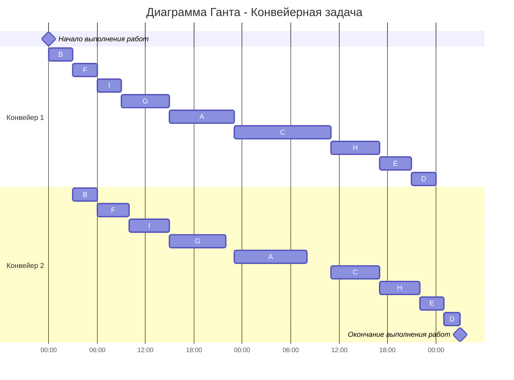

# Задание №4

## 1 Задача о распределении инвестиций между проектами

Условия задачи представляются в виде прямоугольной матрицы, где столбцы соответствуют проектам (A, B, C, D, E), а строки — частям инвестиций (100, 200, 300, 400, 500). В ячейках таблицы представлены суммы прибыли от вложения определённой части средств в конкретный проект.

Для решения задачи требуется рассчитать максимально возможную сумму прибыли от вложения всех средств в проекты и оптимальное распределение этой суммы между проектами.

**Условие:**
| $ | A | B | C | D | E |
|-----|----|----|----|----|----|
| 100 | 5 | 4 | 4 | 3 | 2 |
| 200 | 6 | 5 | 6 | 4 | 5 |
| 300 | 9 | 7 | 8 | 9 | 8 |
| 400 | 10 | 8 | 9 | 10 | 11 |
| 500 | 11 | 12 | 12 | 13 | 12 |

---

### Шаг 1: Рассмотрим комбинации для двух проектов (AB)

Найдём оптимальные значения прибыли для различных сумм инвестиций, распределяя их между проектами A и B.

- **S = 100:**

  - 100A = 5
  - 100B = 4
  - **Максимум: 5** (все средства в A)

- **S = 200:**

  - 200A = 6
  - 200B = 5
  - 100A + 100B = 5 + 4 = 9
  - **Максимум: 9** (по 100 в A и B)

- **S = 300:**

  - 300A = 9
  - 300B = 7
  - 100A + 200B = 5 + 5 = 10
  - 200A + 100B = 6 + 4 = 10
  - **Максимум: 10** (например, 100A + 200B)

- **S = 400:**

  - 400A = 10
  - 400B = 8
  - 200A + 200B = 6 + 5 = 11
  - 300A + 100B = 9 + 4 = 13
  - 300B + 100A = 7 + 5 = 12
  - **Максимум: 13** (300A + 100B)

- **S = 500:**
  - 500A = 11
  - 500B = 12
  - 100A + 400B = 5 + 8 = 13
  - 100B + 400A = 4 + 10 = 14
  - 200A + 300B = 6 + 7 = 13
  - 300A + 200B = 9 + 5 = 14
  - **Максимум: 14** (например, 100B + 400A или 300A + 200B)

Сводная таблица для AB:
| $ | A/B |
| --- | --- |
| 100 | 5 (1; 0) |
| 200 | 9 (1; 1) |
| 300 | 10 (1; 2) или (2; 1) |
| 400 | 13 (3; 1) |
| 500 | 14 (4; 1) или (3; 2) |

---

### Шаг 2: Добавим проект C (рассмотрим ABC, т.е. комбинацию из трёх проектов)

Теперь будем распределять средства между проектами A, B и C, используя уже найденные оптимальные значения для AB.

- **S = 100:**

  - 100AB = 5
  - 100C = 4
  - **Максимум: 5** (все в AB)

- **S = 200:**

  - 200AB = 9
  - 200C = 6
  - 100AB + 100C = 5 + 4 = 9
  - **Максимум: 9** (либо 200AB, либо 100AB+100C)

- **S = 300:**

  - 300AB = 10
  - 300C = 8
  - 100AB + 200C = 5 + 6 = 11
  - 200AB + 100C = 9 + 4 = 13
  - **Максимум: 13** (200AB + 100C)

- **S = 400:**

  - 400AB = 13
  - 400C = 9
  - 200AB + 200C = 9 + 6 = 15
  - 300AB + 100C = 10 + 4 = 14
  - 300C + 100AB = 8 + 5 = 13
  - **Максимум: 15** (200AB + 200C)

- **S = 500:**
  - 500AB = 14
  - 500C = 12
  - 400AB + 100C = 13 + 4 = 17
  - 400C + 100AB = 9 + 5 = 14
  - 300AB + 200C = 10 + 6 = 16
  - 300C + 200AB = 8 + 9 = 17
  - **Максимум: 17** (например, 400AB + 100C или 300C + 200AB)

Сводная таблица для ABC:
| $ | AB/C |
| --- | --- |
| 100 | 5 (1; 0) |
| 200 | 9 (2; 0) или (1;1) |
| 300 | 13 (2; 1) |
| 400 | 15 (2; 2) |
| 500 | 17 (4; 1) или (2; 3) |

---

### Шаг 3: Добавим проект D (рассмотрим ABCD, комбинацию из четырёх проектов)

Теперь добавим проект D и будем распределять средства между ABC и D.

- **S = 100:**

  - 100ABC = 5
  - 100D = 3
  - **Максимум: 5** (все в ABC)

- **S = 200:**

  - 200ABC = 9
  - 200D = 4
  - 100ABC + 100D = 5 + 3 = 8
  - **Максимум: 9** (все в ABC)

- **S = 300:**

  - 300ABC = 13
  - 300D = 9
  - 100ABC + 200D = 5 + 4 = 9
  - 200ABC + 100D = 9 + 3 = 12
  - **Максимум: 13** (все в ABC)

- **S = 400:**

  - 400ABC = 15
  - 400D = 10
  - 200ABC + 200D = 9 + 4 = 13
  - 300ABC + 100D = 13 + 3 = 16
  - 300D + 100ABC = 9 + 5 = 14
  - **Максимум: 16** (300ABC + 100D)

- **S = 500:**
  - 500ABC = 17
  - 500D = 13
  - 400ABC + 100D = 15 + 3 = 18
  - 400D + 100ABC = 10 + 5 = 15
  - 300ABC + 200D = 13 + 4 = 17
  - 300D + 200ABC = 9 + 9 = 18
  - **Максимум: 18** (например, 400ABC + 100D или 300D + 200ABC)

Сводная таблица для ABCD:
| $ | ABC/D |
| --- | ---- |
| 100 | 5 (1; 0) |
| 200 | 9 (2; 0) |
| 300 | 13 (3; 0) |
| 400 | 16 (3; 1) |
| 500 | 18 (4; 1) или (2; 3) |

---

### Шаг 4: Добавим проект E (рассмотрим ABCDE, т.е. пять проектов)

Наконец, добавим проект E и распределим все 500 единиц между всеми пятью проектами.

- **S = 500:**
  - 500ABCD = 18
  - 500E = 12
  - 400ABCD + 100E = 16 + 2 = 18
  - 100ABCD + 400E = 5 + 11 = 16
  - 200ABCD + 300E = 9 + 8 = 17
  - 300ABCD + 200E = 13 + 5 = 18
  - **Максимум: 18** (например, 500ABCD, 400ABCD+100E или 300ABCD+200E)

Сводная таблица для ABCDE:
| $ | ABCD/E |
| --- | ----- |
| 100 | - |
| 200 | - |
| 300 | - |
| 400 | - |
| 500 | 18 (5; 0) или (4; 1) или (3; 2) |

---

### Ответ

Максимально возможная прибыль равна **18 единицам**.

Оптимальное распределение средств (один из возможных путей):

Возьмём путь: **400 ABCD + 100 E = 18**

**400 ABCD = 16** (согласно таблице ABC/D)

Это достигается как **300 ABC + 100 D = 16**

**300 ABC = 13** (согласно таблице AB/C)

Это достигается как **200 AB + 100 C = 13**

**200 AB = 9** (согласно таблице A/B)

Это достигается как **100 A + 100 B = 9**

Итак, разложив этот путь:

- Из `200 AB = 9`: **A: 100, B: 100**
- Из `200 AB + 100 C = 13`: **C: 100**
- Из `300 ABC + 100 D = 16`: **D: 100**
- Из `400 ABCD + 100 E = 18`: **E: 100**

**Окончательное распределение:**

- **A: 100**
- **B: 100**
- **C: 100**
- **D: 100**
- **E: 100**

**Прибыль равна: 18**

## 2 Оптимальное расписание. Конвейерная задача

Дано 9 независимых заданий, каждое из которых состоит из двух этапов. Длительность выполнения каждого задания на первом и втором этапе задана парой чисел:

> (8, 9), (3, 3), (12, 6), (3, 2), (4, 3), (3, 4), (6, 7), (6, 5), (3, 5)

Задания обозначим латинскими буквами от A до I:

| Задание | A   | B   | C   | D   | E   | F   | G   | H   | I   |
| ------- | --- | --- | --- | --- | --- | --- | --- | --- | --- |
| I этап  | 8   | 3   | 12  | 3   | 4   | 3   | 6   | 6   | 3   |
| II этап | 9   | 3   | 6   | 2   | 3   | 4   | 7   | 5   | 5   |

Требуется:

1. Построить расписание выполнения заданий двумя исполнителями (конвейерами) **в кратчайший возможный срок**.
2. Применить **алгоритм Джонсона**, с пошаговым описанием.
3. Указать **длительность итогового расписания**.
4. Представить расписание в виде **диаграммы Ганта** (с использованием Mermaid).

---

## Решение

### Шаг 1. Применение алгоритма Джонсона

**Алгоритм Джонсона** позволяет построить оптимальное расписание для двухэтапной конвейерной задачи с минимальным общим временем выполнения.

#### Шаг 1.1. Разделение заданий на две группы

- **Группа 1**: задания, у которых длительность **первого этапа ≤ второго этапа**  
  Выбираем:

  - A: 8 ≤ 9
  - B: 3 ≤ 3
  - F: 3 ≤ 4
  - G: 6 ≤ 7
  - I: 3 ≤ 5

  → **Группа 1**: **A, B, F, G, I**

- **Группа 2**: задания, у которых **первый этап > второго этапа**  
  → Остальные:

  - C: 12 > 6
  - D: 3 > 2
  - E: 4 > 3
  - H: 6 > 5

  → **Группа 2**: **C, D, E, H**

#### Шаг 1.2. Сортировка групп

- **Группа 1**: сортируем **по возрастанию** длительности первого этапа:

  | Задание | I этап |
  | ------- | ------ |
  | B       | 3      |
  | F       | 3      |
  | I       | 3      |
  | G       | 6      |
  | A       | 8      |

  → Отсортированный порядок: **B, F, I, G, A**

- **Группа 2**: сортируем **по убыванию** длительности второго этапа:

  | Задание | II этап |
  | ------- | ------- |
  | C       | 6       |
  | H       | 5       |
  | E       | 3       |
  | D       | 2       |

  → Отсортированный порядок: **C, H, E, D**

#### Шаг 1.3. Формирование итогового расписания

Соединяем отсортированные группы:  
**B → F → I → G → A → C → H → E → D**

---

### Шаг 2. Расчёт времени выполнения и построение диаграммы Ганта

Обозначим:

- **P1** — первый исполнитель (первый этап)
- **P2** — второй исполнитель (второй этап)

**Второй исполнитель может начать работу над заданием только после завершения этого задания на P1 и завершения предыдущего задания на P2.**

Выполним расчёт вручную (для контроля):

| Задача | t1  | t2  | Начало P1 | Конец P1 | Начало P2 | Конец P2 |
| ------ | --- | --- | --------- | -------- | --------- | -------- |
| B      | 3   | 3   | 0         | 3        | 3         | 6        |
| F      | 3   | 4   | 3         | 6        | 6         | 10       |
| I      | 3   | 5   | 6         | 9        | 10        | 15       |
| G      | 6   | 7   | 9         | 15       | 15        | 22       |
| A      | 8   | 9   | 15        | 23       | **23**    | 32       |
| C      | 12  | 6   | 23        | 35       | 35        | 41       |
| H      | 6   | 5   | 35        | 41       | 41        | 46       |
| E      | 4   | 3   | 41        | 45       | 46        | 49       |
| D      | 3   | 2   | 45        | 48       | 49        | **51**   |

> Общая длительность расписания: **51 единица времени**

---

### Шаг 3. Диаграмма Ганта

