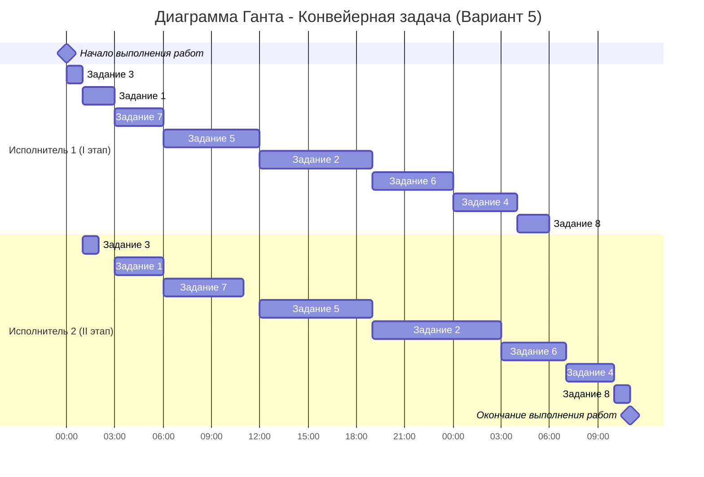

# Задача о распределении инвестиций между проектами

## Условие задачи:

| $   | A  | B  | C  | D  |
|-----|----|----|----|----|
| 30  | 6  | 8  | 7  | 7  |
| 60  | 8  | 9  | 9  | 8  |
| 90  | 11 | 11 | 12 | 12 |
| 120 | 12 | 16 | 13 | 15 |
| 150 | 14 | 18 | 17 | 16 |

---

## 1. Объединяем проекты A и B → AB

Представим инвестиции в «частях» (1 часть = 30$).  
Для каждой суммы частей `s` находим макс. прибыль от распределения между A и B.

| s | Прибыль AB(s) | Комбинация (A:B) |
|---|---------------|------------------|
| 0 | 0           | (0:0)          |
| 1 | 8           | (0:1)          |
| 2 | 14          | (1:1)          |
| 3 | 16          | (2:1)          |
| 4 | 19          | (3:1)          |
| 5 | 22          | (1:4)          |

---

## 2. Объединяем AB и C → ABC

Для каждой суммы частей `s` находим макс. прибыль от распределения между AB и C.

| s | Прибыль ABC(s) | Комбинация (AB:C) |
|---|----------------|-------------------|
| 0 | 0            | (0:0)           |
| 1 | 8            | (1:0)           |
| 2 | 15           | (1:1)           |
| 3 | 21           | (2:1)           |
| 4 | 23           | (3:1)           |
| 5 | 26           | (4:1)           |

---

## 3. Объединяем ABC и D → ABCD

Для полного бюджета (5 частей) находим макс. прибыль от распределения между ABC и D.

| i (ABC) | D(5−i) | Прибыль |
|---------|--------|---------|
| 0     | 16   | 16    |
| 1     | 15   | 23    |
| 2     | 12   | 27    |
| 3     | 8    | 29    |
| 4     | 7    | 30  |
| 5     | 0    | 26    |

Максимальная прибыль: 30

Комбинация: ABC = 4 части, D = 1 часть

---

## Расшифровка оптимального распределения

- ABC(4) = 23 → из таблицы: AB = 3 части, C = 1 часть
- AB(3) = 16 → A = 2 части, B = 1 часть
- C = 1 часть
- D = 1 часть

Итого:
- A: 2 части = 60$
- B: 1 часть = 30$
- C: 1 часть = 30$
- D: 1 часть = 30$

Проверка:
- Прибыль: 8 + 8 + 7 + 7 = 30
- Сумма: 60 + 30 + 30 + 30 = 150$

---

##  Ответ:

Максимальная прибыль: 30

Распределение инвестиций:
- Проект A: 60$
- Проект B: 30$
- Проект C: 30$
- Проект D: 30$

## 4.2 Оптимальное расписание. Конвейерная задача

Данные по заданиям:

| Задание | 1   | 2   | 3   | 4   | 5   | 6   | 7   | 8   |
|---------|-----|-----|-----|-----|-----|-----|-----|-----|
| I этап  | 2   | 7   | 1   | 4   | 6   | 5   | 3   | 2   |
| II этап | 3   | 8   | 1   | 3   | 7   | 4   | 5   | 1   |

Используем АЛГОРИТМ Джонсона:

### I. Разделить задачи на 2 группы
- I ЭТАП ≤ II ЭТАП: 1, 2, 3, 4, 5, 7 → 1 группа  
  (поскольку: 2≤3, 7≤8, 1≤1, 4≤3  → исправление: 4 не входит; 6≤7, 3≤5)  
  Верно:  
  - Задание 1: 2 ≤ 3   
  - Задание 2: 7 ≤ 8    
  - Задание 3: 1 ≤ 1   
  - Задание 4: 4 > 3   
  - Задание 5: 6 ≤ 7   
  - Задание 6: 5 > 4   
  - Задание 7: 3 ≤ 5   
  - Задание 8: 2 > 1 

  Итого:  
  - I ЭТАП ≤ II ЭТАП: 1, 2, 3, 5, 7 → 1 группа  
  - I ЭТАП > II ЭТАП: 4, 6, 8 → 2 группа

### II. Сортировка
1) В 1 группе отсортировать по возрастанию I ЭТАПа:  
   Задания:  
   - 3 (1), 1 (2), 7 (3), 5 (6), 2 (7)  
   → 3 → 1 → 7 → 5 → 2

2) Во 2 группе отсортировать по убыванию II ЭТАПа:  
   Задания:  
   - 4 (II=3), 6 (II=4), 8 (II=1)  
   → по убыванию II этапа: 6 → 4 → 8

### III. Объединить отсортированные группы (1 гр → 2 гр)  
3 → 1 → 7 → 5 → 2 → 6 → 4 → 8

---

### Диаграмма Ганта
