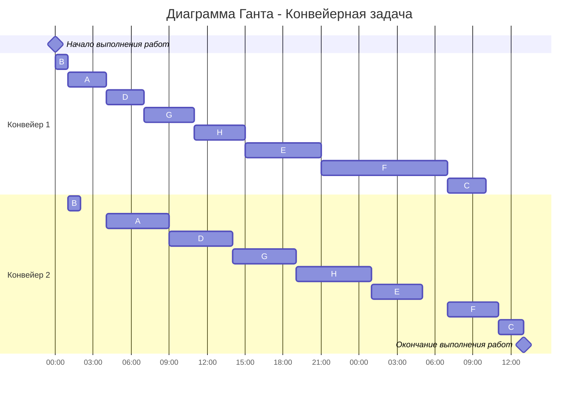

# Задание №4

## 4.1 Задача о распределении инвестиций между проектами

Условия задачи представляются в виде прямоугольной матрицы, где столбцы соответствуют проектам, а строки части инвестиций, направляемых в проекты, объем инвестиций указывается в первом столбце. В ячейках таблицы представлены суммы прибыли от вложения некоторой части средств в определенный проект.

Для решения задачи требуется рассчитать максимально возможную сумму прибыли от вложения всех средств в проекты и распределение этой суммы между проектами.

Условие:
| $ | A | B | C | D | E |
|-----|----|----|----|----|----|
| 100 | 3 | 5 | 4 | 7 | 8 |
| 200 | 8 | 11 | 9 | 8 | 12 |
| 300 | 9 | 12 | 14 | 10 | 13 |
| 400 | 14 | 16 | 15 | 14 | 14 |
| 500 | 21 | 19 | 20 | 22 | 19 |

**Решение должно содержать номер варианта и подробное пошаговое описание.**

Ищем оптимальные распределения для проекта AB
#100

1. 100A = 3
2. 100B = 5

#200

1. 100B + 100A = 8
2. 200B = 11 берем это
3. 200A = 8

#300

1. 100A + 200B = 14 берем это
2. 100B + 200A = 13
3. 300B = 12
4. 300A = 9

#400

1. 100A + 300B = 15
2. 300A + 100B = 14
3. 200A + 200B = 19 берем это
4. 400A = 14
5. 400B = 16

#500

1. 100A + 400B = 19
2. 400A + 100B = 19
3. 200A + 300B = 20
4. 200B + 300A = 20
5. 500A = 21 берем это
6. 500B = 19

| $   | AB  | c   |
| --- | --- | --- |
| 100 | 5   | 5   |
| 200 | 11  | 11  |
| 300 | 14  | 12  |
| 400 | 19  | 16  |
| 500 | 21  | 19  |

Теперь для проекта ABC

#100

1. 100AB = 5 берем это
2. 100C = 5

#200

1. 100AB + 100C = 10
2. 200AB = 11 берем это
3. 200C = 11

#300

1. 100C + 200AB = 16
2. 100AB + 200C = 16
3. 300AB = 14 берем это
4. 300C = 12

#400

1. 100C + 300AB = 19
2. 300C + 100AB = 17
3. 200C + 200AB = 20 берем это
4. 400C = 16
5. 400AB = 19

#500

1. 100C + 400AB = 24
2. 400C + 100AB = 21
3. 200C + 300AB = 25 берем это
4. 200AB + 300C = 23
5. 500C = 19
6. 500AB = 21

| $   | ABC | D   |
| --- | --- | --- |
| 100 | 5   | 7   |
| 200 | 11  | 8   |
| 300 | 14  | 10  |
| 400 | 20  | 14  |
| 500 | 25  | 22  |

Теперь для проекта ABCD

#100

1. 100ABC = 5
2. 100D = 7 берем это

#200

1. 100ABС + 100D = 12 берем это
2. 200ABС = 11
3. 200D = 8

#300

1. 100D + 200ABC = 18 берем это
2. 100ABC + 200D = 13
3. 300ABC = 14
4. 300D = 10

#400

1. 100D + 300ABC = 21 берем это
2. 300D + 100ABC = 15
3. 200D + 200ABC = 19
4. 400D = 14
5. 400ABC = 20

#500

1. 100D + 400ABC = 27 берем это
2. 400D + 100ABC = 19
3. 200D + 300ABC = 22
4. 200ABC + 300D = 21
5. 500D = 22
6. 500ABC = 25

| $   | ABCD | E   |
| --- | ---- | --- |
| 100 | 7    | 8   |
| 200 | 12   | 12  |
| 300 | 18   | 13  |
| 400 | 21   | 14  |
| 500 | 27   | 19  |

И для ABCDE

#100

1. 100ABCВ = 7
2. 100E = 8 берем это

#200

1. 100ABСD + 100E = 15 берем это
2. 200ABСD = 12
3. 200E = 12

#300

1. 100E + 200ABCD = 20 берем это
2. 100ABCD + 200E = 19
3. 300ABCD = 18
4. 300E = 13

#400

1. 100E + 300ABCD = 26 берем это
2. 300E + 100ABCD = 20
3. 200E + 200ABCD = 24
4. 400E = 14
5. 400ABCD = 21

#500

1. 100E + 400ABCD = 29
2. 400E + 100ABCD = 22
3. 200E + 300ABCD = 30 берем это
4. 200ABCD + 300E = 25
5. 500E = 19
6. 500ABCD = 27

| $   | ABCDE |
| --- | ----- |
| 100 | 8     |
| 200 | 15    |
| 300 | 20    |
| 400 | 26    |
| 500 | 30    |

### Ответ

Максимальная доходность 30 при путь

Путь - ABCDE = ($200E$ + (300ABCD = $100D$ + 200ABC = (200AB = $200B$)))

## 4.2 Оптимальное расписание. Конвейерная задача

Необходимо построить расписание, выполняемое в кратчайшие сроки двумя исполнителями:

1. Применить алгоритм Джонсона, в решении отобразить ход выполнения алгоритма с подробными комментариями.
2. В ответе указать длительность полученного расписания.
3. В ответе вывести полученное расписание **в виде диаграммы Ганта**. Диаграмму Ганта можно оформить с помощью плагина Mermaid, образцы оформления диаграмм представлены в данном файле, в описании алгоритмов.

**Решение должно содержать номер варианта и подробное пошаговое описание.**

## Условия задач

### 1. Построим таблицу для вводных независимых заданий, разделенных на 2 этапа каждое:

| -       | A   | B   | C   | D   | E   | F   | G   | H   |
| ------- | --- | --- | --- | --- | --- | --- | --- | --- |
| I этап  | 3   | 1   | 3   | 3   | 6   | 10  | 4   | 4   |
| II этап | 5   | 1   | 2   | 5   | 4   | 4   | 5   | 6   |

### 2. Применим алгоритм Джонсона:

1. выпишем номера заданий, в которых I этап длится меньше либо также, как II этап (I этап <= II этап): A, B, D, G, H. После чего отсортируем получившиеся задания в порядке неубывания длительности их I этапа: B, A, D, G, H.
2. выпишем номера заданий, в которых I этап длится дольше II этапа (I этап > II этап): C, E, F. После чего отсортируем получившиеся задания в порядке невозсрастания длительности их II этапа: E, F, C.
3. Соединим получившиеся отсортированные последовательности: B, A, D, G, H, E, F, C.

Кротчайшее расписание в сумме займет 37 единиц времени
