# Задание №4

## Вариант 3

**Условие задачи о распределении инвестиций:**

| $   | A  | B  | C  | D  |
|-----|----|----|----|----|
| 100 | 6  | 7  | 5  | 5  |
| 200 | 8  | 9  | 11 | 8  |
| 300 | 18 | 12 | 17 | 14 |
| 400 | 21 | 19 | 20 | 18 |
| 500 | 25 | 23 | 20 | 26 |

---

### 1. Задача о распределении инвестиций между проектами

Нужно найти макс. прибыль. Упрощаем задачу и берем только A и B. Представим что вместо $ у нас части т.е. 1, 2, 3, 4, 5.

| $   | A:B         |
|-----|-------------|
| 100 | 7 (0:1)     |
| 200 | 13 (1:1)    |
| 300 | 18 (3:0)    |
| 400 | 25 (3:1)    |
| 500 | 28 (4:1)    |

**для 100:**

| A   | B   | Результат       |
|-----|-----|-----------------|
| 1   | 0   | 7 (макс. прибыль) |
| 0   | 1   | 6               |

**для 200:**

| A   | B   | Результат       |
|-----|-----|-----------------|
| 0   | 2   | 9               |
| 1   | 1   | **13** (макс.)  |
| 2   | 0   | 8               |

**для 300:**

| A   | B   | Значения        |
|-----|-----|-----------------|
| 0   | 3   | 12              |
| 1   | 2   | 15              |
| 2   | 1   | 15              |
| 3   | 0   | **18** (макс.)  |

**для 400:**

| A   | B   | Результат       |
|-----|-----|-----------------|
| 0   | 4   | 19              |
| 1   | 3   | 20              |
| 2   | 2   | 17              |
| 3   | 1   | **23** (макс.)  |
| 4   | 0   | 21              |

**для 500:**

| A   | B   | Результат       |
|-----|-----|-----------------|
| 0   | 5   | 23              |
| 1   | 4   | 25              |
| 2   | 3   | 20              |
| 3   | 2   | 27              |
| 4   | 1   | **28** (макс.)  |
| 5   | 0   | 25              |

---

### 2. Продолжаем таблицу, добавляем столбец AB : C

| $   | A:B         | AB:C        |
|-----|-------------|-------------|
| 100 | 7 (0:1)     | 7 (1:0)     |
| 200 | 13 (1:1)    | 13 (2:0)    |
| 300 | 18 (3:0)    | 18 (3:0)    |
| 400 | 25 (3:1)    | 25 (3:1)    |
| 500 | 28 (4:1)    | 30 (2:3)    |

**для 100**  
| AB  | C   | Результат |
|-----|-----|-----------|
| 0   | 1   | 5         |
| 1   | 0   | **7** (макс.) |

**для 200**  
| AB  | C   | Результат |
|-----|-----|-----------|
| 0   | 2   | 11        |
| 1   | 1   | 12        |
| 2   | 0   | **13** (макс.) |

**для 300**  
| AB  | C   | Результат |
|-----|-----|-----------|
| 0   | 3   | 17        |
| 1   | 2   | 12        |
| 2   | 1   | **18** (макс.) |
| 3   | 0   | **18** (макс.) |

**для 400**  
| AB  | C   | Результат |
|-----|-----|-----------|
| 0   | 4   | 20        |
| 1   | 3   | 24        |
| 2   | 2   | 24        |
| 3   | 1   | 23        |
| 4   | 0   | **25** (макс.) |

**для 500**  
| AB  | C   | Результат |
|-----|-----|-----------|
| 0   | 5   | 20        |
| 1   | 4   | 27        |
| 2   | 3   | **30**    |
| 3   | 2   | 29        |
| 4   | 1   | 30        |
| 5   | 0   | 28        |

*Если несколько max, то выбираем любой*

---

### 3. Добавляем столбец АВС : D

| $   | A:B         | AB:C        | ABC:D       |
|-----|-------------|-------------|-------------|
| 100 | 7 (0:1)     | 7 (1:0)     |             |
| 200 | 13 (1:1)    | 13 (2:0)    |             |
| 300 | 18 (3:0)    | 18 (3:0)    |             |
| 400 | 25 (3:1)    | 25 (3:1)    |             |
| 500 | 28 (4:1)    | 30 (2:3)    | 30 (5:0)    |

*Не считаем т.к это последний столбец => дальше распределение не будет + за 500$ будет самое большое число которое и возьмем*

**за 500**      
| ABC | D   | Сумма |
|-----|-----|-------|
| 0   | 5   | 26    |
| 1   | 4   | 25    |
| 2   | 3   | 24    |
| 3   | 2   | 28    |
| 4   | 1   | **30** |
| 5   | 0   | **30** (макс.) |

**Ответ:** максимальная прибыль 30$.  

---

## 4.2 Оптимальное расписание. Конвейерная задача

**Данные по заданиям:**

| Задание | A   | B   | C   | D   | E   | F   | G   | H   | I   | J   |
|---------|-----|-----|-----|-----|-----|-----|-----|-----|-----|-----|
| I этап  | 7   | 5   | 7   | 7   | 7   | 8   | 4   | 1   | 8   | 4   |
| II этап | 6   | 6   | 6   | 8   | 6   | 9   | 4   | 2   | 10  | 3   |

**Используем АЛГОРИТМ Джонсона:**

### I. Разделить задачи на 2 группы
- **I ЭТАП ≤ II ЭТАП**: B, D, F, G, H, I → **1 группа**
- **I ЭТАП > II ЭТАП**: A, C, E, J → **2 группа**

### II. Сортировка
1) **В 1 группе** отсортировать по возрастанию I ЭТАПа (если равные знач., то без различия):  
   **H → G → B → D → F → I**

2) **Во 2 группе** отсортировать по убыванию II ЭТАПа:  
   **A → C → E → J**

### III. Объединить отсортированные группы (1 гр → 2 гр)  
**H → G → B → D → F → I → A → C → E → J**

---

### Диаграмма Ганта

```mermaid
gantt
    title Диаграмма Ганта - Конвейерная задача (Вариант 3)
    dateFormat  X
    axisFormat %U
    Начало выполнения работ : milestone, m1, 0, 0h
    section Конвейер 1
    H : a1, 0, 1h
    G : a2, after a1, 4h
    B : a3, after a2, 5h
    D : a4, after a3, 7h
    F : a5, after a4, 8h
    I : a6, after a5, 8h
    A : a7, after a6, 7h
    C : a8, after a7, 7h
    E : a9, after a8, 7h
    J : a10, after a9, 4h
    section Конвейер 2
    H : b1, after a1, 2h
    G : b2, after a2 and b1, 4h
    B : b3, after a3 and b2, 6h
    D : b4, after a4 and b3, 8h
    F : b5, after a5 and b4, 9h
    I : b6, after a6 and b5, 10h
    A : b7, after a7 and b6, 6h
    C : b8, after a8 and b7, 6h
    E : b9, after a9 and b8, 6h
    J : b10, after a10 and b9, 3h
    Окончание выполнения работ : milestone, m2, 65, 0h
```

**Ответ: кратчайшее расписание - 65 часов**