# Оптимальное расписание. Стратегия разделения процессоров
## Вариант 3

### Исходные Данные:

| Задания   | A   | B   | C   | D   | E   |
|-----------|-----|-----|-----|-----|-----|
| Время (t) | 43  | 41  | 26  | 23  | 7   |

| Исполнители            | 1   | 2   | 3   |
|------------------------|-----|-----|-----|
| Производительность (p) | 4   | 2   | 1   |

$p_1 = 4$  
$p_2 = 2$  
$p_3 = 1$

### Найдём теоретический минимум времени

$$
t = \frac{43 + 41 + 26 + 23 + 7}{4 + 2 + 1} = \frac{140}{7} = 20
$$

Длительность идеального расписания — 20

### Расставляем приоритеты

Назначаем исполнителей на задачи по убыванию длительности, пока не закончатся исполнители.

- Приоритет: $A > B > C > D > E$
- Назначение:  
  - $P_1$ → A  
  - $P_2$ → B  
  - $P_3$ → C  

(Задачи D и E — без исполнителей)

### Составляем уравнения и сравниваем только последовательные задачи

| Условие | Уравнение          | Результат |
|---------|--------------------|-----------|
| A = B   | $43 - 4t = 41 - 2t$ | $t_1 = 1$ |
| B = C   | $41 - 2t = 26 - t$  | $t_2 = 15$ |
| C = D   | $26 - t = 23$       | $t_3 = 3$ |

**Раньше всех — $t_1 = 1$** → раньше всех сравняются A и B

### Обновляем состояние при $t = 1$

| Задания    | A   | B   | C   | D   | E   |
|------------|-----|-----|-----|-----|-----|
| Время (t)  | 39  | 39  | 25  | 23  | 7   |

Приоритеты:
- A и B — одинаковые → приоритет 1
- C — приоритет 2
- D — приоритет 3
- E — приоритет 4

Назначение:
- $P_1, P_2$ → A и B (по 3 ед. производительности каждому)
- $P_3$ → C

### Следующий этап: $t = 3$ (после 2 единиц с момента $t=1$)

| Условие | Уравнение              | Результат |
|---------|------------------------|-----------|
| AB = C  | $39 - 3t = 25 - t$     | $t = 7$ |
| C = D   | $25 - t = 23$          | $t = 2$ → раньше |

→ **$t_3 = 2$** (относительно текущего этапа) → общее время = 1 + 2 = 3

Обновленные объемы:

| Задания | A   | B   | C   | D   | E   |
|---------|-----|-----|-----|-----|-----|
| Время (t)       | 33  | 33  | 23  | 23  | 7   |

Приоритеты:
- A, B — 1
- C, D — 2 (сравнялись!)
- E — 3

Назначение:
- $P_1, P_2$ → A, B
- $P_3$ → делит свою производительность между C и D → по 0.5 на каждую

### Следующий этап: $t = 4$ (после 4 единиц с момента $t=3$)

Уравнения:

| Условие | Уравнение                  | Результат |
|---------|----------------------------|-----------|
| AB = CD | $33 - 3t = 23 - 0.5t$      | $t = 4$   |
| CD = E  | $23 - 0.5t = 7$            | $t = 32$  |

→ **$t = 4$** — самый ранний

Обновленные объемы:

| Задания | A   | B   | C   | D   | E   |
|---------|-----|-----|-----|-----|-----|
| Время (t)       | 21  | 21  | 21  | 21  | 7   |

Приоритеты:
- A, B, C, D — 1
- E — 2

Назначение:
- Все три исполнителя ($P_1, P_2, P_3$) работают над A–D
- Производительность на каждую задачу: $7 / 4 = 1.75$

### Следующий этап: $t = 8$ (после 8 единиц с момента $t=7$)

Уравнение:

| Условие | Уравнение        | Результат |
|---------|------------------|-----------|
| ABCD = E| $21 - 1.75t = 7$ | $t = 8$   |

Обновленные объемы:

| Задания | A   | B   | C   | D   | E   |
|---------|-----|-----|-----|-----|-----|
| L       | 7   | 7   | 7   | 7   | 7   |

Все задачи теперь имеют одинаковый объем → все приоритет 1.

Назначение:
- Все исполнители работают над всеми задачами.
- Производительность на каждую: $7 / 5 = 1.4$

### Завершение: $t = 5$ (после 5 единиц)

$$
t_{\text{заверш}} = \frac{7}{1.4} = 5
$$

**Общее время: 3 + 4 + 8 + 5 = 20**

## Ответ:
Оптимальное время выполнения всех заданий — 20 сек

## Диаграмма Ганта:

```mermaid
gantt
    title Диаграмма Ганта
    dateFormat mm
    axisFormat %M
    tickInterval 1minute

    section Исполн. 1
    A : a11, 0, 1m
    A : a12, after a11, 2m
    A+B : a13, after a12, 4m
    A–D : a14, after a13, 8m
    Все : a15, after a14, 5m

    section Исполн. 2
    B : b21, 0, 1m
    B : b22, after b21, 2m
    A+B : b23, after b22, 4m
    A–D : b24, after b23, 8m
    Все : b25, after b24, 5m

    section Исполн. 3
    C : c31, 0, 1m
    C : c32, after c31, 2m
    C+D : c33, after c32, 4m
    A–D : c34, after c33, 8m
    Все : c35, after c34, 5m
```

