# Решение задачи 5 команды brigada
## Состав команды:
1. Ваулин Никита
2. Громов Иван
3. Кузнецов Егор
 
# Оптимальное расписание. Стратегия разделения процессоров 
## Условия задания
Необходимо построить расписание, выполняемое в кратчайшие сроки: 
1. Для решения задачи применить Стратегию разделения процессоров, в решении отобразить ход выполнения алгоритма с подробными комментариями.
2. В ответе указать длительность полученного расписания.
3. В ответе вывести полученное расписание в виде диаграммы Ганта.

## Вариант 8

| Задания      |  A  |  B  |  C  |  D  |  E  |  F  |
|:-------------|:---:|:---:|:---:|:---:|:---:|:---:|
| Длительность | 32  | 29  |  23 | 12  | 12  |  4  |

| Исполнители           |  1  |  2  |  3  |
|:----------------------|:---:|:---:|:---:|
| Производительность(p) |  4  |  3  |  1  |

## Решение

Найдем минимальное время, за которое исполнители смогли бы выполнить все задания. 
Для этого общий объем работы необходимо разделить на сумму производительностей исполнителей:

$$T_{min} = \frac{Q}{P} = \frac{32+29+23+12+12+4}{4+3+1} = \frac{112}{8} = 14$$

Оптимальное время за которое могут выполняться все задания должно быть не меньше 14: $T_{min} \geq 14$

### Принцип распределения исполнителей по задачам

В общем случае (когда задачи не равны по объёму работы) распределение задач исполнителям будет определяться следующим образом: исполнителю с наибольшей производительностью даем задачу с наибольшим объемом работы.  
В случае, если $n$ задач имеют одинаковый объем работы, то исполнители будут работать на каждой из задач одинаковое количесво времени, тем самым работая с производительностью $P = \frac{\text{объем задания}}{\text{n }}$

### Распределение первое:
На начальный момент времени объем работы у каждой задачи выглядит следующим образом:

| Задания      |  A  |  B  |  C  |  D  |  E  |  F  |
|:-------------|:---:|:---:|:---:|:---:|:---:|:---:|
| Длительность | 32  | 29  |  23 | 12  | 12  |  4  |

Распределяем исполнителей:  
- Первоему исполнителю с производительностью 4 выдаем задачу A;
- Второму исполнителю с производительностью 3 выдаем задачу B;
- Третьему исполнителю с производительностью 1 выдаем задачу С.  

Получается такое распределение:

$$P_1 \rightarrow A$$

$$P_2 \rightarrow B$$

$$P_3 \rightarrow C$$

В результате выполнения задач в какой-то момент объем задач между какими-то задачами сравняется, что будет обозначать необходимость изменения распределения. 
Для определения момента, когда задачи сравняются необходимо: 
- Выделить задачи которые могут сравняться;
- Составить уравнения, которые позволят понять момент времени t, когда задачи сравняются. 

Могут сравняться процессы:

$$A = B; \text{(1)}$$

$$B = C; \text{(2)}$$

$$C = D; \text{(3)}$$

Составим уравнения и решим их:

$$32 - 4t_1 = 29 - 3t_1 \Rightarrow t_1 = 3 \text{ (1)}$$
$$29 - 3t_2 = 23 - t_2 \Rightarrow 2t_2 = 6 \Rightarrow t_2 = 3 \text{ (2)}$$
$$23 - t_3 = 12 \Rightarrow t = 11\text{ (3)}$$

Минимальное время до события равенства задач: $t = 3$ 

Отобразим занятость исполнителей на момент времени $t=3$ на диаграмме Ганта:

```mermaid
gantt
    title Диаграмма Ганта
    dateFormat  mm
    axisFormat %M
    tickInterval 1minute
    section Исполн. 1
    A : a1, 0, 3m 
    section Исполн. 2
    B : b1, 0, 3m 
    section Исполн. 3
    C : c1, 0, 3m 

```

После работы исполнителей остаточный объем работы задач: 

$$A(32) = 32 - 4*3 = 20;$$
$$B(29) = 29 - 3*3 = 20;$$
$$С(23) = 23 - 1*3 = 20$$

| Задания      |  A  |  B  |  C  |  D  |  E  |  F  |
|:-------------|:---:|:---:|:---:|:---:|:---:|:---:|
| Длительность | 20  | 20  |  20 | 12  | 12  |  4  |

### Распределение второе:

Распределяем исполнителей:  
Три первые задачи имеют равный объем работы, поэтому все три задачи объединяем в группу, в которой исполнители будут работать равное количесво времени меняя задачи циклически. Исполнителями для нее становятся $P_1, P_2, P_3$.  

Задача $ABC$ имеет объем работы 20 ($ABC = 20$), исполнители, которые будут работать над ней имеют производительность:

$$P_{sum} = \frac{4+3+1}{3} = \frac{8}{3}$$

Задачи, которые могут сравняться:
$$ABC = D;$$

Составим и решим уравнение для определения момента времени, когда объем работу у задач сравняется:

$$20 - \frac{8}{3}t = 12;$$

$$8 = \frac{8}{3}t;$$

$$t= 3;$$

Отобразим занятость исполнителей на момент времени $t = 6$ ($3+3=6$) на диаграмме Ганта:

```mermaid
gantt
    title Диаграмма Ганта
    dateFormat  mm
    axisFormat %M
    tickInterval 1minute
    section Исполн. 1
    A : a11, 0, 4m 
    B : b11, after a11, 1m 
    C : c11, after b11, 1m 

    section Исполн. 2
    B : b21, 0, 3m 
    C : c21, after b21, 1m 
    A : a21, after c21, 1m 
    B : b22, after a21, 1m


    section Исполн. 3
    C : c1, 0, 3m 
    B : b31, after c1, 1m
    C: c32, after b31,1m
    A: a31,after c32, 1m

```

После работы исполнителей остаточный объем работы задач: 

$$A(20) = 20 - \frac{8}{3}*3 = 12;$$
$$B(20) = 20 - \frac{8}{3}*3 = 12;$$
$$С(20) = 20 - \frac{8}{3}*3 = 12;$$

| Задания      |  A  |  B  |  C  |  D  |  E  |  F  |
|:-------------|:---:|:---:|:---:|:---:|:---:|:---:|
| Длительность | 12  | 12  |  12 | 12  | 12  |  4  |

### Распределение третье:

Задачи с $A$ до $E$ образуют общую группу.

Задача $ABCDE$ имеет объем работы 12 ($ABCDE = 12$), исполнители, которые будут работать над ней имеют производительность:

$$P_{sum} = \frac{4+3+1}{5} = \frac{8}{5}$$

Задачи, которые могут сравняться:
$$ABCDE = F;$$

Составим и решим уравнение для определения момента времени, когда объем работу у задач сравняется:

$$12 - \frac{8}{5}t = 4;$$

$$8 = \frac{8}{5}t;$$

$$t= 5;$$

Отобразим занятость исполнителей на момент времени $t = 11$ ($3+3+5=11$) на диаграмме Ганта:

```mermaid
gantt
    title Диаграмма Ганта
    dateFormat  mm
    axisFormat %M
    tickInterval 1minute
    section Исполн. 1
    A : a11, 0, 4m 
    B : b11, after a11, 1m 
    C : c11, after b11, 1m
    A: a12, after c11, 1m
    B: b12, after a12,1m 
    C: c12,after b12,1m
    D: d11, after c12,1m
    E: e11,after d11,1m


    section Исполн. 2
    B : b21, 0, 3m 
    C : c21, after b21, 1m 
    A : a21, after c21, 1m 
    B : b22, after a21, 1m
    E : e21,after b22, 1m
    A : a22, after e21, 1m
    B: b23, after a22,1m
    C: c22, after b23, 1m
    D: d21, after c22, 1m


    section Исполн. 3
    C : c1, 0, 3m 
    B : b31, after c1, 1m
    C: c32, after b31,1m
    A: a31,after c32, 1m
    D: d31, after a31, 1m
    E: e31, after d31, 1m
    A: a32, after e31, 1m
    B: b32, after a32, 1m
    C: c33, after b32, 1m

```

После работы исполнителей остаточный объем работы задач: 

$$A(12) = 12 - \frac{8}{5}*5 = 4;$$
$$B(12) = 12 - \frac{8}{5}*5 = 4;$$
$$С(12) = 12 - \frac{8}{5}*5 = 4;$$
$$D(12) = 12 - \frac{8}{5}*5 = 4;$$
$$E(12) = 12 - \frac{8}{5}*5 = 4;$$

| Задания      |  A  |  B  |  C  |  D  |  E  |  F  |
|:-------------|:---:|:---:|:---:|:---:|:---:|:---:|
| Длительность | 4  | 4  |  4 | 4  | 4  |  4  |

### Распределение четвертое:

Задачи с $A$ до $F$ образуют общую группу.

Задача $ABCDEF$ имеет объем работы 4 ($ABCDEF = 4$), исполнители, которые будут работать над ней имеют производительность:

$$P_{sum} = \frac{4+3+1}{6} = \frac{8}{6}$$

Задачи не включенные в группу отсутсвуют, поэтому объем работы группы может сравняться с 0, т.е. работа закончится. 

Составим и решим уравнение для определения момента времени, когда объем работы у задач закончится:

$$4 - \frac{8}{6}t = 0;$$

$$4 = \frac{4}{3}t;$$

$$t= 3;$$

Отобразим занятость исполнителей на момент времени $t = 14$ ($3+3+5+3=14$) на диаграмме Ганта:

После работы исполнителей остаточный объем работы задач: 

$$A(4) = 4 - \frac{8}{6}*3 = 0;$$
$$B(4) = 4 - \frac{8}{6}*3 = 0;$$
$$С(4) = 4 - \frac{8}{6}*3 = 0;$$
$$D(4) = 4 - \frac{8}{6}*3 = 0;$$
$$E(4) = 4 - \frac{8}{6}*3 = 0;$$

### Ответ

Длительность оптимального расписания составляет $14$.

Диаграмма Ганта:

```mermaid
gantt
    title Диаграмма Ганта
    dateFormat  mm
    axisFormat %M
    tickInterval 1minute
    section Исполн. 1
    A : a11, 0, 4m 
    B : b11, after a11, 1m 
    C : c11, after b11, 1m
    A: a12, after c11, 1m
    B: b12, after a12,1m 
    C: c12,after b12,1m
    D: d11, after c12,1m
    E: e11,after d11,1m
    A: a13, after e11, 0.5m
    B: b13, after a13,0.5m 
    C: c13,after b13,0.5m
    D: d12, after c13,0.5m
    E: e12,after d12,0.5m
    F: f11, after e12,0.5m


    section Исполн. 2
    B : b21, 0, 3m 
    C : c21, after b21, 1m 
    A : a21, after c21, 1m 
    B : b22, after a21, 1m
    E : e21,after b22, 1m
    A : a22, after e21, 1m
    B: b23, after a22,1m
    C: c22, after b23, 1m
    D: d21, after c22, 1m
    F: f21,after d21,0.5m
    A : a23, after f21, 0.5m
    B: b24, after a23,0.5m
    C: c23, after b24, 0.5m
    D: d22, after c23, 0.5m
    E : e22,after d22, 0.5m


    section Исполн. 3
    C : c1, 0, 3m 
    B : b31, after c1, 1m
    C: c32, after b31,1m
    A: a31,after c32, 1m
    D: d31, after a31, 1m
    E: e31, after d31, 1m
    A: a32, after e31, 1m
    B: b32, after a32, 1m
    C: c33, after b32, 1m
    E: e32, after c33, 0.5m
    F: f31, after e32, 0.5m
    A: a33, after f31, 0.5m
    B: b33, after a33, 0.5m
    C: c34, after b33, 0.5m
    D: d32, after c34, 0.5m

```

