| Задания      | A   | B   | C   | D   | E   | F   |
| ------------ | --- | --- | --- | --- | --- | --- |
| Длительность | 22  | 22  | 11  | 9   | 4   | 4   |

| Исполнители            | P₁  | P₂  | P₃  |
| ---------------------- | --- | --- | --- |
| Производительность (p) | 4   | 3   | 1   |

$$
T_{\min} = \frac{22 + 22 + 11 + 9 + 4 + 4}{4 + 3 + 1} = \frac{72}{8} = 9
$$

Следуя алгоритму, первыми по приоритету считаются задачи A и B, так как они имеют наибольшую длительность. Поскольку их приоритеты равны, все свободные исполнители с наивысшей производительностью назначаются совместно на выполнение этого набора задач. Оставшийся исполнитель назначается на следующую по приоритету задачу C. Таким образом, исполнители P₁ и P₂ совместно работают над задачами A и B, а исполнитель P₃ над задачей C.

Процесс продолжается до тех пор, пока либо объёмы некоторых задач не сравняются (и их приоритеты станут равными), либо какая-либо задача не завершится.

Так как исполнители 1 и 2 работают на два задания, их производительность считаем как:

$$
\frac{4 + 3}{2} = 3,5
$$

Смотрим, что сравнится раньше: **AB и C** или **C и D**.

- **AB = C**: 22 – 3,5t = 11 – 1t, получаем: t = 4,4
- **C = D**: 11 – 1t = 9, получаем: t = 2

Смотрим, какие будут объёмы работ через **t = 2** (так как **C = D** произойдёт раньше):

| Задания      | A               | B               | C          | D   | E   | F   |
| ------------ | --------------- | --------------- | ---------- | --- | --- | --- |
| Длительность | 22 – 3,5·2 = 15 | 22 – 3,5·2 = 15 | 11 – 2 = 9 | 9   | 4   | 4   |

Получаем, что первую единицу времени:

|     | 0–2 |
| --- | --- |
| P₁  | AB  |
| P₂  | AB  |
| P₃  | C   |

Теперь у нас **A = B**, **C = D**, **E = F**.

Получается: **P₁ и P₂** отправляем на задания **AB**. **P₃** — на задания **CD**.

Так как исполнители 1 и 2 работают на два задания, их производительность = 3,5.  
Исполнитель 3 работает на два задания, его производительность = 1 / 2 = 0,5.

Смотрим, что сравнится раньше: **AB и CD** или **CD и EF**.

- **AB = CD**: 15 – 3,5t = 9 – 0,5t, получаем: t = 2
- **CD = EF**: 9 – 0,5t = 4, получаем: t = 10

Так как **AB = CD** произойдёт быстрее всего, смотрим объёмы через ещё **t = 2**:

| Задания      | A              | B              | C             | D             | E   | F   |
| ------------ | -------------- | -------------- | ------------- | ------------- | --- | --- |
| Длительность | 15 – 3,5·2 = 8 | 15 – 3,5·2 = 8 | 9 – 0,5·2 = 8 | 9 – 0,5·2 = 8 | 4   | 4   |

Получаем, что до **t = 4** исполнители работают так:

|     | 0–2 | 2–4 |
| --- | --- | --- |
| P₁  | AB  | AB  |
| P₂  | AB  | AB  |
| P₃  | C   | CD  |

Теперь у нас **A = B = C = D** и **E = F**.

Получается: все исполнители отправляем на задачи **ABCD**.

Совместная производительность на 4 задачи: \

$$
\frac{4 + 3 + 1}{4} = 2.
$$

Смотрим, когда сравняются **ABCD и EF**:

- **ABCD = EF**: 8 – 2t = 4, получаем: t = 2

Объёмы работ ещё через **t = 2**:

| Задания      | A           | B           | C           | D           | E   | F   |
| ------------ | ----------- | ----------- | ----------- | ----------- | --- | --- |
| Длительность | 8 – 2·2 = 4 | 8 – 2·2 = 4 | 8 – 2·2 = 4 | 8 – 2·2 = 4 | 4   | 4   |

Получаем, что до **t = 6** исполнители работают так:

|     | 0–2 | 2–4 | 4–6  |
| --- | --- | --- | ---- |
| P₁  | AB  | AB  | ABCD |
| P₂  | AB  | AB  | ABCD |
| P₃  | C   | CD  | ABCD |

Теперь у нас **A = B = C = D = E = F**.

Получается: все исполнители отправляем на задачи **ABCDEF**, до тех пор пока они не выполнятся.

Совместная производительность на 6 задач:

$$
\frac{4 + 3 + 1}{6} = \frac{8}{6} = \frac{4}{3}
$$

Смотрим, когда задача **ABCDEF** завершится:  
4 – (4/3)·t = 0, получаем: t = 3

Получаем, что исполнители работают так:

|     | 0–2 | 2–4 | 4–6  | 6–9    |
| --- | --- | --- | ---- | ------ |
| P₁  | AB  | AB  | ABCD | ABCDEF |
| P₂  | AB  | AB  | ABCD | ABCDEF |
| P₃  | C   | CD  | ABCD | ABCDEF |

Общее время выполнения: **9** единиц.

## Диаграмма Ганта

```mermaid
gantt
    title Диаграмма Ганта
    dateFormat  mm
    axisFormat %M
    tickInterval 1minute

    section P1
    A : p1_1, 0, 1m
    B : p1_2, after p1_1, 1m
    B : p1_3, after p1_2, 1m
    A : p1_4, after p1_3, 1m
    A : p1_5, after p1_4, 0.5m
    B : p1_6, after p1_5, 0.5m
    C : p1_7, after p1_6, 0.5m
    D : p1_8, after p1_7, 0.5m
    D : p1_9, after p1_8, 0.5m
    E : p1_10, after p1_9, 0.5m
    F : p1_11, after p1_10, 0.5m
    A : p1_12, after p1_11, 0.5m
    B : p1_13, after p1_12, 0.5m
    C : p1_14, after p1_13, 0.5m

    section P2
    B : p2_1, 0, 1m
    A : p2_2, after p2_1, 1m
    A : p2_3, after p2_2, 1m
    B : p2_4, after p2_3, 1m
    B : p2_5, after p2_4, 0.5m
    C : p2_6, after p2_5, 0.5m
    D : p2_7, after p2_6, 0.5m
    A : p2_8, after p2_7, 0.5m
    A : p2_9, after p2_8, 0.5m
    B : p2_10, after p2_9, 0.5m
    C : p2_11, after p2_10, 0.5m
    D : p2_12, after p2_11, 0.5m
    E : p2_13, after p2_12, 0.5m
    F : p2_14, after p2_13, 0.5m

    section P3
    C : p3_1, 0, 1m
    C : p3_2, after p3_1, 1m
    C : p3_3, after p3_2, 1m
    D : p3_4, after p3_3, 1m
    C : p3_5, after p3_4, 0.5m
    D : p3_6, after p3_5, 0.5m
    A : p3_7, after p3_6, 0.5m
    B : p3_8, after p3_7, 0.5m
    B : p3_9, after p3_8, 0.5m
    C : p3_10, after p3_9, 0.5m
    D : p3_11, after p3_10, 0.5m
    E : p3_12, after p3_11, 0.5m
    F : p3_13, after p3_12, 0.5m
    A : p3_14, after p3_13, 0.5m
```

<!--region Диаграмма Ганта -->

Итоговый ответ: **9 единиц**
