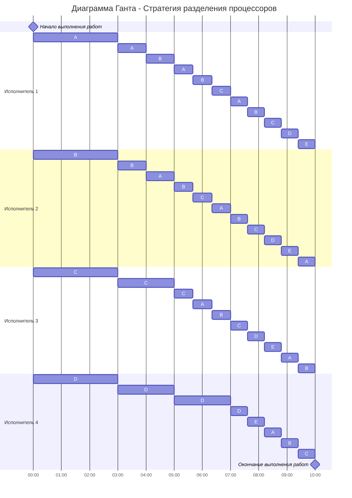

# Решение задания 5: Оптимальное расписание. Стратегия разделения процессоров
### Вариант 5:

| Задания      |  A  |  B  |  C  |  D  |  E  |
|:-------------|:---:|:---:|:---:|:---:|:---:|
| Длительность | 31  | 28  |  22 | 13  |  6  |

| Исполнители           |  $P_1$  |  $P_2$  |  $P_3$  |  $P_4$  |
|:----------------------|:---:|:---:|:---:|:---:|
| Производительность(p) |  4  |  3  |  2  |  1  |
## Решение
Найдем длительность оптимального расписания заданий по формуле:

$$  
T_{min} = \frac {V_1 + V_2 + ... + V_n}{p_1 + p_2 + ... + p_k}  
$$  

$$  
T_{min} = \frac {31 + 28 + 22 + 13 + 6}{4 + 3 + 2 + 1} = 10
$$  

Выполним первый шаг алгоритма:

1. Выбрать задания с самым высоким приоритетом (может быть одно задание или несколько заданий с одинаковым приоритетом), назначить на эти задания одного или несколько самых производительных работников. Если остались свободные работники назначить их на задания со следующим приоритетом.

| Задания      |  A  |  B  |  C  |  D  |  E  |
|:-------------|:---:|:---:|:---:|:---:|:---:|
| Длительность | 31  | 28  |  22 | 13  |  6  |
| Приоритет    | 1   | 2   |  3  | 4   |  5  |
| Исполнитель  |$P_1$|$P_2$|$P_3$|$P_4$|     |

Приступим ко второму шагу:

2. Работники выполняют задания до тех пор, пока не наступит одно из событий:
- какое-либо задание будет завершено и освободится исполнитель,
- сравняются приоритеты у каких-то заданий, если до того эти приоритеты были разные, то есть с изменением приоритетов необходимо переназначить работников на задания согласно шагу 1.

|Условие|Уравнение        |Результат|
|:------|:---------------:|:-------:|
|A=B    |31 - 4t = 28 - 3t|t = 3    |
|B=C    |28 - 3t = 22 - 2t|t = 6    |     
|C=D    |22 - 2t = 13 - t |t = 9    |
|D=E    |13 - t = 6       |t = 7    |

И берем самый "Ранний результат", когда приоритеты сменятся в первый раз => t = 3
Теперь снова построим таблицу заданий, но уже со смененными приоритетами и будем повторять шаги алгоритма (1),(2) до тех пор, пока все задачи не станут первого приоритета

<table>
  <tr>
    <th>Задания</th>
    <th>A</th>
    <th>B</th>
    <th>C</th>
    <th>D</th>
    <th>E</th>
  </tr>
  <tr>
    <td>Длительность</td>
    <td>19</td>
    <td>19</td>
    <td>16</td>
    <td>10</td>
    <td>6</td>
  </tr>
  <tr>
    <td>Приоритет</td>
    <td>1</td>
    <td>1</td>
    <td>2</td>
    <td>3</td>
    <td>4</td>
  </tr>
  <tr>
    <td>Исполнитель</td>
    <td colspan="2">P1P2</td>
    <td>P3</td>
    <td>P4</td>
    <td></td>
  </tr>
</table>

После смены приоритетов:

$$
AB = 19
$$

$$
P_1P_2 = \frac{4 + 3}{2} = \frac{7}{2} = 3,5
$$

2 здесь - это количество заданий

|Условие|Уравнение        |Результат|
|:------|:---------------:|:-------:|
|AB=C   |19 - 3,5t = 16 - 2t|t = 2  |  
|C=D    |16 - 2t = 10 - t |t = 6    |
|D=E    |10 - t = 6       |t = 4  |

"Самый ранний" - t = 2

<table>
  <tr>
    <th>Задания</th>
    <th>A</th>
    <th>B</th>
    <th>C</th>
    <th>D</th>
    <th>E</th>
  </tr>
  <tr>
    <td>Длительность</td>
    <td>12</td>
    <td>12</td>
    <td>12</td>
    <td>8</td>
    <td>6</td>
  </tr>
  <tr>
    <td>Приоритет</td>
    <td>1</td>
    <td>1</td>
    <td>1</td>
    <td>2</td>
    <td>3</td>
  </tr>
  <tr>
    <td>Исполнитель</td>
    <td colspan="3">P1P2P3</td>
    <td>P4</td>
    <td></td>
  </tr>
</table>

После смены приоритетов:

$$
ABC = 12
$$

$$
P_1P_2P_3 = \frac{4 + 3 + 2}{3} = 3
$$

|Условие|Уравнение        |Результат|
|:------|:---------------:|:-------:|
|ABC=D   |12 - 3t = 8 - t|t = 2  |  
|D=E    |8 - t = 6       |t = 2  |

"Самый ранний" и единственный - t = 2
<table>
  <tr>
    <th>Задания</th>
    <th>A</th>
    <th>B</th>
    <th>C</th>
    <th>D</th>
    <th>E</th>
  </tr>
  <tr>
    <td>Длительность</td>
    <td>6</td>
    <td>6</td>
    <td>6</td>
    <td>6</td>
    <td>6</td>
  </tr>
  <tr>
    <td>Приоритет</td>
    <td>1</td>
    <td>1</td>
    <td>1</td>
    <td>1</td>
    <td>1</td>
  </tr>
  <tr>
    <td>Исполнитель</td>
    <td colspan="5">P1P2P3P4</td>
  </tr>
</table>

После того как у всех задач приоритет стал одинаковым, все исполнители продолжнают работать над всеми задачами до конца.

# Ответ
## Диаграмма Ганта

## Оптимальное время выполнения всех заданий составляет 10, расписание представлено в виде диаграммы Ганта выше.