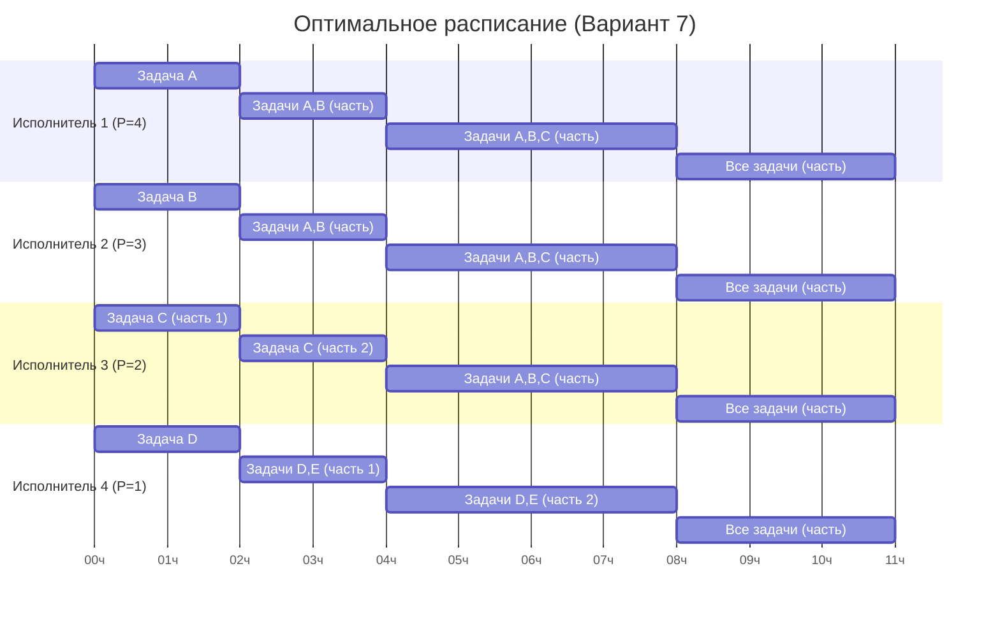

Задание №5:

Задания и их длительность (объемы):

| Задание      | A  | B  | C  | D  | E  |
| :----------- | :- | :- | :- | :- | :- |
| Длительность | 33 | 31 | 26 | 11 | 9  |

Исполнители и их производительность:

| Исполнитель        | 1 | 2 | 3 | 4 |
| :----------------- | :- | :- | :- | :- |
| Производительность | 4 | 3 | 2 | 1 |

#### Шаг 1: Начальное состояние (t = 0)

В начальный момент времени приоритеты задач равны их длительности. Распределяем самых производительных исполнителей на задачи с наивысшим приоритетом.

*   Приоритеты: A(33) > B(31) > C(26) > D(11) > E(9)
*   Исполнители: P1(4) > P2(3) > P3(2) > P4(1)

Назначение:
*   Исполнитель 1 (P=4) → Задача A
*   Исполнитель 2 (P=3) → Задача B
*   Исполнитель 3 (P=2) → Задача C
*   Исполнитель 4 (P=1) → Задача D
*   Задача E ожидает.

#### Шаг 2: Определение первого события

Ищем ближайший момент времени (`t`), когда либо завершится задача, либо сравняются приоритеты выполняемых задач.

*   Завершение задачи D: 11 / 1 = 11ч
*   Приоритет A сравняется с B: 33 - 4t = 31 - 3t → t = 2ч
*   Приоритет B сравняется с C: 31 - 3t = 26 - 2t → t = 5ч
*   Приоритет C сравняется с D: 26 - 2t = 11 - 1t → t = 15ч

Самое раннее событие произойдет через t = 2 часа.

#### Шаг 3: Состояние и перераспределение в момент t = 2

Вычисляем оставшиеся объемы работ:
*   A: 33 - 4 * 2 = 25
*   B: 31 - 3 * 2 = 25
*   C: 26 - 2 * 2 = 22
*   D: 11 - 1 * 2 = 9
*   E: 9 (без изменений)

Приоритеты A и B сравнялись. Происходит перераспределение.
*   Приоритеты: A(25) = B(25) > C(22) > D(9) = E(9)
*   На задачи A и B (общий приоритет) назначаются исполнители 1 и 2 (P=4, P=3). Их суммарная производительность P(A,B) = 7.
*   На задачу C назначается исполнитель 3 (P=2).
*   На задачи D и E (общий приоритет) назначается исполнитель 4 (P=1). Суммарная производительность P(D,E) = 1.

#### Шаг 4: Определение второго события

Ищем следующее событие от момента t=2. Производительность на группы задач распределяется пропорционально количеству задач в группе.
*   Производительность на A и B: P(A,B) = 7. На каждую задачу приходится 7/2 = 3.5.
*   Производительность на C: P(C) = 2.
*   Производительность на D и E: P(D,E) = 1. На каждую задачу приходится 1/2 = 0.5.

Рассчитываем время до событий:
*   Завершение D или E: 9 / 0.5 = 18ч
*   Приоритет (A,B) сравняется с C: 25 - 3.5t = 22 - 2t → 1.5t = 3 → t = 2ч
*   Приоритет C сравняется с (D,E): 22 - 2t = 9 - 0.5t → 1.5t = 13 → t ≈ 8.67ч

Ближайшее событие — через 2 часа (общее время `2 + 2 = 4ч`).

#### Шаг 5: Состояние и перераспределение в момент t = 4

Вычисляем оставшиеся объемы:
*   A, B: 25 - 3.5 * 2 = 18
*   C: 22 - 2 * 2 = 18
*   D, E: 9 - 0.5 * 2 = 8

Теперь у задач A, B, C одинаковый приоритет.
*   Приоритеты: A(18) = B(18) = C(18) > D(8) = E(8)
*   На задачи A, B, C назначаются исполнители 1, 2, 3 (P=4, 3, 2; суммарно 9). Производительность на каждую: 9/3 = 3.
*   На задачи D, E назначается исполнитель 4 (P=1). Производительность на каждую: 1/2 = 0.5.

#### Шаг 6: Определение третьего события

Ищем следующее событие от момента t=4.
*   Завершение D или E: 8 / 0.5 = 16ч
*   Приоритет (A,B,C) сравняется с (D,E): 18 - 3t = 8 - 0.5t → 2.5t = 10 → t = 4ч

Ближайшее событие — через 4 часа (общее время `4 + 4 = 8ч`).

#### Шаг 7: Состояние и перераспределение в момент t = 8

Вычисляем оставшиеся объемы:
*   A, B, C: 18 - 3 * 4 = 6
*   D, E: 8 - 0.5 * 4 = 6

Все задачи (A, B, C, D, E) имеют одинаковый приоритет (6). Все исполнители (суммарная производительность P=10) работают над всеми задачами. Производительность на каждую задачу: 10/5 = 2.

#### Шаг 8: Завершение всех работ

Оставшийся объем каждой задачи равен 6.
*   Время до завершения: 6 / 2 = 3 часа.

Общее время выполнения = 8ч (предыдущие шаги) + 3ч = 11 часов.

### Итог

Длительность полученного расписания: 11 часов.

