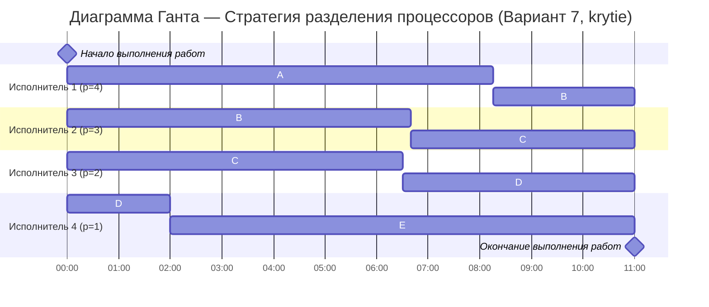

# Задание №5 — Оптимальное расписание

## Команда `krytie`

## Вариант 7

### Исходные данные

| Задание | A  | B  | C  | D  | E  |
|:------:|:--:|:--:|:--:|:--:|:--:|
| Объём \(V_i\) | 33 | 31 | 26 | 11 |  9 |

**Исполнители**

| Исполнитель | 1 | 2 | 3 | 4 |
|:----------:|:-:|:-:|:-:|:-:|
| Производительность \(p_j\) | 4 | 3 | 2 | 1 |

## 1) Расчёт минимально возможного времени расписания

Суммарный объём работ:

$$
V_{\text{sum}} = 33 + 31 + 26 + 11 + 9 = 110
$$

Суммарная производительность:

$$
P_{\text{sum}} = 4 + 3 + 2 + 1 = 10
$$

Минимальная возможная длительность оптимального расписания:

$$
T_{\min}=\frac{V_{\text{sum}}}{P_{\text{sum}}}=\frac{110}{10}=11
$$

**Вывод:** если удаётся построить расписание без простоев исполнителей на интервале \([0;11]\), то оно будет **оптимальным**.

## 2) Стратегия разделения процессоров (как строим расписание)

- **Приоритет задания** в момент времени \(t\) — это **остаточный объём** работы по этому заданию.
- **Правило назначения:** задания с более высоким приоритетом получают более производительных исполнителей.
- **События, после которых пересматриваем назначения:**
  - приоритеты каких-то заданий становятся равны (можно менять назначения),
  - завершился очередной «кусок» работы, и исполнитель может быть переназначен.

> Примечание про равные приоритеты: если несколько заданий имеют одинаковый приоритет, можно выбрать любое распределение между ними — это не ухудшает оптимальность.

## 3) Построение расписания (пошагово, с комментариями)

Чтобы гарантировать оптимальность, строим расписание на время \(T_{\min}=11\) **без простоев** и проверяем, что каждый объём \(V_i\) выполнен полностью.

### Шаг 0 — стартовые приоритеты и первичное назначение

В момент \(t=0\):

- \(A=33\), \(B=31\), \(C=26\), \(D=11\), \(E=9\)
- Назначаем исполнителей по убыванию производительности на 4 задания с наибольшим приоритетом:
  - **исп.1 (4)** → \(A\)
  - **исп.2 (3)** → \(B\)
  - **исп.3 (2)** → \(C\)
  - **исп.4 (1)** → \(D\)

### Шаг 1 — первый момент изменения приоритетов (\(t=2\))

На интервале \(t \in [0;2]\) задания выполняются без прерываний. Посчитаем остатки:

- \(A: 33 - 4\cdot2 = 25\)
- \(B: 31 - 3\cdot2 = 25\)
- \(C: 26 - 2\cdot2 = 22\)
- \(D: 11 - 1\cdot2 = 9\)
- \(E: 9\) (не выполнялось)

В точке \(t=2\) получаем два важных равенства приоритетов:

- \(A=B=25\)
- \(D=E=9\)

**Комментарий:** так как \(D\) и \(E\) сравнялись, дальше можно выбрать любое из них для выполнения самым медленным исполнителем. Чтобы всё успеть за \(T_{\min}\) и не плодить микропереключения, выбираем выполнять \(E\) (а \(D\) доберём позже более быстрым исполнителем).

После \(t=2\) назначаем:

- **исп.1 (4)** → \(A\)
- **исп.2 (3)** → \(B\)
- **исп.3 (2)** → \(C\)
- **исп.4 (1)** → \(E\)

и работаем так до момента \(t=\frac{13}{2}=6.5\).

### Шаг 2 — момент \(t=\frac{13}{2}=6.5\): перенос исп.3 с \(C\) на \(D\)

На интервале \([2;\frac{13}{2}]\) длительность равна \(\frac{9}{2}\). Остаточные объёмы становятся:

- \(A: 25 - 4\cdot\frac{9}{2} = 7\)
- \(B: 25 - 3\cdot\frac{9}{2} = \frac{23}{2}\)
- \(C: 22 - 2\cdot\frac{9}{2} = 13\)
- \(D: 9\) (не выполнялось с \(t=2\))
- \(E: 9 - 1\cdot\frac{9}{2} = \frac{9}{2}\)

**Комментарий:** с этого момента выгодно начать «догонять» \(D\) более быстрым исполнителем, поэтому **исп.3** переключаем с \(C\) на \(D\).

Дальше на очень коротком интервале \([\frac{13}{2};\frac{20}{3}]\) (\(=\frac{1}{6}\) часа) держим:

- **исп.1 (4)** → \(A\)
- **исп.2 (3)** → \(B\)
- **исп.3 (2)** → \(D\)
- **исп.4 (1)** → \(E\)

### Шаг 3 — момент \(t=\frac{20}{3}\approx 6.67\): перенос исп.2 с \(B\) на \(C\)

После интервала длиной \(\frac{1}{6}\) остатки:

- \(A: 7 - 4\cdot\frac{1}{6} = \frac{19}{3}\)
- \(B: \frac{23}{2} - 3\cdot\frac{1}{6} = 11\)
- \(C: 13\) (не выполнялось на этом маленьком отрезке)
- \(D: 9 - 2\cdot\frac{1}{6} = \frac{26}{3}\)
- \(E: \frac{9}{2} - 1\cdot\frac{1}{6} = \frac{13}{3}\)

**Комментарий:** задание \(B\) уже «достаточно уменьшили», теперь подключаем **исп.2** к заданию \(C\), чтобы оно точно завершилось к \(T_{\min}\).

На интервале \([\frac{20}{3};\frac{33}{4}]\) работаем так:

- **исп.1 (4)** → \(A\)
- **исп.2 (3)** → \(C\)
- **исп.3 (2)** → \(D\)
- **исп.4 (1)** → \(E\)

### Шаг 4 — момент \(t=\frac{33}{4}=8.25\): завершили \(A\), перенос исп.1 на \(B\)

Длительность интервала \([\frac{20}{3};\frac{33}{4}]\) равна \(\frac{19}{12}\). Остатки в момент \(t=\frac{33}{4}\):

- \(A: \frac{19}{3} - 4\cdot\frac{19}{12} = 0\) (**задание A завершено**)
- \(B: 11\) (не выполнялось)
- \(C: 13 - 3\cdot\frac{19}{12} = \frac{33}{4}\)
- \(D: \frac{26}{3} - 2\cdot\frac{19}{12} = \frac{11}{2}\)
- \(E: \frac{13}{3} - 1\cdot\frac{19}{12} = \frac{11}{4}\)

**Комментарий:** как только \(A\) завершилось, самый быстрый исполнитель (исп.1) переключается на самое «тяжёлое» из оставшихся — \(B\).

На последнем интервале \([\frac{33}{4};11]\) (длина \(\frac{11}{4}=2.75\)) выполняем:

- **исп.1 (4)** → \(B\)
- **исп.2 (3)** → \(C\)
- **исп.3 (2)** → \(D\)
- **исп.4 (1)** → \(E\)

### Шаг 5 — момент \(t=11\): завершение всех заданий

Проверка на финише:

- \(B: 11 - 4\cdot\frac{11}{4} = 0\)
- \(C: \frac{33}{4} - 3\cdot\frac{11}{4} = 0\)
- \(D: \frac{11}{2} - 2\cdot\frac{11}{4} = 0\)
- \(E: \frac{11}{4} - 1\cdot\frac{11}{4} = 0\)

Все задания завершены ровно к \(t=11\), простоев нет.

## 4) Ответ (длительность оптимального расписания)

$$
\boxed{T_{\min}=11}
$$

## 5) Диаграмма Ганта

