Вариант 7. Стратегия разделения процессоров
Дано

Задание	                A	B	C	D	E
Объём Vi                33	31	26	11	9

Исполнитель	            1	2	3	4
Производительность pj 	4	3	2	1

1. Расчёт минимально возможного времени расписания
Суммарный объём работ:

V sum = 33 + 31 + 26 + 11 + 9 = 110

Суммарная производительность:

P sum = 4 + 3 + 2 + 1 = 10

Минимальная возможная длительность оптимального расписания:

T min = V sum / P sum = 110 / 10 = 11

Вывод: при отсутствии простоев всех исполнителей оптимальное расписание должно длиться \(T_{\min} = 11\) условных единиц времени.

2. Идея построения расписания
Цель:
Построить такое расписание, чтобы: каждый исполнитель работал всё время 0 ≤ t ≤ 11, суммарный объём обработки по каждому заданию совпадал с его объёмом Vi, на больших по объёму заданиях в среднем работали более производительные исполнители.

Для задания i средняя требуемая скорость обработки:
rˉi = Vi / T min
⁡
Считаем:
rˉA=33/11=3

rˉB=31/11≈2,82

rˉC=26/11≈2,36

rˉD=11/11=1

rˉE=9/11≈0,82

Сумма этих средних скоростей даёт:
3+2,82+2,36+1+0,82≈10(P sum)

То есть при непрерывной работе исполнителей можно так распределить их время, чтобы в среднем каждое задание обрабатывалось с нужной скоростью.

Разделение загрузки между исполнителями
Полная ёмкость каждого исполнителя за время 
Tmin = 11

Исп.1: 4 * 11 = 44

Исп.2: 3 * 11=33

Исп.3: 2 * 11=22

Исп.4: 1 * 11=11

Обозначим через 
xj,i - время, которое исполнитель j тратит на задание i. Тогда для каждого задания:

j∑ pj * xj,i = Vi
​
Построим удобное распределение, чтобы каждый исполнитель работал подряд максимум над двумя заданиями:

Исполнитель 1 (p=4)
Почти всё время на самом большом задании A, остаток — на B:
на A: 
x 1,A = 8,25. Объём: 4⋅8,25=33 — A полностью выполнено. Остаток времени: 11 - 8,25 = 2,75 → отдаем на B
Объём: 4 * 2,75 = 11.

Исполнитель 2 (p=3)
Вначале помогает с B, затем переключается на C:
на B: нужно ещё 31 − 11 = 20 единиц объёма;
Время: x 2,B = 20/3 ≈ 6,67. Суммарно использованное время: 6,67, остаётся 11 − 6,67 ≈ 4,33.
Отдаём это время заданию C: объём: 3 * 4,33 ≈ 13.

Исполнитель 3 (p=2)
Основная работа над C и D:
на C нужно ещё 
26
−
13
=
13
26−13=13 единиц объёма;
Время: 3,C = 13/2 = 6,5. За это время использовано 13 единиц объёма, остаётся ресурс исполнителя 3: 22 − 13 = 9 → отдаем на D: x 3,D = 9/2 = 4,5.

Исполнитель 4 (p=1)
Работает над E и остатком D: на D нужно ещё 11 − 9 = 2 единицы объёма;
время: x 4,D = 2. Oстаётся время: 11 − 2 = 9.
Отдаём его заданию E: x 4,E = 9 → объём = 9.
Проверка по заданиям:
A: только исп.1 4 * 8,25 = 33
B: исп.1 + исп.2 4 * 2,75 + 3 * 6,67 ≈ 11 + 20 = 31
C: исп.2 + исп.3 3 * 4,33 + 2 * 6,5 ≈ 13 + 13 = 26
D: исп.3 + исп.4 2 * 4,5 + 1 * 2 = 9 + 2 = 11
E: исп.4 1 * 9 = 9
Проверка по исполнителям (время):
Исп.1: 8,25 + 2,75 = 11
Исп.2: 6,67 + 4,33 ≈ 11
Исп.3: 6,5 + 4,5 = 11
Исп.4: 9 + 2 = 11
Все исполнители заняты все 11 единиц времени, объёмы заданий совпадают с исходными.
Значит, полученное расписание достигает нижней границы \(T_{\min} = 11\) и поэтому оптимально.

4. Пошаговое расписание (интервалы работы)
Выберем интервалы работы так, чтобы каждый исполнитель шёл подряд по своим задачам.
Используем ось времени [0;11].
Исполнитель 1, \(p_1 = 4\) 0→8,25: выполняет A 8,25→11: выполняет B
Исполнитель 2, \(p_2 = 3\) 0→6,67: выполняет B 6,67→11: выполняет C
Исполнитель 3, \(p_3 = 2\) 0→6,5: выполняет C 6,5→11: выполняет D
Исполнитель 4, \(p_4 = 1\) 0→9: выполняет E 9→11: выполняет D

Проверка приоритетов (качественно):
В начале три самых больших задания A, B, C закреплены за тремя самыми быстрыми исполнителями 1–3.
На малых заданиях D и E в основном работают более медленные исполнители.
По мере завершения A и E более быстрые исполнители перекидываются на ещё незавершённые задания.
Таким образом, в течение всего расписания более крупные по оставшемуся объёму задания в среднем получают более производительные ресурсы.

5. Длительность полученного расписания
Все задания завершаются к моменту \(t = 11\).
Исполнители заняты без простоев на всём интервале [0;11].
Ответ: длительность оптимального расписания T min = 11
​
 6. Диаграмма Ганта

```mermaid
gantt
    title Диаграмма Ганта
    dateFormat HH:mm
    axisFormat %H:%M

    Начало : milestone, m1, 00:00, 0h

    section Исполнитель 1 (p=4)
    A :a1, 00:00, 8.25h
    B :a2, after a1, 2.75h

    section Исполнитель 2 (p=3)
    B :b1, 00:00, 6.67h
    C :b2, after b1, 4.33h

    section Исполнитель 3 (p=2)
    C :c1, 00:00, 6.5h
    D :c2, after c1, 4.5h

    section Исполнитель 4 (p=1)
    E :d1, 00:00, 9h
    D :d2, after d1, 2h

    Конец : milestone, m2, 11:00, 0h
```

