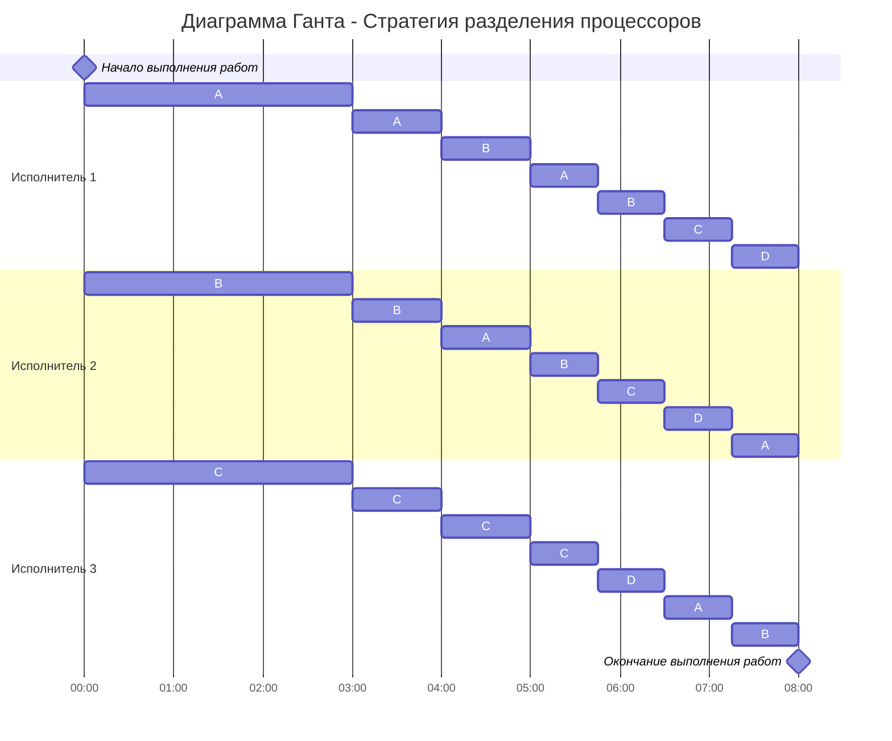

# Решение задания 5: Оптимальное расписание. Стратегия разделения процессоров
### Вариант 2:

| Задания      |  A  |  B  |  C  |  D  |
|:-------------|:---:|:---:|:---:|:---:|
| Длительность | 25  | 22  |  11 |  6  |

| Исполнители           |  1  |  2  |  3  |
|:----------------------|:---:|:---:|:---:|
| Производительность(p) |  4  |  3  |  1  |
## Решение
Найдем длительность оптимального расписания заданий по формуле:

$$  
T_{min} = \frac {V_1 + V_2 + ... + V_n}{p_1 + p_2 + ... + p_k}  
$$  

$$  
T_{min} = \frac {25 + 22 + 11 + 6}{4 + 3 + 1} = 8
$$  

Выполним первый шаг алгоритма:

1. Выбрать задания с самым высоким приоритетом (может быть одно задание или несколько заданий с одинаковым приоритетом), назначить на эти задания одного или несколько самых производительных работников. Если остались свободные работники назначить их на задания со следующим приоритетом.

| Задания      |  A  |  B  |  C  |  D  |
|:-------------|:---:|:---:|:---:|:---:|
| Длительность | 25  | 22  |  11 |  6  |
| Приоритет    | 1   |  2  |  3  |  4  |
| Исполнитель  |$P_1$|$P_2$|$P_3$|     |    

Приступим ко второму шагу:

2. Работники выполняют задания до тех пор, пока не наступит одно из событий:
- какое-либо задание будет завершено и освободится исполнитель,
- сравняются приоритеты у каких-то заданий, если до того эти приоритеты были разные, то есть с изменением приоритетов необходимо переназначить работников на задания согласно шагу 1.

|Условие|Уравнение        |Результат|
|:------|:---------------:|:-------:|
|A=B    |25 - 4t = 22 - 3t|t = 3    |
|B=C    |22 - 3t = 11 - t |t = 5.5  |     
|C=D    |11 - t = 6       |t = 5    |

И берем самый "Ранний результат", когда приоритеты сменятся в первый раз => t = 3
Теперь снова построим таблицу заданий, но уже со смененными приоритетами и будем повторять шаги алгоритма (1),(2) до тех пор, пока все задачи не станут первого приоритета

<table>
  <tr>
    <th>Задания</th>
    <th>A</th>
    <th>B</th>
    <th>C</th>
    <th>D</th>
  </tr>
  <tr>
    <td>Длительность</td>
    <td>13</td>
    <td>13</td>
    <td>8</td>
    <td>6</td>
  </tr>
  <tr>
    <td>Приоритет</td>
    <td>1</td>
    <td>1</td>
    <td>2</td>
    <td>3</td>
  </tr>
  <tr>
    <td>Исполнитель</td>
    <td colspan="2">P1P2</td>
    <td>P3</td>
    <td></td>
  </tr>
</table>

После смены приоритетов:

$$
AB = 13
$$

$$
P_1P_2 = \frac{4 + 3}{2} = \frac{7}{2} = 3,5
$$

где 2 - это количество заданий

|Условие|Уравнение          |Результат|
|:------|:-----------------:|:-------:|
|AB=C   |13 - 3,5t = 16 - 2t|t = 2    |  
|C=D    |8 - t = 6          |t = 2    |

"Самый ранний" и единственный - t = 2

<table>
  <tr>
    <th>Задания</th>
    <th>A</th>
    <th>B</th>
    <th>C</th>
    <th>D</th>
  </tr>
  <tr>
    <td>Длительность</td>
    <td>6</td>
    <td>6</td>
    <td>6</td>
    <td>6</td>
  </tr>
  <tr>
    <td>Приоритет</td>
    <td>1</td>
    <td>1</td>
    <td>1</td>
    <td>1</td>
  </tr>
  <tr>
    <td>Исполнитель</td>
    <td colspan="4">P1P2P3</td>
  </tr>
</table>

После того как у всех задач приоритет стал одинаковым, все исполнители продолжают работать над всеми задачами до конца.

После смены приоритетов:

$$
ABCD = 6
$$

$$
P_1P_2P_3 = \frac{4 + 3 + 1}{3} = 2
$$

|Условие|Уравнение        |Результат|
|:------|:---------------:|:-------:|
|ABCD   |6 - 2t = 0       |t = 3    |  

# Ответ
## Диаграмма Ганта

## Оптимальное время выполнения всех заданий составляет 8, расписание представлено в виде диаграммы Ганта выше.