# Вариант 9

## Исходные данные

| Задания      |  A  |  B  |  C  |  D  |  E  |
|:-------------|:---:|:---:|:---:|:---:|:---:|
| Длительность | 42  | 26  | 23  |  7  |  7  |

| Исполнители           |  1  |  2  |  3  |
|:----------------------|:---:|:---:|:---:|
| Производительность(p) |  4  |  2  |  1  |

## Решение

### Шаг 1: Минимально возможное время

Общий объём работы:
$$
Q = 42 + 26 + 23 + 7 + 7 = 105
$$

Суммарная производительность:
$$
P = 4 + 2 + 1 = 7
$$

Минимальное теоретическое время:
$$
T_{\min} = \frac{Q}{P} = \frac{105}{7} = 15
$$

Следовательно, оптимальное расписание не может быть короче **15** единиц времени.

---

### Шаг 2: Первое распределение (0 ≤ t < 3)

Назначаем самые большие задачи самым производительным исполнителям:

- Исполнитель 1 → задача A (42)
- Исполнитель 2 → задача B (26)
- Исполнитель 3 → задача C (23)

Проверим, когда какие-либо остатки сравняются:

- $A = B$:  
  $$
  42 - 4t = 26 - 2t \Rightarrow 2t = 16 \Rightarrow t = 8
  $$

- $B = C$:  
  $$
  26 - 2t = 23 - t \Rightarrow t = 3
  $$

- $C = D$:  
  $$
  23 - t = 7 \Rightarrow t = 16
  $$

Первое событие — при $t = 3$.

Остатки после $t = 3$:

$$
A = 42 - 4 \cdot 3 = 30
$$
$$
B = 26 - 2 \cdot 3 = 20
$$
$$
C = 23 - 1 \cdot 3 = 20
$$

| Задания      |  A  |  B  |  C  |  D  |  E  |
|:-------------|:---:|:---:|:---:|:---:|:---:|
| Длительность | 30  | 20  | 20  |  7  |  7  |

---

### Шаг 3: Второе распределение (3 ≤ t < 7)

Объединяем B и C в группу **BC** (объём = 20).  
Исполнители:

- $P_1$ (4) → A
- $P_2$ (2) и $P_3$ (1) → BC (суммарная производительность = 3, распределённая на 2 задачи)

Проверим следующие точки равенства:

- $A = BC$:  
  $$
  30 - 4t = 20 - \frac{3}{2}t \Rightarrow 10 = \frac{5}{2}t \Rightarrow t = 4
  $$

- $BC = D$:  
  $$
  20 - \frac{3}{2}t = 7 \Rightarrow \frac{3}{2}t = 13 \Rightarrow t = \frac{26}{3} \approx 8.67
  $$

Ближайшее событие — через $t = 4$ (абсолютное время: $3 + 4 = 7$).

Остатки после $t = 7$:

$$
A = 30 - 4 \cdot 4 = 14
$$
$$
B = C = 20 - \frac{3}{2} \cdot 4 = 14
$$

| Задания      |  A  |  B  |  C  |  D  |  E  |
|:-------------|:---:|:---:|:---:|:---:|:---:|
| Длительность | 14  | 14  | 14  |  7  |  7  |

---

### Шаг 4: Третье распределение (7 ≤ t < 10)

Объединяем A, B, C в группу **ABC** (объём = 14).  
Все три исполнителя работают над ней.

Эффективная производительность на одну задачу:
$$
\frac{4 + 2 + 1}{3} = \frac{7}{3}
$$

Проверим, когда ABC сравняется с D/E:
$$
14 - \frac{7}{3}t = 7 \Rightarrow \frac{7}{3}t = 7 \Rightarrow t = 3
$$

Абсолютное время: $7 + 3 = 10$

Остатки после $t = 10$:

$$
A = B = C = D = E = 7
$$

| Задания      |  A  |  B  |  C  |  D  |  E  |
|:-------------|:---:|:---:|:---:|:---:|:---:|
| Длительность |  7  |  7  |  7  |  7  |  7  |

---

### Шаг 5: Четвёртое распределение (10 ≤ t ≤ 15)

Теперь все 5 задач равны. Объединяем в группу **ABCDE**.

Эффективная производительность на одну задачу:
$$
\frac{4 + 2 + 1}{5} = \frac{7}{5}
$$

Время до завершения:
$$
7 - \frac{7}{5}t = 0 \Rightarrow t = 5
$$

Абсолютное время завершения: $10 + 5 = 15$

Все задачи завершены.

---

## Итоговая диаграмма Ганта

```mermaid
gantt
    title Диаграмма Ганта (Вариант 9)
    dateFormat  X
    axisFormat %s
    tickInterval 1
    section Исполнитель 1
    A : 0, 7
    B : 7, 1
    C : 8, 1
    A : 9, 1
    D : 10, 1
    E : 11, 1
    A : 12, 1
    B : 13, 1
    C : 14, 1
    section Исполнитель 2
    B : 0, 3
    C : 3, 4
    A : 7, 1
    B : 8, 1
    C : 9, 1
    D : 10, 1
    E : 11, 1
    A : 12, 1
    B : 13, 1
    C : 14, 1
    section Исполнитель 3
    C : 0, 3
    B : 3, 4
    C : 7, 1
    A : 8, 1
    B : 9, 1
    D : 10, 1
    E : 11, 1
    A : 12, 1
    B : 13, 1
    C : 14, 1
```

## Ответ: t = 15