# Вариант 9

| Задания      |  A  |  B  |  C  |  D  |  E  |
|:-------------|:---:|:---:|:---:|:---:|:---:|
| Длительность | 42  | 26  | 23  |  7  |  7  |

| Исполнители           |  1  |  2  |  3  |
|:----------------------|:---:|:---:|:---:|
| Производительность(p) |  4  |  2  |  1  |

## Решение

Найдем минимальное время, за которое исполнители смогли бы выполнить все задания. 
Для этого общий объем работы необходимо разделить на сумму производительностей исполнителей:

$$
T_{min} = \frac{Q}{P} = \frac{42 + 26 + 23 + 7 + 7}{4 + 2 + 1} = \frac{105}{7} = 15
$$

Оптимальное время, за которое могут выполняться все задания, должно быть не меньше 15: $T_{min} \geq 15$

### Принцип распределения исполнителей по задачам

В общем случае (когда задачи не равны по объёму работы) распределение задач исполнителям будет определяться следующим образом: исполнителю с наибольшей производительностью даем задачу с наибольшим объемом работы.  
В случае, если $n$ задач имеют одинаковый объем работы, то исполнители будут работать на каждой из задач одинаковое количество времени, тем самым работая с производительностью $P = \frac{\text{объем задания}}{n}$

### Распределение первое:
На начальный момент времени объем работы у каждой задачи выглядит следующим образом:

| Задания      |  A  |  B  |  C  |  D  |  E  |
|:-------------|:---:|:---:|:---:|:---:|:---:|
| Длительность | 42  | 26  | 23  |  7  |  7  |

Распределяем исполнителей:  
- Первому исполнителю с производительностью 4 выдаем задачу A;
- Второму исполнителю с производительностью 2 выдаем задачу B;
- Третьему исполнителю с производительностью 1 выдаем задачу C.  

Получается такое распределение:

$$
P_1 \rightarrow A
$$

$$
P_2 \rightarrow B
$$

$$
P_3 \rightarrow C
$$

В результате выполнения задач в какой-то момент объем задач между какими-то задачами сравняется, что будет обозначать необходимость изменения распределения. 
Для определения момента, когда задачи сравняются необходимо: 
- Выделить задачи, которые могут сравняться;
- Составить уравнения, которые позволят понять момент времени t, когда задачи сравняются. 

Могут сравняться процессы:

$$
A = B; \text{ (1)}
$$

$$
B = C; \text{ (2)}
$$

$$
C = D; \text{ (3)}
$$

Составим уравнения и решим их:

$$
42 - 4t_1 = 26 - 2t_1 \Rightarrow 2t_1 = 16 \Rightarrow t_1 = 8 \text{ (1)}
$$

$$
26 - 2t_2 = 23 - t_2 \Rightarrow t_2 = 3 \text{ (2)}
$$

$$
23 - t_3 = 7 \Rightarrow t_3 = 16 \text{ (3)}
$$

Минимальное время до события равенства задач: $t = 3$ 

После работы исполнителей остаточный объем работы задач: 

$$
A(42) = 42 - 4 \cdot 3 = 30;
$$

$$
B(26) = 26 - 2 \cdot 3 = 20;
$$

$$
C(23) = 23 - 1 \cdot 3 = 20
$$

| Задания      |  A  |  B  |  C  |  D  |  E  |
|:-------------|:---:|:---:|:---:|:---:|:---:|
| Длительность | 30  | 20  | 20  |  7  |  7  |

### Распределение второе:

Распределяем исполнителей:  
Задачи B и C имеют равный объем работы, поэтому объединяем их в группу, в которой исполнители $P_2$ и $P_3$ будут работать равное количество времени, меняя задачи циклически.  

Задача $BC$ имеет объем работы 20 ($BC = 20$), суммарная производительность исполнителей, работающих над ней:

$$
P_{sum} = \frac{2 + 1}{2} = \frac{3}{2}
$$

Задачи, которые могут сравняться:
$$
A = BC;
$$

Составим и решим уравнение для определения момента времени, когда объем работы у задач сравняется:

$$
30 - 4t = 20 - \frac{3}{2}t;
$$

$$
10 = \frac{5}{2}t;
$$

$$
t = 4;
$$

После работы исполнителей остаточный объем работы задач: 

$$
A(30) = 30 - 4 \cdot 4 = 14;
$$

$$
B(20) = 20 - \frac{3}{2} \cdot 4 = 14;
$$

$$
C(20) = 20 - \frac{3}{2} \cdot 4 = 14;
$$

| Задания      |  A  |  B  |  C  |  D  |  E  |
|:-------------|:---:|:---:|:---:|:---:|:---:|
| Длительность | 14  | 14  | 14  |  7  |  7  |

### Распределение третье:

Задачи с $A$ по $C$ образуют общую группу.

Задача $ABC$ имеет объем работы 14 ($ABC = 14$), исполнители, которые будут работать над ней, имеют суммарную производительность:

$$
P_{sum} = \frac{4 + 2 + 1}{3} = \frac{7}{3}
$$

Задачи, которые могут сравняться:
$$
ABC = D;
$$

Составим и решим уравнение для определения момента времени, когда объем работы у задач сравняется:

$$
14 - \frac{7}{3}t = 7;
$$

$$
7 = \frac{7}{3}t;
$$

$$
t = 3;
$$

После работы исполнителей остаточный объем работы задач: 

$$
A(14) = 14 - \frac{7}{3} \cdot 3 = 7;
$$

$$
B(14) = 14 - \frac{7}{3} \cdot 3 = 7;
$$

$$
C(14) = 14 - \frac{7}{3} \cdot 3 = 7;
$$

$$
D(7) = 7 - 0 = 7;
$$

$$
E(7) = 7 - 0 = 7;
$$

| Задания      |  A  |  B  |  C  |  D  |  E  |
|:-------------|:---:|:---:|:---:|:---:|:---:|
| Длительность |  7  |  7  |  7  |  7  |  7  |

### Распределение четвертое:

Все задачи имеют одинаковый объем работы, поэтому они объединяются в одну общую группу.

Задача $ABCDE$ имеет объем работы 7 ($ABCDE = 7$), суммарная производительность исполнителей:

$$
P_{sum} = \frac{4 + 2 + 1}{5} = \frac{7}{5}
$$

Объем работы группы может сравняться с 0, т.е. работа закончится. 

Составим и решим уравнение для определения момента времени, когда объем работы у задач закончится:

$$
7 - \frac{7}{5}t = 0;
$$

$$
7 = \frac{7}{5}t;
$$

$$
t = 5;
$$

### Ответ

Длительность оптимального расписания составляет $15$.

Диаграмма Ганта:

```mermaid
gantt
    title Диаграмма Ганта (Вариант 9)
    dateFormat  mm
    axisFormat %M
    tickInterval 1minute

    section Исполн. 1
    A : a11, 0, 3m
    A : a12, after a11, 4m
    A : a13, after a12, 1m
    B : b11, after a13, 1m
    C : c11, after b11, 1m
    A : a14, after c11, 1m
    B : b12, after a14, 1m
    C : c12, after b12, 1m
    D : d11, after c12, 1m
    E : e11, after d11, 1m

    section Исполн. 2
    B : b21, 0, 3m
    B : b22, after b21, 2m
    C : c21, after b22, 3m
    A : a21, after c21, 1m
    B : b23, after a21, 1m
    B : b24, after b23, 1m
    C : c22, after b24, 1m
    D : d21, after c22, 1m
    E : e21, after d21, 1m
    A : a22, after e21, 1m

    section Исполн. 3
    C : c31, 0, 3m
    C : c32, after c31, 2m
    B : b31, after c32, 3m
    C : c33, after b31, 1m
    A : a31, after c33, 1m
    C : c34, after a31, 1m
    D : d31, after c34, 1m
    E : e31, after d31, 1m
    A : a32, after e31, 1m
    B : b32, after a32, 1m
```

