# Решение задания: Оптимальное расписание. Стратегия разделения процессоров

### Вариант 1:
| Задания      |  A  |  B  |  C  |  D  |  E  |  F  |
|:-------------|:---:|:---:|:---:|:---:|:---:|:---:|
| Длительность | 38  | 32  | 23  | 11  |  5  |  5  |

| Исполнители           |  1  |  2  |  3  |
|:----------------------|:---:|:---:|:---:|
| Производительность(p) |  3  |  2  |  1  |

## Решение
Найдем минимально возможное время выполнения всех заданий ($T_{min}$):
$$T_{min} = \frac {\sum V_i}{\sum p_j} = \frac {38 + 32 + 23 + 11 + 5 + 5}{3 + 2 + 1} = \frac{114}{6} = 19$$

**Основные правила построения:**
1. Чем выше длительность задания, тем выше его приоритет.
2. На задачи с высшим приоритетом назначаются исполнители с высшей производительностью.
3. **На задачи назначаются все свободные исполнители, пока это возможно по приоритетам.**
4. Если исполнителей меньше, чем задач равного приоритета, используется циклическое переключение (Round-robin).

---

### Шаг 1: Интервал 0 – 6
Назначаем: **A** на **P1**, **B** на **P2**, **C** на **P3**.
Уравнение для поиска $t$: $38 - 3t = 32 - 2t \implies \mathbf{t = 6}$.

**Состояние задач после Шага 1 ($t=6$):**
| Задания      |  A  |  B  |  C  |  D  |  E  |  F  |
|:-------------|:---:|:---:|:---:|:---:|:---:|:---:|
| Длительность | 20  | 20  | 17  | 11  |  5  |  5  |
| Приоритет    |  1  |  1  |  2  |  3  |  4  |  4  |
| Исполнитель  | P1  | P2  | P3  |  -  |  -  |  -  |

---

### Шаг 2: Интервал 6 – 8
Задачи **A** и **B** сравнялись ($V=20$). Они делят мощности P1 и P2. Средняя производительность на задачу: $p_{AB} = (3+2)/2 = 2,5$.
Уравнение: $20 - 2,5t = 17 - t \implies 1,5t = 3 \implies \mathbf{t = 2}$.

**Состояние задач после Шага 2 ($t=2$):**
| Задания      |  A  |  B  |  C  |  D  |  E  |  F  |
|:-------------|:---:|:---:|:---:|:---:|:---:|:---:|
| Длительность | 15  | 15  | 15  | 11  |  5  |  5  |
| Приоритет    |  1  |  1  |  1  |  2  |  3  |  4  |
| Исполнитель  | <--- P1, P2 ---> | P3  |  -  |  -  |  -  |

---

### Шаг 3: Интервал 8 – 10
Задачи **A, B, C** сравнялись ($V=15$). Все исполнители делят эти задачи. Средняя мощность: $p_{ABC} = 6/3 = 2$.
Уравнение: $15 - 2t = 11 \implies 2t = 4 \implies \mathbf{t = 2}$.

**Состояние задач после Шага 3 ($t=2$):**
| Задания      |  A  |  B  |  C  |  D  |  E  |  F  |
|:-------------|:---:|:---:|:---:|:---:|:---:|:---:|
| Длительность | 11  | 11  | 11  | 11  |  5  |  5  |
| Приоритет    |  1  |  1  |  1  |  1  |  2  |  2  |
| Исполнитель  | <--- P1, P2, P3 ---> |  -  |  -  |  -  |

---

### Шаг 4: Интервал 10 – 14
Четыре задачи (A, B, C, D) делят мощности трех исполнителей. Средняя мощность: $p_{ABCD} = 6/4 = 1,5$.
Уравнение: $11 - 1,5t = 5 \implies 1,5t = 6 \implies \mathbf{t = 4}$.

**Состояние задач после Шага 4 ($t=4$):**
| Задания      |  A  |  B  |  C  |  D  |  E  |  F  |
|:-------------|:---:|:---:|:---:|:---:|:---:|:---:|
| Длительность |  5  |  5  |  5  |  5  |  5  |  5  |
| Приоритет    |  1  |  1  |  1  |  1  |  1  |  1  |
| Исполнитель  | <------- P1, P2, P3 -------> |  -  |  -  |

---

### Шаг 5: Интервал 14 – 19
Все задачи сравнялись. Средняя мощность на задачу: $p = 6/6 = 1$.
Время до завершения: $5 / 1 = \mathbf{5}$.

---

## Ответ

### Диаграмма Ганта (Циклическое смещение)

```mermaid
gantt
    title Диаграмма Ганта - Стратегия разделения (Циклическое смещение)
    dateFormat HH:mm
    axisFormat %H:%M

    section Исполнитель 1
    A (0-6)           :a1, 00:00, 3h
    A (6-7)           :a2, after a1, 30m
    B (7-8)           :a3, after a2, 30m
    A (8-8.6)         :a4, after a3, 20m
    B (8.6-9.3)       :a5, after a4, 20m
    C (9.3-10)        :a6, after a5, 20m
    A (10-11)         :a7, after a6, 30m
    B (11-12)         :a8, after a7, 30m
    C (12-13)         :a9, after a8, 30m
    D (13-14)         :a10, after a9, 30m
    A (14-14.8)       :a11, after a10, 25m
    B (14.8-15.6)     :a12, after a11, 25m
    C (15.6-16.5)     :a13, after a12, 25m
    D (16.5-17.3)     :a14, after a13, 25m
    E (17.3-18.1)     :a15, after a14, 25m
    F (18.1-19)       :a16, after a15, 25m

    section Исполнитель 2
    B (0-6)           :b1, 00:00, 3h
    B (6-7)           :b2, after b1, 30m
    A (7-8)           :b3, after b2, 30m
    B (8-8.6)         :b4, after b3, 20m
    C (8.6-9.3)       :b5, after b4, 20m
    A (9.3-10)        :b6, after b5, 20m
    B (10-11)         :b7, after b6, 30m
    C (11-12)         :b8, after b7, 30m
    D (12-13)         :b9, after b8, 30m
    A (13-14)         :b10, after b9, 30m
    B (14-14.8)       :b11, after b10, 25m
    C (14.8-15.6)     :b12, after b11, 25m
    D (15.6-16.5)     :b13, after b12, 25m
    E (16.5-17.3)     :b14, after b13, 25m
    F (17.3-18.1)     :b15, after b14, 25m
    A (18.1-19)       :b16, after b15, 25m

    section Исполнитель 3
    C (0-6)           :c1, 00:00, 3h
    C (6-8)           :c2, after c1, 1h
    C (8-8.6)         :c3, after c2, 20m
    A (8.6-9.3)       :c4, after c3, 20m
    B (9.3-10)        :c5, after c4, 20m
    C (10-11)         :c6, after c5, 30m
    D (11-12)         :c7, after c6, 30m
    A (12-13)         :c8, after c7, 30m
    B (13-14)         :c9, after c8, 30m
    C (14-14.8)       :c10, after c9, 25m
    D (14.8-15.6)     :c11, after c10, 25m
    E (15.6-16.5)     :c12, after c11, 25m
    F (16.5-17.3)     :c13, after c12, 25m
    A (17.3-18.1)     :c14, after c13, 25m
    B (18.1-19)       :c15, after c14, 25m
```

### Объяснение построения диаграммы:

Стратегия разделения процессоров подразумевает, что когда несколько исполнителей назначены на группу задач, они распределяют свои усилия поровну между ними. Чтобы избежать ситуации, когда одну задачу делают два человека одновременно, применяется **циклическое смещение** (Round-robin):

1.  **Интервал 0–6 сек (3 задачи на 3 исполнителя):**
    Каждый исполнитель закреплен за одной уникальной задачей ($P_1 \to A$, $P_2 \to B$, $P_3 \to C$).

2.  **Интервал 6–8 сек (2 задачи A и B делят мощности P1 и P2):**
    Интервал длительностью $t=2$ делится на 2 равные части по 1 секунде. В первой части $P_1$ делает $A$, во второй — $B$. У $P_2$ порядок обратный ($B$, затем $A$). Исполнитель $P_3$ в это время единолично продолжает выполнять задачу $C$.

3.  **Интервал 8–10 сек (3 задачи A, B, C на 3 исполнителя):**
    Интервал $t=2$ делится на 3 равные части (по $\approx 0.66$ сек). Задачи распределяются со сдвигом: 
    * **P1**: $A \to B \to C$
    * **P2**: $B \to C \to A$
    * **P3**: $C \to A \to B$

4.  **Интервал 10–14 сек (4 задачи A, B, C, D на 3 исполнителя):**
    Интервал $t=4$ делится на 4 части по 1 секунде. Каждый исполнитель последовательно переключается между задачами, смещаясь на один шаг относительно коллеги, чтобы задачи выполнялись параллельно.

5.  **Интервал 14–19 сек (6 задач на 3 исполнителя):**
    Интервал $t=5$ делится на 6 частей ($\approx 0.83$ сек). Это позволяет всем 6 задачам продвигаться к завершению равномерно и закончиться одновременно в точке $T = 19$.