# Паросочетания. Венгерский алгоритм.

## Вариант 4. Задача о назначении

### Условие задачи
Дана матрица затрат для задач A, B, C, D, E с исполнителями 1, 2, 3, 4, 5.

Исходная матрица затрат:

|       | **1** | **2** | **3** | **4** | **5** |
|-------|:-----:|:-----:|:-----:|:-----:|:-----:|
| **A** |  15   |   7   |  14   |   8   |  16   |
| **B** |  19   |  19   |  14   |  10   |  14   |
| **C** |  13   |   5   |  18   |  20   |  10   |
| **D** |  14   |   5   |   9   |  12   |  20   |
| **E** |  17   |  18   |  11   |  16   |  11   |

## 1. Редукция матрицы по строкам и стобцам
Проведём редукцию матрицы затрат. Вычтем из каждой строки min значение в представленной строке, после чего повторим это действия со столбцами.

|       | **1** | **2** | **3** | **4** | **5** | **min** |
|-------|:-----:|:-----:|:-----:|:-----:|:-----:|:-------:|
| **A** |  15   |   7   |  14   |   8   |  16   |    7    |
| **B** |  19   |  19   |  14   |  10   |  14   |   10    |
| **C** |  13   |   5   |  18   |  20   |  10   |    5    |
| **D** |  14   |   5   |   9   |  12   |  20   |    5    |
| **E** |  17   |  18   |  11   |  16   |  11   |   11    |

Результат вычитания:

|       | **1** | **2** | **3** | **4** | **5** |
|-------|:-----:|:-----:|:-----:|:-----:|:-----:|
| **A** |   8   |   0   |   7   |   1   |   9   |
| **B** |   9   |   9   |   4   |   0   |   4   |
| **C** |   8   |   0   |  13   |  15   |   5   |
| **D** |   9   |   0   |   4   |   7   |  15   |
| **E** |   6   |   7   |   0   |   5   |   0   |

После этого вычитаем из каждого столбца его минимальный элемент.

|       | **1** | **2** | **3** | **4** | **5** |
|-------|:-----:|:-----:|:-----:|:-----:|:-----:|
| **A** |   8   |   0   |   7   |   1   |   9   |
| **B** |   9   |   9   |   4   |   0   |   4   |
| **C** |   8   |   0   |  13   |  15   |   5   |
| **D** |   9   |   0   |   4   |   7   |  15   |
| **E** |   6   |   7   |   0   |   5   |   0   |
| **min** | **6** | **0** | **0** | **0** | **0** |

Результат вычитания:

|       | **1** | **2** | **3** | **4** | **5** |
|-------|:-----:|:-----:|:-----:|:-----:|:-----:|
| **A** |   2   |   0   |   7   |   1   |   9   |
| **B** |   3   |   9   |   4   |   0   |   4   |
| **C** |   2   |   0   |  13   |  15   |   5   |
| **D** |   3   |   0   |   4   |   7   |  15   |
| **E** |   0   |   7   |   0   |   5   |   0   |

Получили редуцированную матрицу, где нули обозначают наименее затратные варианты значений

## 2. Построение двудольного графа по нулевым элементам
Построим двудольный граф, вынесем на него только те рёбра, для которых в матрице указаны нули

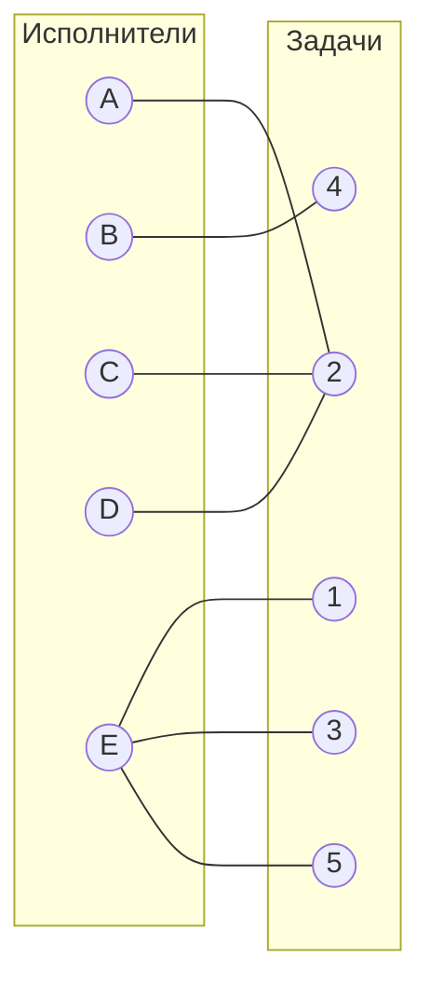
Произвольно выбираем начальное паросочетание:
[B4], [D2], [E5]

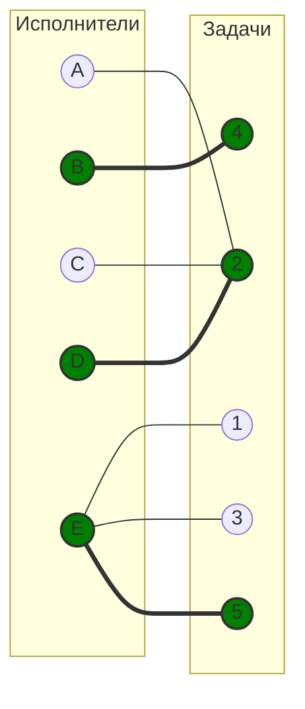

Непокрытые вершины: A, C и 1, 3

## 3. Построение чередующегося дерева из вершины A
Выбираем одну свободную вершину из левой доли и строим чередующееся дерево относительно текущего паросочетания:

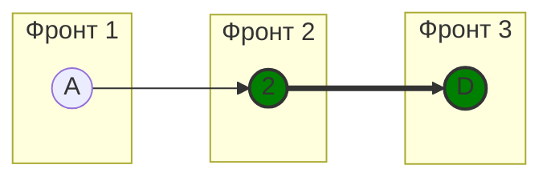

В построенном дереве нет чередующихся цепей, т.е. мы попали в закрашенную вершину, из которой нет других ребёр.

## 4. Определение множеств для повторной редукции
Выполняем диагональную редукцию матрицы. Используем (A, D) и (2). Переставляем столбец 2 перед столбцом 1, переставляем строку D после строки A, п. Перестановки не влияют на граф, мы так делаем, чтобы было проще отделить вершины.

Исходная матрица:

|       | **1** | **2** | **3** | **4** | **5** |
|-------|:-----:|:-----:|:-----:|:-----:|:-----:|
| **A** |   2   |   0   |   7   |   1   |   9   |
| **B** |   3   |   9   |   4   |   0   |   4   |
| **C** |   2   |   0   |  13   |  15   |   5   |
| **D** |   3   |   0   |   4   |   7   |  15   |
| **E** |   0   |   7   |   0   |   5   |   0   |

Переставляем столбец 2 перед столбцом 1:

|       | **2** | **1** | **3** | **4** | **5** |
|-------|:-----:|:-----:|:-----:|:-----:|:-----:|
| **A** |   0   |   2   |   7   |   1   |   9   |
| **B** |   9   |   3   |   4   |   0   |   4   |
| **C** |   0   |   2   |  13   |  15   |   5   |
| **D** |   0   |   3   |   4   |   7   |  15   |
| **E** |   7   |   0   |   0   |   5   |   0   |

Переставляем строку D после строки A:

|       | **2** | **1** | **3** | **4** | **5** |
|-------|:-----:|:-----:|:-----:|:-----:|:-----:|
| **A** |   0   |   2   |   7   |   1   |   9   |
| **D** |   0   |   3   |   4   |   7   |  15   |
| **B** |   9   |   3   |   4   |   0   |   4   |
| **C** |   0   |   2   |  13   |  15   |   5   |
| **E** |   7   |   0   |   0   |   5   |   0   |

Вычитаем 1 из строк A и D и прибавляем 1 к строке 2

|       | **2** | **1** | **3** | **4** | **5** | **Δ** |
|-------|:-----:|:-----:|:-----:|:-----:|:-----:|:-----:|
| **A** |   0   |   2   |   7   |   1   |   9   |  **-1**   |
| **D** |   0   |   3   |   4   |   7   |  15   |  **-1**   |
| **B** |   9   |   3   |   4   |   0   |   4   |       |
| **C** |   0   |   2   |  13   |  15   |   5   |       |
| **E** |   7   |   0   |   0   |   5   |   0   |       |
| **Δ** |   **+1**    |    |       |       |       |     |

Результат:

|       | **2** | **1** | **3** | **4** | **5** |
|-------|:-----:|:-----:|:-----:|:-----:|:-----:|
| **A** |   0   |   1   |   6   |   0   |   8   |
| **D** |   0   |   2   |   3   |   6   |  14   |
| **B** |   10   |   3   |   4   |   0   |   4   |
| **C** |   1   |   2   |  13   |  15   |   5   |
| **E** |   8   |   0   |   0   |   5   |   0   |

В ячейке A4 появился новый ноль, но в ячейке С2 вместо 0 появилась 1. Вычтем 1 из строки C:

|       | **2** | **1** | **3** | **4** | **5** |
|-------|:-----:|:-----:|:-----:|:-----:|:-----:|
| **A** |   0   |   1   |   6   |   0   |   8   |
| **D** |   0   |   2   |   3   |   6   |  14   |
| **B** |   10   |   3   |   4   |   0   |   4   |
| **C** |   0   |   1   |  12   |  14   |   4   |
| **E** |   8   |   0   |   0   |   5   |   0   |

## 5. Обновлённый двудольный граф
Построим новый граф, т.к. появились новые рёбра (нули). Добавляем новое ребро A4 в граф.

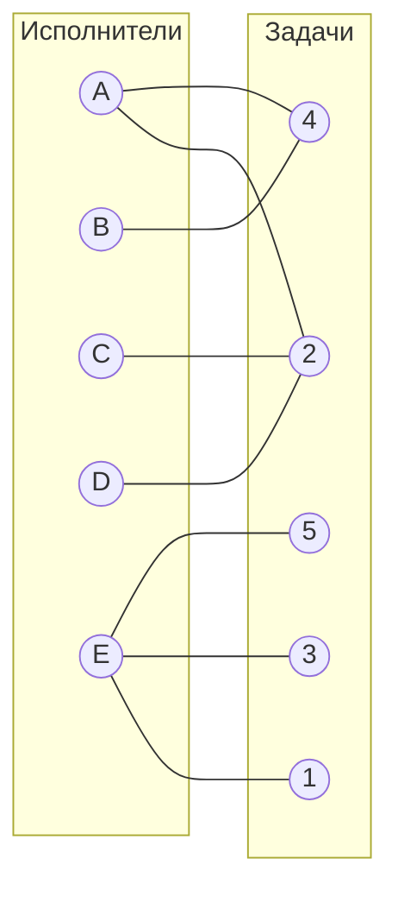
Текущее паросочетание: [B4], [D2], [E5]. Мы его не меняем!

## 6. Построение чередующегося дерева
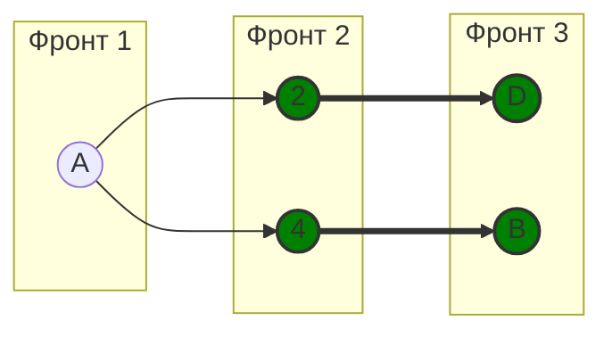

Нет чередующейся цепи. Обе ветви дерева заканчиваются в покрытых вершинах -> совершенное паросочетание не найдено.

## 7. Применяем диагональную редукцию
Берём вершины (A, D, B) и (2, 4).

Исходная матрица:

|       | **2** | **1** | **3** | **4** | **5** |
|-------|:-----:|:-----:|:-----:|:-----:|:-----:|
| **A** |   0   |   1   |   6   |   0   |   8   |
| **D** |   0   |   2   |   3   |   6   |  14   |
| **B** |   10   |   3   |   4   |   0   |   4   |
| **C** |   0   |   1   |  12   |  14   |   4   |
| **E** |   8   |   0   |   0   |   5   |   0   |

 Переставляем столбец 4 после столбца 2:

|       | **2** | **4** | **1** | **3** | **5** |
|-------|:-----:|:-----:|:-----:|:-----:|:-----:|
| **A** |   0   |   0   |   1   |   6   |   8   |
| **D** |   0   |   6   |   2   |   3   |  14   |
| **B** |   10   |   0   |   3   |   4   |   4   |
| **C** |   0   |  14   |   1   |  12   |   4   |
| **E** |   8   |   5   |   0   |   0   |   0   |

Вычитаем 1 из строк A, D, B и прибавляем 1 к столбцам 2, 4

|       | **2** | **4** | **1** | **3** | **5** | **Δ** |
|-------|:-----:|:-----:|:-----:|:-----:|:-----:|:-----:|
| **A** |   0   |   0   |   1   |   6   |   8   |  **-1**   |
| **D** |   0   |   6   |   2   |   3   |  14   |  **-1**   |
| **B** |   10   |   0   |   3   |   4   |   4   |  **-1**   |
| **C** |   0   |  14   |   1   |  12   |   4   |       |
| **E** |   8   |   5   |   0   |   0   |   0   |       |
| **Δ** |   **+1**    | **+1**   |       |       |       |     |

Результат:

|       | **2** | **4** | **1** | **3** | **5** |
|-------|:-----:|:-----:|:-----:|:-----:|:-----:|
| **A** |   0   |   0   |   0   |   5   |   7   |
| **D** |   0   |   6   |   1   |   2   |  13   |
| **B** |   10   |   0   |   2   |   3   |   3   |
| **C** |   1   |  15   |   1   |  12   |   4   |
| **E** |   9   |   6   |   0   |   0   |   0   |

В ячейке A1 появился новый ноль, но в ячейке С2 вместо 0 появилась 1. Вычтем 1 из строки C:

|       | **2** | **4** | **1** | **3** | **5** |
|-------|:-----:|:-----:|:-----:|:-----:|:-----:|
| **A** |   0   |   0   |   0   |   5   |   7   |
| **D** |   0   |   6   |   1   |   2   |  13   |
| **B** |   10   |   0   |   2   |   3   |   3   |
| **C** |   0   |  14   |   0   |  11   |   3   |
| **E** |   9   |   6   |   0   |   0   |   0   |

В ячейке C1 появился новый ноль.

## 8. Построим новый граф

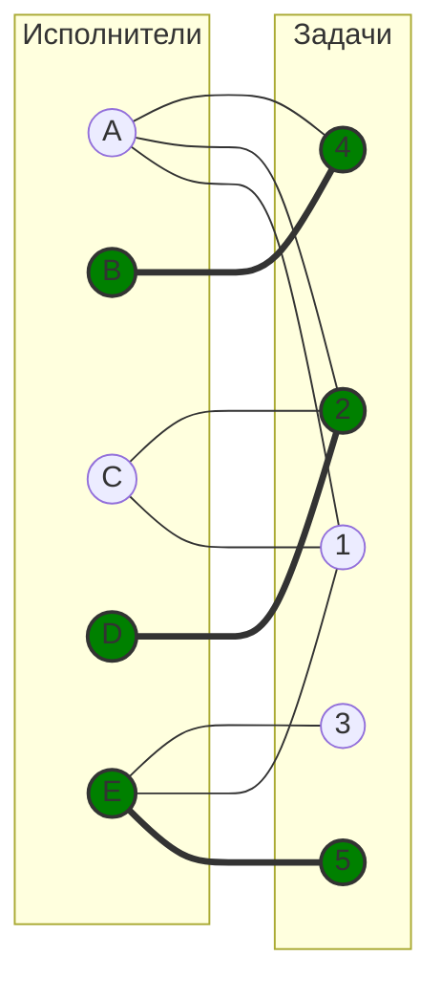

Текущее паросочетание: [B4], [D2], [E5]. Мы его не меняем!

## 9. Строим чередующееся дерево
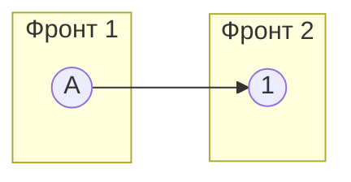

Получаем чередующуюся цепь A - 1 (перекрашиваем)

## 10. Построение нового графа
Строим новый граф из-за нового набора в паросочетании.

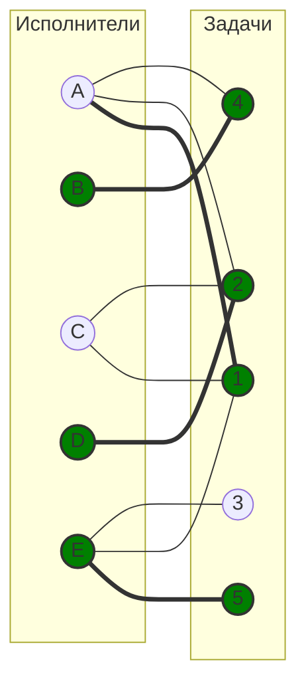

Текущее паросочетание: [A1], [B4], [D2], [E5].

## 11. Строим чередующееся дерево

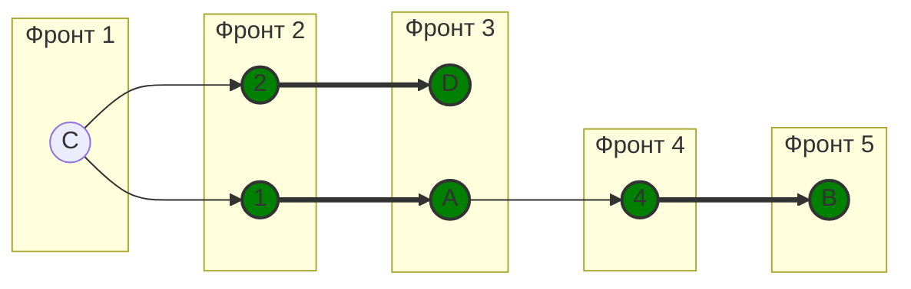

В нём нет чередующихся цепей.

## 12. Применяем диагональную редукцию
Берём вершины (A, B, C, D) и (1, 2, 4)

Исходная матрица:

|       | **2** | **4** | **1** | **3** | **5** |
|-------|:-----:|:-----:|:-----:|:-----:|:-----:|
| **A** |   0   |   0   |   0   |   5   |   7   |
| **D** |   0   |   6   |   1   |   2   |  13   |
| **B** |   10   |   0   |   2   |   3   |   3   |
| **C** |   0   |  14   |   0   |  11   |   3   |
| **E** |   9   |   6   |   0   |   0   |   0   |

Ставим строку C перед строкой D, после этого ставим строку B перед строкой C:

|       | **2** | **4** | **1** | **3** | **5** |
|-------|:-----:|:-----:|:-----:|:-----:|:-----:|
| **A** |   0   |   0   |   0   |   5   |   7   |
| **B** |   10   |   0   |   2   |   3   |   3   |
| **C** |   0   |  14   |   0   |  11   |   3   |
| **D** |   0   |   6   |   1   |   2   |  13   |
| **E** |   9   |   6   |   0   |   0   |   0   |

Ставим столбец 1 перед столбцом 2:

|       | **1** | **2** | **4** | **3** | **5** |
|-------|:-----:|:-----:|:-----:|:-----:|:-----:|
| **A** |   0   |   0   |   0   |   5   |   7   |
| **B** |   2   |   10   |   0   |   3   |   3   |
| **C** |   0   |   0   |  14   |  11   |   3   |
| **D** |   1   |   0   |   6   |   2   |  13   |
| **E** |   0   |   9   |   6   |   0   |   0   |

Вычитаем 2 из строк A, B, C, D и прибавляем 2 к столбцам 1, 2, 4

|       | **1** | **2** | **4** | **3** | **5** | **Δ** |
|-------|:-----:|:-----:|:-----:|:-----:|:-----:|:-----:|
| **A** |   0   |   0   |   0   |   5   |   7   |  **-2**   |
| **B** |   2   |   10   |   0   |   3   |   3   |  **-2**   |
| **C** |   0   |   0   |  14   |  11   |   3   |  **-2**      |
| **D** |   1   |   0   |   6   |   2   |  13   |   **-2**     |
| **E** |   0   |   9   |   6   |   0   |   0   |       |
| **Δ** | **+2** | **+2**   | **+2**      |       |       |     |

Результат:

|       | **1** | **2** | **4** | **3** | **5** |
|-------|:-----:|:-----:|:-----:|:-----:|:-----:|
| **A** |   0   |   0   |   0   |   3   |   5   |
| **B** |   2   |   10   |   0   |   1   |   1   |
| **C** |   0   |   0   |  14   |  9   |   1   |
| **D** |   1   |   0   |   6   |   0   |  11   |
| **E** |   2   |   11   |   8   |   0   |   0   |

## 13. Построим новый граф
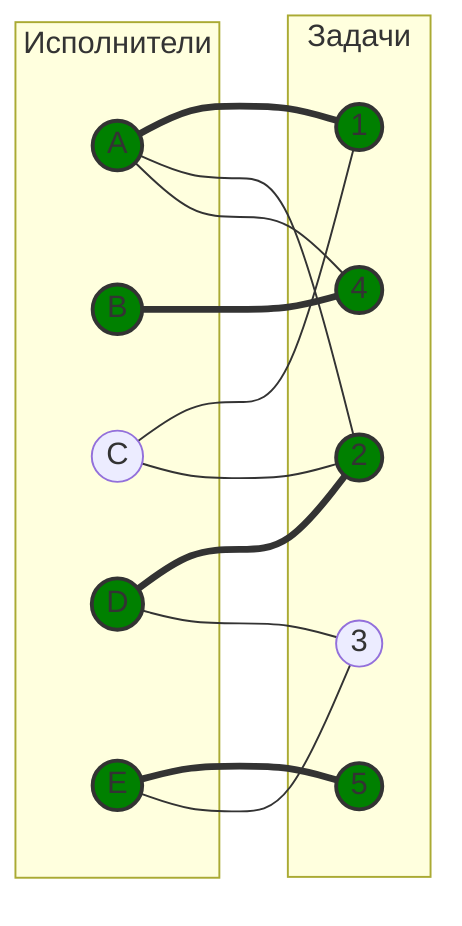

Текущее паросочетание: [A1], [B4], [D2], [E5].

## 14. Строим чередующееся дерево

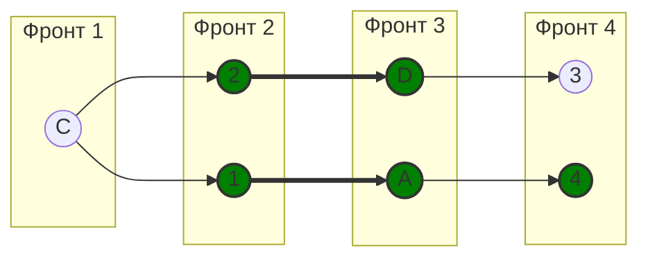

Чередующаяся цепь: C - 2 = D - 3
Перекрашиваем: C = 2 - D = 3

## 15. Строим новый граф
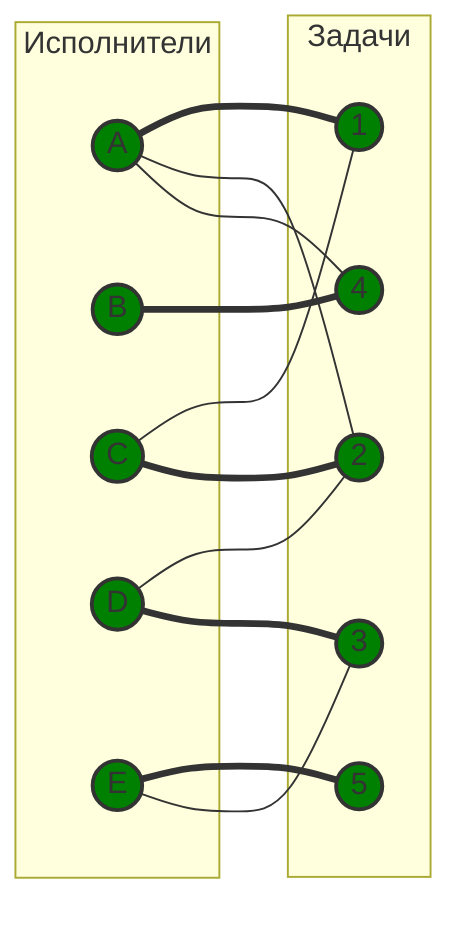
Текущее паросочетание: [A1], [B4], [C2], [D3], [E5].

## 16. Строим чередующееся дерево
Строим чередующееся дерево, но нет свободных вершин -> дерево построить нельзя -> задача решена

| Назначение | Значение в исходной матрице |
|:----------:|:---------------------------:|
| **A -> 1**  |              15              |
| **B -> 4**  |             10              |
| **C -> 2**  |             5              |
| **D -> 3**  |              9              |
| **E -> 5**  |             11              |

15 + 10 + 5 + 9 + 11 = 50

## Ответ
Минимальное назначение: **[A1], [B4], [C2], [D3], [E5]**
Минимальная сумма затрат: **50**