# brigada: Задача о назначении. Задание №8 Вариант 9
Состав команды:
1. Ваулин Никита
2. Громов Иван
3. Кузнецов Егор

## Постановка задачи
Для выполнения задания необходимо: 
1. Решить задачу о назначении с использованием Венгерского алгоритма **строго** так, как было разобрано на занятиях.
2. Оформить решение задачи по шагам с подробными комментариями, таблицами и диаграммами.
3. В ответе указать минимальную сумму затрат на выполнение всех заданий.
4. В ответе вывести найденные назначения

### Вариант 9:
#### Матрица затрат:
|       | **1** | **2** | **3** | **4** | **5** |
|-------|:-----:|:-----:|:-----:|:-----:|:-----:|
| **A** |  11   |  18   |  18   |  10   |  10   |
| **B** |   9   |   7   |  16   |   9   |  12   |
| **C** |  14   |   5   |  10   |  14   |   7   |
| **D** |  11   |   6   |   5   |   8   |   9   |
| **E** |  10   |   5   |  10   |  14   |  19   |

## Решение задачи
Решим задачу с помощью Венгерского алгоритма.

Венгерский алгоритм (эффективный алгоритм для решения задачи о назначениях)

- Шаг 1.  Выполнить редукцию матрицы по строкам и столбцам. 
- Шаг 2. Построить двудольный граф (в котором количество ребер равно кол-ву нулей в матрице), в построенном графе выбрать какое-то начальное паросочетание. 
- Шаг 3. (Циклический) Построить чередующееся дерево относительно текущего паросочетания, используя волновой метод.
    - Дерево не удалось построить (так как первый фронт, оказался пустым) => задача решена (текущее паросочетание является искомым).
    - Дерево удалось построить (в нем есть чередующаяся цепь), тогда перекрашиваем цепь, корректируем текущее паросочетание и возвращаемся к началу Шага 3.
    - Дерево удалось построить (в нем нет чередующейся цепи), тогда выполняем диагональную редукцию, а потом редукции по строками столбца, если необходимо. В результате редукций корректируем граф, возвращаемя к началу Шага 3.

### Шаг 1. Выполним редукцию матрицы
По строкам:
|       | **1** | **2** | **3** | **4** | **5** |
|-------|:-----:|:-----:|:-----:|:-----:|:-----:|
| **A** |   1   |   8   |   8   |   0   |   0   |
| **B** |   2   |   0   |   9   |   2   |   5   |
| **C** |   9   |   0   |   5   |   9   |   2   |
| **D** |   6   |   1   |   0   |   3   |   4   |
| **E** |   5   |   0   |   5   |   9   |  14   |

По столбцам:
|       | **1** | **2** | **3** | **4** | **5** |
|-------|:-----:|:-----:|:-----:|:-----:|:-----:|
| **A** |   0   |   8   |   8   |   0   |   0   |
| **B** |   1   |   0   |   9   |   2   |   5   |
| **C** |   8   |   0   |   5   |   9   |   2   |
| **D** |   5   |   1   |   0   |   3   |   4   |
| **E** |   4   |   0   |   5   |   9   |  14   |

### Шаг 2. Строим двудольный граф на основе полученной матрицы

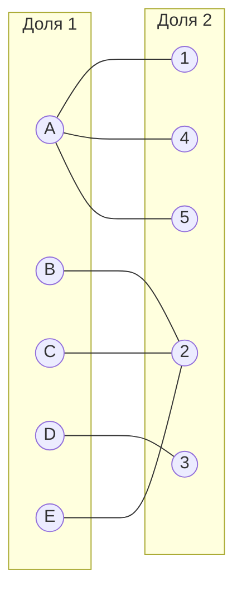

Выбираем начальное паросочетание: **[A1, B2, D3]**
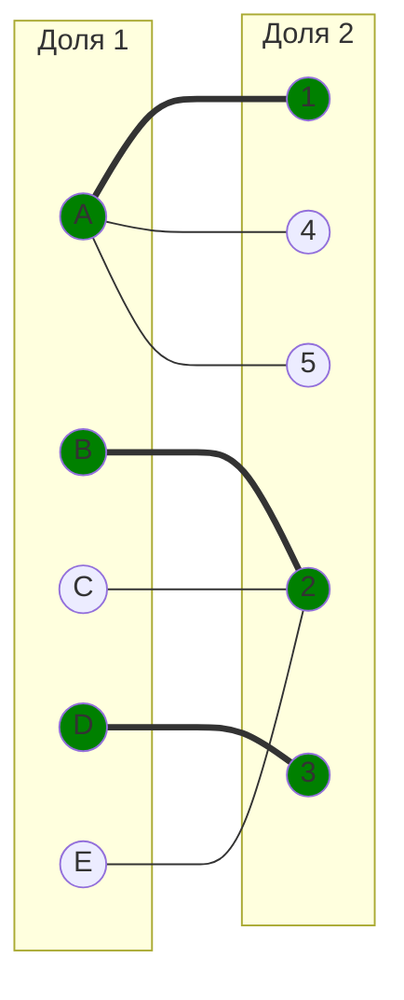

### Шаг 3. Цикл

#### Итерация 1
С помощью *волнового метода* построим чередующееся дерево на основе полученного графа. В качестве вершины дерева выберем любую непокрытую вершину, например "**C**"

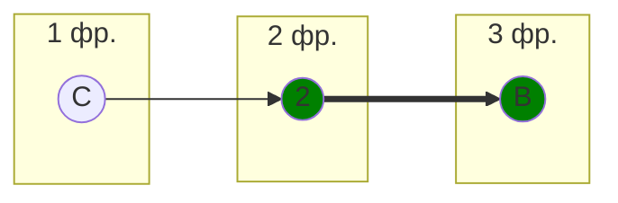
Дерево удалось построить, но чередующейся цепи нет. Следовательно, выполняем диагональную редукцию.

##### Диагональная редукция
Сформируем два множества:

**X: (C, B)**   
**Y: (2)**

Найдем минимальный элемент, входящий в множество X, но не входящий в Y.

*min = 1*

Вычтем из строк множества  Х минимальное число и прибавим его к столбцу множества Y (для востанновления 0).

|       |       |  *+1* |       |       |       |       |
|-------|:-----:|:-----:|:-----:|:-----:|:-----:|:-----:|
|       | **1** | **2** | **3** | **4** | **5** |       |
| **A** |   0   |   8   |   8   |   0   |   0   |       |
| **B** |   1   |   0   |   9   |   2   |   5   |  *-1* |
| **C** |   8   |   0   |   5   |   9   |   2   |  *-1* |
| **D** |   5   |   1   |   0   |   3   |   4   |       |
| **E** |   4   |   0   |   5   |   9   |  14   |       |

Получили:

|       | **1** | **2** | **3** | **4** | **5** |
|-------|:-----:|:-----:|:-----:|:-----:|:-----:|
| **A** |   0   |   9   |   8   |   0   |   0   |
| **B** |   0   |   0   |   8   |   1   |   4   |
| **C** |   7   |   0   |   4   |   8   |   1   |
| **D** |   5   |   2   |   0   |   3   |   4   |
| **E** |   4   |   1   |   5   |   9   |  14   |

Заметим, что в результате исчезло ребро **Е2**, проведем редукцию по строке *Е*, чтобы восстановить 0.
|       | **1** | **2** | **3** | **4** | **5** |
|-------|:-----:|:-----:|:-----:|:-----:|:-----:|
| **A** |   0   |   9   |   8   |   0   |   0   |
| **B** |   0   |   0   |   8   |   1   |   4   |
| **C** |   7   |   0   |   4   |   8   |   1   |
| **D** |   5   |   2   |   0   |   3   |   4   |
| **E** |   3   |   0   |   4   |   8   |  13   |

Скорректируем двудольный граф:
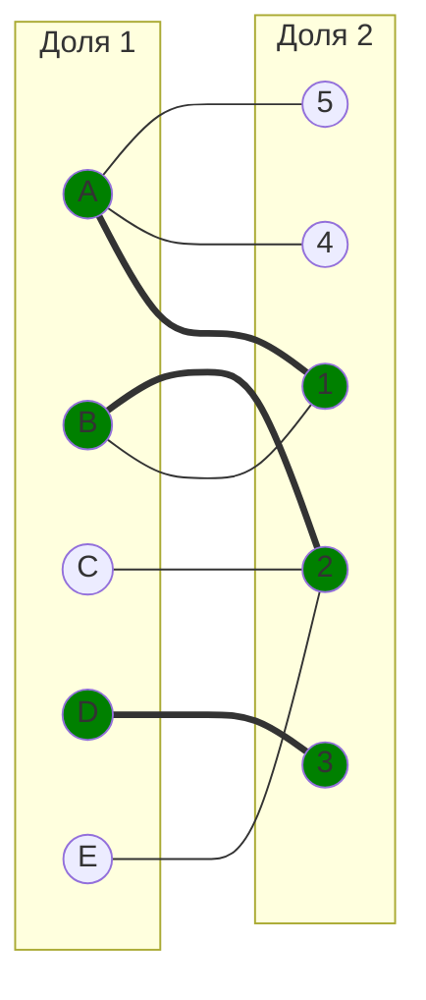
  Вернемся к началу Шага 3.

#### Итерация 2
Построим чередующееся дерево на основе нового графа. В качестве вершины дерева выберем непокрытую вершину "**C**"

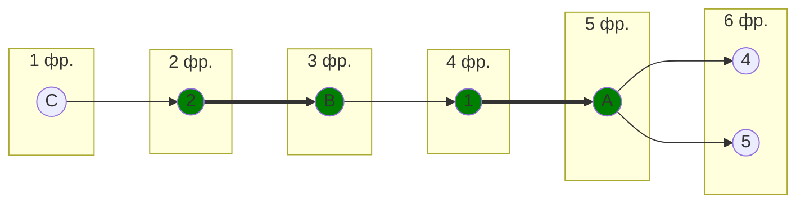

Дерево удалось построить, в нем найдена чередующаяся цепь **C--2==B--1==A--4**

Перекрашиваем **C==2--B==1--A==4**

Получаем новое паросочетание: **[A4, B1, C2, D3]**

Скорректируем двудольный граф:
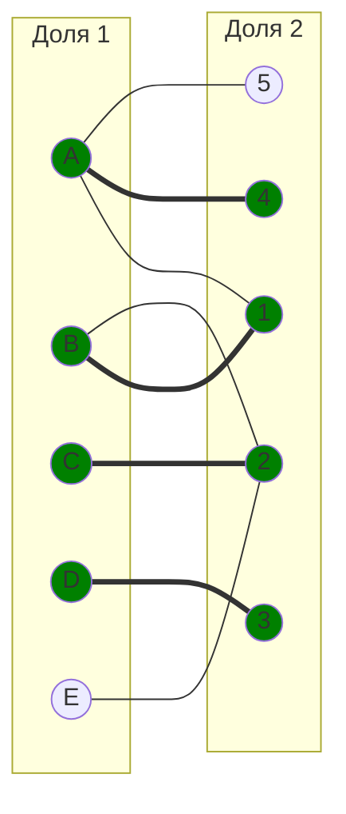

#### Итерация 3
Построим чередующееся дерево на основе нового графа. В качестве вершины дерева выбираем оставшуюся непокрытую вершину "**E**".

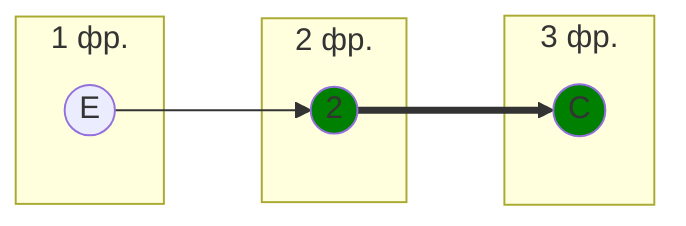
Дерево удалось построить, но чередующейся цепи нет. Следовательно, выполняем диагональную редукцию.

##### Диагональная редукция
Сформируем два множества:

**X: (E, C)**   
**Y: (2)**

Найдем минимальный элемент, входящий в множество X, но не входящий в Y.

*min = 1*

Вычтем из строк множества  Х минимальное число и прибавим его к столбцу множества Y (для востанновления 0).

|       |       |  *+1* |       |       |       |       |
|-------|:-----:|:-----:|:-----:|:-----:|:-----:|:-----:|
|       | **1** | **2** | **3** | **4** | **5** |       |
| **A** |   0   |   9   |   8   |   0   |   0   |       |
| **B** |   0   |   0   |   8   |   1   |   4   |       |
| **C** |   7   |   0   |   4   |   8   |   1   |  *-1* |
| **D** |   5   |   2   |   0   |   3   |   4   |       |
| **E** |   3   |   0   |   4   |   8   |  13   |  *-1* |

Получили:
|       | **1** | **2** | **3** | **4** | **5** |
|-------|:-----:|:-----:|:-----:|:-----:|:-----:|
| **A** |   0   |  10   |   8   |   0   |   0   |
| **B** |   0   |   1   |   8   |   1   |   4   |
| **C** |   6   |   0   |   3   |   7   |   0   |
| **D** |   5   |   3   |   0   |   3   |   4   |
| **E** |   2   |   0   |   3   |   7   |  12   |

Скорректируем двудольный граф:
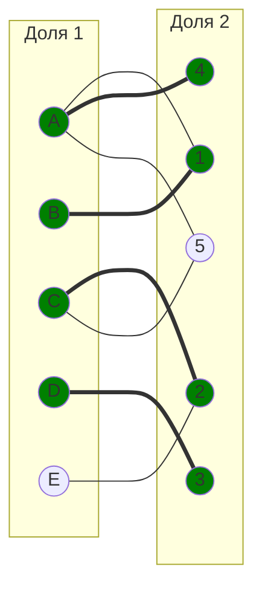

#### Итерация 4
Построим чередующееся дерево на основе нового графа. В качестве вершины дерева выбираем оставшуюся непокрытую вершину "**E**".

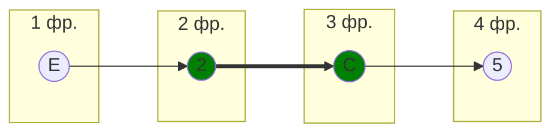

Найдена чередующаяся цепь: **E--2==C--5**

Перекрашиваем: **E==2--C==5**

Получаем новое паросочетание: **[E2, C5, B1, A4, D3]**

Корректируем граф:
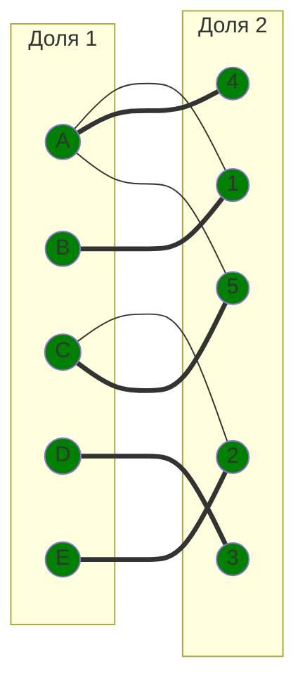

#### Итерация 5
Новое чередующееся дерево построить нельзя, так как все вершины покрыты. Следовательно, задача решена, а алгоритм завершает работу. Текущее паросочетание является искомым.

### Шаг 4. Вычисление суммы затрат
В результате было получено следующее назначение:

**A - 4** (10)

**B - 1** (9)

**C - 5** (7)

**D - 3** (5)

**E - 2** (5)

Вычислим минимальную сумму затрат на выполнение всех работ:

$$
10 + 9 + 7 + 5 + 5 = 36
$$

## Ответ
Минимальная сумма затрат = **36**

Такую сумму можно достичь при следующем назначении:

**A-4 B-1 C-5 D-3 E-2**

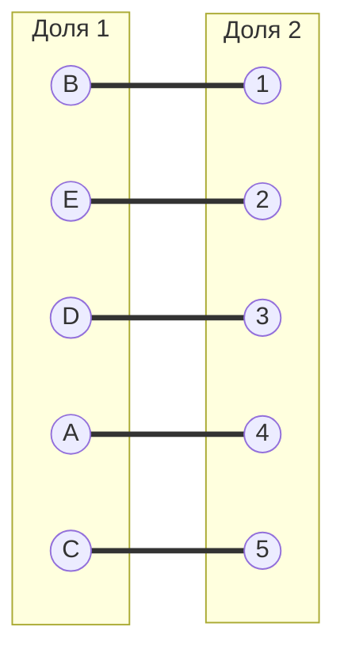