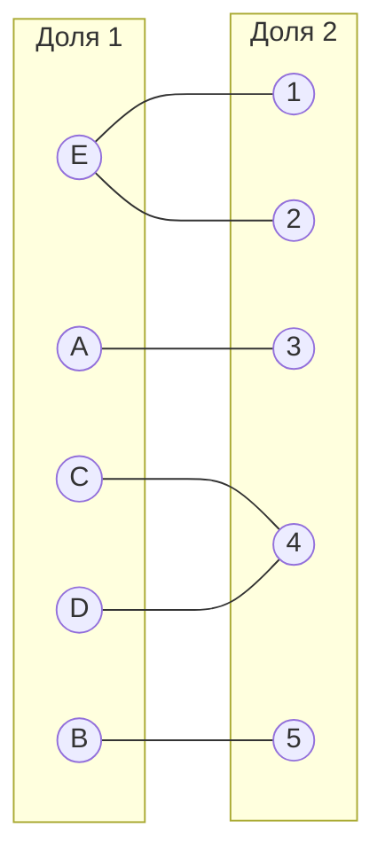
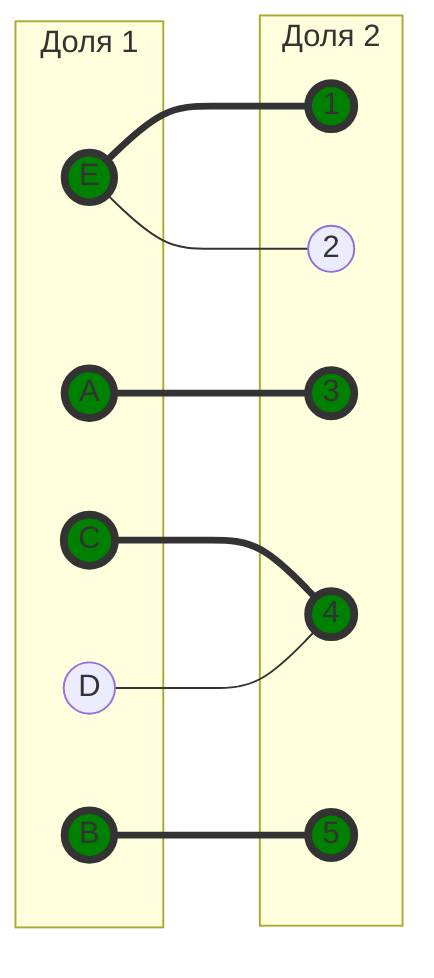
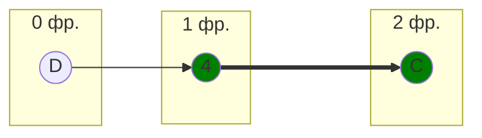
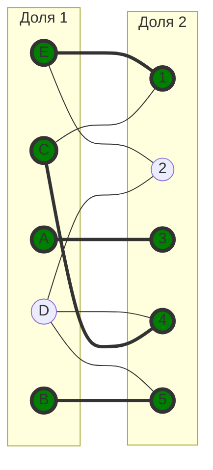
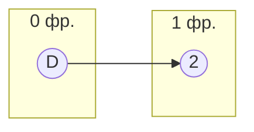
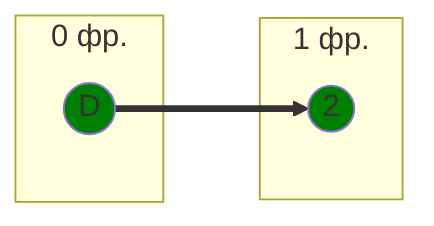
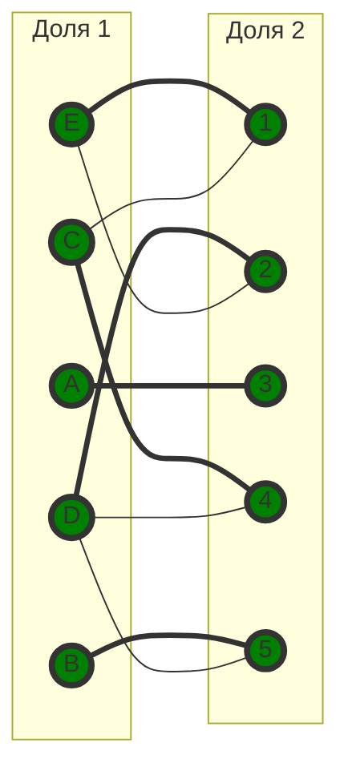

## Задание №8

## Вариант №8. Задача о назначении. Венгерский алгоритм

Для выполнения задания необходимо:

1. Решить задачу о назначении с использованием Венгерского алгоритма **строго** так, как было разобрано на занятиях.
2. Оформить решение задачи по шагам с подробными комментариями, таблицами и диаграммами.
3. В ответе указать минимальную сумму затрат на выполнение всех заданий.
4. В ответе вывести найденные назначения.

---

## Решение

Дана матрица затрат для задач A, B, C, D, E и исполнителей 1, 2, 3, 4, 5:

|       | **1** | **2** | **3** | **4** | **5** |
| ----- | :---: | :---: | :---: | :---: | :---: |
| **A** |   18  |   20  |   6   |   9   |   7   |
| **B** |   16  |   15  |   18  |   11  |   9   |
| **C** |   11  |   20  |   20  |   8   |   12  |
| **D** |   17  |   9   |   13  |   5   |   8   |
| **E** |   6   |   7   |   16  |   20  |   9   |

---

### 1. Редукция по строкам

Вычтем из каждой строки минимальный элемент.

|       | **1** | **2** | **3** | **4** | **5** | **Min** |
| ----- | :---: | :---: | :---: | :---: | :---: | :-----: |
| **A** |   12  |   14  |   0   |   3   |   1   |    -6   |
| **B** |   7   |   6   |   9   |   2   |   0   |    -9   |
| **C** |   3   |   12  |   12  |   0   |   4   |    -8   |
| **D** |   12  |   4   |   8   |   0   |   3   |    -5   |
| **E** |   0   |   1   |   10  |   14  |   3   |    -6   |

После чего вычтем из каждого столбца минимальное значение, представленное в этом столбце.

Вычтем из каждого столбца минимальный элемент.

|       | **1** | **2** | **3** | **4** | **5** |
| ----- | :---: | :---: | :---: | :---: | :---: |
| **A** |   12  |   13  |   0   |   3   |   1   |
| **B** |   7   |   5   |   9   |   2   |   0   |
| **C** |   3   |   11  |   12  |   0   |   4   |
| **D** |   12  |   3   |   8   |   0   |   3   |
| **E** |   0   |   0   |   10  |   14  |   3   |
|**Min**|   0   |   1   |   0   |   0   |   0   |   

Получим редуцированную матрицу, где нули обозначают наименее затратные варианты назначений.

|       | **1** | **2** | **3** | **4** | **5** |
| ----- | :---: | :---: | :---: | :---: | :---: |
| **A** |   12  |   13  |   0   |   3   |   1   |
| **B** |   7   |   5   |   9   |   2   |   0   |
| **C** |   3   |   11  |   12  |   0   |   4   |
| **D** |   12  |   3   |   8   |   0   |   3   |
| **E** |   0   |   0   |   10  |   14  |   3   |

---

### 2. Построим двудольный граф, вынесем на него те ребра, для которых в редуцированной матрице указаны нули.

Выберем начальное паросочетание:

* A–3
* B–5
* C–4
* E–1

Вершина D остаётся непокрытой.

---

### 3. Попытка построения чередующегося дерева из вершины D

Чередующаяся цепь заканчивается в покрытой вершине. Совершенного паросочетания нет.

---

### 4. Проведем повторную редукцию матрицы затрат.

Во множество X выпишем все покрытые построенным деревом вершины первой доли графа, во множество Y все покрытые построенным деревом вершины из второй доли графа.

Множества:

$$
X = {D, C}
$$

$$
Y = {4}
$$

Необходимо найти минимальный элемент из строк, включенных во множество X и столбцов, не включенных во множество Y. В нашем случае это будут строки D, C и столбцы 1, 2, 3, 5. Минимальный элемент 3, расположен в строке C и столбце 1.

Минимальный элемент равен **3** (ячейка C–1).

Вычтем 3 из строк X и прибавим к столбцу Y.

|       | **1** | **2** | **3** | **4** | **5** |       |
| ----- | :---: | :---: | :---: | :---: | :---: | :---: |
| **A** |   12  |   13  |   0   |   6   |   1   |       |
| **B** |   7   |   5   |   9   |   5   |   0   |       |
| **C** |   0   |   8   |   9   |   0   |   1   |   -3  |
| **D** |   9   |   0   |   5   |   0   |   0   |   -3  |
| **E** |   0   |   0   |   10  |   17  |   3   |       |
|       |       |       |       |   +3  |       |       |

Появились новые нулевые значения в ячейках C-1, D-2, D-5, добавим соответствующие рёбра в двудольный граф.

---

### 5. Попытаемся построить совершенное паросочетание с помощью чередующихся деревьев.

Цепь начинается и заканчивается в непокрытых вершинах.

---

### 6. Перекрашивание чередующейся цепи

Получаем новое паросочетание:

* A–3
* B–5
* C–4
* D-2
* E–1

Паросочетание является совершенным.

---

### 7. Подсчёт стоимости

По исходной матрице:

* A–3 = 6
* B–5 = 9
* C–4 = 8
* D–2 = 9
* E–1 = 6

**Общая стоимость:**
[
6 + 9 + 8 + 9 + 6 = 38
]

---

## Ответ

Минимальная стоимость затрат **38**, при следующих назначениях:

* задача A — исполнитель 3;
* задача B — исполнитель 5;
* задача C — исполнитель 4;
* задача D — исполнитель 2;
* задача E — исполнитель 1.