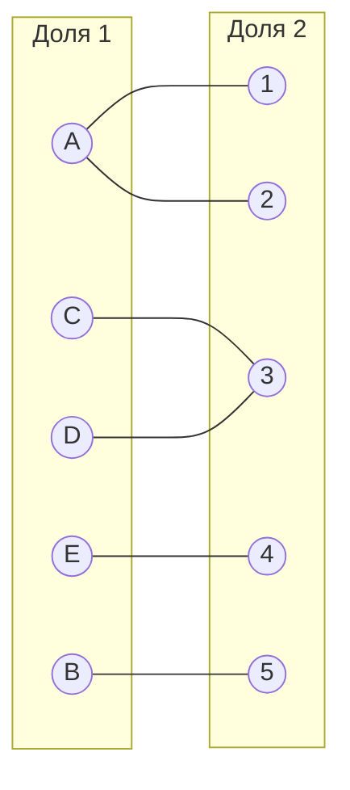
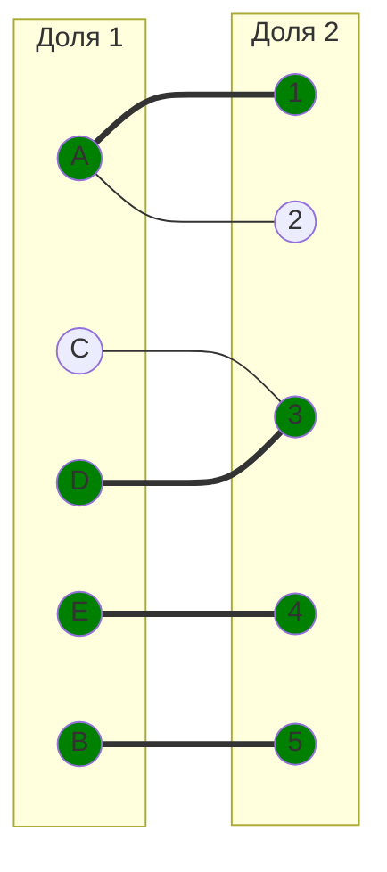
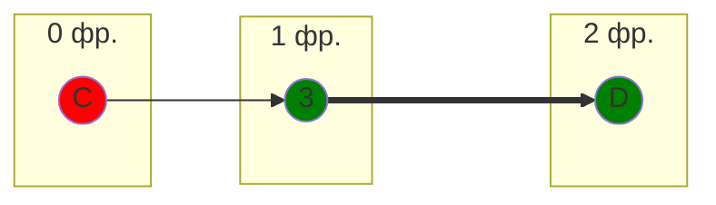
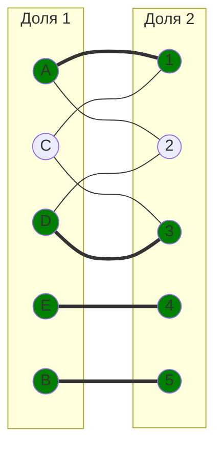
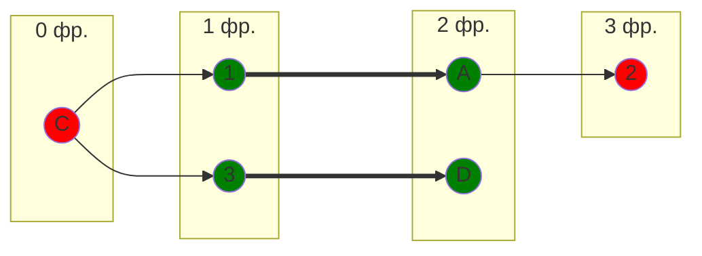
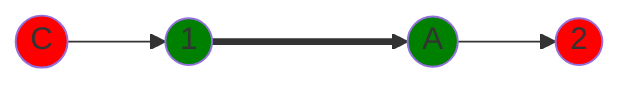
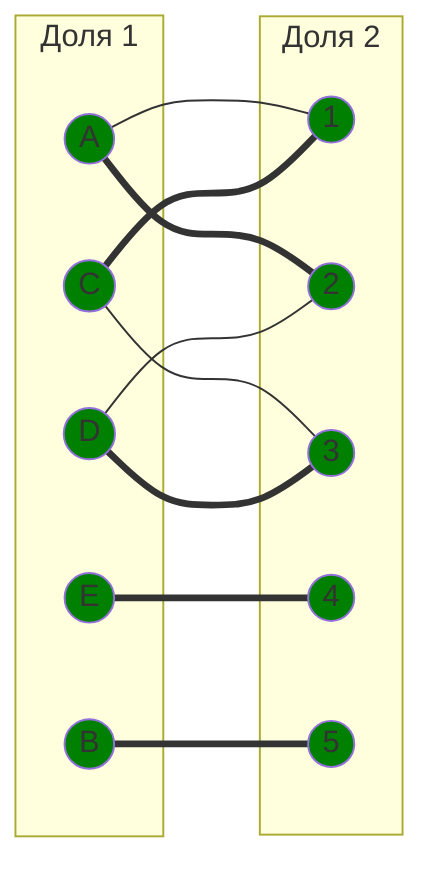

# Задание №8. Вариант 7. Задача о назначении. Венгерский алгоритм

## Решение

### Исходная матрица затрат

Дана матрица затрат для задач A, B, C, D, E и исполнителей 1, 2, 3, 4, 5:

|       | **1** | **2** | **3** | **4** | **5** |
| ----- | :---: | :---: | :---: | :---: | :---: |
| **A** |  13   |  15   |  17   |  17   |  19   |
| **B** |  13   |  19   |   8   |  16   |   5   |
| **C** |   9   |  14   |   7   |  10   |  10   |
| **D** |  18   |  13   |   9   |  12   |  17   |
| **E** |  10   |  20   |   6   |   5   |  10   |

### Шаг 1. Редукция по строкам

Вычтем из каждой строки минимальное значение, представленное в этой строке.

|       | **1** | **2** | **3** | **4** | **5** | **Min** |
| ----- | :---: | :---: | :---: | :---: | :---: | :-----: |
| **A** |   0   |   2   |   4   |   4   |   6   |   13    |
| **B** |   8   |  14   |   3   |  11   |   0   |    5    |
| **C** |   2   |   7   |   0   |   3   |   3   |    7    |
| **D** |   9   |   4   |   0   |   3   |   8   |    9    |
| **E** |   5   |  15   |   1   |   0   |   5   |    5    |

### Шаг 2. Редукция по столбцам

Вычтем из каждого столбца минимальное значение, представленное в этом столбце.

|         | **1** | **2** | **3** | **4** | **5** |
| ------- | :---: | :---: | :---: | :---: | :---: |
| **A**   |   0   |   0   |   4   |   4   |   6   |
| **B**   |   8   |  12   |   3   |  11   |   0   |
| **C**   |   2   |   5   |   0   |   3   |   3   |
| **D**   |   9   |   2   |   0   |   3   |   8   |
| **E**   |   5   |  13   |   1   |   0   |   5   |
| **Min** |   0   |   2   |   0   |   0   |   0   |

Получим редуцированную матрицу, где нули обозначают наименее затратные варианты назначений.

|       | **1** | **2** | **3** | **4** | **5** |
| ----- | :---: | :---: | :---: | :---: | :---: |
| **A** |   0   |   0   |   4   |   4   |   6   |
| **B** |   8   |  12   |   3   |  11   |   0   |
| **C** |   2   |   5   |   0   |   3   |   3   |
| **D** |   9   |   2   |   0   |   3   |   8   |
| **E** |   5   |  13   |   1   |   0   |   5   |

### Шаг 3. Построение двудольного графа и начальное паросочетание

Построим двудольный граф, вынесем на него те ребра, для которых в редуцированной матрице указаны нули.

Выберем произвольное паросочетание $[A, 1]$, $[B, 5]$, $[D, 3]$, $[E, 4]$ и попытаемся построить совершенное паросочетание с помощью чередующихся деревьев.

### Шаг 4. Построение чередующегося дерева

Попытаемся построить дерево из оставшейся непокрытой вершины C.

В построенном дереве нет цепей, чередующихся относительно текущего паросочетания, которые начинаются и заканчиваются в непокрытых вершинах. Таким образом, в указанном графе нет совершенного паросочетания.

### Шаг 5. Повторная редукция матрицы

Во множество X выпишем все покрытые построенным деревом вершины первой доли графа, во множество Y все покрытые построенным деревом вершины из второй доли графа.

$$
X = \{C, D\}
$$

$$
Y = \{3\}
$$

Необходимо найти минимальный элемент из строк, включенных во множество X и столбцов, не включенных во множество Y. В нашем случае это будут строки C, D и столбцы 1, 2, 4, 5. Минимальный элемент 2, расположен в строке D и столбце 2.

Вычтем найденное значение из строк множества X и прибавим к столбцам множества Y:

|       | **1** | **2** | **3** | **4** | **5** |     |
| ----- | :---: | :---: | :---: | :---: | :---: | :-: |
| **A** |   0   |   0   |   6   |   4   |   6   |     |
| **B** |   8   |  12   |   5   |  11   |   0   |     |
| **C** |   0   |   3   |   0   |   1   |   1   | -2  |
| **D** |   7   |   0   |   0   |   1   |   6   | -2  |
| **E** |   5   |  13   |   3   |   0   |   5   |     |
|       |       |       |  +2   |       |       |     |

В ячейках C1 и D2 появились новые нулевые значения, добавим соответствующие ребра в двудольный граф.

### Шаг 6. Построение совершенного паросочетания

Попытаемся построить совершенное паросочетание с помощью чередующихся деревьев.

Построенное дерево содержит чередующуюся, относительно текущего паросочетания, цепь C1 - 1A - A2, цепь начинается и заканчивается в непокрытых вершинах, все ребра в цепи чередуются по вхождению в текущее паросочетание.

Возьмём цепь С1 - 1А - А2 перекрасим её и проверим полученное паросочетание

### Шаг 7. Перекраска цепи

Возьмём цепь C1 - 1A - A2, перекрасим её и проверим полученное паросочетание.

Полученное расписание является совершенным. Выпишем полученные назначения и их стоимости из исходной матрицы:

- задача A, исполнитель 2 (15)
- задача B, исполнитель 5 (5)
- задача C, исполнитель 1 (9)
- задача D, исполнитель 3 (9)
- задача E, исполнитель 4 (5)

Общая стоимость затрат = 15 + 5 + 9 + 9 + 5 = 43.

## Ответ

Минимальная стоимость затрат **43**, при следующих назначениях:

- задача A: исполнитель 2,
- задача B: исполнитель 5,
- задача C: исполнитель 1,
- задача D: исполнитель 3,
- задача E: исполнитель 4.
