# Решение задачи (Вариант 6)

## Исходная матрица
|   | 1  | 2  | 3  | 4  | 5  |
|---|----|----|----|----|----|
| A | 7  | 11 | 9  | 11 | 14 |
| B | 5  | 13 | 16 | 20 | 17 |
| C | 19 | 10 | 9  | 10 | 7  |
| D | 13 | 5  | 5  | 5  | 18 |
| E | 12 | 20 | 20 | 13 | 7  |

---

## Шаг 1: Вычитание минимального элемента строк и столбцов
1. Проведем редукцию матрицы затрат. Вычтем из каждой строки минимальное значение, представленное в этой строке.
2. Вторым шагом необходимо вычесть минимальное значение из каждого столбца, но так как после первого шага каждый столбец содержит 0, матрица не изменится.
Минимальные элементы строк:  
- A: 7 
- B: 5
- C: 7 
- D: 5
- E: 7 

**Результат:**
|   | 1  | 2  | 3  | 4  | 5  |
|---|----|----|----|----|----|
| A | 0  | 4  | 2  | 4  | 7  |
| B | 0  | 8  | 11 | 15 | 12 |
| C | 12 | 3  | 2  | 3  | 0  |
| D | 8  | 0  | 0  | 0  | 13 |
| E | 5  | 13 | 13 | 6  | 0  |

Получим редуцированную матрицу, где нули обозначают наименее затратные варианты назначений.
Получили следующие ребра: А-1, B-1, C-5, D-2, D-3, D-4, E-5
Построим по этим ребрам граф и определим начальное паросочетание - $[A, 1]$, $[D, 4]$, $[E, 5]$

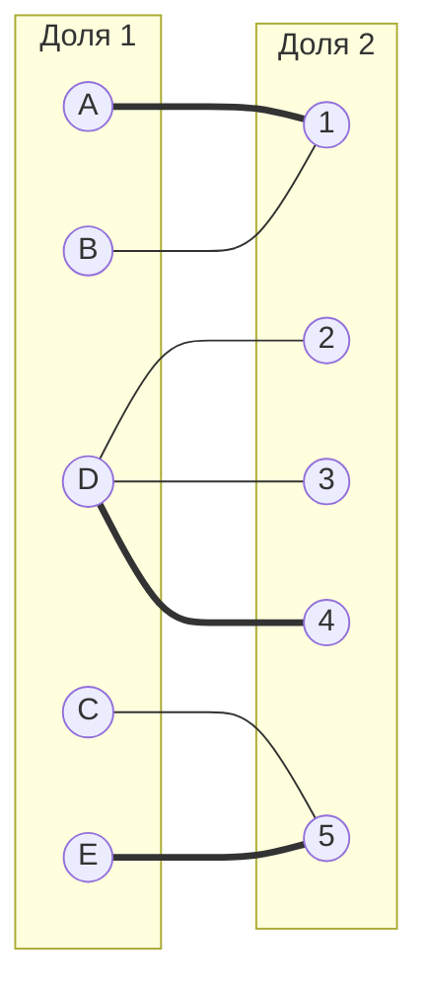
При помощи волнового метода найдем чередующиеся цепи, построив чередующееся дерево
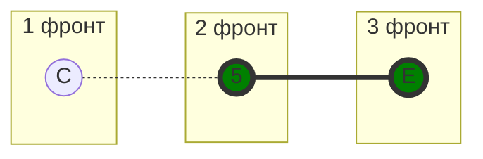
В построенном дереве нет цепей, чередующееся относительно текущего паросочетания, обе ветки закончились в покрытых вершинах, то есть в указанном графе нет совершенного паросочетания.

Во множество X выпишем все **покрытые построенным деревом** вершины первой доли графа, во множество Y все **покрытые построенным деревом** вершины из второй доли графа.

$$
X = \{C, E\}
$$

$$
Y = \{5 \}
$$

Переместим строки C, E наверх и столбец 5 влево

|   | 5  | 1  | 2  | 3  | 4  |
|---|----|----|----|----|----|
| C | 0  | 12 | 3  | 2  | 3  |
| E | 0  | 5  | 13 | 13 | 6  |
| A | 7  | 0  | 4  | 2  | 4  |
| B | 12 | 0  | 8  | 11 | 15 |
| D | 13 | 8  | 0  | 0  | 0  |

Необходимо найти минимальный элемент из строк, включенных во множество X и столбцов, не включенных во множество Y. В нашем случае это будут строки C, E и столбцы 5. Минимальный элемент 2, расположен в строке C и столбце 3. 
Минимум = 2
Вычтем найденное значение из строк множества X и прибавим к столбцам множества Y:

|   | 5  | 1  | 2  | 3  | 4  |
|---|----|----|----|----|----|
| C | 0  | 12 | 3  | 2  | 3  |
| E | 0  | 5  | 13 | 13 | 6  |
| A | 7  | 0  | 4  | 2  | 4  |
| B | 12 | 0  | 8  | 11 | 15 |
| D | 13 | 8  | 0  | 0  | 0  |

Получаем:
|   | 1  | 2  | 3  | 4  | 5  |
|---|----|----|----|----|----|
| A | 0  | 4  | 2  | 4  | 9  |
| B | 0  | 8  | 11 | 15 | 14 |
| C | 10 | 1  | 0  | 1  | 0  |
| D | 8  | 0  | 0  | 0  | 15 |
| E | 3  | 11 | 11 | 4  | 0  |

В ячейке C3 появилось новое нулевое значение, добавим соответствующее ребро в двудольный граф.
Ребро сразу отмечаем как закрашенное (увеличиваем паросочетание), так как вершины C и 3 незакрашенные.
 
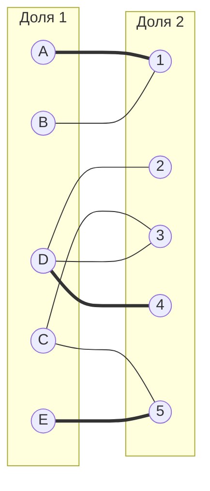
При помощи волнового метода найдем чередующиеся цепи, построив чередующееся дерево

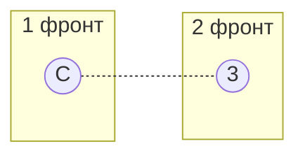
Построенное дерево содержит чередующуюся, относительно текущего паросочетания, цепь C - 3, цепь начинается и заканчивается в непокрытых вершинах, все ребра в цепи чередуются по вхождению в текущее паросочетание. Перекрашиваем ребра в найденной цепи, чтобы увеличить паросочетание.
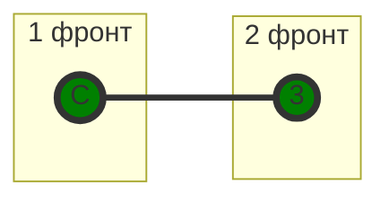
Получили:

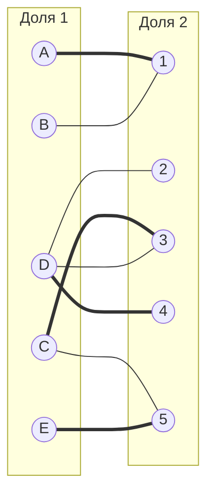
При помощи волнового метода найдем чередующиеся цепи, построив чередующееся дерево

В построенном дереве нет цепей, чередующееся относительно текущего паросочетания, обе ветки закончились в покрытых вершинах, то есть в указанном графе нет совершенного паросочетания.
Во множество X выпишем все **покрытые построенным деревом** вершины первой доли графа, во множество Y все **покрытые построенным деревом** вершины из второй доли графа.

$$
X = \{A, B\}
$$

$$
Y = \{1 \}
$$

Переместим строки A, B наверх и столбец 1 влево

|   | 1  | 2  | 3  | 4  | 5  |
|---|----|----|----|----|----|
| A | 0  | 4  | 2  | 4  | 9  |
| B | 0  | 8  | 11 | 15 | 14 |
| C | 10 | 1  | 0  | 1  | 0  |
| D | 8  | 0  | 0  | 0  | 15 |
| E | 3  | 11 | 11 | 4  | 0  |

Необходимо найти минимальный элемент из строк, включенных во множество X и столбцов, не включенных во множество Y. В нашем случае это будут строки A, B и столбцы 1. Минимальный элемент 2, расположен в строке A и столбце 3. 
Минимум = 2
Вычтем найденное значение из строк множества X и прибавим к столбцам множества Y:

Получаем:
|   | 1  | 2  | 3  | 4  | 5  |
|---|----|----|----|----|----|
| A | 0  | 2  | 0  | 2  | 7  |
| B | 0  | 6  | 9  | 13 | 12 |
| C | 12 | 1  | 0  | 1  | 0  |
| D | 10 | 0  | 0  | 0  | 15 |
| E | 5  | 11 | 11 | 4  | 0  |

В ячейке A3 появилось новое нулевое значение, добавим соответствующее ребро в двудольный граф.
Ребро не закрашиваем так как вершины A и 3 уже закрашенные

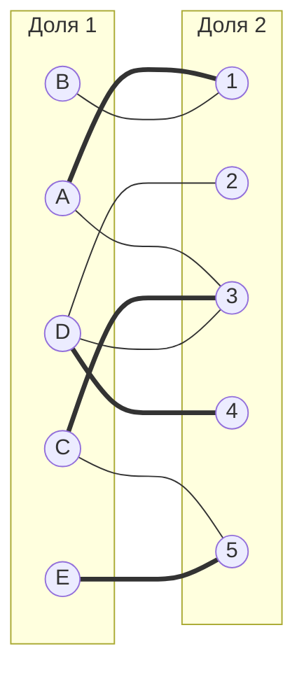
При помощи волнового метода найдем чередующиеся цепи, построив чередующееся дерево

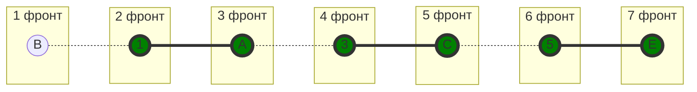

В построенном дереве нет цепей, чередующееся относительно текущего паросочетания, обе ветки закончились в покрытых вершинах, то есть в указанном графе нет совершенного паросочетания.

Во множество X выпишем все **покрытые построенным деревом** вершины первой доли графа, во множество Y все **покрытые построенным деревом** вершины из второй доли графа.

$$
X = \{A, B, C, E\}
$$

$$
Y = \{1, 3, 5\}
$$

Переместим строки A, B, C, E наверх и столбцы 1, 3, 5 влево

|   | 1  | 3  | 5  | 2  | 4  |
|---|----|----|----|----|----|
| A | 0  | 0  | 7  | 2  | 2  |
| B | 0  | 9  | 12 | 6  | 13 |
| C | 12 | 0  | 0  | 1  | 1  |
| E | 5  | 11 | 0  | 11 | 4  |
| D | 10 | 0  | 15 | 0  | 0  |

Необходимо найти минимальный элемент из строк, включенных во множество X и столбцов, не включенных во множество Y. В нашем случае это будут строки A, B и столбцы 1. Минимальный элемент 2, расположен в строке С и столбце 3. 
Минимум = 1
Вычтем найденное значение из строк множества X и прибавим к столбцам множества Y:

Получаем:
|   | 1  | 2  | 3  | 4  | 5  |
|---|----|----|----|----|----|
| A | 0  | 1  | 0  | 1  | 7  |
| B | 0  | 5  | 9  | 12 | 12 |
| C | 12 | 0  | 0  | 0  | 0  |
| D | 11 | 0  | 1  | 0  | 16 |
| E | 5  | 0  | 11 | 0  | 0  |

В ячейках С2 и С4 появились новые нулевые значения, добавим соответствующие ребра в двудольный граф, а также ячейка D3 перестала быть 0, убираем это ребро из графа.
Ребра не закрашиваем так как вершина С уже закрашена

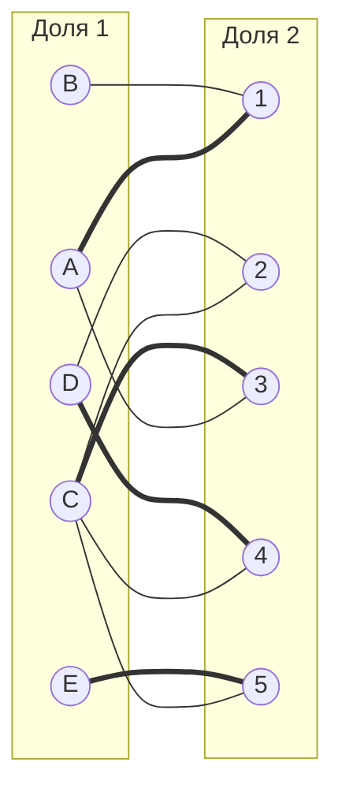
При помощи волнового метода найдем чередующиеся цепи, построив чередующееся дерево

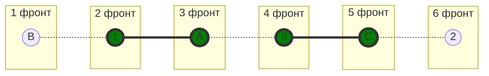
Построенное дерево содержит чередующуюся, относительно текущего паросочетания, цепь B1 - 1A - A3 - 3C - C2, цепь начинается и заканчивается в непокрытых вершинах, все ребра в цепи чередуются по вхождению в текущее паросочетание. Перекрашиваем ребра в найденной цепи, чтобы увеличить паросочетание.
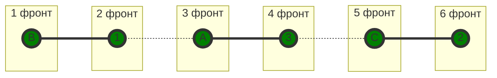
Получаем:
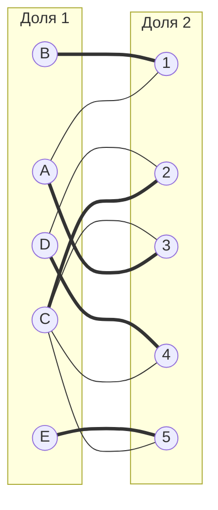
При поиске чередующихся цепей при помощи волнового метода 1 фронт будет пустым, поэтому текущее паросочетание является совершенным, следовательно
полученное расписание является совершенным. Выпишем полученные назначения и их стоимости из исходной матрицы:
- A3 - 9
- B1 - 5
- C2 - 10
- D4 - 5
- E5 - 7

Общая стоимость затрат = 9 + 5 + 10 + 5 + 7 = 36.

## Ответ
Минимальная стоимость затрат 36, при следующих назначениях:
- задача B, исполнитель 1,
- задача C, исполнитель 2,
- задача A, исполнитель 3,
- задача D, исполнитель 4,
- задача E, исполнитель 5.

