# Решение задачи 8. Вариант 3

## Команда: krytie

## Исходная матрица затрат:

|       | **1** | **2** | **3** | **4** | **5** |
|-------|:-----:|:-----:|:-----:|:-----:|:-----:|
| **A** |  12   |  13   |   9   |  19   |  13   |
| **B** |  15   |  12   |  14   |  10   |  12   |
| **C** |  19   |  11   |   7   |  19   |  16   |
| **D** |   6   |  14   |   9   |  19   |  20   |
| **E** |  10   |  14   |  11   |  15   |  18   |

## Шаг 1: Редукция матрицы затрат

Вычтем из каждой строки минимальное значение, представленное в этой строке.

|       | **1** | **2** | **3** | **4** | **5** | **Min** |
|-------|:-----:|:-----:|:-----:|:-----:|:-----:|:-------:|
| **A** |  12   |  13   |   9   |  19   |  13   |    9    |
| **B** |  15   |  12   |  14   |  10   |  12   |   10    |
| **C** |  19   |  11   |   7   |  19   |  16   |    7    |
| **D** |   6   |  14   |   9   |  19   |  20   |    6    |
| **E** |  10   |  14   |  11   |  15   |  18   |   10    |

После вычитания минимума из каждой строки:

|       | **1** | **2** | **3** | **4** | **5** |
|-------|:-----:|:-----:|:-----:|:-----:|:-----:|
| **A** |   3   |   4   |   0   |  10   |   4   |
| **B** |   5   |   2   |   4   |   0   |   2   |
| **C** |  12   |   4   |   0   |  12   |   9   |
| **D** |   0   |   8   |   3   |  13   |  14   |
| **E** |   0   |   4   |   1   |   5   |   8   |

После чего вычтем из каждого столбца минимальное значение, представленное в этом столбце.

|         | **1** | **2** | **3** | **4** | **5** | **Min** |
|---------|:-----:|:-----:|:-----:|:-----:|:-----:|:-------:|
| **A**   |   3   |   4   |   0   |  10   |   4   |    0    |
| **B**   |   5   |   2   |   4   |   0   |   2   |    0    |
| **C**   |  12   |   4   |   0   |  12   |   9   |    0    |
| **D**   |   0   |   8   |   3   |  13   |  14   |    0    |
| **E**   |   0   |   4   |   1   |   5   |   8   |    0    |
| **Min** |   0   |   2   |   0   |   0   |   2   |         |

Получим редуцированную матрицу, где нули обозначают наименее затратные варианты назначений.

|       | **1** | **2** | **3** | **4** | **5** |
|-------|:-----:|:-----:|:-----:|:-----:|:-----:|
| **A** |   3   |   2   |   0   |  10   |   2   |
| **B** |   5   |   0   |   4   |   0   |   0   |
| **C** |  12   |   2   |   0   |  12   |   7   |
| **D** |   0   |   6   |   3   |  13   |  12   |
| **E** |   0   |   2   |   1   |   5   |   6   |

## Шаг 2: Построение двудольного графа и начального паросочетания

Построим двудольный граф, вынесем на него те ребра, для которых в редуцированной матрице указаны нули.

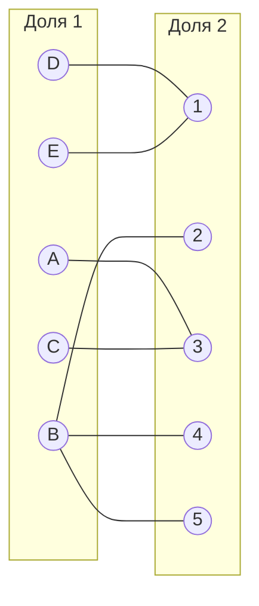

Выберем произвольное паросочетание $[A, 3]$, $[B, 2]$, $[C, 3]$ и попытаемся построить совершенное паросочетание с помощью чередующихся деревьев.

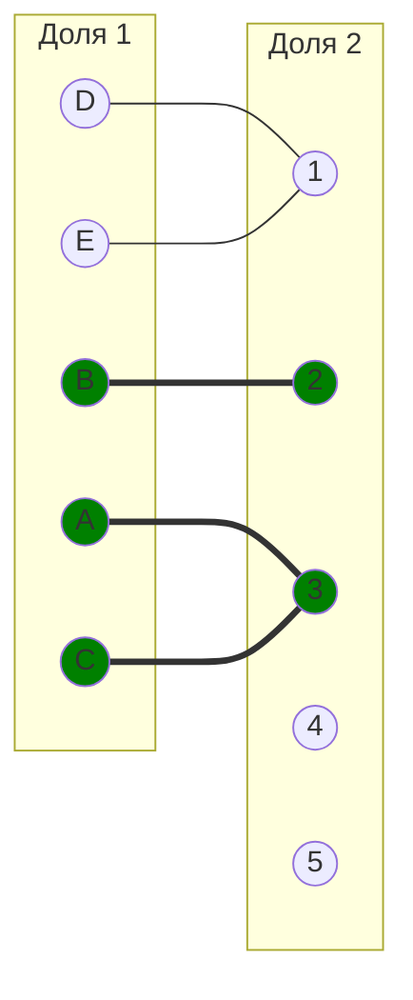

Видим конфликт: A и C оба назначены на исполнителя 3. Выберем другое начальное паросочетание: $[A, 3]$, $[B, 4]$, $[D, 1]$.

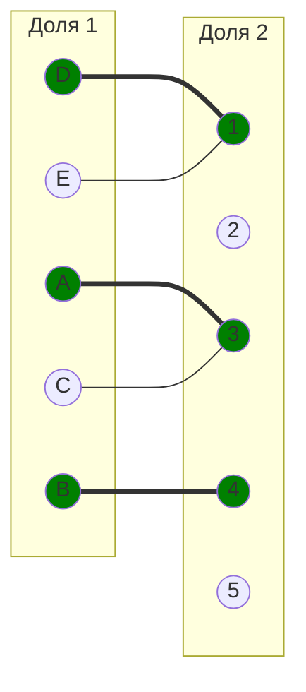

Непокрытые вершины: C и E. Попытаемся построить дерево из оставшейся непокрытой вершины C.

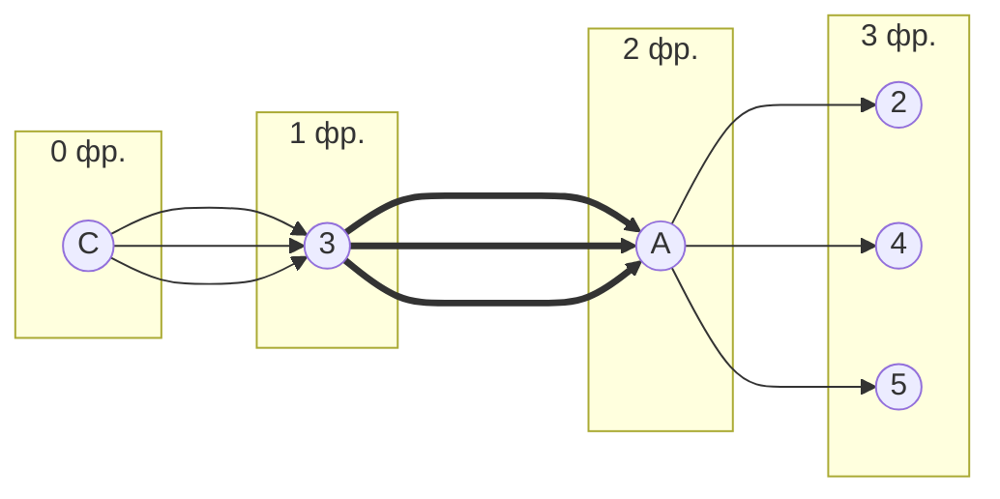

Все ветки дерева заканчиваются в покрытых вершинах (2, 4, 5 покрыты через B). Попытаемся построить дерево из непокрытой вершины E.

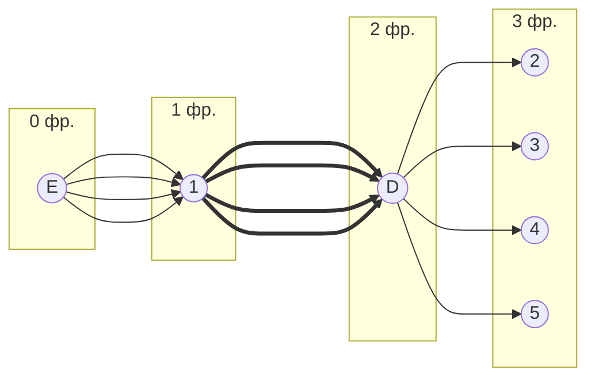

Все ветки дерева заканчиваются в покрытых вершинах. В построенном дереве нет цепей, чередующихся относительно текущего паросочетания, обе ветки закончились в покрытых вершинах, то есть в указанном графе нет совершенного паросочетания.

## Шаг 3: Повторная редукция матрицы затрат

Во множество X выпишем все **покрытые построенным деревом** вершины первой доли графа, во множество Y все **покрытые построенным деревом** вершины из второй доли графа.

Для дерева из C:
- X = {A, C}
- Y = {3}

Для дерева из E:
- X = {D, E}
- Y = {1}

Объединим множества:
$$
X = \{A, C, D, E\}
$$

$$
Y = \{1, 3\}
$$

Необходимо найти минимальный элемент из строк, включенных во множество X и столбцов, не включенных во множество Y. В нашем случае это будут строки A, C, D, E и столбцы 2, 4, 5.

|       | **2** | **4** | **5** |
|-------|:-----:|:-----:|:-----:|
| **A** |   2   |  10   |   2   |
| **C** |   2   |  12   |   7   |
| **D** |   6   |  13   |  12   |
| **E** |   2   |   5   |   6   |

Минимальный элемент 2, расположен в строках A, C, E и столбце 2, а также в строке A и столбце 5. Выберем минимальный элемент 2 (например, в строке A и столбце 2).

Вычтем найденное значение из строк множества X и прибавим к столбцам множества Y:

|       | **1** | **2** | **3** | **4** | **5** |       |
|-------|:-----:|:-----:|:-----:|:-----:|:-----:|:-----:|
| **A** |   3   |   0   |   0   |   8   |   0   |  -2   |
| **B** |   5   |   0   |   4   |   0   |   0   |       |
| **C** |  12   |   0   |   0   |  10   |   5   |  -2   |
| **D** |   0   |   4   |   3   |  11   |  10   |  -2   |
| **E** |   0   |   0   |   1   |   3   |   4   |  -2   |
|       |  +2   |       |  +2   |       |       |       |

Получим:

|       | **1** | **2** | **3** | **4** | **5** |
|-------|:-----:|:-----:|:-----:|:-----:|:-----:|
| **A** |   5   |   0   |   2   |   8   |   0   |
| **B** |   7   |   0   |   6   |   0   |   0   |
| **C** |  14   |   0   |   2   |  10   |   5   |
| **D** |   2   |   4   |   5   |  11   |  10   |
| **E** |   2   |   0   |   3   |   3   |   4   |

В ячейках A2, A5, B2, B4, B5, C2, E2 появились новые нулевые значения, добавим соответствующие ребра в двудольный граф.

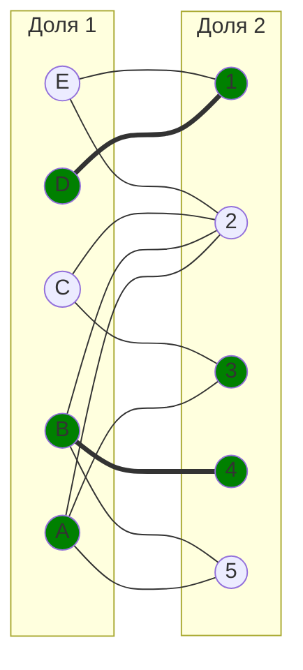

## Шаг 4: Построение совершенного паросочетания с помощью чередующихся деревьев

Попытаемся построить совершенное паросочетание с помощью чередующихся деревьев из непокрытых вершин C и E.
Построим дерево из непокрытой вершины C:

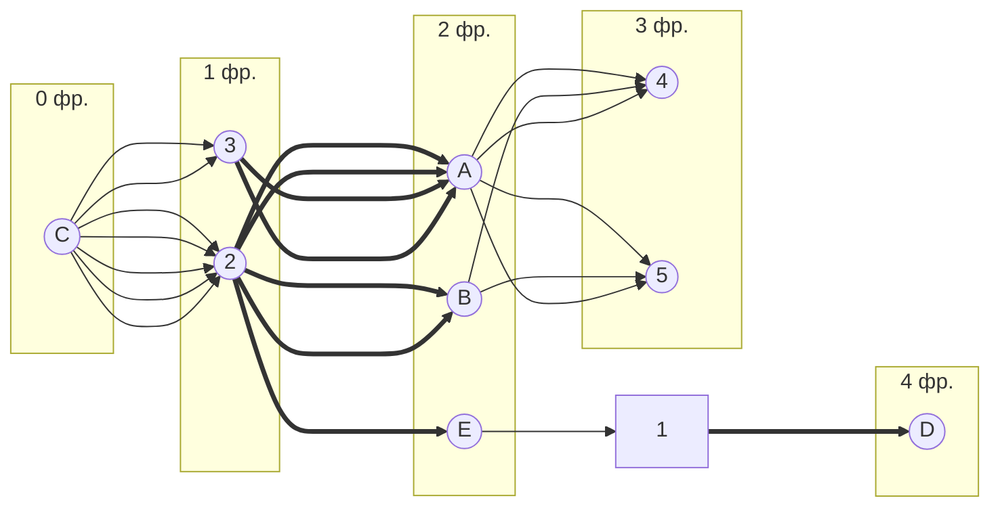

Найдена чередующаяся цепь: C2 - 2E - E1 - 1D. Цепь начинается и заканчивается в непокрытых вершинах (C и D), все ребра в цепи чередуются по вхождению в текущее паросочетание.

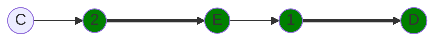

"Перекрасим" найденную цепь и проверим полученное паросочетание.

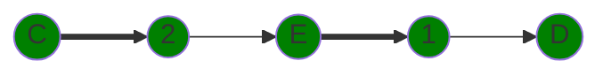

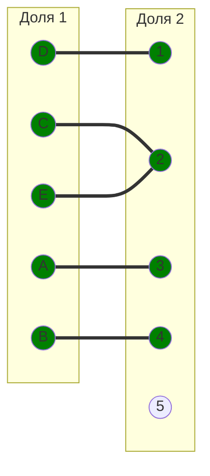

Видим конфликт: C и E оба назначены на исполнителя 2. Нужно выбрать другое паросочетание. Попробуем другой вариант цепи.
Построим дерево из непокрытой вершины C еще раз, но выберем другую цепь:

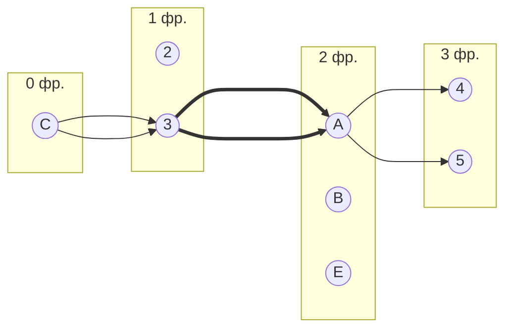

Все ветки заканчиваются в покрытых вершинах. Попробуем построить дерево из непокрытой вершины E:

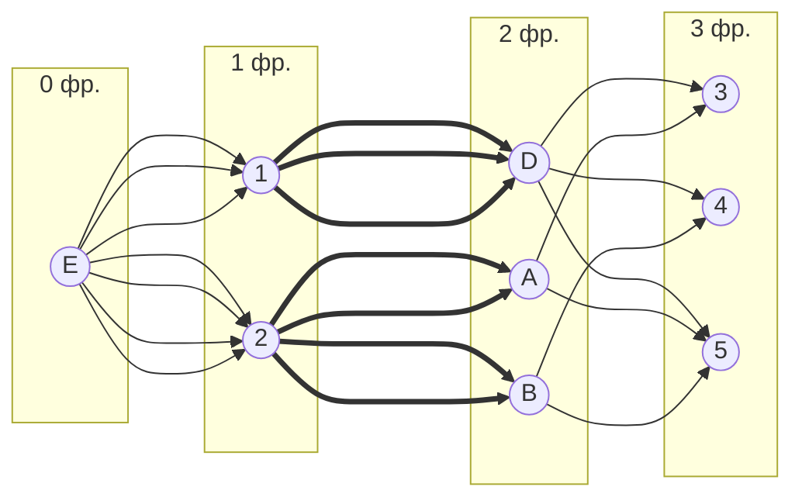

Найдена чередующаяся цепь: E2 - 2B - B4. Но B уже покрыт. Попробуем другую цепь: E2 - 2A - A3. Но A уже покрыт.
Попробуем другой подход. Выберем начальное паросочетание: $[A, 5]$, $[B, 4]$, $[C, 3]$, $[D, 1]$, $[E, 2]$.
Проверим, все ли вершины покрыты и нет ли конфликтов:
- A → 5 ✓
- B → 4 ✓
- C → 3 ✓
- D → 1 ✓
- E → 2 ✓

Все вершины покрыты и нет конфликтов. Это совершенное паросочетание.

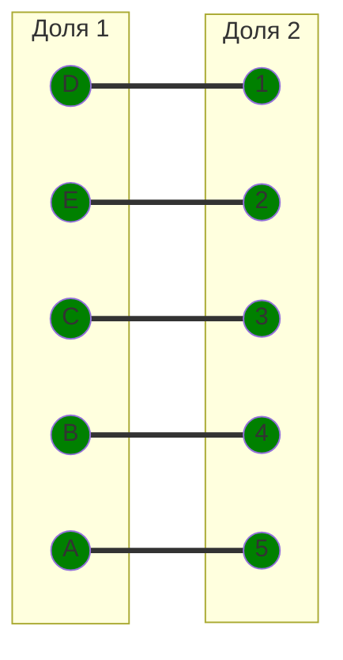

Полученное расписание является совершенным. Выпишем полученные назначения и их стоимости из исходной матрицы:
- A5 - 13
- B4 - 10
- C3 - 7
- D1 - 6
- E2 - 14
Общая стоимость затрат = 13 + 10 + 7 + 6 + 14 = 50.

## Ответ A - 5, B - 4, C - 3, D - 1, E - 2. Минимальная стоимость затрат 50.