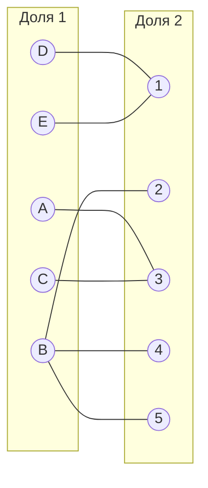
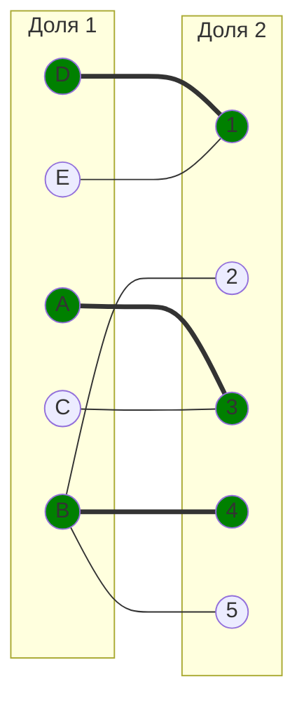
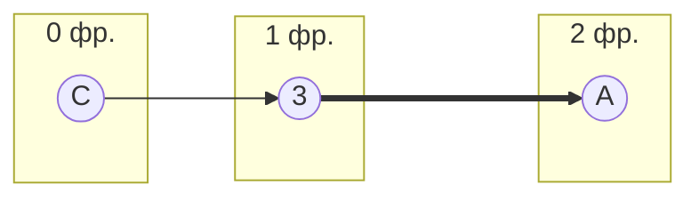
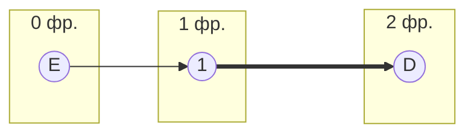
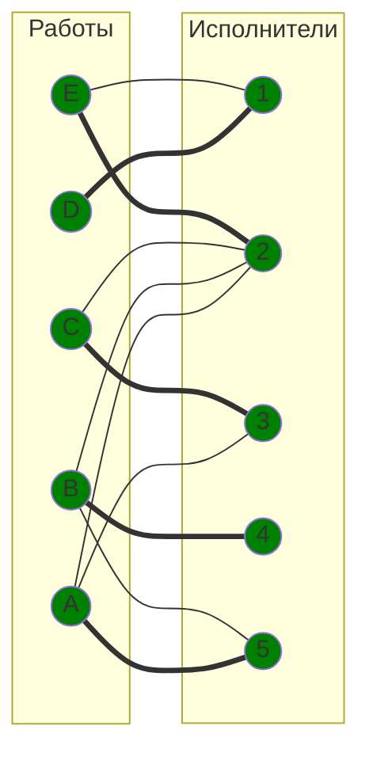

# Решение задачи 8. Вариант 3

## Команда: krytie

## Исходная матрица затрат:

|       | **1** | **2** | **3** | **4** | **5** |
|-------|:-----:|:-----:|:-----:|:-----:|:-----:|
| **A** |  12   |  13   |   9   |  19   |  13   |
| **B** |  15   |  12   |  14   |  10   |  12   |
| **C** |  19   |  11   |   7   |  19   |  16   |
| **D** |   6   |  14   |   9   |  19   |  20   |
| **E** |  10   |  14   |  11   |  15   |  18   |

## Шаг 1: Редукция матрицы затрат

Вычтем из каждой строки минимальное значение, представленное в этой строке.

|       | **1** | **2** | **3** | **4** | **5** | **Min** |
|-------|:-----:|:-----:|:-----:|:-----:|:-----:|:-------:|
| **A** |  12   |  13   |   9   |  19   |  13   |    9    |
| **B** |  15   |  12   |  14   |  10   |  12   |   10    |
| **C** |  19   |  11   |   7   |  19   |  16   |    7    |
| **D** |   6   |  14   |   9   |  19   |  20   |    6    |
| **E** |  10   |  14   |  11   |  15   |  18   |   10    |

После вычитания минимума из каждой строки:

|       | **1** | **2** | **3** | **4** | **5** |
|-------|:-----:|:-----:|:-----:|:-----:|:-----:|
| **A** |   3   |   4   |   0   |  10   |   4   |
| **B** |   5   |   2   |   4   |   0   |   2   |
| **C** |  12   |   4   |   0   |  12   |   9   |
| **D** |   0   |   8   |   3   |  13   |  14   |
| **E** |   0   |   4   |   1   |   5   |   8   |

После чего вычтем из каждого столбца минимальное значение, представленное в этом столбце.

|         | **1** | **2** | **3** | **4** | **5** | **Min** |
|---------|:-----:|:-----:|:-----:|:-----:|:-----:|:-------:|
| **A**   |   3   |   4   |   0   |  10   |   4   |    0    |
| **B**   |   5   |   2   |   4   |   0   |   2   |    0    |
| **C**   |  12   |   4   |   0   |  12   |   9   |    0    |
| **D**   |   0   |   8   |   3   |  13   |  14   |    0    |
| **E**   |   0   |   4   |   1   |   5   |   8   |    0    |
| **Min** |   0   |   2   |   0   |   0   |   2   |         |

Получим редуцированную матрицу, где нули обозначают наименее затратные варианты назначений.

|       | **1** | **2** | **3** | **4** | **5** |
|-------|:-----:|:-----:|:-----:|:-----:|:-----:|
| **A** |   3   |   2   |   0   |  10   |   2   |
| **B** |   5   |   0   |   4   |   0   |   0   |
| **C** |  12   |   2   |   0   |  12   |   7   |
| **D** |   0   |   6   |   3   |  13   |  12   |
| **E** |   0   |   2   |   1   |   5   |   6   |

## Шаг 2: Построение двудольного графа и начального паросочетания

Построим двудольный граф, вынесем на него те ребра, для которых в редуцированной матрице указаны нули.

Выберем произвольное паросочетание $[A, 3]$, $[B, 2]$, $[C, 3]$ и попытаемся построить совершенное паросочетание с помощью чередующихся деревьев.

Непокрытые вершины: C и E. Попытаемся построить дерево из оставшейся непокрытой вершины C.

Не получается построить чередующееся дерево, так как вершина А покрыта.

Не получается построить чередующееся дерево, так как вершина D покрыта.

## Шаг 3. Повторная редукция

Увеличивающий путь не найден, поэтому используем стандартное правило покрытия нулей:

1. Помечаем все непокрытые строки (`C`, `E`).
2. Для каждой отмеченной строки смотрим нулевые столбцы и отмечаем их (`3`, `1`).
3. Для каждого отмеченного столбца отмечаем строки, которые в них имеют выбранные ребра (итого `A`, `D`).

Получаем множества `X = {A, C, D, E}` (строки) и `Y = {1, 3}` (столбцы). Минимальная система покрывающих линий: вертикальные линии в столбцах `1`, `3` и горизонтальная линия по строке `B`. (Неотмеченная строка `B` даёт горизонтальную линию, остальные отмеченные столбцы превращаются в вертикальные.)

Важно: корректная операция выполняется над *линиями*, которые покрывают нули. В нашем случае линии проходят по столбцам `1`, `3` и по строке `B`, поэтому **непокрыты** остаются клетки в строках `A`, `C`, `D`, `E` и столбцах `2`, `4`, `5`. Минимальный из них — `2` (например, ячейки `A2`, `A5`, `C2`, `E2`), а единицы в столбцах `1` и `3` покрыты линиями и потому не участвуют.

Правило:
- вычитаем 2 из всех непокрытых элементов (то есть из ячеек строк `A`, `C`, `D`, `E` в столбцах `2`, `4`, `5`);
- добавляем 2 ко всем элементам, покрытым двумя линиями (пересечения строки `B` со столбцами `1` и `3`);
- элементы, покрытые ровно одной линией, остаются без изменений.

После операции (дополнительная редукция не требуется, т.к. в каждом столбце уже есть ноль) получаем матрицу:

|       | **1** | **2** | **3** | **4** | **5** |
|-------|:-----:|:-----:|:-----:|:-----:|:-----:|
| **A** |   3   |   0   |   0   |   8   |   0   |
| **B** |   7   |   0   |   6   |   0   |   0   |
| **C** |  12   |   0   |   0   |  10   |   5   |
| **D** |   0   |   4   |   3   |  11   |  10   |
| **E** |   0   |   0   |   1   |   3   |   4   |

## Шаг 4. Построение совершенного паросочетания

### Итоговый двудольный граф

Итоговое совершенное паросочетание - `A → 5` `B → 4` `C → 3` `D → 1` `E → 2`

## Шаг 5. Финальный ответ и стоимость

Переносим найденные соответствия на исходную матрицу затрат:

- `A → 5` (стоимость 13)
- `B → 4` (стоимость 10)
- `C → 3` (стоимость 7)
- `D → 1` (стоимость 6)
- `E → 2` (стоимость 14)

Суммарные затраты: `13 + 10 + 7 + 6 + 14 = 50`.
