# Задание №8

## Варианты 2. Задача о назначении. Венгерский алгоритм
Для выполнения задания необходимо: 
1. Решить задачу о назначении с использованием Венгерского алгоритма **строго** так, как было разобрано на занятиях.
2. Оформить решение задачи по шагам с подробными комментариями, таблицами и диаграммами.
3. В ответе указать минимальную сумму затрат на выполнение всех заданий.
4. В ответе вывести найденные назначения

### Решение
Дана матрица затрат для задач A, B, C, D, E и исполнителей 1, 2, 3, 4, 5:
|       | **1** | **2** | **3** | **4** | **5** |
|-------|:-----:|:-----:|:-----:|:-----:|:-----:|
| **A** |  17   |  18   |  11   |  16   |  11   |
| **B** |  13   |   5   |  18   |  20   |  10   |
| **C** |  14   |   5   |   9   |  12   |  20   |
| **D** |  15   |   7   |  14   |   8   |  16   |
| **E** |  19   |  19   |  14   |  10   |  14   |

1. Проведем редукцию матрицы затрат по строкам. Вычтем из каждой строки минимальное значение, представленное в этой строке.

|       | **1** | **2** | **3** | **4** | **5** |
|-------|:-----:|:-----:|:-----:|:-----:|:-----:|
| **A** |  6   |  7   |  0   |  5   |  0   |
| **B** |  8   |   0   |  13   |  15   |  5   |
| **C** |  9   |   0   |   4   |  7   |  15   |
| **D** |  8   |   0   |  7   |   1   |  9   |
| **E** |  9   |  9   |  4   |  0   |  4   |

2. После чего проведем редукцию матрицы затрат по столбцам. Вычтем из каждого столбца минимальное значение, представленное в этом столбце.

|       | **1** | **2** | **3** | **4** | **5** |
|-------|:-----:|:-----:|:-----:|:-----:|:-----:|
| **A** |  0   |  7   |  0   |  5   |  0   |
| **B** |  2   |   0   |  13   |  15   |  5   |
| **C** |  3   |   0   |   4   |  7   |  15   |
| **D** |  2   |   0   |  7   |   1   |  9   |
| **E** |  3   |  9   |  4   |  0   |  4   |

Получим редуцированную матрицу, где нули обозначают наименее затратные варианты назначений.

3. Построим двудольный граф, вынесем на него те ребра, для которых в редуцированной матрице указаны нули.

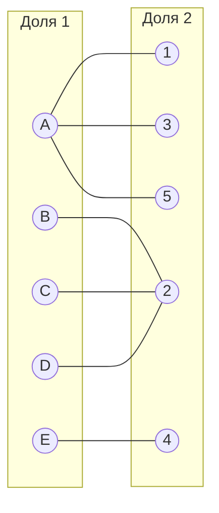
Выберем произвольное паросочетание $[A, 1]$, $[B, 2]$, $[E, 4]$ и попытаемся построить совершенное паросочетание с помощью чередующихся деревьев.

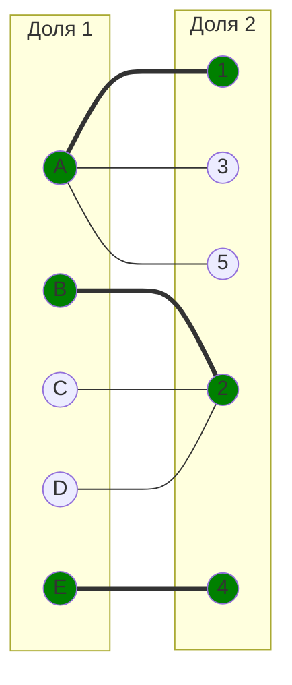

Попытаемся построить дерево из оставшейся непокрытой вершины C.

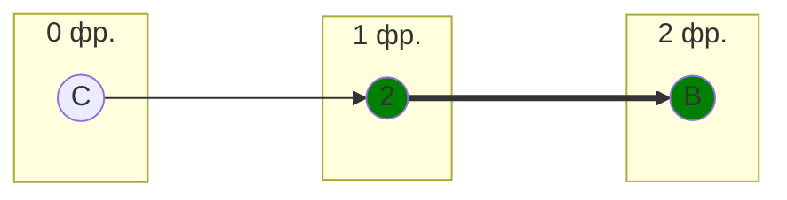
Во множество X выпишем все **покрытые построенным деревом** вершины первой доли графа, во множество Y все **покрытые построенным деревом** вершины из второй доли графа.
$$
X = \{B, C\}
$$

$$
Y = \{2 \}
$$

Необходимо найти минимальный элемент из строк, включенных во множество X и столбцов, не включенных во множество Y. В нашем случае это будут строки B, C и столбцы 1, 3, 4, 5. Минимальный элемент 2, расположен в строке B и столбце 1. 

Вычтем найденное значение из строк множества X и прибавим к столбцам множества Y:

Редуцируем строки

|       | **1** | **2** | **3** | **4** | **5** |
|-------|:-----:|:-----:|:-----:|:-----:|:-----:|
| **A** |  0   |  7   |  0   |  5   |  0   |
| **B** |  0   |   -2   |  11   |  13   |  3   |
| **C** |  1   |   -2   |   2   |  5   |  13   |
| **D** |  2   |   -2   |  7   |   1   |  9   |
| **E** |  3   |  9   |  4   |  0   |  4   |

восстанавливаем столбец 2

|       | **1** | **2** | **3** | **4** | **5** |
|-------|:-----:|:-----:|:-----:|:-----:|:-----:|
| **A** |  0   |  9   |  0   |  5   |  0   |
| **B** |  0   |   0   |  11   |  13   |  3   |
| **C** |  1   |   0   |   2   |  5   |  13   |
| **D** |  2   |   0   |  7   |   1   |  9   |
| **E** |  3   |  11   |  4   |  0   |  4   |

получаем новое ребро B -> 1

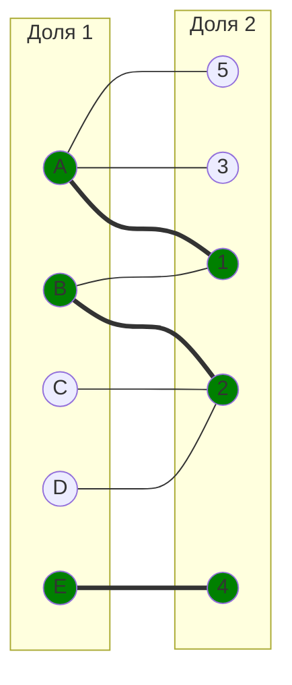

Попытаемся построить совершенное паросочетание с помощью чередующихся деревьев.

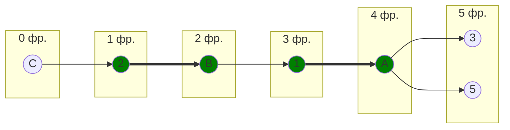
Построенное дерево содержит чередующуюся, относительно текущего паросочетания, цепь С2 - 2B - B1 - 1A - A5, цепь начинается и заканчивается в непокрытых вершинах, все ребра в цепи чередуются по вхождению в текущее паросочетание.

"Перекрасим" найденную цепь и проверим полученное паросочетание.

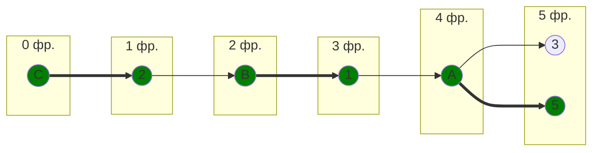

И получаем новый граф

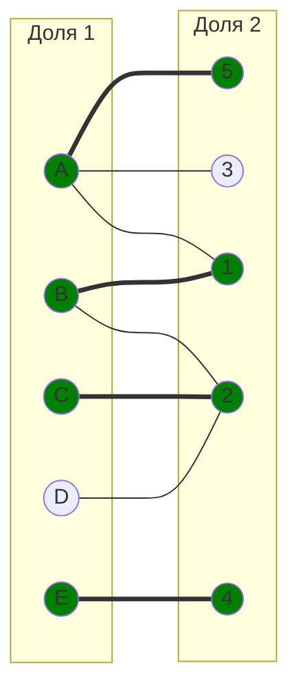

Попытаемся построить совершенное паросочетание с помощью чередующихся деревьев.

В построенном дереве нет цепей, чередующееся относительно текущего паросочетания, обе ветки закончились в покрытых вершинах, то есть в указанном графе нет совершенного паросочетания.

Проведем повторную редукцию матрицы затрат.

Во множество X выпишем все **покрытые построенным деревом** вершины первой доли графа, во множество Y все **покрытые построенным деревом** вершины из второй доли графа.

$$
X = \{D, C\}
$$

$$
Y = \{2 \}
$$

Необходимо найти минимальный элемент из строк, включенных во множество X и столбцов, не включенных во множество Y. В нашем случае это будут строки D, C и столбцы 1, 3, 4, 5. Минимальный элемент 1, расположен в строке C и столбце 1. 

Вычтем найденное значение из строк множества X и прибавим к столбцам множества Y:

|       | **1** | **2** | **3** | **4** | **5** |
|-------|:-----:|:-----:|:-----:|:-----:|:-----:|
| **A** |  0   |  9   |  0   |  5   |  0   |
| **B** |  0   |   0   |  11   |  13   |  3   |
| **C** |  1   |   0   |   2   |  5   |  13   |
| **D** |  2   |   0   |  7   |   1   |  9   |
| **E** |  3   |  11   |  4   |  0   |  4   |

|       | **1** | **2** | **3** | **4** | **5** |
|-------|:-----:|:-----:|:-----:|:-----:|:-----:|
| **A** |  0   |   10  |  0   |  5   |  0   |
| **B** |  0   |   1   |  11   |  13   |  3   |
| **C** |  0   |  0   |   1   |  4   |  12   |
| **D** |  1  |   0   |  6  |   0   |  8   |
| **E** |  3   |  12   |  4   |  0   |  4   |

Получаем 2 новых ребра - С -> 1 и D -> 4
и теряем ребро B -> 2

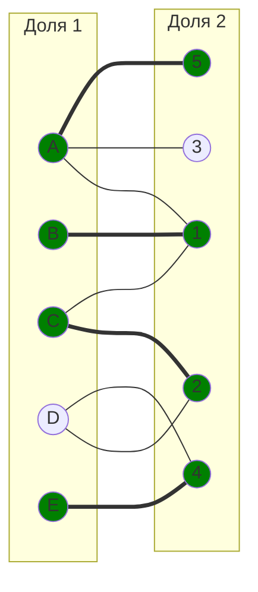

Попытаемся построить совершенное паросочетание с помощью чередующихся деревьев.

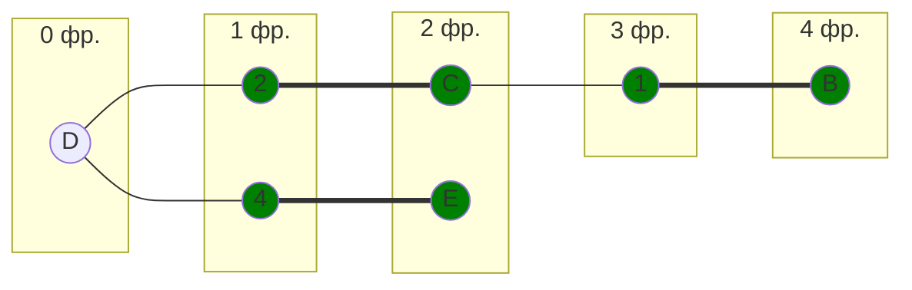

В построенном дереве нет цепей, чередующееся относительно текущего паросочетания, обе ветки закончились в покрытых вершинах, то есть в указанном графе нет совершенного паросочетания.

Проведем повторную редукцию матрицы затрат.

Во множество X выпишем все **покрытые построенным деревом** вершины первой доли графа, во множество Y все **покрытые построенным деревом** вершины из второй доли графа.

$$
X = \{D, C, E, B\}
$$

$$
Y = \{2, 1, 4\}
$$

Необходимо найти минимальный элемент из строк, включенных во множество X и столбцов, не включенных во множество Y. В нашем случае это будут строки D, C, E, B и столбцы 3, 5. Минимальный элемент 1, расположен в строке C и столбце 3. 

Вычтем найденное значение из строк множества X и прибавим к столбцам множества Y:

|       | **1** | **2** | **3** | **4** | **5** |
|-------|:-----:|:-----:|:-----:|:-----:|:-----:|
| **A** |  0   |   10  |  0   |  5   |  0   |
| **B** |  0   |   1   |  11   |  13   |  3   |
| **C** |  0   |  0   |   1   |  4   |  12   |
| **D** |  1  |   0   |  6  |   0   |  8   |
| **E** |  3   |  12   |  4   |  0   |  4   |

|       | **1** | **2** | **3** | **4** | **5** |
|-------|:-----:|:-----:|:-----:|:-----:|:-----:|
| **A** |  1   |   11  |  0   |  6   |  0   |
| **B** |  0   |   1   |  10   |  13   |  2   |
| **C** |  0   |  0   |   0   |  4   |  11   |
| **D** |  1  |   0   |  5  |   0   |  7   |
| **E** |  3   |  12   |  3   |  0   |  3   |

Получаем новое ребро C -> 3

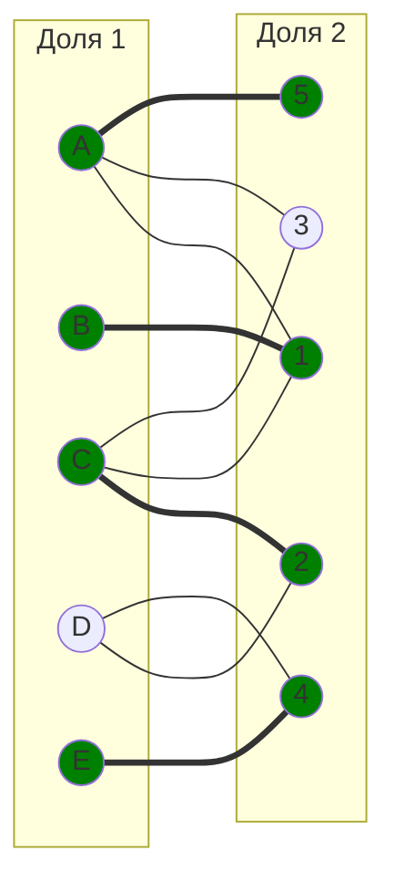
Попытаемся построить совершенное паросочетание с помощью чередующихся деревьев.

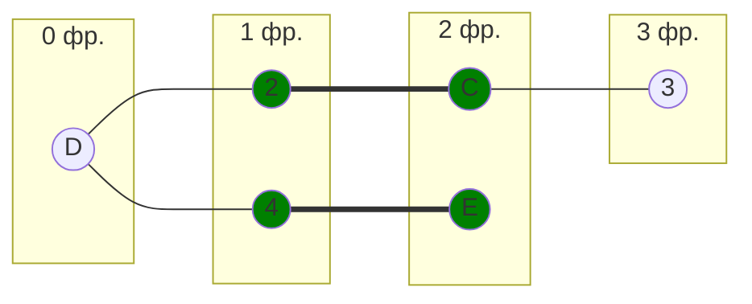

Построенное дерево содержит чередующуюся, относительно текущего паросочетания, цепь D2 - 2C - C3, цепь начинается и заканчивается в непокрытых вершинах, все ребра в цепи чередуются по вхождению в текущее паросочетание.

"Перекрасим" найденную цепь и проверим полученное паросочетание.

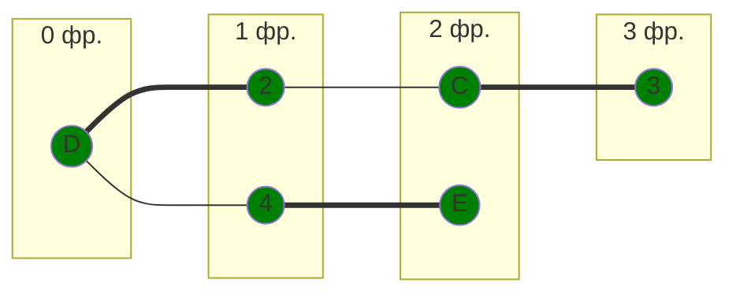

Тем самым количество пар в паросочетании увеличилось

Итоговый граф:

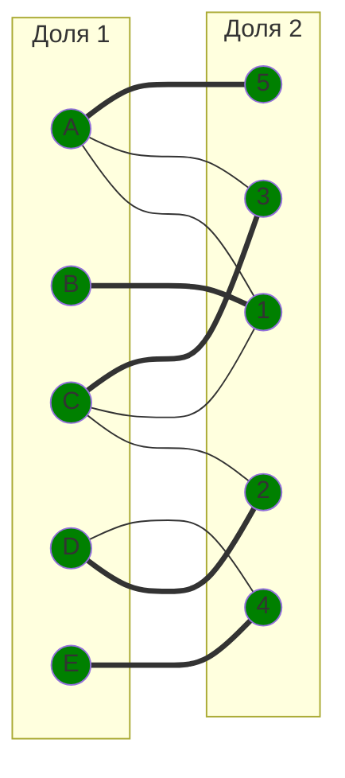

Итоговое паросочетание: 

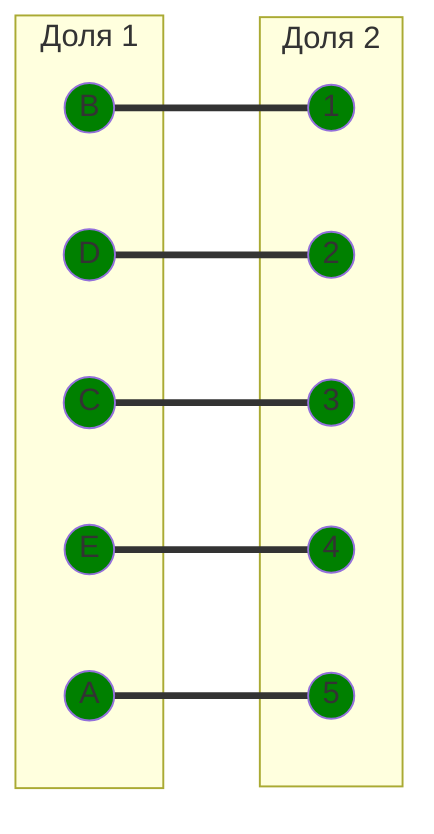
Полученное расписание является совершенным. Выпишем полученные назначения и их стоимости из исходной матрицы:
- B1 - 13
- D2 - 7
- C3 - 9
- E4 - 10
- A5 - 11

Общая стоимость затрат = 13 + 11 + 7 + 10 + 9 = 50

## Ответ
Минимальная стоимость затрат 50, при следующих назначениях:
- задача B, исполнитель 1,
- задача D, исполнитель 2,
- задача C, исполнитель 3,
- задача E, исполнитель 4.
- задача A, исполнитель 5.