## Задание №8

## Вариант №5. Задача о назначении. Венгерский алгоритм
Для выполнения задания необходимо: 
1. Решить задачу о назначении с использованием Венгерского алгоритма **строго** так, как было разобрано на занятиях.
2. Оформить решение задачи по шагам с подробными комментариями, таблицами и диаграммами.
3. В ответе указать минимальную сумму затрат на выполнение всех заданий.
4. В ответе вывести найденные назначения

## Решение

Дана матрица затрат для задач A, B, C, D, E и исполнителей 1, 2, 3, 4, 5:

|       | **1** | **2**  | **3** | **4** | **5** |
|-------|:-----:|:------:|:-----:|:-----:|:-----:|
| **A** |   6   |   10   |   14  |   11  |   7   |
| **B** |   18  |   11   |   11  |   11  |   11  |
| **C** |   5   |   19   |   14  |   5   |   8   |
| **D** |   8   |   15   |   16  |   17  |   20  |
| **E** |   8   |   10   |   9   |   13  |   15  |

1. Проведем редукцию матрицы затрат. Вычтем из каждой строки минимальное значение, представленное в этой строке.

|       | **1** | **2**  |  **3** |  **4** | **5**  | **Min** |
|-------|:-----:|:------:|:------:|:------:|:------:|:-------:|
| **A** |   0   |   4   |   8   |   5   |   1    |   -6    |
| **B** |   7  |   0   |   0   |   0   |   0   |   -11    |
| **C** |   0   |   14   |   9   |   0    |   3    |   -5    |
| **D** |   0   |   7   |   8   |   9   |   12   |   -8    |
| **E** |   0   |   2   |   1    |   5   |   7   |   -8    |

Теперь у нас в каждой строке и в каждом столбце есть наименее затратные варианты назначений, поэтому делать редукцию по столбцам не нужно. 

Получаем редуцированную матрицу, где нули обозначают наименее затратные варианты назначений.

|       | **1** | **2**  |  **3** |  **4** | **5**  |
|-------|:-----:|:------:|:------:|:------:|:------:|
| **A** |   0   |   4   |   8   |   5   |   1    |
| **B** |   7  |   0   |   0   |   0   |   0   |
| **C** |   0   |   14   |   9   |   0    |   3    |
| **D** |   0   |   7   |   8   |   9   |   12   |
| **E** |   0   |   2   |   1    |   5   |   7   |

2. Построим двудольный граф, вынесем на него те ребра, для которых в редуцированной матрице указаны нули.

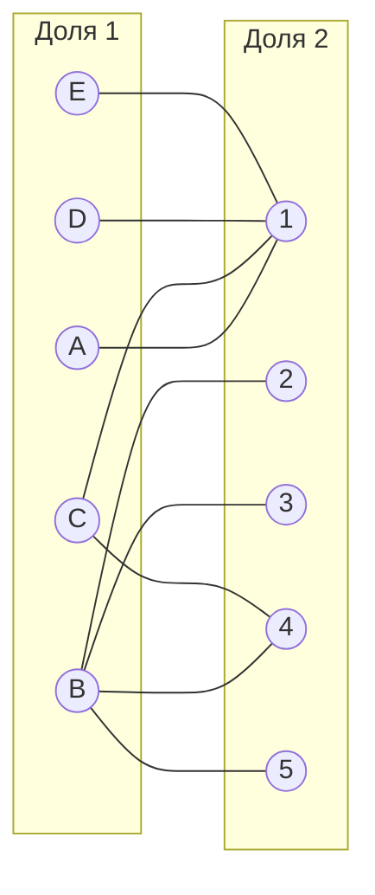

Выберем произвольное паросочетание $[A, 1]$, $[B, 2]$, $[C, 4]$ и попытаемся построить совершенное паросочетание с помощью чередующихся деревьев.

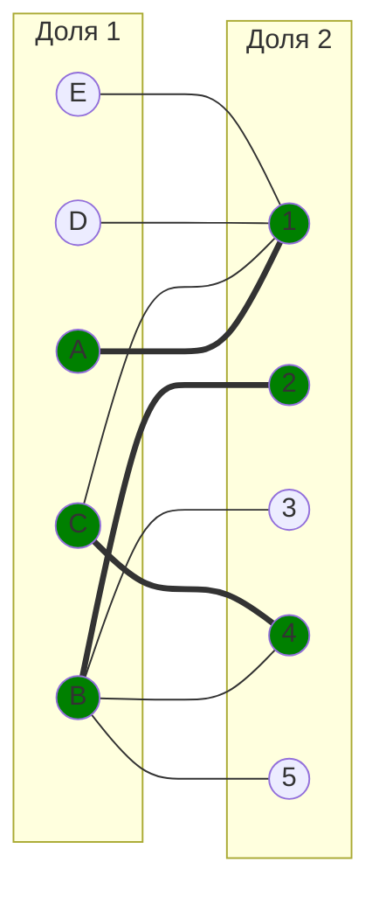

Попытаемся построить дерево из одной из оставшихся непокрытых вершин, возьмем вершину D.

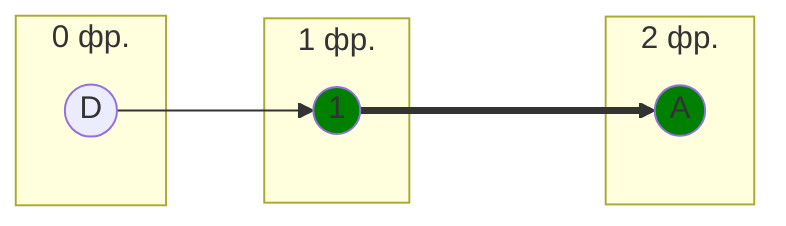

В построенном дереве нет цепей, чередующееся относительно текущего паросочетания, ветка закончилась в покрытой вершине, то есть в указанном графе нет совершенного паросочетания.

3. Проведем повторную редукцию матрицы затрат.

Во множество X выпишем все **покрытые построенным деревом** вершины первой доли графа, во множество Y все **покрытые построенным деревом** вершины из второй доли графа.

$$
X = \{A, D\}
$$

$$
Y = \{1\}
$$

Необходимо найти минимальный элемент из строк, включенных во множество X и столбцов, не включенных во множество Y. В нашем случае это будут строки A, D и столбцы 2, 3, 4 и 5. Минимальный элемент 1, расположен в строке A и столбце 5.

Вычтем найденное значение из строк множества X и прибавим к столбцам множества Y:

|       | **1** | **2** | **3** | **4** | **5** |       |
|-------|:-----:|:-----:|:-----:|:-----:|:-----:|:-----:|
| **A** |   0   |   3   |   7   |   4   |   **0**   |  -1   |
| **B** |   7   |   0   |   0   |   0   |   0   |       |
| **C** |   0   |   14   |   9   |   0   |   3   |       |
| **D** |   0   |   6   |   7   |   8   |   11   |  -1   |
| **E** |   0   |   2   |   1   |   5   |   7   |     |
|       |  +1   |       |       |       |       |       |

В ячейке A5 появилось новое нулевые значение, добавим соответствующее ребро в двудольный граф.

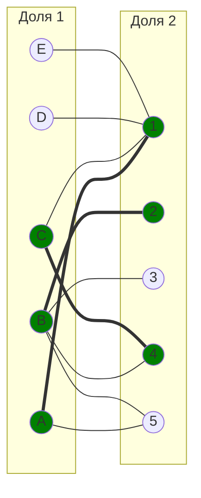

4. Попытаемся снова построить дерево для непокрытой вершины D. 

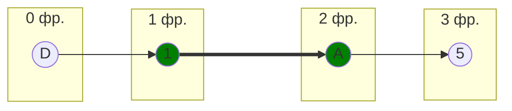

Построенное дерево содержит чередующуюся, относительно текущего паросочетания, цепь D - 1 - A - 5, цепь начинается и заканчивается в непокрытых вершинах, все ребра в цепи чередуются по вхождению в текущее паросочетание.

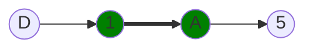

"Перекрасим" найденную цепь и проверим полученное паросочетание.

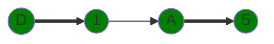

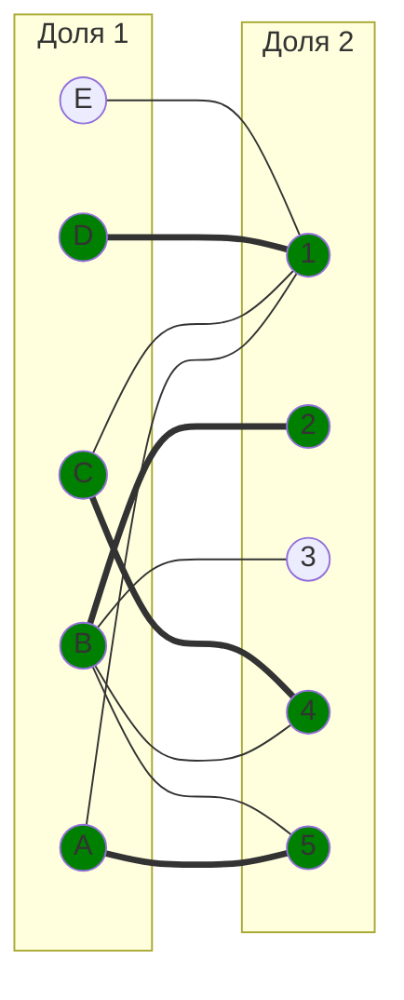
5. Попытаемся построить дерево из одной из оставшейся вершины E.
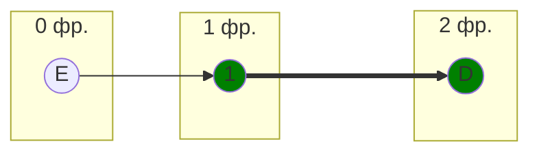

В построенном дереве нет цепей, чередующееся относительно текущего паросочетания, ветка закончилась в покрытой вершине, то есть в указанном графе нет совершенного паросочетания.

6. Проведем повторную редукцию матрицы затрат.

Во множество X выпишем все **покрытые построенным деревом** вершины первой доли графа, во множество Y все **покрытые построенным деревом** вершины из второй доли графа.

$$
X = \{E, D\}
$$

$$
Y = \{1\}
$$

Необходимо найти минимальный элемент из строк, включенных во множество X и столбцов, не включенных во множество Y. В нашем случае это будут строки D, E и столбцы 2, 3, 4 и 5. Минимальный элемент 1, расположен в строке E и столбце 3.

Вычтем найденное значение из строк множества X и прибавим к столбцам множества Y:

|       | **1** | **2** | **3** | **4** | **5** |       |
|-------|:-----:|:-----:|:-----:|:-----:|:-----:|:-----:|
| **A** |   0   |   3   |   7   |   4   |   0   |     |
| **B** |   7   |   0   |   0   |   0   |   0   |       |
| **C** |   0   |   14   |   9   |   0   |   3   |       |
| **D** |   0   |   5   |   6   |   7   |   10   |   -1 |
| **E** |   0   |   1   |   **0**   |   4   |   6   |   -1  |
|       |  +1   |       |       |       |       |       |

В ячейке E3 появилось новое нулевое значение, добавим соответствующее ребро в двудольный граф.

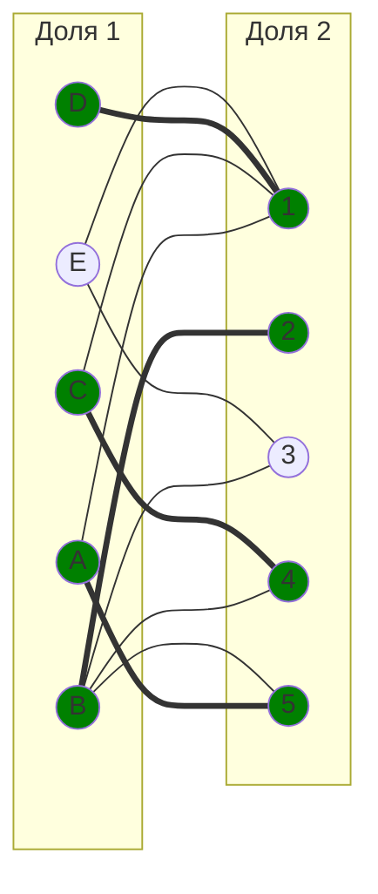
7. Попытаемся построить дерево из одной из оставшейся вершины E.
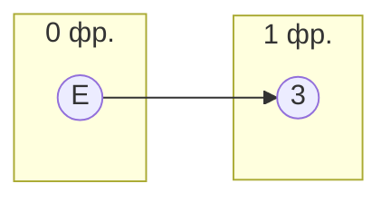
"Перекрасим" найденную цепь и проверим полученное паросочетание.
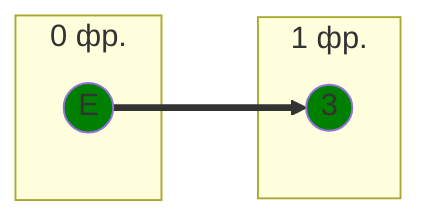
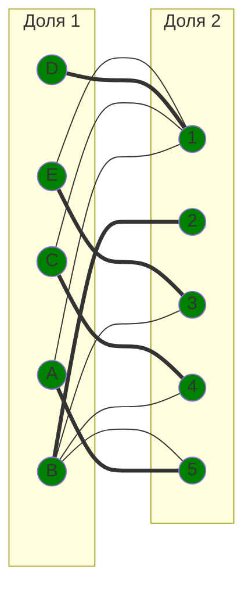

Полученное паросочетание является совершенным. Выпишем полученные назначения и их стоимости из исходной матрицы:
- A5 - 7
- B2 - 11
- C4 - 5
- D1 - 8
- E3 - 9

Общая стоимость затрат = 7 + 11 + 5 + 8 + 9 = 40.

## Ответ
Минимальная стоимость затрат 40, при следующих назначениях:
- задача A, исполнитель 5,
- задача B, исполнитель 2,
- задача C, исполнитель 4,
- задача D, исполнитель 1,
- задача E, исполнитель 3.