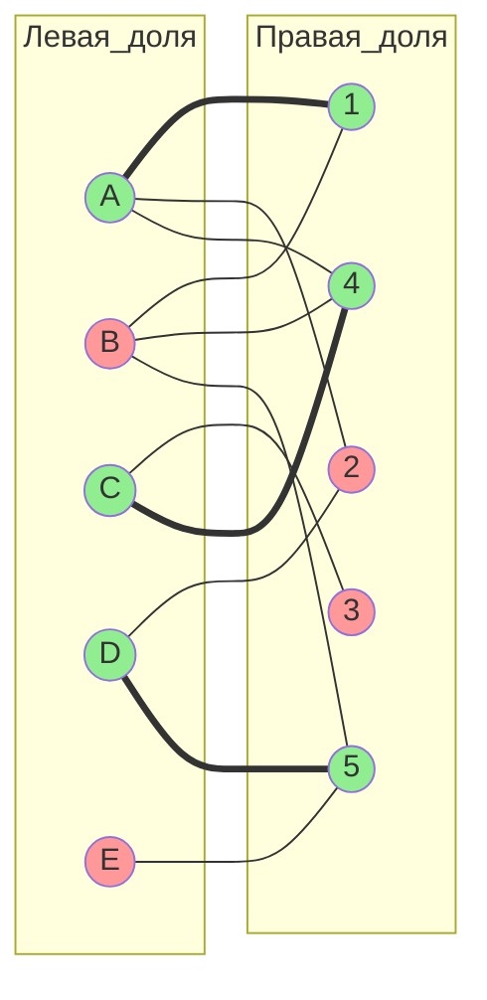
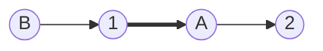
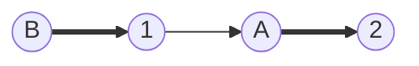
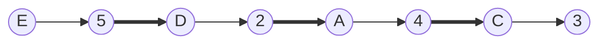
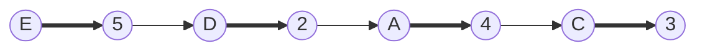

# travis 1 вариант  
## Максимальное паросочетание с помощью чередующихся цепей
## Граф

**Левая доля:** A, B, C, D, E  
**Правая доля:** 1, 2, 3, 4, 5  

**Рёбра графа:**

- A — 1, 2, 4  
- B — 1, 4, 5  
- C — 3, 4  
- D — 2, 5  
- E — 5  

**Начальное паросочетание:**  
M = {A–1, C–4, D–5}

**Покрытые вершины:**  
- слева: A, C, D  
- справа: 1, 4, 5  

**Свободные вершины:**  
- слева: B, E  
- справа: 2, 3 

## Теоретическая идея метода

Ищется **увеличивающая чередующаяся цепь**, которая:

- начинается в свободной вершине левой доли;
- заканчивается в свободной вершине правой доли;
- рёбра строго чередуются:  
  **не-M → M → не-M → M → … → не-M**

После нахождения такой цепи выполняется **инверсия паросочетания вдоль неё**:

- каждое M-ребро удаляется из паросочетания;
- каждое не-M ребро добавляется в паросочетание.

Размер паросочетания увеличивается ровно на 1.

## Начальное состояние

## Шаг 1. Поиск увеличивающей цепи от вершины B

Строим чередующееся дерево от свободной вершины **B**:

- B → 1 (по не-M ребру)  
- 1 → A (по M-ребру)  
- A → 2 (по не-M ребру)

Вершина **2** свободна, следовательно найдена увеличивающая цепь:

**B → 1 → A → 2**

### Инверсия цепи

**Изменения:**

- M-ребро A–1 удаляется;
- не-M рёбра B–1 и A–2 добавляются.

**Новое паросочетание:**  
M = {B–1, A–2, C–4, D–5}

## Шаг 2. Поиск увеличивающей цепи от вершины E

Строим чередующееся дерево от свободной вершины **E**:

**E → 5 → D → 2 → A → 4 → C → 3**

Вершина **3** свободна, следовательно найдена увеличивающая цепь.

### Инверсия цепи

**Изменения:**

- удаляются M-рёбра: D–5, A–2, C–4;
- добавляются не-M рёбра: E–5, D–2, A–4, C–3.

**Новое паросочетание:**  
M = {B–1, A–4, C–3, D–2, E–5}

## Итог

**Максимальное и совершенное паросочетание:**

- A — 4  
- B — 1  
- C — 3  
- D — 2  
- E — 5  

**Размер паросочетания:** 5  

Свободных вершин не осталось, увеличивающих цепей больше нет.  
По теореме Берге полученное паросочетание является **максимальным**.  
Так как покрыты все вершины обеих долей, паросочетание также является **совершенным**.

**Обоснования к каждому этапу**

Начальное состояние: Обоснование: Начальное паросочетание задано заданием, оно покрывает 3 вершины левой доли. Зеленый цвет обозначает покрытые вершины (инцидентные M-ребрам), красный — свободные. Это позволяет визуально отслеживать, от каких вершин начинать поиск цепей (свободные левые).
Шаг 1 (Поиск увеличивающей цепи от B): Обоснование: Метод чередующихся цепей строит дерево слой за слоем для поиска увеличивающей цепи, начиная с непокрытой левой вершины. Чередование ребер (не-M на переходах в правую, M в левую) обеспечивает правильность цепи. Поиск останавливается при первой непокрытой правой вершине, гарантируя увеличение M.
Шаг 1 (Перекраска цепи): Обоснование: Инвертирование вдоль чередующейся цепи, соединяющей две непокрытые вершины, увеличивает паросочетание на 1 без нарушения условий (каждая вершина инцидентна ровно одному M-ребру). Перекраска визуализирует смену: жирные линии (M) становятся тонкими (не-M), и наоборот, обновляя покрытие вершин.
Шаг 2 (Поиск увеличивающей цепи от E): Обоснование: Аналогично шагу 1, теперь только одна свободная левая вершина. Более длинная цепь требует полного обхода дерева, но принцип тот же: чередование до свободной правой вершины.
Шаг 2 (Перекраска цепи): Обоснование: Инвертирование длинной цепи добавляет 4 новых M-ребра и удаляет 3 старых, увеличивая размер на 1. Промежуточные вершины остаются покрытыми, но с новыми ребрами; концы (E и 3) становятся покрытыми.
Итог (Проверка на максимальность): Обоснование: По теореме Берге, отсутствие увеличивающих цепей (нет свободных левых вершин) подтверждает максимальность. Размер 5 равен минимальному из размеров долей, подтверждая совершенность.