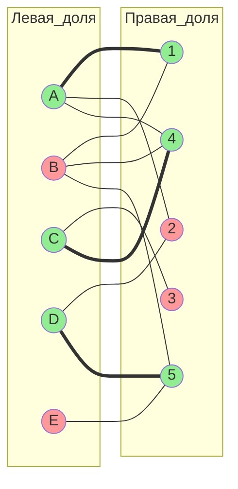
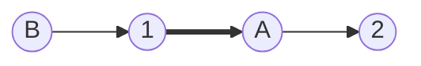
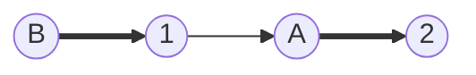
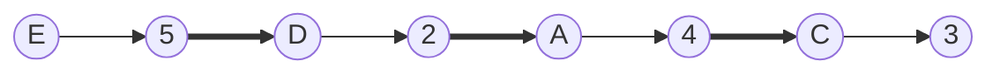
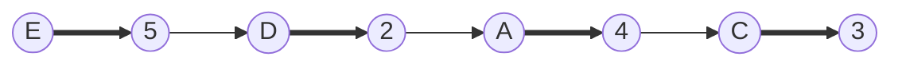
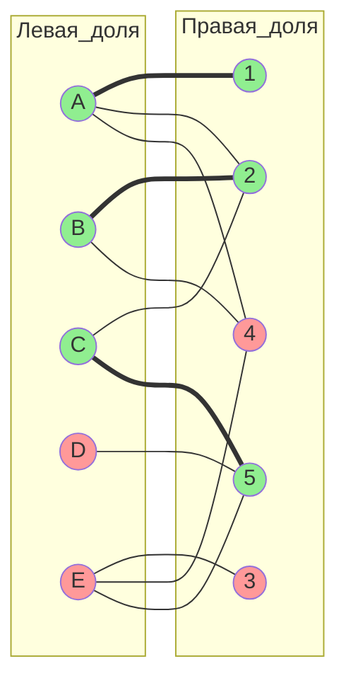
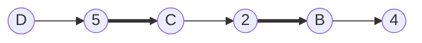
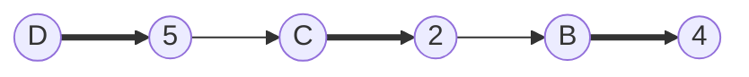
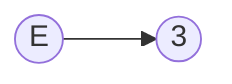
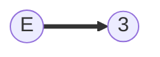

# travis 1 вариант задание 1 
**Максимальное паросочетание с помощью волнового метода**

**Граф**

**Левая доля:** A, B, C, D, E  
**Правая доля:** 1, 2, 3, 4, 5  

**Рёбра:**

- A — 1, 2, 4  
- B — 1, 4, 5  
- C — 3, 4  
- D — 2, 5  
- E — 5  

**Начальное паросочетание:**  
M = {A–1, C–4, D–5}

**Покрытые вершины:**  
- слева: A, C, D  
- справа: 1, 4, 5  

**Свободные вершины:**  
- слева: B, E  
- справа: 2, 3  

**Волновой метод (BFS)**

- **Фронт 0** — свободные вершины левой доли  
- **Нечётные фронты** — переход по не-M рёбрам в правую долю  
- **Чётные фронты** — переход по M-рёбрам в левую долю  

Если свободная правая вершина достигнута на нечётном фронте, найдена увеличивающая цепь.  
После этого выполняется инверсия рёбер вдоль цепи.

**Начальное состояние**

**Шаг 1. Волновой поиск (B, E)**

**Фронт 0:** B, E  
**Фронт 1:** 1, 4, 5  
**Фронт 2:** A, C, D  
**Фронт 3:** 2, 3 (свободные)

Выбираем цепь: **B → 1 → A → 2**

**Инверсия цепи**

**Новое паросочетание:**  
M = {B–1, A–2, C–4, D–5}

**Шаг 2. Волновой поиск (E)**

Цепь: **E → 5 → D → 2 → A → 4 → C → 3**

**Инверсия цепи**

**Новое паросочетание:**  
M = {B–1, A–4, C–3, D–2, E–5}

**Итог**

**Максимальное и совершенное паросочетание:**

- A — 4  
- B — 1  
- C — 3  
- D — 2  
- E — 5  

**Размер:** 5  

Свободных вершин не осталось.  
По теореме Берге паросочетание является **максимальным** и **совершенным**.

**Обоснования к каждому этапу**  

**Начальное состояние**  
Начальное паросочетание задано заданием, оно покрывает 3 вершины левой доли. Зеленый цвет обозначает покрытые вершины (инцидентные M-ребрам), красный — свободные. Это позволяет визуально отслеживать, от каких вершин начинать поиск цепей (свободные левые).  
**Шаг 1.** Волновой поиск увеличивающей цепи  
Волновой метод использует BFS для построения слоёв (фронтов), начиная с всех свободных левых вершин одновременно. Это эффективно находит кратчайшие увеличивающие цепи, строго следуя чередованию ребёр. Выбор одной цепи из найденных позволяет продолжить процесс.  
**Шаг 1.** Перекраска цепи  
Инвертирование вдоль найденной цепи увеличивает паросочетание на 1. Перекраска показывает смену статуса рёбер и обновление покрытия вершин, где концы цепи становятся покрытыми, а промежуточные остаются покрытыми с новыми рёбрами.  
**Шаг 2.** Волновой поиск увеличивающей цепи  
Аналогично шагу 1, но теперь с одной свободной левой вершиной. Волновой метод строит фронты до достижения свободной правой вершины, обеспечивая нахождение цепи любой длины.  
**Шаг 2.** Перекраска цепи  
Инвертирование добавляет больше не-M рёбер, чем удаляет M-рёбер (на 1), увеличивая размер. Концы цепи (E и 3) становятся покрытыми, завершая совершенное паросочетание.  
**Итог (Проверка на максимальность)**  
По теореме Берге, отсутствие свободных левых вершин означает отсутствие увеличивающих цепей. Волновой метод гарантирует, что все возможные цепи проверены; размер 5 подтверждает максимальность и совершенность. 

# travis 1 вариант задание 2  
**Максимальное паросочетание с помощью чередующихся цепей**  
**Граф**  

**Левая доля:** A, B, C, D, E  
**Правая доля:** 1, 2, 3, 4, 5  

**Рёбра графа:**  
- A — 1, 2, 4  
- B — 2, 4  
- C — 2, 5  
- D — 5  
- E — 3, 4, 5  

**Начальное паросочетание:**  
M = {A–1, B–2, C–5}  

**Покрытые вершины:**  
- слева: A, B, C  
- справа: 1, 2, 5  

**Свободные вершины:**  
- слева: D, E  
- справа: 3, 4  

**Теоретическая идея метода**  

Ищется **увеличивающая чередующаяся цепь**, которая:  
- начинается в свободной вершине левой доли;  
- заканчивается в свободной вершине правой доли;  
- рёбра строго чередуются:  
  **не-M → M → не-M → M → … → не-M**  

После нахождения такой цепи выполняется **инверсия паросочетания вдоль неё**:  
- каждое M-ребро удаляется из паросочетания;  
- каждое не-M ребро добавляется в паросочетание.  

Размер паросочетания увеличивается ровно на 1.  

**Начальное состояние**

**Шаг 1. Поиск увеличивающей цепи от вершины D**  
Строим чередующееся дерево от свободной вершины **D**:  
**D → 5 → C → 2 → B → 4**  

Вершина **4** свободна, следовательно найдена увеличивающая цепь.  

**Инверсия цепи**  

**Изменения:**  
- удаляются M-рёбра: C–5, B–2;  
- добавляются не-M рёбра: D–5, C–2, B–4.  

**Новое паросочетание:**  
M = {A–1, B–4, C–2, D–5}  

**Шаг 2. Поиск увеличивающей цепи от вершины E**  

Из свободной вершины **E** по не-M ребру сразу достигается свободная вершина **3**:  

**E → 3**  

**Инверсия цепи**  

**Изменения:**  
- ребро E–3 добавляется в паросочетание.  

**Новое паросочетание:**  
M = {A–1, B–4, C–2, D–5, E–3}  

**Итог**  

**Максимальное и совершенное паросочетание:**  

- A — 1  
- B — 4  
- C — 2  
- D — 5  
- E — 3  

**Размер паросочетания:** 5  

Свободных вершин не осталось, увеличивающих цепей больше нет.  
По теореме Берге полученное паросочетание является **максимальным**.  
Так как покрыты все вершины обеих долей, паросочетание также является **совершенным**.  

**Начальное состояние**  
Начальное паросочетание задано заданием, оно покрывает 3 вершины левой доли. Зеленый цвет обозначает покрытые вершины (инцидентные M-ребрам), красный — свободные. Это позволяет визуально отслеживать, от каких вершин начинать поиск цепей (свободные левые).  
**Шаг 1.** Поиск увеличивающей цепи от D  
Метод чередующихся цепей строит дерево слой за слоем для поиска увеличивающей цепи, начиная с непокрытой левой вершины. Чередование ребер (не-M на переходах в правую, M в левую) обеспечивает правильность цепи. Поиск останавливается при первой непокрытой правой вершине, гарантируя увеличение M.
**Шаг 1.** Перекраска цепи  
Инвертирование вдоль чередующейся цепи, соединяющей две непокрытые вершины, увеличивает паросочетание на 1 без нарушения условий (каждая вершина инцидентна ровно одному M-ребру). Перекраска визуализирует смену: жирные линии (M) становятся тонкими (не-M), и наоборот, обновляя покрытие вершин.  
**Шаг 2.** Поиск увеличивающей цепи от E  
Аналогично шагу 1, теперь только одна свободная левая вершина. Тривиальная цепь длины 1 — частный случай, когда свободная левая вершина напрямую соединена с свободной правой.  
**Шаг 2.** Перекраска цепи  
Инвертирование тривиальной цепи просто добавляет одно новое M-ребро. Обе вершины (E и 3) были свободны, после добавления становятся покрытыми, завершая совершенное паросочетание.  
**Итог (Проверка на максимальность)**  
По теореме Берге, отсутствие увеличивающих цепей (нет свободных левых вершин) подтверждает максимальность. Размер 5 равен минимальному из размеров долей, подтверждая совершенность.